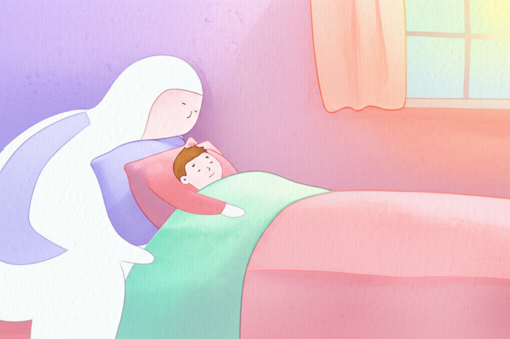

# Chapter 1. 우리 아이의 수면, 무엇이 문제일까요?

*잠들지 못하고 뒤척이는 아이와 곁에서 지켜보는 부모*

## 새벽 3시, 아직도 깨어 있는 우리 집

새벽 3시, 집 안은 조용하지만 한 방에서는 불빛이 새어 나옵니다. 일곱 살 민서는 이불을 발로 차며 뒤척이고 있습니다. 옆에 누운 엄마는 민서의 등을 토닥이며 "이제 자자, 내일 유치원 가야지"라고 속삭여 보지만, 민서의 눈은 말똥말똥합니다. 벌써 두 시간째입니다. 거실에서는 아빠가 내일 출근 걱정에 한숨을 쉬고 있습니다.

"저희 집만 이런 건가요?"

이런 밤이 일주일에 서너 번, 혹은 거의 매일 반복된다면, 부모님은 이미 지칠 대로 지쳐 있을 것입니다. 인터넷을 검색해 보고, 다른 부모님들께 물어보고, 병원에도 가보았을 것입니다. 그런데 아무도 속 시원한 답을 주지 않습니다. 먼저 말씀드리고 싶은 것이 있습니다. **여러분만 이런 것이 아닙니다.** 그리고 이 문제는 반드시 나아질 수 있습니다.

---

## 발달장애 아동의 수면 문제, 얼마나 흔할까요?

발달장애 아동의 수면 문제는 놀라울 만큼 흔합니다. 여러 연구에 따르면 **발달장애 아동의 50~80%가 수면과 관련된 어려움**을 경험합니다. 일반 아동의 수면 문제 비율이 약 20~30%인 것과 비교하면, 거의 두 배에서 세 배에 이르는 수치입니다.

*일반 아동과 발달장애 아동의 수면 패턴 비교 — 잠들기까지 걸리는 시간, 밤중 각성 횟수, 총 수면 시간에서 뚜렷한 차이가 나타납니다*

그렇다면 아이들이 겪는 수면 문제는 구체적으로 어떤 모습일까요? 크게 네 가지로 나눌 수 있습니다.

### 1) 잠들기 어려움 (입면 장애)

"불 끄고 누워도 한 시간이 넘게 잠을 못 자요."

이불에 누워도 쉽게 잠들지 못하는 상태를 말합니다. 의학에서는 '입면 장애'라고 부르는데, 쉽게 말해 **잠이 드는 문 앞에서 서성이는 것**과 같습니다. 일반적으로 아이가 누운 후 30분 이상 잠들지 못하는 것이 일주일에 3회 이상 반복되면 입면 장애로 봅니다. 발달장애 아동 중 상당수가 이 어려움을 겪으며, 잠들기까지 1~2시간이 걸리는 경우도 드물지 않습니다.

### 2) 자주 깨는 문제 (수면 유지 장애)

"겨우 재워놓으면 한두 시간 만에 깨요."

잠이 들었다가 밤중에 여러 번 깨는 것을 '수면 유지 장애'라고 합니다. **깊은 잠과 얕은 잠 사이를 오갈 때 완전히 깨어버리는 것**이지요. 한 번 깨면 다시 잠들기까지 또 오랜 시간이 걸리기도 합니다. 밤새 서너 번씩 깨는 아이도 있어서, 부모님도 함께 잠을 설치게 됩니다.

### 3) 너무 일찍 깨는 문제 (조기 각성)

"새벽 4시면 벌써 일어나서 돌아다녀요."

아직 해가 뜨지도 않았는데 아이가 완전히 깨어 활동을 시작하는 경우입니다. 충분히 잠을 자지 못했는데도 **뇌의 각성 시스템이 너무 일찍 작동**해버리는 것입니다. 이른 아침부터 깨어 있는 아이를 돌봐야 하는 부모님의 피로는 점점 쌓여갑니다.

### 4) 불규칙한 수면-각성 주기

"잠드는 시간이 매일 달라요. 어떤 날은 밤 9시, 어떤 날은 새벽 1시예요."

우리 몸에는 '생체 시계'라는 것이 있어서 일정한 시간에 졸리고 일정한 시간에 깨어나도록 조절합니다. 그런데 이 **생체 시계의 리듬이 불규칙한 아이들**이 있습니다. 낮잠 시간도 들쭉날쭉하고, 밤잠 시간도 예측하기 어렵습니다. 수면 루틴을 잡기가 특히 힘든 유형입니다.

---

## 수면 부족이 미치는 영향

수면은 단순히 쉬는 시간이 아닙니다. **아이의 뇌가 하루 동안 배운 것을 정리하고, 몸이 성장하고, 감정을 회복하는 시간**입니다. 이 소중한 시간이 부족하면 아이에게, 그리고 가족 모두에게 연쇄적인 영향이 나타납니다.

### 아이에게 미치는 영향

**감정 조절이 더 어려워집니다.** 잠을 충분히 못 잔 아이는 작은 일에도 쉽게 짜증을 내고, 울음이 잦아지고, 감정의 폭이 커집니다. 평소에는 참을 수 있던 상황에서도 쉽게 폭발합니다. 이는 아이의 잘못이 아니라, 수면 부족으로 뇌의 감정 조절 기능이 약해진 것입니다.

**학습과 기억력이 저하됩니다.** 수면 중에 뇌는 낮 동안 배운 내용을 장기 기억으로 옮기는 작업을 합니다. 잠이 부족하면 이 과정이 제대로 이루어지지 않아, 치료 시간에 배운 것이 잘 남지 않고, 새로운 것을 익히는 속도도 느려집니다.

**행동 문제가 증가합니다.** 피곤한 아이는 집중하기 어렵고, 과잉행동이 나타나기도 하며, 자해 행동이나 상동 행동(같은 동작을 반복하는 행동)이 늘어날 수 있습니다. 수면 문제를 해결했더니 낮 시간의 행동이 크게 좋아졌다는 보고도 많습니다.

**면역력이 약해집니다.** 수면 중에 면역 세포가 활발하게 활동합니다. 잠이 부족한 아이는 감기에 더 잘 걸리고, 아픈 후 회복도 느려집니다.

### 가족에게 미치는 영향

아이의 수면 문제는 아이만의 문제가 아닙니다. **가족 전체의 삶에 파급 효과**를 일으킵니다.

부모님은 아이를 돌보느라 자신의 수면 시간이 줄어들고, 만성 피로와 스트레스에 시달립니다. 부부 사이에 갈등이 생기기도 하고, 우울감을 느끼는 부모님도 적지 않습니다. 형제자매가 있다면 밤마다 반복되는 소란에 함께 잠을 설치거나, 지쳐 있는 부모님에게 충분한 관심을 받지 못할 수 있습니다. 결국 가족 모두의 삶의 질이 낮아지는 악순환이 이어집니다.

---

> **💡 우리 가족 이야기**
>
> "8세 자폐 스펙트럼 아들 준호는 매일 밤 2~3시간씩 뒤척였어요. 저도 남편도 교대로 준호 곁에 있어야 했고, 낮에는 늘 피곤했죠. 준호는 유치원에서 자주 졸았고, 친구들과도 잘 어울리지 못했어요. 치료사 선생님은 '수면부터 해결해야 다른 치료 효과도 올라갑니다'라고 하셨는데, 어디서부터 시작해야 할지 막막했어요."
> — 준호 엄마, 서울

---

## 희망을 이야기합니다

여기까지 읽으시면서 "맞아, 우리 이야기야" 하고 고개를 끄덕이셨을 수도 있습니다. 힘든 밤이 반복될 때면 "영원히 이러면 어쩌지"라는 불안이 밀려올 수도 있습니다.

하지만 분명히 말씀드립니다. **수면 문제는 개선될 수 있습니다.**

약물에 의존하지 않고, 아이에게 부담을 주지 않으면서도 자연스럽게 수면을 도울 수 있는 방법이 있습니다. 바로 **후각과 호흡을 활용한 수면 훈련**입니다. 우리 몸이 원래 가지고 있는 시스템을 부드럽게 이끌어주는 방법이기에, 안전하고 효과적입니다.

이 책은 그 여정의 가이드가 될 것입니다. 다음 챕터에서는 후각과 호흡이 왜, 어떻게 수면에 영향을 주는지 그 과학적 연결고리를 살펴봅니다.

지금 이 책을 펼친 것만으로도 이미 첫걸음을 떼신 것입니다.

---

**✅ 핵심 포인트**
- 발달장애 아동의 절반 이상이 수면 문제를 경험합니다 — 여러분만의 문제가 아닙니다
- 수면 부족은 아이의 감정, 학습, 행동, 건강에 연쇄적으로 영향을 미칩니다
- 수면 문제는 반드시 해결해야 할 건강 문제이며, 가족 전체의 삶의 질과 직결됩니다
- 후각과 호흡을 활용한 자연스러운 방법으로 충분히 개선할 수 있습니다

---
