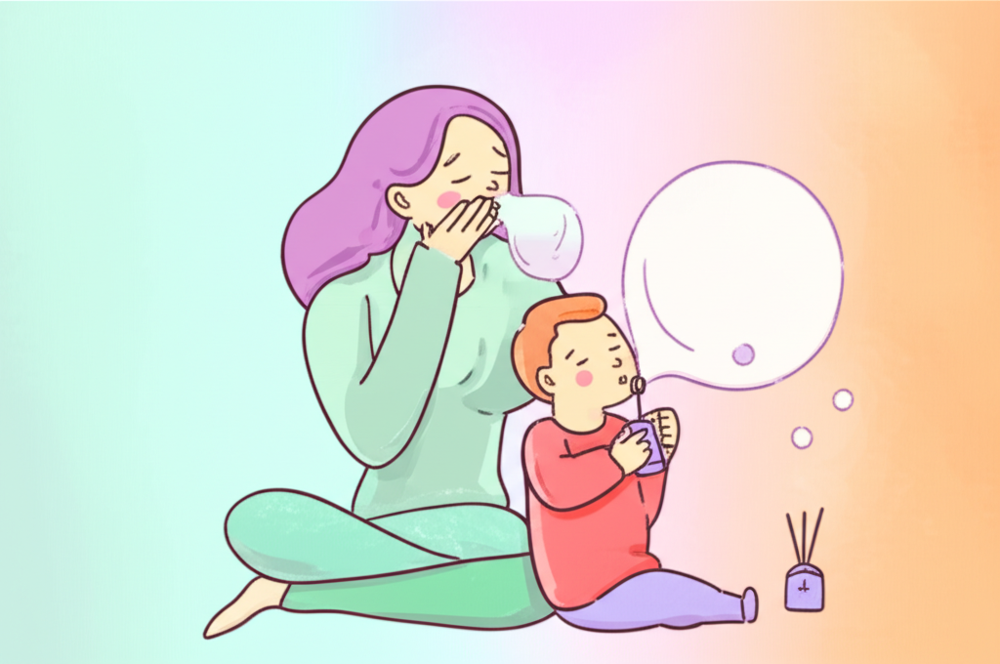

# Chapter 6. 2주차 — 호흡 훈련 시작

*부모와 함께 호흡 훈련을 하고 있는 아이의 편안한 모습*

## 이번 주, 본격적인 호흡 훈련에 들어갑니다

1주차를 잘 마치셨나요? 아이가 향기에 친해지고, 호흡 놀이에 관심을 보이기 시작했다면 최고입니다. 아직 관심이 약하더라도 괜찮습니다 — 2주차에 자연스럽게 이어갈 수 있습니다.

2주차에는 1주차의 놀이 경험을 바탕으로, **목적이 있는 호흡 훈련으로 한 걸음 나아갑니다.** 여전히 놀이의 형태를 유지하되, 코로 들이마시고 입으로 내쉬는 패턴을 아이가 자연스럽게 익히도록 안내합니다.

핵심 변화: **향기를 맡는 것(후각) + 천천히 내쉬는 것(호흡)을 하나로 연결**합니다.

---

## 2주차 목표

1. **코 호흡 익히기**: "코로 들이마시고 입으로 내쉬기"를 자연스럽게 할 수 있다
2. **향기와 호흡 연결하기**: 향기를 맡으며 호흡하는 패턴을 경험한다
3. **호흡 시간 늘리기**: 호흡 놀이 시간을 5분에서 7~8분으로 점진적으로 늘린다

### 이 정도면 성공입니다
- 아이가 "코로 킁~ 하고 맡아봐" 하면 코로 숨을 들이마신다
- 비누방울이나 깃털 불기를 3~5회 연속으로 할 수 있다
- 향기 시간을 기다리거나 좋아하는 모습을 보인다

---

## 일일 루틴: 향기 호흡 시간

*2주차 저녁 루틴 — 취침 30분 전 시작, 총 20분*

### Step 1. 분위기 만들기 (2분)

1주차와 동일합니다. 조명을 낮추고, 화면을 끄고, "자, 향기 시간이야!" 하고 시작합니다. 이미 아이에게 익숙한 시작 신호입니다.

### Step 2. 향기 맡기 (3분)

1. 아이가 좋아하는 향으로 디퓨저를 켭니다 (2~3방울)
2. **새로운 요소 추가**: "좋은 냄새를 코로 킁~ 하고 맡아볼까?" 하며 코 호흡을 유도합니다
3. 부모님이 먼저 시범을 보입니다. 과장되게 코로 크게 들이마시며 "음~ 좋은 냄새!"

**코 호흡을 유도하는 말:**
- "꽃 냄새 맡듯이 코로 킁~ 해볼까?"
- "맛있는 음식 냄새 맡을 때처럼 코로 쉬이익~"
- "좋은 냄새가 코로 쏙~ 들어간다!"

### Step 3. 향기 호흡 훈련 (7~8분)

이번 주의 핵심 시간입니다. **"향기 맡기(들이마시기) → 놀이(내쉬기)"의 패턴**을 반복합니다.

**Day 8~9: 꽃향기 놀이**

"꽃향기 맡고 촛불 끄기" 놀이로 코 호흡의 기본 패턴을 익힙니다.

1. "예쁜 꽃 냄새를 맡아볼까? 코로 쉬이익~" (코로 들이마시기)
2. "이번엔 생일 촛불을 끄자! 후~" (입으로 천천히 내쉬기)
3. 3~5회 반복
4. 익숙해지면 들이마시는 시간을 조금씩 늘립니다 ("더 오래 맡아볼까? 쉬이이이익~")

> **💡 지금 바로 해보세요**
>
> "꽃향기 맡기 — 촛불 끄기" 놀이를 부모님이 먼저 해보세요.
> 코로 3초 들이마시고, 입으로 3초 내쉬어보세요.
> 이 단순한 패턴이 아이의 자율신경계를 이완 모드로 바꿔줍니다.

**Day 10~11: 향기와 호흡 연결하기**

디퓨저 향기를 맡으면서 호흡 놀이를 합니다.

1. 디퓨저를 켠 상태에서 시작합니다
2. "좋은 냄새를 코로 크~게 맡고..." (들이마시기)
3. "비누방울을 천~천~히 불어보자" (내쉬기)
4. 또는 "깃털을 살~살~ 날려보자" (내쉬기)
5. 향기를 맡는 것과 내쉬는 것이 하나의 흐름이 되도록 합니다

**Day 12~14: 호흡 리듬 만들기**

조금 더 구조화된 호흡 패턴을 시도합니다.

1. **"쉬이익(코 들이마시기, 2~3초) — 후우우(입 내쉬기, 3~4초)"** 리듬 만들기
2. 부모님이 먼저 리듬을 보여주고, 아이가 따라 합니다
3. 함께 호흡하며 "하나, 둘, 셋" 세어도 좋습니다
4. 5~7회 정도 반복합니다

*아이 맞춤 호흡 훈련 3단계 — 꽃향기 놀이 → 향기+호흡 연결 → 호흡 리듬 만들기*

### Step 4. 마무리와 잠자리 (3~5분)

- 호흡 놀이가 끝나면 아이를 칭찬해주세요
- 칭찬 스티커를 붙여줍니다
- 디퓨저는 켜둔 채로 (또는 타이머 설정) 잠자리에 눕힙니다
- "좋은 냄새랑 같이 잘 자자" 하고 말해줍니다
- 기록지에 오늘의 훈련을 기록합니다

---

## 이런 상황이라면?

### "아이가 코로 숨 쉬는 걸 어려워해요"

입 호흡이 습관인 아이에게는 흔한 일입니다.
- 입을 살짝 다물게 하고 코앞에 손가락을 대서 바람이 나오는지 느끼게 해보세요
- "코가 바람을 쉬이익~ 하고 마시고 있어!" 하고 재미있게 표현하세요
- 코 호흡이 어려운 아이는 이비인후과 확인을 권합니다 (비염, 아데노이드 비대 등)

### "아이가 호흡 리듬을 맞추지 못해요"

완전히 정상입니다. 리듬을 맞추는 것은 목표가 아니라 방향입니다.
- 정확한 초 수보다 "천천히, 느리게"라는 느낌만 전달하면 됩니다
- 아이의 자연스러운 호흡 속도에 부모님이 맞춰주세요 (아이가 부모를 따라하는 것이 아니라, 부모가 아이의 속도에 맞추세요)
- 2주차에 완벽해질 필요 없습니다. 3~4주차에 걸쳐 점진적으로 나아집니다

> **⚠️ 주의하세요**
>
> 호흡 훈련 중 아이가 어지러움을 호소하거나, 얼굴이 빨개지거나, 불편해하면 **즉시 중단**하세요. 자연스러운 호흡으로 돌아간 후, 다음에 더 짧은 시간으로 시도합니다. 호흡 훈련은 절대 강제하는 것이 아닙니다.

### "효과가 전혀 안 보여요"

2주차에 수면 개선이 보이지 않는 것은 지극히 정상입니다. 지금은 효과를 기대하는 시기가 아니라, 기초를 쌓는 시기입니다. 기록지를 보면서 "아이가 향기를 좋아하게 되었다", "호흡 놀이를 3분에서 5분으로 늘릴 수 있었다" 같은 과정의 성과에 주목하세요.

> **💡 우리 가족 이야기**
>
> "도윤이는 늘 입으로 숨을 쉬었어요. 코 호흡이 너무 어려웠죠. 그런데 '꽃향기 맡기' 놀이를 했더니 향기를 맡으려고 자연스럽게 코로 숨을 쉬더라고요. '아! 이게 코 호흡이구나' 하고 깨달았어요. 2주차 끝날 때쯤엔 '엄마, 냄새 맡을래' 하면서 스스로 코로 킁킁거리기 시작했습니다."
> — 도윤 엄마, 인천

---

## 2주차 체크리스트

- □ 코로 들이마시는 호흡을 아이에게 소개했다
- □ "꽃향기 맡기 — 촛불 끄기" 놀이를 시도했다
- □ 향기 맡기와 호흡 놀이를 연결해서 진행했다
- □ 호흡 놀이 시간이 5분 이상 가능해졌다
- □ 향기 시간을 5회 이상 실시했다
- □ 매일 기록했다

**5개 이상 체크했다면**, 3주차로 넘어가세요!
**3~4개라면**, 2주차를 며칠 더 연장해도 좋습니다.

---

**✅ 핵심 포인트**
- 2주차 핵심은 "코로 들이마시고 입으로 내쉬기" 패턴을 익히는 것입니다
- "꽃향기 맡기 — 촛불 끄기" 놀이로 자연스럽게 코 호흡을 유도하세요
- 향기 맡기(후각)와 호흡 훈련을 하나의 활동으로 연결합니다
- 아이의 속도에 맞추되, 호흡 시간을 조금씩 늘려갑니다
- 수면 개선은 아직 기대하지 마세요 — 기초를 쌓는 시기입니다

---
