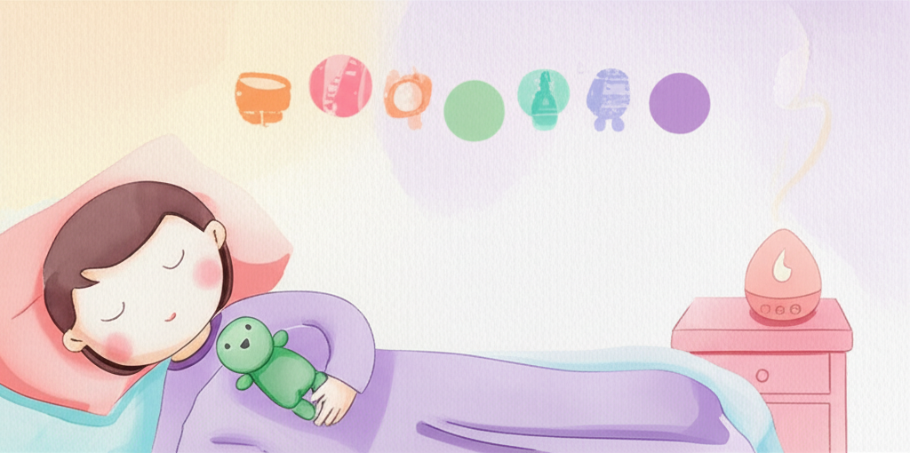

# Chapter 7. 3주차 — 수면 루틴 만들기

*향기와 호흡이 포함된 잠자리 루틴을 따르는 가족*

## 이제 진짜 수면 루틴을 만듭니다

2주 동안 아이는 향기에 친해졌고, 호흡 놀이를 경험했습니다. 이제 이 두 가지를 **수면으로 직접 연결하는 루틴**을 만들 차례입니다.

3주차의 핵심 변화는 이것입니다. 지금까지는 "향기 시간"과 "잠자는 시간"이 별개였다면, 이번 주부터는 **향기와 호흡이 잠자리로 이어지는 하나의 흐름**이 됩니다. 아이의 뇌가 "이 향기 + 이 호흡 = 잠잘 시간"이라는 연결을 학습하기 시작합니다.

많은 가정에서 이 주부터 **첫 번째 눈에 띄는 변화**를 경험합니다. 기대하되, 조급하지는 마세요.

---

## 3주차 목표

1. **완전한 수면 루틴 완성**: 향기 → 호흡 → 잠자리의 일관된 순서 확립
2. **호흡 심화**: 놀이 도구 없이도 호흡 훈련이 가능해지기
3. **자기 진정 시작**: 아이가 스스로 몸을 이완하는 첫 경험

### 이 정도면 성공입니다
- 디퓨저를 켜면 아이가 "잠잘 시간이구나"라고 인식한다
- 비누방울 없이도 "후~" 하고 천천히 내쉴 수 있다
- 잠들기까지 걸리는 시간이 이전보다 조금이라도 줄었다

---

## 수면 루틴 설계하기

*3주차 수면 루틴 — 취침 30분 전부터 잠들기까지의 전체 흐름*

### 완전한 루틴: 30분 프로그램

**시간 -30분: 스크린 오프 & 환경 전환**
- TV, 태블릿, 스마트폰을 끕니다
- 방 조명을 따뜻한 색으로 전환합니다
- "이제 곧 향기 시간이야" 예고합니다

**시간 -25분: 디퓨저 ON & 준비**
- 아이가 좋아하는 오일로 디퓨저를 켭니다 (2~3방울)
- 잠옷으로 갈아입습니다
- 양치질을 합니다
- 이 일상적인 활동들이 향기와 함께 이루어지면서, "이 향기 = 잠잘 준비"라는 연결이 강화됩니다

**시간 -15분: 호흡 훈련**
- 아이와 함께 침대나 매트에 앉거나 눕습니다
- 이번 주의 새로운 호흡법을 연습합니다 (아래 상세 안내)
- 약 7~10분간 진행합니다

**시간 -5분: 잠자리 마무리**
- 아이를 이불에 눕힙니다
- "오늘도 잘 했어. 좋은 냄새랑 같이 잘 자" 하고 말합니다
- 디퓨저는 타이머 설정 (10~15분 후 자동 꺼짐)
- 방을 나오거나, 아이 곁에 조용히 있습니다

---

## 3주차 호흡 훈련: 도구에서 몸으로

### Day 15~17: 도구 줄이기

1주차와 2주차에 사용했던 도구(비누방울, 깃털)를 점진적으로 줄여갑니다.

**Day 15:** 비누방울 3회 → 도구 없이 "후~" 3회
**Day 16:** 비누방울 1회 → 도구 없이 "후~" 5회
**Day 17:** 도구 없이 "코로 쉬이익~ 입으로 후우우~" 5~7회

아이에게 이렇게 설명하세요: "이제 도구 없이도 할 수 있어! 대단하다!"

### Day 18~19: 배 호흡법 (복식호흡)

도구 없이 호흡할 수 있게 되면, 한 단계 깊은 호흡을 시도합니다.

1. 아이를 등을 대고 눕힙니다
2. 아이 배 위에 **작은 인형**을 올려놓습니다
3. "인형이 올라갔다~ 내려갔다~ 하게 숨을 쉬어볼까?"
4. 코로 들이마시면 배가 올라오고(인형이 올라감), 입으로 내쉬면 배가 내려갑니다(인형이 내려감)
5. "인형을 천~천~히 올렸다 내렸다 해보자"

*배 호흡법 — 인형을 배 위에 올려 시각적으로 호흡을 확인하는 방법*

이 방법이 좋은 이유는 **호흡을 눈으로 볼 수 있기 때문**입니다. 추상적인 "깊이 숨 쉬어"보다 인형이 올라가고 내려가는 것을 보는 것이 아이에게 훨씬 이해하기 쉽습니다.

> **💡 지금 바로 해보세요**
>
> 부모님이 먼저 누워서 배 위에 작은 물건을 올려보세요.
> 코로 들이마실 때 배가 올라오는지, 입으로 내쉴 때 배가 내려가는지 확인하세요.
> 의외로 어른도 처음에는 잘 안 될 수 있습니다.
> 연습하면 금방 됩니다 — 아이도 마찬가지예요.

### Day 20~21: 루틴 안정화

이틀간은 새로운 것을 추가하지 않습니다. 지금까지 만든 루틴을 **똑같이 반복**합니다.

- 같은 시간, 같은 순서, 같은 향기, 같은 호흡법
- 반복은 지루한 것이 아니라, 뇌에 패턴을 새기는 과정입니다
- 아이가 "다음에 뭐 해?" 하고 예측할 수 있다면, 루틴이 자리잡고 있다는 증거입니다

---

## 변화를 관찰하세요

3주차부터는 수면의 변화를 의식적으로 관찰해보세요.

### 작은 변화의 신호들

이런 변화가 보인다면, 프로그램이 효과를 발휘하기 시작한 것입니다:

- 잠들기까지 걸리는 시간이 **조금이라도** 줄었다
- 잠자리에서 뒤척이는 시간이 줄었다
- 디퓨저를 켜면 아이가 **자발적으로** 잠자리 쪽으로 간다
- 밤중에 깨는 횟수가 줄었다
- 깨더라도 다시 잠드는 시간이 빨라졌다
- 아침에 일어났을 때 기분이 좋아졌다

> **📌 전문가 팁**
>
> "3주차에 변화가 안 보여도 포기하지 마세요. 눈에 보이지 않아도 아이의 뇌 속에서는 변화가 진행되고 있습니다. 향기와 수면의 연결이 형성되는 중이에요. 보통 임계점을 넘으면 갑자기 변화가 눈에 띄기 시작합니다. 4주차까지 꾸준히 이어가세요."

### 기록지 비교하기

1주차 기록지와 3주차 기록지를 나란히 놓고 비교해보세요.

| 비교 항목 | 1주차 | 3주차 | 변화 |
|-----------|-------|-------|------|
| 향기에 대한 반응 | | | |
| 호흡 훈련 참여도 | | | |
| 평균 입면 시간 | | | |
| 밤중 각성 횟수 | | | |
| 아침 기분 상태 | | | |

---

## 이런 상황이라면?

### "루틴을 지키기가 너무 힘들어요"

현실적으로 매일 완벽한 30분 루틴이 어려울 수 있습니다.
- **최소 버전**을 만들어두세요: 디퓨저 켜기 + 호흡 5회 + 잠자리 (5분이면 됩니다)
- 바쁜 날에는 최소 버전이라도 하는 것이 안 하는 것보다 훨씬 좋습니다
- 완벽한 7일보다 불완전한 7일이 낫습니다

### "아이가 배 호흡을 못 해요"

많은 아이가 처음에 어려워합니다. 괜찮습니다.
- 인형 대신 부모님의 손을 아이 배에 올려주세요 — 촉각적 피드백이 더 직접적입니다
- 배 호흡이 안 되면, 2주차의 "꽃향기 맡기 — 촛불 끄기"를 계속해도 됩니다
- 강요하지 마세요. 배 호흡은 4주차에도 연습할 수 있습니다

> **💡 우리 가족 이야기**
>
> "3주차 셋째 날, 정말 놀라운 일이 일어났어요. 제가 디퓨저를 켜려고 방에 들어갔더니, 시현이가 이미 이불 위에 누워서 '엄마, 냄새!' 하고 기다리고 있었어요. 전에는 잠자리에 눕히는 것만으로도 전쟁이었는데. 그날 15분 만에 잠들었어요. 예전에는 1시간이 넘게 걸렸는데."
> — 시현 엄마, 광주

---

## 3주차 체크리스트

- □ "디퓨저 ON → 잠잘 준비 → 호흡 훈련 → 잠자리"의 완전한 루틴을 실시했다
- □ 호흡 도구 없이 "코로 쉬이익~ 입으로 후우우~"가 가능해졌다
- □ 배 호흡법(인형 올리기)을 시도했다
- □ 매일 같은 시간, 같은 순서로 루틴을 진행했다
- □ 수면의 작은 변화를 관찰하고 기록했다
- □ 1주차 기록과 비교해보았다

---

**✅ 핵심 포인트**
- 3주차에 향기와 호흡이 잠자리로 이어지는 **완전한 수면 루틴**을 만듭니다
- 호흡 도구를 점진적으로 줄이고, **배 호흡법(복식호흡)**으로 나아갑니다
- 매일 같은 시간·같은 순서의 반복이 뇌에 "잠잘 시간" 패턴을 새깁니다
- 이 시기부터 **눈에 띄는 수면 개선**이 시작되는 가정이 많습니다
- 변화가 느리더라도 꾸준히 — 4주차까지 이어가세요

---
