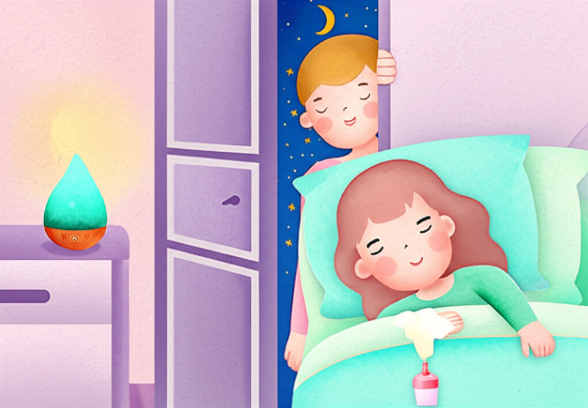

# Chapter 8. 4주차 — 습관으로 굳히기

*편안하게 잠들어 있는 아이와 흐뭇하게 바라보는 부모*

## 마지막 주, 루틴을 습관으로 바꿉니다

4주차에 오신 것을 축하합니다! 여기까지 온 것 자체가 대단한 일입니다.

지난 3주간 아이는 향기에 친해지고(1주차), 호흡 훈련을 익히고(2주차), 수면 루틴을 만들었습니다(3주차). 이번 주의 목표는 이 루틴을 **아이의 일상 속 자연스러운 습관으로 굳히는 것**입니다.

루틴과 습관의 차이는 무엇일까요? 루틴은 **"의식적으로 따르는 순서"**이고, 습관은 **"자동으로 이루어지는 행동"**입니다. 양치질을 예로 들면, 처음에는 "양치해야지" 하고 의식적으로 했지만, 지금은 자연스럽게 세면대로 향하지 않나요? 수면 루틴도 마찬가지입니다.

---

## 4주차 목표

1. **루틴 자동화**: 부모의 개입을 줄이고, 아이가 스스로 루틴을 따라가기
2. **호흡 자립**: 아이가 혼자서도 느린 호흡을 할 수 있기
3. **성과 확인 & 다음 단계 설계**: 4주간의 변화를 정리하고 장기 계획 세우기

### 이 정도면 대성공입니다
- 디퓨저를 켜면 아이가 알아서 잠자리 준비를 한다
- 부모가 "호흡하자" 하지 않아도 아이가 스스로 깊은 숨을 쉰다
- 입면 시간이 프로그램 시작 전보다 확실히 줄었다

---

## Day 22~24: 루틴 자동화

### 부모의 개입을 한 단계씩 줄이기

지금까지는 부모님이 모든 단계를 이끌었습니다. 이번에는 아이가 스스로 할 수 있는 부분을 늘려갑니다.

**Day 22:** 부모가 디퓨저를 켜되, "다음에 뭐 하지?" 하고 물어봅니다. 아이가 순서를 기억하고 말하거나 행동으로 보여주면 크게 칭찬합니다.

**Day 23:** 아이에게 디퓨저 버튼을 직접 누르게 합니다 (안전한 범위에서). "오늘은 네가 켜볼까?" 자신이 루틴의 주인공이라는 느낌을 줍니다.

**Day 24:** 부모가 곁에 있되, 최소한의 말만 합니다. 아이가 스스로 잠옷을 입고, 자리에 눕고, 호흡을 하는 모습을 관찰합니다.

> **📌 전문가 팁**
>
> 자동화가 잘 되지 않는다고 실망하지 마세요. 발달장애 아동은 습관 형성에 더 많은 시간이 필요할 수 있습니다. 4주차에 완전히 자동화되지 않아도 괜찮습니다. 방향이 맞다면, 5주, 6주에 걸쳐 계속하면 됩니다.

---

## Day 25~26: 변형과 응용

루틴이 안정되었다면, 다양한 상황에서도 유지할 수 있도록 유연성을 키웁니다.

### 상황별 응용법

**외출 시 / 여행 시**
- 작은 롤온(roll-on) 아로마 스틱을 준비합니다 (베개에 한 번 문지르면 됩니다)
- 디퓨저가 없어도 향기는 유지할 수 있습니다
- 호흡 훈련은 어디서든 할 수 있으므로, 장소가 달라져도 루틴의 핵심은 유지됩니다

**컨디션이 안 좋은 날**
- 아이가 아프거나 피곤한 날에는 **최소 버전**으로 진행합니다
- 최소 버전: 디퓨저만 켜고, 호흡 3회만 하고, 바로 잠자리
- 안 하는 것보다 짧게라도 하는 것이 습관 유지에 중요합니다

**주말이나 일정이 다른 날**
- 시간이 30분~1시간 정도 달라지는 것은 괜찮습니다
- 순서(향기 → 호흡 → 잠자리)는 가급적 유지합니다

### 향기 변화 시도

4주 동안 같은 향기를 사용했다면, 새로운 향을 추가해볼 수 있습니다.

- 기존 향기를 베이스로 유지하면서, 새 향을 1방울 블렌딩합니다
- 예: 라벤더 2방울 + 시더우드 1방울
- 아이가 거부하면 기존 향으로 돌아갑니다
- 계절에 따라 향을 바꿔주는 것도 좋습니다

---

## Day 27~28: 성과 확인과 다음 단계

### 4주간의 변화 정리하기

기록지를 꺼내서 1주차와 4주차를 비교합니다.

*4주 프로그램 전후 변화 — 주요 지표 비교 그래프*

**변화 기록표**

| 항목 | 프로그램 전 | 4주차 현재 | 변화 |
|------|------------|-----------|------|
| 평균 입면 시간 | ___분 | ___분 | ___분 단축 |
| 밤중 각성 횟수 | ___회 | ___회 | ___회 감소 |
| 총 수면 시간 | ___시간 | ___시간 | ___시간 증가 |
| 아침 기분 | 좋음/보통/나쁨 | 좋음/보통/나쁨 | |
| 향기에 대한 반응 | | | |
| 호흡 훈련 참여도 | | | |

> **💡 지금 바로 해보세요**
>
> 위 표를 채운 후, 아이에게도 보여주세요.
> "봐, 여기 스티커가 이렇게 많아! 네가 정말 잘 한 거야!"
> 아이가 자신의 성과를 시각적으로 확인하면 자신감이 생깁니다.
> 가족 모두 함께 축하하는 시간을 가져보세요.

### 4주 이후: 장기 유지 계획

4주 프로그램이 끝났다고 해서 루틴을 멈추면 안 됩니다. **최소 2~3개월간 지속**해야 안정적인 습관으로 자리잡습니다.

**유지 모드로 전환하기**
- 향기와 호흡 루틴을 매일 계속합니다
- 단, 기록은 매일이 아닌 주 1회로 줄여도 됩니다
- 새로운 것을 추가하기보다, 현재 루틴을 안정적으로 유지하는 데 집중합니다

**점진적으로 줄여도 되는 것**
- 부모의 직접적인 개입 (아이가 스스로 할 수 있는 부분)
- 호흡 훈련 시간 (아이가 스스로 이완할 수 있다면, 5분 → 3분 → 잠자리 전 호흡 3회 정도로)

**절대 줄이지 말아야 할 것**
- 향기 사용 (디퓨저 켜기는 계속!)
- 루틴의 순서 (향기 → 호흡 → 잠자리)
- 일관된 취침 시간

---

## 이런 상황이라면?

### "4주가 지났는데 변화가 미미해요"

낙담하지 마세요. 변화의 속도는 아이마다 다릅니다.
- 아주 작은 변화라도 있다면, 방향은 맞습니다. 계속하세요
- 전혀 변화가 없다면, 향기 종류를 바꿔보거나, 루틴 시간대를 조정해보세요
- 8주까지 진행해도 변화가 없다면, 전문가(소아 수면 전문의, 작업치료사)와 상담을 권합니다

### "잘 되다가 갑자기 퇴보했어요"

이것은 매우 흔한 현상입니다. **"퇴행"은 발달 과정의 자연스러운 일부**입니다.
- 아이의 컨디션, 환경 변화(유치원 행사, 계절 변화, 가족 여행 등)가 원인일 수 있습니다
- 당황하지 말고, 기존 루틴을 그대로 유지하세요
- 대부분 며칠~1주일 안에 다시 원래 수준으로 돌아옵니다

### "다른 형제자매도 같이 하고 싶어해요"

좋은 소식입니다! 함께 하면 좋습니다.
- 향기와 호흡 루틴은 발달장애가 없는 아이에게도 수면에 도움이 됩니다
- 형제가 함께 하면 "함께 하는 가족 시간"이 되어, 모든 아이에게 긍정적입니다
- 단, 대상 아이의 루틴을 형제에게 맞추어 바꾸지는 마세요. 형제가 따라오는 형태가 좋습니다

> **💡 우리 가족 이야기**
>
> "4주가 끝나고 기록지를 봤더니, 잠드는 시간이 평균 70분에서 20분으로 줄었더라고요. 숫자로 보니까 눈물이 났어요. 밤이 두려웠던 우리 가족에게 평화가 찾아온 거예요. 지금은 3개월째 계속하고 있는데, 디퓨저를 켜면 은찬이가 알아서 이불로 가요. 가끔 안 그런 날도 있지만, 예전과는 비교할 수 없죠."
> — 은찬 엄마, 수원

---

## 4주차 최종 체크리스트

- □ 아이가 루틴의 순서를 알고 스스로 따라갈 수 있다
- □ 부모의 개입 없이도 호흡을 시도한 적이 있다
- □ 외출 시에도 간단한 형태로 루틴을 유지했다
- □ 4주간의 변화를 기록지로 비교했다
- □ 장기 유지 계획을 세웠다
- □ 가족 함께 4주 완성을 축하했다

---

**✅ 핵심 포인트**
- 4주차 목표는 루틴을 **자동화된 습관**으로 전환하는 것입니다
- 부모의 개입을 점진적으로 줄이고, 아이의 **자율성**을 키웁니다
- 외출, 컨디션 변화 등 다양한 상황에서도 **유연하게 유지**하는 방법을 익힙니다
- 4주 이후에도 **최소 2~3개월** 루틴을 지속해야 안정적인 습관이 됩니다
- 속도가 느려도 괜찮습니다 — **꾸준함이 가장 강력한 전략**입니다

---
