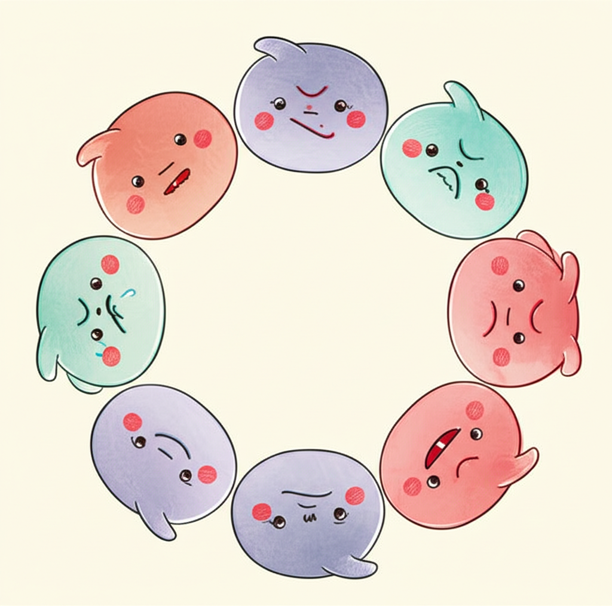

# Part 1. 마음의 지도 그리기

---

## Chapter 1. 당신의 마음에 먼저 안부를 묻습니다

*핵심 메시지: "이런 감정을 느끼는 당신은 정상입니다"*

---

> 💬 **공감 에피소드**
>
> *아침 7시. 알람보다 먼저 눈이 떠집니다.*
>
> *오늘 일정이 머릿속을 빠르게 스쳐 갑니다.*
> *9시 언어치료, 11시 작업치료.*
> *점심은 치료실 근처 편의점에서 해결해야겠다.*
> *오후 2시에 어린이집 상담, 4시에 감각통합치료.*
>
> *아이 옷을 갈아입히다가 아이가 울음을 터뜨립니다.*
> *양말 감촉이 싫은 모양입니다.*
> *"괜찮아, 괜찮아." 아이를 달래면서 생각합니다.*
>
> *'나는 괜찮은 걸까?'*
>
> *치료실 대기실에서 다른 아이가 "엄마!"라고 부릅니다.*
> *그 한마디에 가슴이 콕 찔립니다.*
> *우리 아이도 언젠간 저렇게 부를 수 있을까.*
>
> *저녁, 아이를 재우고 소파에 앉습니다.*
> *핸드폰을 열면 또래 아이의 영상이 떠오릅니다.*
> *또래는 문장으로 말하고, 숟가락을 혼자 쥡니다.*
>
> *핸드폰을 끄고 천장을 바라봅니다.*
> *눈물이 흐릅니다. 이유를 잘 모르겠습니다.*
> *그냥, 눈물이 나옵니다.*

---

혹시 이 이야기가 낯설지 않으신가요?

세부 상황은 다를 수 있습니다.
하지만 그 **마음의 무게**는 비슷할 겁니다.

발달지연 아동의 부모로 산다는 것.
그것은 남들에게 쉽게 설명할 수 없는 감정의 연속입니다.

이 챕터에서는 그 감정들을 하나씩 꺼내 보겠습니다.
꺼내놓는 것만으로도 마음이 조금 가벼워질 수 있습니다.

---

### 부모가 흔히 겪는 7가지 감정

발달지연 아동을 양육하면서 부모가 겪는 감정은 다양합니다.
여기 소개하는 7가지는 가장 흔하게 나타나는 감정들입니다.
어쩌면 전부 겪고 계실 수도 있습니다.

**그 모든 감정은 자연스러운 것입니다.**

---

#### 1. 죄책감

> *"임신 중에 커피를 마셔서 그런 걸까?"*
> *"좀 더 일찍 발견했으면 달랐을까?"*

부모는 원인을 자신에게서 찾으려 합니다.
내가 뭘 잘못했기 때문이라고 생각합니다.

하지만 대부분의 발달지연은 특정한 원인 하나로 설명되지 않습니다.
당신 탓이 아닙니다.
**정말로, 당신 탓이 아닙니다.**

---

#### 2. 고립감

> *"친구들 모임에 가면 할 말이 없어요."*
> *"아이가 어린이집에서 문제를 일으킬까 봐 외출이 두려워요."*

발달지연 아동의 부모는 사회적으로 고립되기 쉽습니다.
또래 부모와 대화가 어렵고, 외출이 부담스럽습니다.
점점 세상이 좁아지는 느낌이 듭니다.

당신만 그런 것이 아닙니다.
**많은 부모가 같은 외로움을 느끼고 있습니다.**

---

#### 3. 슬픔

> *"돌잔치 때 찍은 사진을 보면 울컥해요."*
> *"다른 아이들이 뛰어노는 걸 보면 마음이 아파요."*

이 슬픔은 아이를 사랑하지 않아서가 아닙니다.
**기대했던 양육의 모습**과 **현실** 사이의 거리에서 오는 슬픔입니다.
이 감정은 Chapter 2에서 더 자세히 다루겠습니다.

---

#### 4. 분노

> *"왜 하필 우리 아이인 거야?"*
> *"의사가 '좀 더 지켜보자'고만 해서 화가 났어요."*

분노는 때로 세상을 향하고, 때로 배우자를 향하고,
때로 자기 자신을 향합니다.
분노 자체는 나쁜 감정이 아닙니다.
**중요한 것은 그 분노를 어떻게 다루느냐**입니다.

---

#### 5. 불안

> *"이 아이가 학교에 갈 수 있을까?"*
> *"내가 늙으면 이 아이는 누가 돌보지?"*

부모의 불안은 현재에 머물지 않습니다.
5년 후, 10년 후, 30년 후까지 달려갑니다.
아직 오지 않은 미래가 무겁게 짓누릅니다.

**지금 이 순간에 집중하는 연습이 필요합니다.**
그 방법은 Chapter 3에서 함께 배워 보겠습니다.

---

#### 6. 수치심

> *"마트에서 아이가 바닥에 누워 울 때, 사람들 시선이…"*
> *"시어머니가 '키우기를 어떻게 했길래'라고 하셨어요."*

수치심은 가장 깊은 곳에 숨어 있는 감정입니다.
남들의 시선, 가족의 말 한마디가 비수가 됩니다.
하지만 기억하세요.

**수치심을 느끼게 만든 건 당신이 아니라, 편견입니다.**

---

#### 7. 무력감

> *"열심히 치료받는데 왜 나아지지 않는 거지?"*
> *"내가 이렇게까지 해도 안 되는 건가."*

최선을 다하는데도 변화가 더딜 때.
부모는 깊은 무력감에 빠집니다.
하지만 **변화는 눈에 보이지 않는 곳에서도 일어나고 있습니다.**
아이의 성장은 계단식입니다.
평평한 구간이 있어야 다음 계단을 오를 수 있습니다.

---

### "나만 이런 건 아닐까?"

혹시 이렇게 생각하신 적 있나요?
"다른 부모들은 잘 견디는 것 같은데, 나만 유난인 걸까?"

**아닙니다. 당신만 겪는 일이 아닙니다.**

연구 결과가 이를 분명하게 보여줍니다.

---

**발달지연 아동 부모의 정신건강 관련 통계:**

- 발달장애 아동 부모의 **약 40~50%**가 임상적 수준의 우울 증상을 보고합니다.
  일반 부모의 약 2~3배 높은 수치입니다.
  *(Singer, 2006; Bailey et al., 2007)*

- 발달지연 아동 양육자의 **약 35~45%**가 높은 수준의 양육 스트레스를 경험합니다.
  *(Estes et al., 2009; Hayes & Watson, 2013)*

- 발달장애 아동 어머니의 **약 70%**가 신체적 건강 문제(만성피로, 두통, 소화장애 등)를 동반합니다.
  *(Miodrag & Hodapp, 2010)*

- 양육 스트레스로 인한 부부 갈등 경험: **약 60~70%**
  *(Hartley et al., 2010)*

---

이 숫자들이 말하는 것은 하나입니다.

**당신이 느끼는 감정은 비정상이 아닙니다.**
오히려 이 상황에서 당연한 반응입니다.

힘든 감정을 느끼는 것은 당신이 약해서가 아닙니다.
**그만큼 열심히 양육하고 있다는 증거**입니다.

---

### 감정에 이름 붙이기의 힘

여기서 한 가지 흥미로운 연구를 소개합니다.

UCLA의 매튜 리버만(Matthew Lieberman) 교수 연구팀은
감정에 이름을 붙이는 것만으로도 뇌의 변화가 일어난다는 사실을 발견했습니다.

이것을 **'감정 명명하기(Affect Labeling)'**라고 합니다.

---

**원리는 이렇습니다:**

불안하거나 화가 날 때, 뇌의 **편도체(감정 중추)**가 활성화됩니다.
이때 "아, 내가 지금 불안하구나"라고 말로 표현하면,
뇌의 **전전두엽(이성 중추)**이 활성화되면서
편도체의 활동이 줄어듭니다.

쉽게 말하면 이렇습니다.

> 💡 **알아두세요**
>
> **감정에 이름을 붙이는 것 = 감정의 볼륨을 낮추는 것**
>
> "힘들다"라고 막연하게 느끼는 것보다
> "지금 나는 **죄책감**을 느끼고 있구나"라고 구체적으로 인식하면
> 그 감정의 강도가 줄어듭니다.
>
> 연구에 따르면, 감정 명명만으로 부정적 감정의 강도가
> **약 30~50%** 감소하는 효과가 나타났습니다.
> *(Lieberman et al., 2007; Torre & Lieberman, 2018)*

---

**감정에 이름 붙이기, 3단계로 시작해 보세요:**

**1단계: 멈추기**
지금 느끼는 감정을 알아차리세요.
몸의 신호에 주목합니다.
가슴이 답답한가요? 어깨가 뻣뻣한가요? 눈물이 나려고 하나요?

**2단계: 이름 붙이기**
그 감정에 가장 가까운 이름을 찾아 보세요.
"지금 나는 ______을/를 느끼고 있구나."
정확하지 않아도 괜찮습니다. 가까운 것이면 됩니다.

**3단계: 인정하기**
"이 감정을 느끼는 것은 자연스러운 거야."
자신에게 한 마디 건네 주세요.
판단하지 말고, 그냥 인정해 주는 것만으로 충분합니다.

---

이 3단계가 바로 **마음 치유의 시작점**입니다.

아직은 어색할 수 있습니다.
그동안 자신의 감정을 돌볼 여유가 없었을 테니까요.
하지만 이 작은 연습이 쌓이면,
감정의 파도에 휩쓸리지 않는 힘이 생깁니다.

---

> 🎯 **셀프 체크: 지난 한 주, 나는 이런 감정을 느꼈다**
>
> 아래 감정 중에서 지난 한 주 동안 느낀 것에 체크해 보세요.
> 여러 개를 체크해도 괜찮습니다. 솔직하게 표시해 주세요.
>
> - [ ] **죄책감** — "내 탓인 것 같다"는 느낌
> - [ ] **고립감** — "나 혼자인 것 같다"는 느낌
> - [ ] **슬픔** — 이유 없이 눈물이 나거나 마음이 무거운 느낌
> - [ ] **분노** — 상황이나 누군가에게 화가 나는 느낌
> - [ ] **불안** — 미래가 걱정되고 마음이 조급한 느낌
> - [ ] **수치심** — 남들의 시선이 신경 쓰이고 위축되는 느낌
> - [ ] **무력감** — "아무리 해도 안 된다"는 느낌
> - [ ] **감사함** — 작은 것에도 고마운 느낌
> - [ ] **희망** — "잘 될 거야"라는 작은 기대
> - [ ] **사랑** — 아이를 향한 깊은 사랑
>
> **체크한 감정을 바라보며 자신에게 말해 주세요:**
>
> *"이 감정을 느끼는 나는, 정상이야."*
>
> 💡 마지막 세 가지(감사함, 희망, 사랑)도 함께 넣었습니다.
> 힘든 감정 속에서도 당신 안에는 이런 감정이 분명 있습니다.
> 그것을 잊지 마세요.

---

> 📝 **Chapter 1 핵심 포인트**
>
> ✅ **부정적 감정은 자연스러운 반응이다**
> 죄책감, 고립감, 슬픔, 분노, 불안, 수치심, 무력감…
> 이 모든 감정은 발달지연 아동 부모라면 누구나 겪는 보편적인 감정입니다.
> 느끼는 것 자체를 부끄러워하지 마세요.
>
> ✅ **감정을 인식하는 것만으로도 치유가 시작된다**
> "감정 명명하기(Affect Labeling)"는 과학적으로 입증된 방법입니다.
> "지금 나는 ______을 느끼고 있구나"라고 말하는 것만으로
> 감정의 강도가 줄어듭니다. 오늘부터 연습해 보세요.
>
> ✅ **당신만 겪는 일이 아니다**
> 발달지연 아동 부모의 약 40~50%가 우울 증상을,
> 약 35~45%가 높은 양육 스트레스를 경험합니다.
> 당신은 혼자가 아닙니다. 같은 길을 걷는 부모가 많습니다.

---
