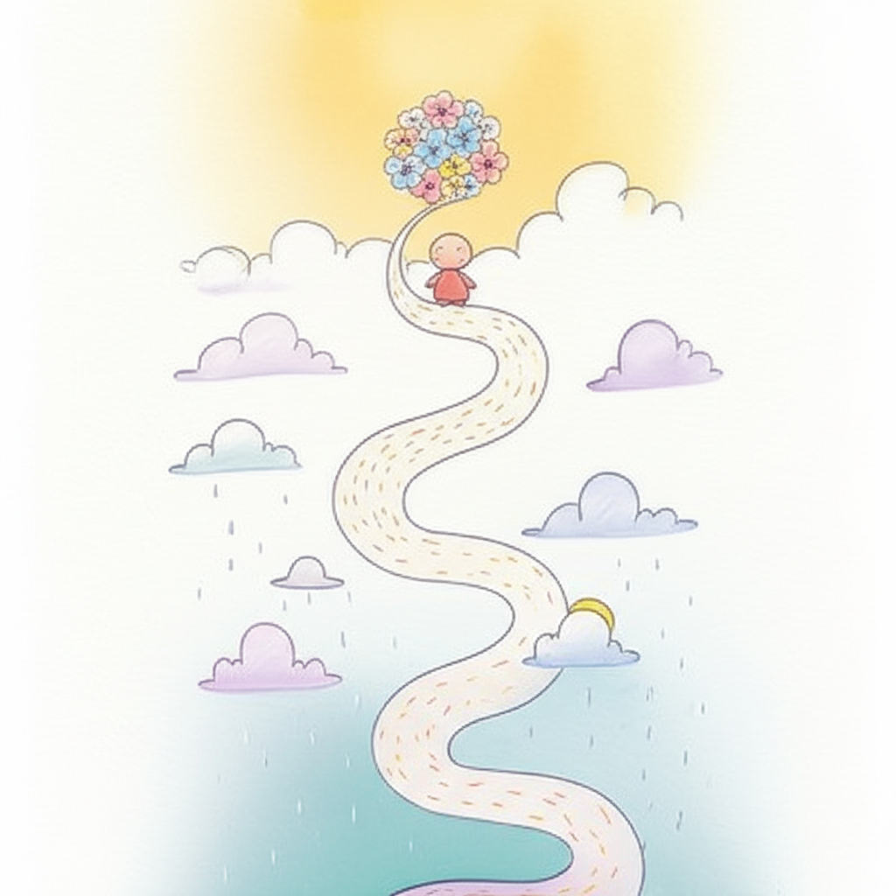

## Chapter 2. 진단 그 이후 — 애도와 수용의 과정

*핵심 메시지: "기대했던 양육과 현실 사이에서 흔들리는 건 당연합니다"*

---

> 💬 **공감 에피소드**
>
> *그날을 기억합니다.*
>
> *병원 복도의 형광등이 유난히 밝았습니다.*
> *의사의 입에서 나온 단어들이 귀에 들어왔다가*
> *머릿속에서 뒤엉켰습니다.*
>
> *"발달지연… 추가 검사가 필요합니다… 치료를 시작해야…"*
>
> *고개를 끄덕이면서도 마음속으로는 생각했습니다.*
> *'우리 아이는 아닐 거야. 좀 늦된 것뿐이야.'*
>
> *집에 오는 길, 아이는 카시트에서 잠들어 있었습니다.*
> *백미러로 아이의 얼굴을 봤습니다.*
> *세상에서 가장 평화로운 얼굴.*
>
> *주차장에 차를 세우고 한참을 울었습니다.*
> *아이가 깨지 않도록, 소리 없이.*
>
> *그날 이후, 세상이 달라 보이기 시작했습니다.*
> *전에는 보이지 않던 것들이 눈에 들어왔습니다.*
> *놀이터에서 뛰어노는 아이들, 유치원 앞에서 재잘거리는 아이들.*
>
> *'우리 아이도 저렇게 될 수 있을까?'*
>
> *그 질문이 머릿속을 떠나지 않았습니다.*

---

진단을 받은 날.
혹은 "발달이 좀 느린 것 같다"는 말을 처음 들은 날.

그날은 많은 부모에게 **삶의 전환점**입니다.

세상이 '진단 이전'과 '진단 이후'로 나뉘는 순간.
오늘은 그 '이후'의 마음을 이야기해 보겠습니다.

---

### 기대했던 아이 vs 현실의 아이

아이가 태어나기 전부터 부모는 상상합니다.

첫 걸음마를 떼는 모습.
"엄마", "아빠"라고 부르는 목소리.
유치원 입학식에서 손 흔드는 장면.
운동회에서 달리는 모습.

이것은 모든 부모가 자연스럽게 품는 **양육 서사(narrative)**입니다.

발달지연 진단은 이 서사를 흔듭니다.
기대했던 타임라인이 무너지고,
익숙했던 미래 그림이 흐려집니다.

이때 부모가 느끼는 것은 **상실감**입니다.

> 💡 **알아두세요**
>
> 여기서 말하는 상실은 "아이를 잃었다"는 뜻이 아닙니다.
> **기대했던 양육의 모습을 잃었다**는 뜻입니다.
>
> 사랑하는 아이는 바로 눈앞에 있습니다.
> 달라진 것은 아이가 아니라, **미래에 대한 기대**입니다.
>
> 이 상실감을 느끼는 것이
> 아이를 사랑하지 않는다는 뜻이 절대 아닙니다.
> 오히려 **아이를 깊이 사랑하기 때문에** 느끼는 감정입니다.

---

### 부모 버전 애도의 5단계

심리학자 엘리자베스 쿠블러-로스(Elisabeth Kübler-Ross)는
상실을 겪는 사람이 거치는 다섯 단계를 제시했습니다.

원래는 죽음과 임종에 관한 이론이지만,
발달지연 아동 부모의 심리 과정에도 놀라울 만큼 잘 들어맞습니다.

각 단계를 **발달지연 아동 부모의 상황**에 맞게 풀어 보겠습니다.

---

---

#### 1단계: 부정 (Denial)

**"아닐 거야. 좀 늦된 것뿐이야."**

진단을 받았지만 받아들이지 않는 단계입니다.
"의사가 틀렸을 수도 있어."
"다른 병원에 가면 다를 수도 있어."
"아인슈타인도 말이 늦었대."

부정은 마음의 **완충 장치**입니다.
충격을 한꺼번에 받아들이지 않도록
마음이 스스로를 보호하는 것입니다.

> 이 단계에서 부모는:
> - 여러 병원을 돌며 다른 진단을 기대합니다
> - 인터넷에서 "발달지연 자연회복" 사례를 찾습니다
> - 주변에 진단 사실을 알리지 않습니다

---

#### 2단계: 분노 (Anger)

**"왜 하필 우리 아이야? 대체 누구 탓이야?"**

현실이 조금씩 스며들면서 분노가 찾아옵니다.

분노의 방향은 다양합니다:
- **세상을 향한 분노**: "왜 하필 우리 가족에게?"
- **의료진을 향한 분노**: "왜 더 빨리 알려주지 않았어?"
- **배우자를 향한 분노**: "왜 당신은 무심하게 구는 거야?"
- **자신을 향한 분노**: "내가 뭘 잘못한 거지?"

> 이 단계에서 부모는:
> - 사소한 일에도 쉽게 화가 납니다
> - 배우자와 잦은 다툼을 합니다
> - "불공평하다"는 생각에 사로잡힙니다

---

#### 3단계: 타협 (Bargaining)

**"이것만 하면 나아지지 않을까?"**

부모는 무언가와 거래하려 합니다.
"이 치료를 받으면 좋아질 거야."
"하루에 3시간씩 자극하면 따라잡을 수 있을 거야."
"내가 더 노력하면…"

이 단계에서 부모는 치료에 모든 에너지를 쏟습니다.
치료 스케줄이 빽빽해지고,
검증되지 않은 방법에도 손을 뻗습니다.

> 이 단계에서 부모는:
> - 치료와 교육에 과도하게 몰두합니다
> - "이번에야말로"라는 기대를 반복합니다
> - 자신의 건강과 생활을 뒷전으로 밀어둡니다

> 💡 **알아두세요**
>
> 적극적인 치료는 물론 중요합니다.
> 하지만 **"이것만 하면 정상이 될 거야"라는 조건부 기대**는
> 부모와 아이 모두를 지치게 합니다.
>
> 치료의 목표는 "정상 아이 만들기"가 아니라
> **"아이가 자기 잠재력을 최대한 발휘하도록 돕기"**입니다.
> 이 차이가 타협 단계를 건강하게 지나는 열쇠입니다.

---

#### 4단계: 우울 (Depression)

**"아무리 해도 변하지 않는 것 같아."**

타협 단계에서 기대한 만큼의 변화가 보이지 않을 때.
깊은 슬픔과 무기력이 찾아옵니다.

"나는 좋은 부모가 아닌 것 같아."
"이렇게 사는 게 무슨 의미가 있지?"
"앞으로가 너무 막막해."

이 단계는 가장 힘들지만,
동시에 **진정한 수용으로 가는 관문**이기도 합니다.

> 이 단계에서 부모는:
> - 의욕이 떨어지고 무기력합니다
> - 사회적 활동을 피합니다
> - 수면, 식욕에 변화가 생깁니다
> - 눈물이 자주 납니다

> 💡 **알아두세요**
>
> 이 단계에서의 우울이 2주 이상 지속되고,
> 일상생활이 어려울 정도라면
> **반드시 전문가의 도움을 받으세요.**
>
> 부모의 우울은 아이의 발달에도 영향을 미칩니다.
> 전문 상담을 받는 것은 나약함이 아니라,
> **가장 용감한 양육 행위**입니다.

---

#### 5단계: 수용 (Acceptance)

**"이 아이가 자기만의 속도로 자라고 있구나."**

수용은 체념이 아닙니다.
"포기"와 "수용"은 전혀 다릅니다.

수용은 이런 것입니다:
- 아이의 현재 모습을 **있는 그대로** 바라보는 것
- 또래와 비교하는 대신 **아이 자신의 어제와 오늘**을 비교하는 것
- 완벽한 미래 대신 **오늘 하루의 작은 성장**에 주목하는 것
- "왜 우리 아이가?"라는 질문 대신 **"우리 아이에게 지금 필요한 것은?"**이라고 묻는 것

> 이 단계에서 부모는:
> - 아이의 작은 변화에 기뻐합니다
> - 현실적인 기대를 세울 수 있게 됩니다
> - 다른 발달지연 아동 부모와 연대할 수 있게 됩니다
> - 자신의 감정을 편안하게 인정합니다

---

### "수용은 포기가 아닙니다"

이 부분이 정말 중요합니다.

많은 부모가 수용을 두려워합니다.
"현실을 받아들이면 더 이상 노력하지 않게 되는 거 아냐?"
"포기하는 것과 뭐가 다르지?"

**전혀 다릅니다.**

---

| | 포기 | 수용 |
|---|---|---|
| **아이를 바라보는 시선** | "이 아이는 안 될 거야" | "이 아이에게 맞는 길이 있어" |
| **치료에 대한 태도** | 치료를 중단함 | 현실적 목표로 치료를 지속함 |
| **감정 상태** | 무관심, 냉담 | 평온함, 때로 슬프지만 괜찮음 |
| **미래 계획** | 계획을 세우지 않음 | 아이에게 맞는 계획을 세움 |
| **자기 자신** | 자신도 포기함 | 자신도 돌봄 |

---

수용은 **"더 이상 아무것도 하지 않겠다"가 아닙니다.**
수용은 **"있는 그대로의 출발선에서 시작하겠다"**입니다.

비유하면 이렇습니다.

등산을 계획했는데, 출발점이 생각했던 곳이 아니었습니다.
포기는 "그럼 안 가"이고,
수용은 **"여기서부터 올라가면 되지"**입니다.

정상까지의 길이 다를 수 있고,
속도가 다를 수 있고,
경치가 다를 수 있습니다.
하지만 **그 길 위에서 보는 풍경도 아름답습니다.**

---

### 수용은 직선이 아니라 나선형

한 가지 더 꼭 알아야 할 것이 있습니다.

**수용의 과정은 일직선이 아닙니다.**

"이제 받아들였어."라고 생각했는데,
아이 또래 모임에 가면 다시 슬픔이 올라오고.
초등학교 입학 시즌이 되면 다시 불안이 찾아오고.
명절에 친척의 한마디에 다시 분노가 치밀어 오릅니다.

**이것은 퇴보가 아닙니다.**

---

---

수용의 과정을 **나선형 계단**이라고 생각해 보세요.

같은 감정이 다시 찾아오지만,
**전에 서 있던 자리보다 한 바퀴 위에 서 있습니다.**

처음 느꼈던 부정보다 지금의 부정이 가볍고,
처음 느꼈던 분노보다 지금의 분노가 짧습니다.

다시 흔들려도 괜찮습니다.
**다시 흔들린다고 해서 처음으로 돌아가는 것이 아닙니다.**
한 바퀴 위에서 다시 시작하는 것일 뿐입니다.

---

> 💡 **알아두세요**
>
> 발달지연 아동의 부모는 아이의 생애 주기마다
> 이 나선형 과정을 다시 경험할 수 있습니다.
>
> - **영유아기**: 첫 진단의 충격
> - **학령기**: 일반 학교 vs 특수 학교 결정
> - **사춘기**: 또래 관계, 2차 성징 대응
> - **성인기**: 자립, 돌봄 계획
>
> 각 시기마다 새로운 도전이 찾아오고,
> 감정의 나선이 다시 돌기 시작합니다.
> 하지만 **이전 경험이 축적되어 있으므로**
> 매번 조금씩 더 단단해집니다.

---

> 🎯 **셀프 체크: 지금 나는 어느 단계에 있을까?**
>
> 아래 각 단계의 설명을 읽고, 지금 자신에게 가장 가까운 것에 체크해 보세요.
> 여러 개에 해당할 수도 있습니다. 그것도 완전히 정상입니다.
>
> - [ ] **부정 단계**
>   "아직 받아들이기 어렵다. 다른 진단이 나올 수도 있다고 생각한다."
>
> - [ ] **분노 단계**
>   "화가 많이 난다. 불공평하다는 생각이 자주 든다."
>
> - [ ] **타협 단계**
>   "이것만 하면, 이 치료만 받으면 좋아질 거라고 기대하고 있다."
>
> - [ ] **우울 단계**
>   "지치고 무기력하다. 앞이 보이지 않는다."
>
> - [ ] **수용 단계**
>   "아이의 현재를 있는 그대로 바라볼 수 있다. 오늘에 집중한다."
>
> ---
>
> **어느 단계에 있든, 기억하세요:**
>
> 그 자리에 있는 당신은 **충분히 잘하고 있습니다.**
>
> 앞으로 가야 한다는 조바심을 내려놓으세요.
> 마음에도 자기만의 속도가 있습니다.
> 아이가 자기 속도로 자라듯,
> **당신의 마음도 자기 속도로 치유됩니다.**

---

> 📝 **Chapter 2 핵심 포인트**
>
> ✅ **상실감을 느끼는 것은 아이를 사랑하지 않는 게 아니다**
> 기대했던 양육의 모습이 달라졌을 때 느끼는 상실감은
> 자연스러운 감정 반응입니다.
> 오히려 아이를 깊이 사랑하기 때문에 느끼는 것입니다.
>
> ✅ **수용은 일직선이 아니라 나선형이다**
> 한 번 수용했다고 끝나지 않습니다.
> 아이의 생애 주기마다, 삶의 사건마다
> 감정의 파도가 다시 올 수 있습니다.
> 하지만 매번 조금씩 더 높은 곳에서 시작합니다.
>
> ✅ **어느 단계에 있든 그 자체로 괜찮다**
> 부정도, 분노도, 우울도 모두 과정의 일부입니다.
> 지금 당신이 서 있는 그 자리가 바로
> 치유가 일어나는 자리입니다.

---
