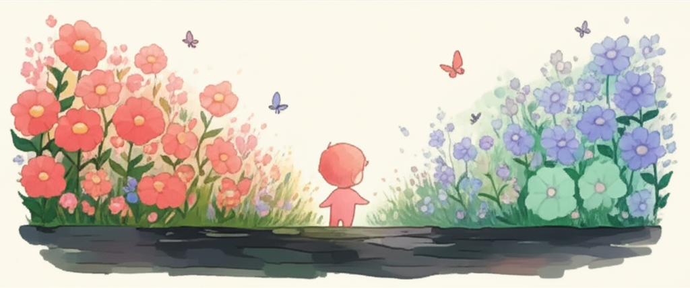

# Part 2. 마음의 짐 내려놓기

---

## Chapter 3. 비교의 늪에서 벗어나기

*핵심 메시지: "비교는 자연스럽지만, 거기 머물 필요는 없습니다"*

---

> 💬 **공감 에피소드**
>
> *밤 11시. 아이를 겨우 재웠습니다.*
>
> *소파에 누워 핸드폰을 켭니다.*
> *오늘 하루의 유일한 쉬는 시간.*
> *아무 생각 없이 인스타그램을 스크롤합니다.*
>
> *그때, 한 영상이 눈에 들어옵니다.*
> *같은 나이 아이가 긴 문장으로 말하고 있습니다.*
> *"엄마, 나 오늘 유치원에서 친구랑 블록으로 성 만들었어!"*
>
> *댓글에는 "너무 귀여워요!" "말을 잘하네요!"가 줄줄이.*
>
> *핸드폰을 쥔 손이 떨립니다.*
> *우리 아이는 아직 두 단어를 겨우 이어 붙입니다.*
> *"엄마… 물…"*
>
> *영상을 끄지 못합니다.*
> *또 다른 영상. 또 다른 아이.*
> *숟가락을 혼자 쥐고, 신발을 혼자 신고,*
> *"사랑해"라고 또박또박 말합니다.*
>
> *핸드폰을 꺼도 잔상이 남습니다.*
> *천장을 보면서 생각합니다.*
>
> *'나는 뭘 잘못한 걸까.'*
> *'우리 아이는 왜…'*
>
> *눈물이 베개를 적십니다.*
> *내일도 치료실에 가야 하는데.*
> *잠이 오지 않습니다.*

---

이 장면이 낯설지 않으시다면,
당신은 **비교의 늪**을 경험한 것입니다.

비교는 누구나 합니다.
하지만 발달지연 아동의 부모에게 비교는
단순한 비교가 아닙니다.
**가슴에 칼을 꽂는 일**입니다.

이 챕터에서는 비교의 늪에서 빠져나오는 법을 배워 보겠습니다.
빠져나올 수 있습니다. 정말로.

---

### 왜 우리는 비교할 수밖에 없는가

먼저, 한 가지 위로가 될 이야기를 하겠습니다.

**비교는 당신의 잘못이 아닙니다.**
비교는 인간의 **뇌에 내장된 기능**입니다.

심리학자 레온 페스팅거(Leon Festinger)는
이것을 **'사회적 비교 이론(Social Comparison Theory)'**이라고 불렀습니다.

쉽게 풀면 이렇습니다.

우리 뇌는 생존을 위해 끊임없이 주변과 자신을 비교합니다.
"나는 안전한가?" "나는 뒤처지지 않았는가?"
수만 년 전 초원에서는 이 비교 본능이 생존에 도움이 됐습니다.

문제는, **지금 우리가 초원이 아니라 SNS 세상에 살고 있다는 것**입니다.

SNS에는 비교 대상이 무한합니다.
게다가 사람들은 **가장 좋은 순간만** 올립니다.
아이가 떼쓴 10분은 올리지 않고,
웃는 10초만 올립니다.

> 💡 **알아두세요**
>
> SNS에서 보는 다른 아이의 모습은
> **편집된 하이라이트 영상**입니다.
> 그 아이의 부모도 당신처럼 힘든 순간이 있습니다.
> 당신이 보지 못하는 뒷면이 있습니다.
>
> 다른 사람의 하이라이트와 당신의 비하인드를 비교하면
> 당연히 당신이 부족해 보일 수밖에 없습니다.

---

### 비교가 만드는 3가지 독

비교는 본능이지만,
**거기에 오래 머무르면 독이 됩니다.**
그 독은 세 가지 방향으로 퍼집니다.

---

#### 독 ①: 자기 비하

> *"다른 엄마들은 잘하는데 나만 못하는 것 같아."*
> *"나는 부모 자격이 없는 건 아닐까."*

비교는 자기 자신을 깎아내립니다.
다른 부모는 다 잘하고, 나만 부족하다고 느끼게 합니다.

하지만 생각해 보세요.
당신은 매일 치료실을 다니고, 아이의 식단을 챙기고,
밤에 잠들 때까지 아이 걱정을 합니다.
**그것이 못하는 부모의 모습인가요?**

---

#### 독 ②: 아이에 대한 실망

> *"왜 우리 아이만 못하지?"*
> *"또래는 벌써 저것까지 하는데…"*

비교는 아이를 바라보는 시선도 바꿉니다.
어제까지 기뻐했던 아이의 작은 성장이
갑자기 하찮아 보이기 시작합니다.

아이가 처음으로 숟가락을 쥐었을 때 그 기쁨.
비교 한 번이면 그 기쁨이 사라집니다.
**비교는 기쁨을 훔치는 도둑**입니다.

---

#### 독 ③: 관계 악화

> *"시어머니가 '조카는 벌써 말한다'고 했을 때 폭발할 뻔했어요."*
> *"친구 아이가 상 받았다는 소식에 축하 문자를 보내기 싫었어요."*

비교는 주변 사람과의 관계에도 균열을 만듭니다.
축하해야 할 자리에서 마음이 쓰라리고,
무심한 한마디에 오래 상처받습니다.
점점 사람들을 피하게 됩니다.

---

### 생각 바꾸기 4단계 — 인지 재구성 실습

좋은 소식이 있습니다.

비교 본능을 없앨 수는 없지만,
**비교한 뒤의 생각은 바꿀 수 있습니다.**

이것을 심리학에서는 **인지 재구성(Cognitive Restructuring)**이라고 합니다.
어려운 말 같지만, 핵심은 간단합니다.

**"자동으로 떠오르는 부정적 생각을, 의식적으로 다른 생각으로 바꾸는 것."**

4단계로 연습해 보겠습니다.

---

#### Step 1: 비교 생각 알아차리기

먼저, 비교 생각이 떠오르는 순간을 알아차려야 합니다.

비교 생각은 주로 이런 형태입니다:
- "다른 아이는 ○○하는데, 우리 아이는…"
- "다른 엄마는 ○○하는데, 나는…"
- "우리 아이만 ○○을/를 못해"
- "벌써 저 나이에 ○○을/를 하네"

이런 생각이 떠오르면, 잠깐 멈추세요.
그리고 마음속으로 이렇게 말합니다.

**"아, 지금 비교하고 있구나."**

Chapter 1에서 배운 '감정 명명하기'와 같은 원리입니다.
알아차리는 것만으로 자동 반응의 고리가 느슨해집니다.

---

#### Step 2: 그 생각이 사실인지 점검하기

비교 생각이 떠오르면, 이 질문들을 던져 보세요:

- **"이 생각이 100% 사실인가?"**
  "다른 아이는 다 잘한다"는 정말 사실일까요?
  모든 아이가 다 잘하는 건 아닙니다.

- **"내가 보지 못하는 부분이 있지 않을까?"**
  그 아이에게도 어려운 영역이 있을 수 있습니다.
  그 부모도 힘든 순간이 있을 수 있습니다.

- **"이 생각이 나에게 도움이 되는가?"**
  이 비교가 나를 더 나은 부모로 만들어 주나요?
  아니면 그냥 마음을 아프게 하나요?

- **"가장 친한 친구가 이런 생각을 한다면 뭐라고 말해줄까?"**
  아마 이렇게 말할 겁니다.
  "야, 너 정말 잘하고 있어. 그렇게 비교하지 마."

---

#### Step 3: 다른 관점으로 바라보기

같은 상황을 다른 각도에서 볼 수 있습니다.
이것을 **리프레이밍(Reframing)**이라고 합니다.

**예시 1:**
- 비교 생각: "또래 아이는 문장으로 말하는데, 우리 아이는 단어도 힘들어."
- 리프레이밍: "우리 아이가 '엄마'라고 했을 때의 그 감동. 그 한 단어의 무게는 다른 아이의 열 문장보다 크다."

**예시 2:**
- 비교 생각: "다른 엄마들은 여유롭게 카페에서 수다 떠는데, 나는 치료실 대기실에…"
- 리프레이밍: "나는 아이를 위해 최선을 다하는 부모다. 치료실 대기실에 앉아 있는 것 자체가 사랑의 증거다."

**예시 3:**
- 비교 생각: "저 아이는 혼자 신발을 신는데, 우리 아이는 아직…"
- 리프레이밍: "한 달 전에는 양말도 못 신었는데, 이제 양말은 신는다. 그 성장에 먼저 주목하자."

**예시 4:**
- 비교 생각: "같은 치료를 받는데 저 아이만 빨리 좋아지네."
- 리프레이밍: "아이마다 속도가 다르다. 우리 아이는 지금 눈에 보이지 않는 곳에서 자라고 있을 수 있다."

---

#### Step 4: 새로운 문장 만들기

마지막으로, 비교 생각을 새로운 문장으로 바꿔 봅니다.

| Before (비교 생각) | After (새로운 문장) |
|---|---|
| "우리 아이만 뒤처져 있어" | "우리 아이는 자기 속도로 앞으로 가고 있어" |
| "나는 부족한 부모야" | "나는 오늘도 최선을 다한 부모야" |
| "다른 집은 정상인데 우리만…" | "모든 가족에게는 각자의 이야기가 있어" |
| "이렇게 해도 안 되는 걸까" | "눈에 보이지 않는 변화가 쌓이고 있어" |
| "아이의 미래가 걱정돼" | "오늘 우리가 함께한 시간이 미래를 만들고 있어" |

이 새로운 문장은 거짓말이 아닙니다.
**같은 현실을 다른 각도에서 본 것**입니다.
처음엔 어색하지만, 반복하면 점점 자연스러워집니다.

---

### SNS 디톡스 실천 팁

생각 바꾸기와 함께,
**비교의 원천 자체를 줄이는 것**도 중요합니다.

현대인에게 가장 큰 비교 원천은 단연 SNS입니다.
완전히 끊을 필요는 없습니다.
하지만 **건강한 거리두기**는 필요합니다.

---

**팁 1: 알고리즘 리셋하기**

"관심 없음" 버튼을 적극 활용하세요.
또래 아이 육아 영상이 뜨면 "관심 없음"을 누릅니다.
알고리즘은 학습합니다.
2주만 꾸준히 하면 피드가 달라집니다.

**팁 2: 시간 제한 설정하기**

핸드폰의 '스크린 타임' 기능으로
SNS 앱 사용 시간을 **하루 30분 이내**로 설정하세요.
특히 아이를 재운 뒤 침대에서 보는 SNS가 가장 위험합니다.
그 시간을 음악 듣기나 짧은 명상으로 대체해 보세요.

**팁 3: 팔로우 정리하기**

마음이 불편해지는 계정은 과감히 언팔로우하세요.
대신 발달지연 아동 부모 커뮤니티, 셀프케어 계정,
긍정적 에너지를 주는 계정으로 채워 보세요.

**팁 4: SNS 없는 시간대 만들기**

아침 기상 후 1시간, 취침 전 1시간은
핸드폰을 다른 방에 두세요.
하루의 시작과 끝을 비교 없이 보내는 것.
이것만으로도 마음이 달라집니다.

**팁 5: "오늘 하루 SNS 쉬기" 도전**

일주일에 하루, SNS를 완전히 쉬어 보세요.
처음엔 불안할 수 있습니다.
하지만 하루가 지나면 느낄 겁니다.
**세상은 아무 일 없이 돌아가고, 마음은 훨씬 가볍다는 것.**

---

> 📋 **워크시트: 나의 비교 트리거 찾기 & 생각 바꾸기 실습**
>
> **Part A. 나의 비교 트리거**
>
> 비교 감정이 올라오는 상황을 적어 보세요.
>
> 1. 언제? (상황): \_\_\_\_\_\_\_\_\_\_\_\_\_\_\_\_\_\_\_\_\_\_\_\_\_\_\_\_\_\_\_\_
> 2. 어디서? (장소): \_\_\_\_\_\_\_\_\_\_\_\_\_\_\_\_\_\_\_\_\_\_\_\_\_\_\_\_\_\_\_\_
> 3. 무엇을 보고? (자극): \_\_\_\_\_\_\_\_\_\_\_\_\_\_\_\_\_\_\_\_\_\_\_\_\_\_\_\_\_\_\_\_
> 4. 어떤 생각이 들었나? \_\_\_\_\_\_\_\_\_\_\_\_\_\_\_\_\_\_\_\_\_\_\_\_\_\_\_\_\_\_\_\_
> 5. 어떤 감정이 들었나? \_\_\_\_\_\_\_\_\_\_\_\_\_\_\_\_\_\_\_\_\_\_\_\_\_\_\_\_\_\_\_\_
>
> ---
>
> **Part B. 생각 바꾸기 실습**
>
> | | 나의 비교 생각 | 새로운 문장 |
> |---|---|---|
> | 1 | \_\_\_\_\_\_\_\_\_\_\_\_\_\_\_ | \_\_\_\_\_\_\_\_\_\_\_\_\_\_\_ |
> | 2 | \_\_\_\_\_\_\_\_\_\_\_\_\_\_\_ | \_\_\_\_\_\_\_\_\_\_\_\_\_\_\_ |
> | 3 | \_\_\_\_\_\_\_\_\_\_\_\_\_\_\_ | \_\_\_\_\_\_\_\_\_\_\_\_\_\_\_ |
>
> ---
>
> **Part C. 나의 SNS 디톡스 계획**
>
> - 하루 SNS 사용 시간 목표: \_\_\_\_분
> - SNS 없는 시간대: \_\_\_\_시 ~ \_\_\_\_시
> - 언팔로우할 계정 수: \_\_\_\_개
> - SNS 쉬는 요일: 매주 \_\_\_\_요일

---

> 📝 **Chapter 3 핵심 포인트**
>
> ✅ **비교는 본능이지만 습관은 바꿀 수 있다**
> 비교는 인간의 뇌에 내장된 생존 본능입니다.
> 비교하는 자신을 탓하지 마세요.
> 다만, 비교 이후의 생각과 행동은 연습으로 바꿀 수 있습니다.
>
> ✅ **생각을 바꾸면 감정이 따라온다**
> 인지 재구성 4단계(알아차리기 → 점검하기 → 리프레이밍 → 새 문장 만들기)를
> 반복하면 비교 이후 느끼는 감정이 달라집니다.
> 처음엔 어색하지만, 3주만 연습하면 자연스러워집니다.
>
> ✅ **SNS와 건강한 거리두기가 필요하다**
> 다른 사람의 하이라이트와 나의 비하인드를 비교하지 마세요.
> 알고리즘 리셋, 시간 제한, 팔로우 정리만으로도
> 비교의 빈도와 강도가 크게 줄어듭니다.

---
