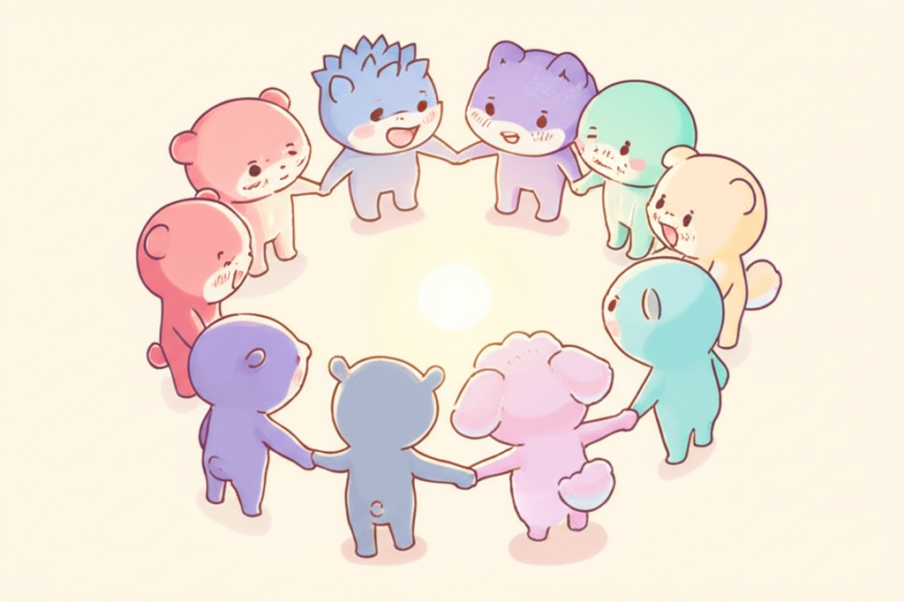

## Chapter 6. 나만의 지지 체계 만들기

*핵심 메시지: "도움을 요청하는 것도 용기입니다"*

---

> 💬 **공감 에피소드**
>
> *주말 오후. 오랜만에 대학 동기 모임에 나왔습니다.*
>
> *다들 아이 이야기를 합니다.*
> *"우리 ○○이 요즘 영어학원 다니는데, 파닉스 완전 잘해!"*
> *"우리는 피아노 시작했어. 손가락이 길어서 선생님이 좋아하시대."*
>
> *고개를 끄덕이며 커피를 마십니다.*
> *우리 아이 이야기는 꺼내지 않습니다.*
> *말하면 분위기가 이상해질 것 같아서.*
>
> *한 친구가 묻습니다.*
> *"너희 ○○이는 요즘 어때?"*
>
> *"응, 잘 지내." 짧게 대답합니다.*
>
> *오늘 아침에 아이가 처음으로 '빠빠'라고 했습니다.*
> *30개월 만에 처음 나온 두 번째 단어.*
> *아침에 남편과 부둥켜안고 울었습니다.*
>
> *하지만 이 자리에서는 말하지 않습니다.*
> *이 기쁨을 나눌 수 없다는 것이 외롭습니다.*
> *같은 기쁨을 이해해줄 사람이 여기에는 없습니다.*
>
> *집에 오는 길.*
> *차 안에서 혼자 중얼거립니다.*
>
> *'아무도 내 마음을 몰라.'*

---

외롭습니다.

발달지연 아동의 부모로 사는 것은 외로운 일입니다.
가장 가까운 사람도 이 마음을 완전히 이해하지 못합니다.

하지만 **혼자 감당하지 않아도 됩니다.**

이 챕터에서는 당신만의 지지 체계를 만드는 법을 이야기합니다.
완벽할 필요 없습니다.
**단 한 사람이라도** 마음을 나눌 수 있다면,
그것만으로 큰 힘이 됩니다.

---

### 왜 고립되는가

먼저, 왜 발달지연 아동의 부모가 유독 고립되기 쉬운지
그 원인을 정리해 보겠습니다.

---

**원인 1: 공유할 수 없는 경험**

"첫 단어", "첫 걸음"의 의미가 다릅니다.
일반 부모에게 첫 단어는 12~18개월에 오는 당연한 이정표입니다.
발달지연 아동 부모에게 첫 단어는 2년, 3년을 기다린 기적입니다.

이 기쁨과 슬픔의 깊이를 공유할 수 있는 사람이 주변에 적습니다.
"우리 아이가 드디어 '엄마'라고 했어!"라고 말하면
"아직 못했어?"라는 반응이 돌아올까 두려워 말을 아끼게 됩니다.

---

**원인 2: 시간과 에너지 부족**

치료 스케줄, 병원 방문, 서류 작업.
사회적 관계를 유지할 물리적 시간이 부족합니다.
겨우 시간이 나도, 에너지가 없습니다.
"사람 만날 힘이 없어요"라는 말.
게으른 것이 아닙니다. **진짜로 힘이 없는 것**입니다.

---

**원인 3: 편견과 오해에 대한 두려움**

"아이가 왜 그래요?"
"부모가 좀 더 신경 쓰면 되지 않아요?"
이런 말을 들을까 봐, 아예 사람을 피하게 됩니다.
설명하기도 지치고, 이해받지 못할 거라는 예상이
사회적 관계를 차단합니다.

---

**원인 4: 죄책감의 역할**

Chapter 4에서 다룬 죄책감이 여기서도 작동합니다.
"아이가 힘든데 나만 놀러 가도 되나?"
"이 시간에 아이랑 뭔가 해야 하는 거 아닌가?"
이런 생각이 사회활동을 포기하게 만듭니다.

---

### 지지 체계의 3개 원(Circle)

지지 체계를 **3개의 동심원**으로 생각해 보세요.

---

#### 1원: 가장 가까운 사람 — 배우자·부모·형제

가장 안쪽 원에는 매일 가까이 있는 사람들이 있습니다.
주로 배우자, 부모님, 형제자매입니다.

**문제는, 가장 가까운 사람에게 마음을 여는 것이 가장 어렵다는 것입니다.**

왜 그럴까요?
- "말해봤자 이해 못 해"
- "또 싸움이 될까 봐"
- "걱정 끼치기 싫어서"

하지만 가장 가까운 사람이 내 편이 되어줄 때,
그 힘은 다른 무엇보다 큽니다.

---

**소통 스크립트: "이렇게 말해 보세요"**

가까운 사람에게 마음을 열 때,
**어떻게 말하느냐**가 중요합니다.

비난이나 요구 대신, **나의 감정과 필요**를 전달하세요.

---

**스크립트 1: 배우자에게 감정을 전할 때**

Before:
> *"당신은 왜 맨날 나한테만 다 떠넘겨? 아이 아빠 맞아?"*

After:
> *"요즘 나 혼자 치료 스케줄 관리하다 보니까 많이 지쳐. (감정)*
> *혹시 이번 주 목요일 치료실은 당신이 데려갈 수 있을까? (구체적 요청)*
> *그러면 나도 좀 쉴 수 있을 것 같아. (이유)"*

---

**스크립트 2: 부모님에게 도움을 요청할 때**

Before:
> *"엄마는 왜 맨날 '애가 왜 이래'라고만 해? 도움이 하나도 안 돼."*

After:
> *"엄마, 요즘 많이 힘들어서 솔직하게 말할게. (진솔한 시작)*
> *아이 상태에 대한 이야기보다, 그냥 '잘하고 있다'는 말이 필요해. (구체적 필요)*
> *그리고 다음 주 수요일에 2시간만 아이 봐줄 수 있어? (구체적 요청)"*

---

**스크립트 3: 배우자에게 감정 지지를 요청할 때**

Before:
> *(속으로만 생각하며 불만이 쌓임)*

After:
> *"오늘 치료실에서 좀 힘든 일이 있었어. (상황 공유)*
> *해결책이 필요한 건 아니고, 그냥 들어줄 수 있어? (필요 명시)*
> *5분만 내 이야기 좀 들어줘. (시간 한정)"*

---

> 💡 **알아두세요**
>
> 이 스크립트의 핵심은 세 가지입니다:
>
> 1. **"나"를 주어로 시작하기** ("당신이 ~" 대신 "내가 ~")
> 2. **감정을 먼저 말하기** (사실 전달 전에 감정 전달)
> 3. **구체적으로 요청하기** ("도와줘" 대신 "목요일에 치료실 데려가줘")
>
> 처음엔 어색합니다. 대본 읽는 것 같을 수 있습니다.
> 하지만 3번만 해보면 자연스러워집니다.

---

#### 2원: 같은 경험을 가진 사람 — 부모 커뮤니티

두 번째 원에는 **같은 길을 걷는 부모들**이 있습니다.

발달지연 아동의 부모에게
같은 경험을 가진 부모 커뮤니티는
**그 어떤 전문가보다 강력한 위로**가 될 수 있습니다.

왜냐하면, 설명이 필요 없기 때문입니다.
"우리 아이가 오늘 숟가락을 쥐었어요"라고 말하면
**모든 의미를 알아듣는 사람들**이 거기 있습니다.

---

**온라인 커뮤니티 찾는 법:**

- 네이버 카페: "발달지연", "느린아이", "발달장애 부모" 등으로 검색
- 카카오톡 오픈채팅: 지역별 부모 모임 검색
- 인스타그램: #발달지연, #느린아이엄마, #특수교육 태그 팔로우

**오프라인 모임 찾는 법:**

- 거주 지역 장애인복지관의 부모 교육/모임 프로그램
- 발달센터나 치료실에서 연결해주는 부모 모임
- 지역사회 부모자조모임 (구청, 보건소에 문의)

---

**좋은 커뮤니티 고르는 기준:**

모든 커뮤니티가 좋은 것은 아닙니다.
아래 기준으로 점검해 보세요.

✅ **비교나 경쟁보다 공감과 격려** 분위기인가?
✅ **검증되지 않은 치료법 홍보**가 없는가?
✅ **모든 양육자**(엄마, 아빠, 조부모)를 존중하는가?
✅ **개인 정보와 사생활**이 보호되는가?
✅ 운영자가 있어 **부적절한 글이 관리**되는가?

이 중 3개 이상 해당하면 좋은 커뮤니티입니다.
하나라도 불편하면 떠나도 됩니다.
**당신의 마음을 지키는 것이 우선**입니다.

---

#### 3원: 전문가 — 상담사·치료사

세 번째 원에는 **전문가**가 있습니다.

아이의 치료사는 이미 만나고 계실 겁니다.
하지만 **부모 자신을 위한 전문가**는 어떨까요?

많은 부모가 이렇게 말합니다.
"아이도 아닌데 내가 무슨 상담을 받아?"

**받으셔야 합니다.**

부모의 정신건강은 아이의 발달에 직접적인 영향을 미칩니다.
부모가 안정되면 아이도 안정됩니다.
부모 상담은 아이를 위한 투자이기도 합니다.

---

**전문 도움이 필요한 5가지 신호:**

아래 항목에 해당하는 것이 있다면,
전문가 상담을 적극 고려하세요.

- [ ] **2주 이상** 우울하거나 무기력한 상태가 지속된다
- [ ] 감정 조절이 점점 어려워져 **아이에게 소리를 지르거나 손이 올라가는** 순간이 있다
- [ ] **"사라지고 싶다"**, "차라리 없었으면"이라는 생각이 든다
- [ ] 수면제나 **음주에 의존**하는 빈도가 늘었다
- [ ] 일상생활(식사, 위생, 외출)이 **거의 불가능**하다

> 💡 **알아두세요**
>
> 상담받는 것은 나약함이 아닙니다.
> **가장 용감한 자기 돌봄**입니다.
>
> 어디서 받나요?
> - 정신건강복지센터 (전국 시·군·구, 무료 상담 가능)
> - 건강보험 적용 정신건강의학과 (1회 약 1~2만원)
> - 사설 심리상담센터 (1회 약 5~10만원)
> - 온라인 상담 플랫폼 (트로스트, 마인드카페 등)
>
> 비용이 부담된다면 정신건강복지센터를 먼저 방문하세요.
> 무료 또는 저렴한 비용으로 상담받을 수 있습니다.

---

### 건강한 경계 설정하기

지지 체계를 만드는 것만큼 중요한 것이 있습니다.
**경계를 세우는 것.**

모든 사람이 당신에게 도움이 되는 것은 아닙니다.
원치 않는 조언, 불필요한 동정, 상처가 되는 말.
이런 것들로부터 자신을 보호할 줄 알아야 합니다.

---

#### 상처 주는 말 대처법

발달지연 아동 부모가 자주 듣는 말들.
그리고 대처할 수 있는 표현들.

---

**상황 1: "아이가 왜 그래요?"**

이 질문에는 여러 의도가 있습니다.
순수한 궁금증일 수도, 은근한 비난일 수도 있습니다.

대처법:
> "발달이 조금 느린 편이에요. 잘 크고 있어요."
> (설명 의무 없음. 짧게 끊어도 됩니다.)

---

**상황 2: "엄마가 좀 더 신경 쓰면 나아지지 않아?"**

대처법:
> "저도 최선을 다하고 있어요. 관심 가져주셔서 감사합니다."
> (방어하지 않고, 대화를 종료합니다.)

---

**상황 3: "우리 때는 그냥 다 알아서 컸는데…"**

대처법:
> "시대가 많이 달라졌죠. 지금은 조기 지원이 중요하다고 해요."
> (반박하지 않고, 정보를 전달합니다.)

---

**상황 4: "특수학교 보내야 하는 거 아니야?"**

대처법:
> "전문가 선생님들과 상의하고 있어요. 걱정해 주셔서 고마워요."
> (결정은 우리가 한다는 것을 명확히 합니다.)

---

**상황 5: "불쌍하다, 얼마나 힘들어…"**

대처법:
> "힘든 순간도 있지만, 아이와 함께하는 즐거운 순간도 많아요."
> (동정이 아닌 연대의 프레임으로 전환합니다.)

---

> 💡 **알아두세요**
>
> 경계를 세운다는 것은 **사람을 밀어내는 것이 아닙니다.**
> 관계를 지키기 위해 **건강한 거리를 유지하는 것**입니다.
>
> 모든 말에 대응할 필요도 없습니다.
> 때로는 **침묵도 훌륭한 경계**입니다.
> 미소 짓고 돌아서는 것도 괜찮습니다.
>
> **당신이 상처받지 않는 것이 가장 중요합니다.**

---

> 📋 **워크시트: 나의 지지 체계 원 그리기**
>
> 아래 3개의 원을 채워 보세요.
> 이름, 관계, 그 사람이 나에게 주는 것을 적어 보세요.
>
> ---
>
> **🔴 1원: 가장 가까운 사람 (매일 만나는 사람)**
>
> | 이름 | 관계 | 이 사람이 나에게 주는 것 |
> |---|---|---|
> | \_\_\_\_\_\_\_ | \_\_\_\_\_\_\_ | \_\_\_\_\_\_\_\_\_\_\_\_\_\_\_\_\_\_\_\_\_\_\_ |
> | \_\_\_\_\_\_\_ | \_\_\_\_\_\_\_ | \_\_\_\_\_\_\_\_\_\_\_\_\_\_\_\_\_\_\_\_\_\_\_ |
>
> → 이 사람에게 이번 주 해볼 소통: \_\_\_\_\_\_\_\_\_\_\_\_\_\_\_\_\_\_\_\_\_\_\_
>
> ---
>
> **🟡 2원: 같은 경험을 가진 사람 (부모 커뮤니티)**
>
> | 커뮤니티/모임 이름 | 온라인/오프라인 | 참여 빈도 |
> |---|---|---|
> | \_\_\_\_\_\_\_\_\_\_\_\_\_\_\_ | \_\_\_\_\_\_\_ | \_\_\_\_\_\_\_ |
> | \_\_\_\_\_\_\_\_\_\_\_\_\_\_\_ | \_\_\_\_\_\_\_ | \_\_\_\_\_\_\_ |
>
> → 아직 참여하는 곳이 없다면, 이번 주에 찾아볼 곳: \_\_\_\_\_\_\_\_\_\_\_\_\_\_\_\_\_\_\_\_
>
> ---
>
> **🟢 3원: 전문가**
>
> | 전문가 유형 | 이름/기관 | 마지막 방문일 |
> |---|---|---|
> | 아이 치료사 | \_\_\_\_\_\_\_\_\_\_\_\_\_ | \_\_\_\_\_\_\_\_\_\_ |
> | 나의 상담사 | \_\_\_\_\_\_\_\_\_\_\_\_\_ | \_\_\_\_\_\_\_\_\_\_ |
>
> → 나를 위한 상담이 필요하다고 느끼는가? \_\_\_\_\_\_\_\_\_\_\_\_\_\_\_\_\_\_\_\_
>
> ---
>
> **지금 나의 지지 체계에서 가장 부족한 원은?**
>
> - [ ] 1원 (가까운 사람과의 소통)
> - [ ] 2원 (같은 경험의 부모 연결)
> - [ ] 3원 (전문가 도움)
>
> → 이번 달 안에 할 수 있는 작은 행동 하나: \_\_\_\_\_\_\_\_\_\_\_\_\_\_\_\_\_\_\_\_\_\_\_

---

> 📝 **Chapter 6 핵심 포인트**
>
> ✅ **혼자 감당할 필요 없다**
> 발달지연 아동의 양육은 혼자 할 수 있는 일이 아닙니다.
> 고립은 자연스럽게 찾아오지만,
> 의식적으로 연결을 만들어야 합니다.
> 도움을 요청하는 것은 약함이 아니라 용기입니다.
>
> ✅ **같은 경험을 나눌 수 있는 사람이 가장 큰 위로다**
> 아이가 "엄마"라고 했을 때의 기쁨을
> 설명 없이 알아주는 사람.
> 그런 사람이 한 명이라도 있으면 큰 힘이 됩니다.
> 부모 커뮤니티를 찾아보세요.
>
> ✅ **경계를 세우는 것은 관계를 지키는 일이다**
> 모든 사람의 조언을 받아들일 필요 없습니다.
> 상처 주는 말에 방어하느라 에너지를 쓰지 마세요.
> 짧게 대응하고, 침묵하고, 돌아서는 것도 괜찮습니다.
> 당신을 보호하는 것이 최우선입니다.

---
