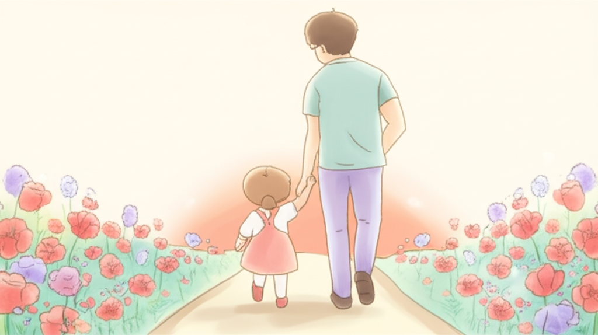

# Part 4. 함께 피어나기

---

## Chapter 7. 아이와 함께 성장하는 나

*핵심 메시지: "아이의 속도로, 나의 속도로, 우리는 함께 자라고 있습니다"*

---

> 💬 **공감 에피소드**
>
> *평범한 화요일 저녁이었습니다.*
>
> *저녁을 준비하고 있었습니다.*
> *아이는 거실 바닥에 앉아 블록을 쌓고 있었습니다.*
> *정확히는, 블록을 하나 올리고 무너뜨리기를 반복하고 있었습니다.*
>
> *3개월째 같은 놀이입니다.*
> *치료사 선생님이 블록 쌓기 연습을 해달라고 했습니다.*
> *매일 했습니다. 매일.*
>
> *그런데 그날.*
>
> *아이가 블록을 하나 올렸습니다.*
> *또 하나 올렸습니다.*
> *그리고… 세 번째 블록을 올렸습니다.*
>
> *3단.*
>
> *아이가 고개를 들어 저를 봤습니다.*
> *그리고 웃었습니다.*
> *자기가 뭘 해냈는지 아는 것 같은 얼굴.*
>
> *국자를 든 채로 멈춰섰습니다.*
> *"잘했어! 세 개나 쌓았네!"*
>
> *아이가 손뼉을 쳤습니다.*
> *저도 손뼉을 쳤습니다.*
>
> *블록 세 개.*
> *다른 집에서는 아무것도 아닌 일.*
>
> *하지만 그 순간, 부엌에 서서*
> *국자를 들고 울고 있었습니다.*
>
> *기쁨의 눈물이었습니다.*
> *3개월의 시간이 블록 세 개에 담겨 있었습니다.*

---

이 책의 마지막 파트입니다.

Part 1에서 마음의 지도를 그렸습니다.
Part 2에서 짐을 내려놓는 연습을 했습니다.
Part 3에서 마음의 근육을 키우기 시작했습니다.

이제 Part 4에서는 **함께 피어나는 이야기**를 하겠습니다.

아이와 당신이 함께 자라고 있다는 것.
그 사실을 발견하는 시간입니다.

---

### 작은 성장을 발견하는 눈

우리는 **마일스톤(milestone)**이라는 말에 익숙합니다.
첫 뒤집기, 첫 걸음, 첫 단어, 배변 훈련 성공.
아이의 성장을 측정하는 큰 이정표들입니다.

발달지연 아동의 부모에게 마일스톤은 양날의 검입니다.
다른 아이의 마일스톤은 빠르게 지나가는데,
우리 아이의 마일스톤은 좀처럼 오지 않습니다.

그래서 제안합니다.

**마일스톤 대신 '마이크로 모먼트(Micro Moment)'에 주목해 보세요.**

마이크로 모먼트는 **아주 작은 변화의 순간**입니다.
누가 봐도 알 수 있는 큰 변화가 아니라,
매일 함께하는 부모만 알아차릴 수 있는 미세한 변화.

---

**마이크로 모먼트 예시:**

- 눈을 마주치는 시간이 1초에서 3초로 늘었다
- 이름을 부르면 고개를 돌리는 횟수가 늘었다
- 싫어하던 질감의 음식을 입에 한 번 대 봤다
- 블록을 2개에서 3개로 쌓았다
- 치료실에 들어갈 때 우는 시간이 줄었다
- 동생이 우는 것을 보고 처음으로 쳐다봤다
- "아"라는 소리를 낼 때 입 모양이 달라졌다
- 신발을 신으려고 시도하는 동작이 나왔다
- 그림책을 가져와서 무릎에 앉았다

이런 변화들은 발달 검사지에 기록되지 않습니다.
하지만 **당신은 압니다.**
이 작은 변화가 얼마나 큰 의미인지.

---

**성장 발견 연습: "오늘 아이가 한 것" 기록법**

매일 밤, 잠들기 전에 한 가지만 적어 보세요.

> **오늘 아이가 한 것:**
> \_\_\_\_\_\_\_\_\_\_\_\_\_\_\_\_\_\_\_\_\_\_\_\_\_\_\_\_

대단한 것이 아니어도 됩니다.
"오늘 아이가 웃었다."
"오늘 아이가 밥을 한 숟가락 더 먹었다."
"오늘 아이가 내 손을 잡았다."

이것을 한 달만 해보세요.

한 달 뒤, 30개의 기록을 쭉 읽어 보면
**당신이 보지 못했던 성장의 흐름**이 보입니다.

매일은 느려 보여도, 한 달을 모으면 달라져 있습니다.
**강물은 눈에 보이지 않게 흐르지만, 결국 바다에 닿습니다.**

---

### 부모로서의 나도 성장했다

아이만 자란 것이 아닙니다.
**당신도 자랐습니다.**

잠깐, 1년 전의 자신을 떠올려 보세요.

---

**1년 전의 나 vs 지금의 나:**

| | 1년 전의 나 | 지금의 나 |
|---|---|---|
| **감정** | 매일 울었다 | 울 때도 있지만, 웃을 때도 있다 |
| **정보** | 뭘 해야 할지 몰랐다 | 치료 시스템을 이해하고 활용한다 |
| **대처** | 감정에 휩쓸렸다 | 감정을 알아차리고 다룰 수 있다 |
| **관계** | 모든 것을 혼자 감당했다 | 도움을 요청할 줄 안다 |
| **시선** | 또래와 비교했다 | 아이 자체를 보려고 노력한다 |

물론 아직 완벽하지 않습니다.
흔들리는 날도 있습니다.
하지만 **1년 전의 당신이라면 이 책을 읽고 있지 못했을 겁니다.**

지금 여기까지 온 것.
그것 자체가 성장입니다.

---

**당신이 얻은 힘들:**

**인내.** 결과가 바로 보이지 않아도 기다릴 줄 아는 힘.
치료 3개월, 6개월, 1년. 포기하지 않고 매일 데려간 당신.
그 인내는 아무나 가질 수 없는 힘입니다.

**공감.** 남들의 아픔이 보이는 눈.
발달지연을 경험하기 전에는 몰랐던 것들이 이제 보입니다.
누군가의 힘든 표정, 아이를 바라보는 불안한 눈빛.
당신의 공감 능력은 깊어졌습니다.

**유연함.** 계획대로 되지 않아도 괜찮다는 것을 아는 지혜.
오늘 치료를 못 가도, 아이가 협조하지 않아도,
"내일 다시 하면 돼"라고 말할 수 있게 되었습니다.

**강인함.** 무너졌다가 다시 일어나는 힘.
몇 번이고 울었지만, 몇 번이고 다시 일어났습니다.
그 강인함은 누가 가르쳐준 것이 아닙니다.
당신이 직접 만들어낸 것입니다.

**감사.** 작은 것에도 감사할 줄 아는 마음.
아이가 웃는 것, 손을 잡는 것, 눈을 맞추는 것.
당연한 줄 알았던 것들이 얼마나 소중한지
이제 당신은 압니다.

---

### 새로운 이야기 쓰기

심리학에는 **내러티브 치료(Narrative Therapy)**라는 분야가 있습니다.

어려운 이론이 아닙니다. 핵심은 간단합니다.

**"우리 삶은 이야기로 이루어져 있고,
그 이야기를 다시 쓸 수 있다."**

지금까지 당신의 이야기는 어떤 이야기였나요?

혹시 이런 이야기가 아니었나요?

> *"진단을 받았다. 힘든 날들이 이어졌다.*
> *치료를 다녔다. 크게 나아지지 않았다.*
> *지쳤다. 외로웠다."*

이 이야기는 사실입니다.
하지만 **전부는 아닙니다.**

같은 경험을 다른 각도에서 쓸 수 있습니다.

> *"진단을 받고 무너졌지만, 다시 일어섰다.*
> *아이를 위해 할 수 있는 것을 찾았다.*
> *치료를 다니면서 나도 성장했다.*
> *힘든 날도 있지만, 아이의 작은 변화에 웃는 날도 있다.*
> *우리는 우리만의 속도로 함께 자라고 있다."*

어떤 이야기가 더 가깝게 느껴지시나요?

두 이야기 모두 사실입니다.
하지만 **어떤 이야기를 선택하느냐**에 따라
내일을 바라보는 눈이 달라집니다.

---

> 💡 **알아두세요**
>
> "남들과 다른 것"이 "남들보다 못한 것"은 아닙니다.
>
> 다른 가족은 직선 도로를 달리고 있을 수 있습니다.
> 우리 가족은 구불구불한 산길을 걷고 있을 수 있습니다.
>
> 하지만 산길에서 보는 풍경은
> 직선 도로에서는 절대 볼 수 없는 풍경입니다.
>
> **우리 가족만의 길이 있고,
> 그 길 위의 이야기는 그 자체로 아름답습니다.**

---

### 미래의 나에게 보내는 편지

이 책의 마지막 실습입니다.

**1년 후의 자신에게 편지를 써 보세요.**

지금의 마음, 지금의 다짐, 지금의 희망을 담아서.

1년 뒤 이 편지를 열어볼 때,
당신은 분명 지금보다 성장해 있을 것입니다.
그때의 당신이 이 편지를 읽으며
"그래, 나 많이 자랐구나"라고 느낄 수 있기를.

---

> 📋 **워크시트: 1년 후의 나에게 보내는 편지**
>
> ---
>
> **오늘 날짜:** \_\_\_\_년 \_\_\_\_월 \_\_\_\_일
>
> **1년 후 이 편지를 열어볼 날짜:** \_\_\_\_년 \_\_\_\_월 \_\_\_\_일
>
> ---
>
> 1년 후의 나에게,
>
> 지금 나는 이런 마음이야:
> \_\_\_\_\_\_\_\_\_\_\_\_\_\_\_\_\_\_\_\_\_\_\_\_\_\_\_\_\_\_\_\_\_\_\_\_\_\_\_\_
> \_\_\_\_\_\_\_\_\_\_\_\_\_\_\_\_\_\_\_\_\_\_\_\_\_\_\_\_\_\_\_\_\_\_\_\_\_\_\_\_
>
> 지금 우리 아이는:
> \_\_\_\_\_\_\_\_\_\_\_\_\_\_\_\_\_\_\_\_\_\_\_\_\_\_\_\_\_\_\_\_\_\_\_\_\_\_\_\_
> \_\_\_\_\_\_\_\_\_\_\_\_\_\_\_\_\_\_\_\_\_\_\_\_\_\_\_\_\_\_\_\_\_\_\_\_\_\_\_\_
>
> 이 책을 읽으면서 가장 와닿았던 것은:
> \_\_\_\_\_\_\_\_\_\_\_\_\_\_\_\_\_\_\_\_\_\_\_\_\_\_\_\_\_\_\_\_\_\_\_\_\_\_\_\_
>
> 1년 후의 나에게 기대하는 것:
> \_\_\_\_\_\_\_\_\_\_\_\_\_\_\_\_\_\_\_\_\_\_\_\_\_\_\_\_\_\_\_\_\_\_\_\_\_\_\_\_
> \_\_\_\_\_\_\_\_\_\_\_\_\_\_\_\_\_\_\_\_\_\_\_\_\_\_\_\_\_\_\_\_\_\_\_\_\_\_\_\_
>
> 1년 후의 나에게 해주고 싶은 말:
> \_\_\_\_\_\_\_\_\_\_\_\_\_\_\_\_\_\_\_\_\_\_\_\_\_\_\_\_\_\_\_\_\_\_\_\_\_\_\_\_
> \_\_\_\_\_\_\_\_\_\_\_\_\_\_\_\_\_\_\_\_\_\_\_\_\_\_\_\_\_\_\_\_\_\_\_\_\_\_\_\_
>
> 지금의 내가
>
> ---
>
> 💡 이 편지를 사진으로 찍어 두거나, 봉투에 넣어 보관하세요.
> 1년 뒤 열어보는 그날, 당신은 분명 미소 짓게 될 것입니다.

---

> 📝 **Chapter 7 핵심 포인트**
>
> ✅ **작은 변화도 위대한 성장이다**
> 마일스톤에 매이지 마세요.
> 눈 맞춤 1초, 블록 하나, 새로운 소리 하나.
> 그 마이크로 모먼트가 쌓여 큰 성장이 됩니다.
> 매일 밤 "오늘 아이가 한 것" 하나만 기록해 보세요.
>
> ✅ **아이만 성장하는 게 아니라, 부모도 함께 자란다**
> 1년 전의 당신과 지금의 당신은 다릅니다.
> 인내, 공감, 유연함, 강인함, 감사.
> 당신은 아이와 함께 이 모든 것을 키워왔습니다.
> 그 성장을 스스로 인정해 주세요.
>
> ✅ **우리 가족만의 이야기는 그 자체로 아름답다**
> 남들과 다른 길을 걷고 있다고 해서
> 우리 이야기가 부족한 것이 아닙니다.
> 구불구불한 산길 위의 풍경도 아름답습니다.
> **당신과 아이의 이야기는 지금 가장 아름다운 챕터를 쓰고 있습니다.**

---
