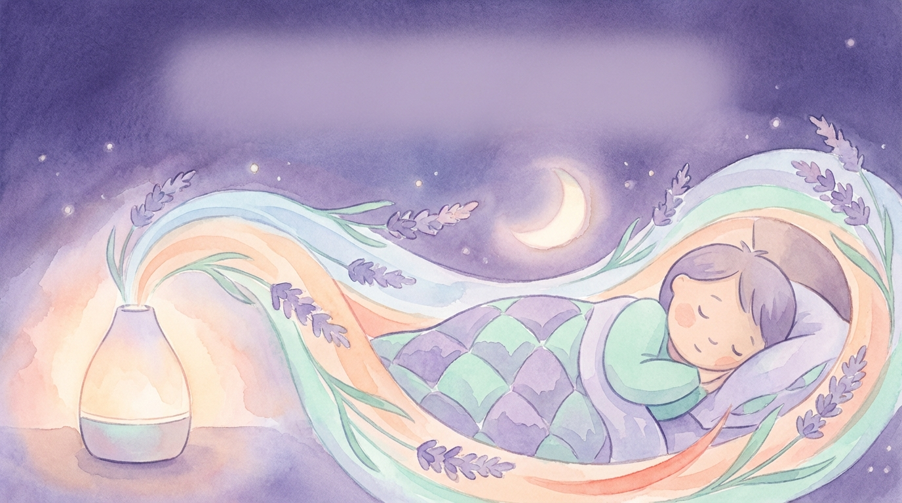

<!-- === 00-cover.md === -->

# 숙면으로 가는 향기로운 호흡

## 발달장애 아동을 위한 후각·호흡 훈련 가이드

4주 완성 프로그램으로 우리 아이의 밤이 평화로워집니다

**피지오 후각 연구소**

**장지예**

---

**면책 조항**

이 책의 내용은 교육 및 정보 제공 목적입니다. 의학적 진단이나 치료를 대체할 수 없으며, 개별 아동의 상태에 따라 전문가 상담이 필요할 수 있습니다. 프로그램 시작 전 주치의와 상담을 권장합니다.

© 2026 장지예. All rights reserved.

<!-- === 01-toc.md === -->

## 이 책의 활용법

이 책은 다음 순서로 읽으시면 좋습니다.

**처음 시작하시는 분**
1. Part 1을 먼저 읽고 원리를 이해하세요
2. Part 2의 Chapter 4로 준비하세요
3. 1주차부터 차근차근 진행하세요

**바로 시작하고 싶은 분**
1. Part 2 Chapter 4~5로 바로 가세요
2. 궁금한 점은 Part 4 Q&A를 참조하세요
3. 나중에 Part 1을 읽으면 더 깊이 이해됩니다

**문제가 생긴 분**
1. Part 4 Q&A를 먼저 확인하세요
2. Part 3 사례에서 비슷한 상황을 찾아보세요
3. 부록의 전문가 네트워크를 활용하세요

# 목차

---

## Part 1. 왜 후각과 호흡이 수면을 바꾸나요?

- Chapter 1. 우리 아이의 수면, 무엇이 문제일까요?
- Chapter 2. 코와 폐, 그리고 뇌의 숨겨진 연결고리
- Chapter 3. 과학이 증명한 향기와 호흡의 힘
- Part 1 핵심 정리

## Part 2. 4주 완성! 우리 아이 맞춤 훈련 프로그램

- Chapter 4. 시작 전 준비하기
- Chapter 5. 1주차 — 향기와 친해지기
- Chapter 6. 2주차 — 호흡 훈련 시작
- Chapter 7. 3주차 — 수면 루틴 만들기
- Chapter 8. 4주차 — 습관으로 굳히기
- Part 2 핵심 정리

## Part 3. 실제 사례로 배우는 성공 비법

- Chapter 9. 민준이의 이야기 (5세, 자폐스펙트럼)
- Chapter 10. 서연이의 이야기 (8세, ADHD)
- Chapter 11. 지훈이의 이야기 (10세, 지적장애)
- Chapter 12. 전문가의 한 줄 조언
- Part 3 핵심 정리

## Part 4. 문제 해결 Q&A

- 자주 묻는 질문 20가지
- 긴급 상황 대처법

## 부록

- 부록 A. 훈련 기록지
- 부록 B. 향기 선택 가이드
- 부록 C. 참고 자료
- 부록 D. 지원 네트워크

## 마치며

<!-- === part1-foundation/chapter01-sleep-problems.md === -->

# Chapter 1. 우리 아이의 수면, 무엇이 문제일까요?

*잠들지 못하고 뒤척이는 아이와 곁에서 지켜보는 부모*

## 새벽 3시, 아직도 깨어 있는 우리 집

새벽 3시, 집 안은 조용하지만 한 방에서는 불빛이 새어 나옵니다. 일곱 살 민서는 이불을 발로 차며 뒤척이고 있습니다. 옆에 누운 엄마는 민서의 등을 토닥이며 "이제 자자, 내일 유치원 가야지"라고 속삭여 보지만, 민서의 눈은 말똥말똥합니다. 벌써 두 시간째입니다. 거실에서는 아빠가 내일 출근 걱정에 한숨을 쉬고 있습니다.

"저희 집만 이런 건가요?"

이런 밤이 일주일에 서너 번, 혹은 거의 매일 반복된다면, 부모님은 이미 지칠 대로 지쳐 있을 것입니다. 인터넷을 검색해 보고, 다른 부모님들께 물어보고, 병원에도 가보았을 것입니다. 그런데 아무도 속 시원한 답을 주지 않습니다. 먼저 말씀드리고 싶은 것이 있습니다. **여러분만 이런 것이 아닙니다.** 그리고 이 문제는 반드시 나아질 수 있습니다.

---

## 발달장애 아동의 수면 문제, 얼마나 흔할까요?

발달장애 아동의 수면 문제는 놀라울 만큼 흔합니다. 여러 연구에 따르면 **발달장애 아동의 50~80%가 수면과 관련된 어려움**을 경험합니다. 일반 아동의 수면 문제 비율이 약 20~30%인 것과 비교하면, 거의 두 배에서 세 배에 이르는 수치입니다.

*일반 아동과 발달장애 아동의 수면 패턴 비교 — 잠들기까지 걸리는 시간, 밤중 각성 횟수, 총 수면 시간에서 뚜렷한 차이가 나타납니다*

그렇다면 아이들이 겪는 수면 문제는 구체적으로 어떤 모습일까요? 크게 네 가지로 나눌 수 있습니다.

### 1) 잠들기 어려움 (입면 장애)

"불 끄고 누워도 한 시간이 넘게 잠을 못 자요."

이불에 누워도 쉽게 잠들지 못하는 상태를 말합니다. 의학에서는 '입면 장애'라고 부르는데, 쉽게 말해 **잠이 드는 문 앞에서 서성이는 것**과 같습니다. 일반적으로 아이가 누운 후 30분 이상 잠들지 못하는 것이 일주일에 3회 이상 반복되면 입면 장애로 봅니다. 발달장애 아동 중 상당수가 이 어려움을 겪으며, 잠들기까지 1~2시간이 걸리는 경우도 드물지 않습니다.

### 2) 자주 깨는 문제 (수면 유지 장애)

"겨우 재워놓으면 한두 시간 만에 깨요."

잠이 들었다가 밤중에 여러 번 깨는 것을 '수면 유지 장애'라고 합니다. **깊은 잠과 얕은 잠 사이를 오갈 때 완전히 깨어버리는 것**이지요. 한 번 깨면 다시 잠들기까지 또 오랜 시간이 걸리기도 합니다. 밤새 서너 번씩 깨는 아이도 있어서, 부모님도 함께 잠을 설치게 됩니다.

### 3) 너무 일찍 깨는 문제 (조기 각성)

"새벽 4시면 벌써 일어나서 돌아다녀요."

아직 해가 뜨지도 않았는데 아이가 완전히 깨어 활동을 시작하는 경우입니다. 충분히 잠을 자지 못했는데도 **뇌의 각성 시스템이 너무 일찍 작동**해버리는 것입니다. 이른 아침부터 깨어 있는 아이를 돌봐야 하는 부모님의 피로는 점점 쌓여갑니다.

### 4) 불규칙한 수면-각성 주기

"잠드는 시간이 매일 달라요. 어떤 날은 밤 9시, 어떤 날은 새벽 1시예요."

우리 몸에는 '생체 시계'라는 것이 있어서 일정한 시간에 졸리고 일정한 시간에 깨어나도록 조절합니다. 그런데 이 **생체 시계의 리듬이 불규칙한 아이들**이 있습니다. 낮잠 시간도 들쭉날쭉하고, 밤잠 시간도 예측하기 어렵습니다. 수면 루틴을 잡기가 특히 힘든 유형입니다.

---

## 수면 부족이 미치는 영향

수면은 단순히 쉬는 시간이 아닙니다. **아이의 뇌가 하루 동안 배운 것을 정리하고, 몸이 성장하고, 감정을 회복하는 시간**입니다. 이 소중한 시간이 부족하면 아이에게, 그리고 가족 모두에게 연쇄적인 영향이 나타납니다.

### 아이에게 미치는 영향

**감정 조절이 더 어려워집니다.** 잠을 충분히 못 잔 아이는 작은 일에도 쉽게 짜증을 내고, 울음이 잦아지고, 감정의 폭이 커집니다. 평소에는 참을 수 있던 상황에서도 쉽게 폭발합니다. 이는 아이의 잘못이 아니라, 수면 부족으로 뇌의 감정 조절 기능이 약해진 것입니다.

**학습과 기억력이 저하됩니다.** 수면 중에 뇌는 낮 동안 배운 내용을 장기 기억으로 옮기는 작업을 합니다. 잠이 부족하면 이 과정이 제대로 이루어지지 않아, 치료 시간에 배운 것이 잘 남지 않고, 새로운 것을 익히는 속도도 느려집니다.

**행동 문제가 증가합니다.** 피곤한 아이는 집중하기 어렵고, 과잉행동이 나타나기도 하며, 자해 행동이나 상동 행동(같은 동작을 반복하는 행동)이 늘어날 수 있습니다. 수면 문제를 해결했더니 낮 시간의 행동이 크게 좋아졌다는 보고도 많습니다.

**면역력이 약해집니다.** 수면 중에 면역 세포가 활발하게 활동합니다. 잠이 부족한 아이는 감기에 더 잘 걸리고, 아픈 후 회복도 느려집니다.

### 가족에게 미치는 영향

아이의 수면 문제는 아이만의 문제가 아닙니다. **가족 전체의 삶에 파급 효과**를 일으킵니다.

부모님은 아이를 돌보느라 자신의 수면 시간이 줄어들고, 만성 피로와 스트레스에 시달립니다. 부부 사이에 갈등이 생기기도 하고, 우울감을 느끼는 부모님도 적지 않습니다. 형제자매가 있다면 밤마다 반복되는 소란에 함께 잠을 설치거나, 지쳐 있는 부모님에게 충분한 관심을 받지 못할 수 있습니다. 결국 가족 모두의 삶의 질이 낮아지는 악순환이 이어집니다.

---

> **💡 우리 가족 이야기**
>
> "8세 자폐 스펙트럼 아들 준호는 매일 밤 2~3시간씩 뒤척였어요. 저도 남편도 교대로 준호 곁에 있어야 했고, 낮에는 늘 피곤했죠. 준호는 유치원에서 자주 졸았고, 친구들과도 잘 어울리지 못했어요. 치료사 선생님은 '수면부터 해결해야 다른 치료 효과도 올라갑니다'라고 하셨는데, 어디서부터 시작해야 할지 막막했어요."
> — 준호 엄마, 서울

---

## 희망을 이야기합니다

여기까지 읽으시면서 "맞아, 우리 이야기야" 하고 고개를 끄덕이셨을 수도 있습니다. 힘든 밤이 반복될 때면 "영원히 이러면 어쩌지"라는 불안이 밀려올 수도 있습니다.

하지만 분명히 말씀드립니다. **수면 문제는 개선될 수 있습니다.**

약물에 의존하지 않고, 아이에게 부담을 주지 않으면서도 자연스럽게 수면을 도울 수 있는 방법이 있습니다. 바로 **후각과 호흡을 활용한 수면 훈련**입니다. 우리 몸이 원래 가지고 있는 시스템을 부드럽게 이끌어주는 방법이기에, 안전하고 효과적입니다.

이 책은 그 여정의 가이드가 될 것입니다. 다음 챕터에서는 후각과 호흡이 왜, 어떻게 수면에 영향을 주는지 그 과학적 연결고리를 살펴봅니다.

지금 이 책을 펼친 것만으로도 이미 첫걸음을 떼신 것입니다.

---

**✅ 핵심 포인트**
- 발달장애 아동의 절반 이상이 수면 문제를 경험합니다 — 여러분만의 문제가 아닙니다
- 수면 부족은 아이의 감정, 학습, 행동, 건강에 연쇄적으로 영향을 미칩니다
- 수면 문제는 반드시 해결해야 할 건강 문제이며, 가족 전체의 삶의 질과 직결됩니다
- 후각과 호흡을 활용한 자연스러운 방법으로 충분히 개선할 수 있습니다

---

<!-- === part1-foundation/chapter02-connection.md === -->

# Chapter 2. 코와 폐, 그리고 뇌의 숨겨진 연결고리

*향기와 호흡이 뇌에 전달되는 과정을 따뜻하게 표현한 일러스트*

## 할머니의 지혜에는 과학이 있었습니다

"코로 깊이 숨 쉬고 자렴."

어릴 적 할머니가 해주시던 말씀을 기억하시나요? 그저 어른들의 잔소리라고 생각했던 이 한마디에, 사실은 놀라운 과학이 담겨 있었습니다.

우리가 코로 숨을 들이마실 때, 공기와 함께 들어오는 향기 분자는 뇌의 가장 깊은 곳까지 단숨에 도달합니다. 동시에 천천히 쉬는 호흡은 온몸에 "이제 쉬어도 돼"라는 신호를 보냅니다. 이 두 가지가 만나면 잠으로 가는 문이 자연스럽게 열립니다.

이 챕터에서는 후각과 호흡이 어떻게 뇌와 연결되어 수면을 돕는지, 그 숨겨진 연결고리를 쉽게 풀어보겠습니다.

---

## 냄새를 맡으면 뇌에서 무슨 일이 일어날까요?

라벤더 향을 맡았을 때 마음이 편안해진 경험이 있으신가요? 또는 어릴 적 먹던 음식 냄새에 그 시절 기억이 갑자기 떠오른 적은요? 이것은 우연이 아닙니다. **후각은 우리의 다섯 가지 감각 중에서 뇌의 감정 중추에 가장 빠르고 직접적으로 연결된 감각**이기 때문입니다.

다른 감각(시각, 청각, 촉각, 미각)은 뇌에 도달하기까지 여러 중간 단계를 거칩니다. 일종의 환승역을 여러 개 지나는 셈이지요. 하지만 후각은 다릅니다. 코 안쪽의 후각 신경이 감지한 냄새 정보는 **단 한 번의 연결만으로 뇌의 변연계(limbic system)에 도착**합니다.

*향기가 뇌에 도달하는 경로 — 코 안쪽의 후각 신경 → 편도체(감정의 뇌) → 해마(기억의 뇌). 다른 감각보다 훨씬 빠르고 직접적입니다*

여기서 중요한 두 가지 뇌 영역이 등장합니다.

**편도체(扁桃體)**는 '감정의 뇌'라고 불립니다. 우리가 무서움을 느끼거나, 안전하다고 느끼거나, 편안함을 느끼는 것 모두 이곳에서 처리됩니다. 편안한 향기가 편도체에 도달하면, 편도체는 몸 전체에 "안전하다, 긴장을 풀어도 된다"는 신호를 보냅니다.

**해마(海馬)**는 '기억의 뇌'입니다. 냄새와 함께 경험한 일을 기억으로 저장하는 역할을 합니다. 라벤더 향과 함께 편안하게 잠든 경험이 반복되면, 해마는 "라벤더 향 = 잠잘 시간"이라는 기억을 만들어냅니다. 나중에는 그 향기만 맡아도 자연스럽게 몸이 수면 모드로 전환되는 것이지요.

### 발달장애 아동의 후각, 무엇이 다를까요?

발달장애 아동은 감각을 처리하는 방식에 특성이 있습니다. 어떤 아이는 소리나 촉감에 매우 예민하고(감각 과민), 어떤 아이는 반대로 감각 자극에 반응이 적습니다(감각 둔감). 후각도 마찬가지입니다.

그런데 흥미로운 점은, **후각 자극이 다른 감각 자극보다 거부 반응이 적은 경우가 많다**는 것입니다. 촉각에 과민한 아이에게 마사지를 하면 강하게 거부할 수 있지만, 은은한 향기는 물리적 접촉 없이 부드럽게 전달됩니다. 이것이 후각 기반 접근이 발달장애 아동에게 특히 유용한 이유입니다.

> **💡 우리 가족 이야기**
>
> "여섯 살 수아는 촉감에 매우 예민해서 마사지는 절대 못 했어요. 그런데 디퓨저에서 나오는 은은한 라벤더 향에는 관심을 보이더라고요. '이게 뭐야?' 하면서 코를 킁킁거리기 시작한 게 첫 번째 변화였어요."
> — 수아 아빠, 경기도

---

## 호흡은 몸의 자동 조종 장치를 바꾸는 스위치입니다

우리 몸에는 **자율신경계(自律神經系)**라는 '자동 조종 장치'가 있습니다. 심장이 뛰는 것, 음식을 소화하는 것, 체온을 유지하는 것 — 이 모든 것을 우리가 의식하지 않아도 알아서 조절해주는 시스템입니다.

이 자동 조종 장치에는 두 가지 모드가 있습니다.

**교감신경 = 액셀(가속 페달)**
놀이터에서 신나게 뛰어놀 때, 무서운 것을 봤을 때, 흥분했을 때 작동합니다. 심장이 빨리 뛰고, 근육에 힘이 들어가고, 눈이 번쩍 뜨이는 상태입니다. 위험에 대비하는 '전투 모드'라고 할 수 있습니다.

**부교감신경 = 브레이크(감속 페달)**
엄마 품에 편안히 안겨 있을 때, 따뜻한 물에 몸을 담그고 있을 때, 배부르게 먹고 나른해질 때 작동합니다. 심장이 천천히 뛰고, 근육이 이완되고, 몸 전체가 쉬는 상태로 들어갑니다. 잠이 들려면 반드시 이 모드가 켜져야 합니다.

많은 발달장애 아동은 **저녁이 되어도 액셀 모드에서 브레이크 모드로 잘 전환되지 않습니다.** 몸은 피곤한데 뇌는 여전히 "활동 중!" 상태에 머물러 있는 것이지요. 이것이 잠들기 어려운 핵심 원인 중 하나입니다.

그런데 여기서 놀라운 사실이 있습니다. 자율신경계는 대부분 자동으로 작동하지만, **호흡만큼은 우리가 의식적으로 조절할 수 있습니다.** 그리고 호흡을 바꾸면 자율신경계의 모드도 바뀝니다.

- **빠르고 얕은 호흡** → 교감신경 활성화 → 몸이 긴장
- **느리고 깊은 호흡** → 부교감신경 활성화 → 몸이 이완

쉽게 말해, **호흡은 액셀과 브레이크를 전환하는 유일한 수동 스위치**인 셈입니다.

---

## 향기 + 호흡 = 수면 개선의 시너지

향기와 호흡, 각각도 효과가 있지만 이 둘을 함께 사용하면 효과가 배가됩니다. 그 과정을 단계별로 살펴보겠습니다.

**1단계: 편안한 향기가 뇌에 "안전하다"는 신호를 보냅니다**
라벤더나 오렌지 같은 편안한 향기가 코를 통해 편도체에 도달하면, 편도체는 경계 수준을 낮춥니다. "위험하지 않아, 긴장을 풀어도 괜찮아"라는 메시지가 온몸에 전달됩니다.

**2단계: 천천히 깊은 호흡이 몸을 이완 모드로 전환합니다**
느리고 깊은 호흡이 부교감신경을 활성화합니다. 심장 박동이 느려지고, 근육의 긴장이 풀리고, 혈압이 내려갑니다. 몸 전체가 "이제 쉴 시간이야"라는 모드로 전환됩니다.

**3단계: 반복적 루틴이 뇌에 "잠잘 시간"을 학습시킵니다**
매일 같은 향기를 맡으며 같은 호흡을 반복하면, 뇌의 해마가 이 패턴을 기억합니다. "이 향기 + 이 호흡 = 잠잘 시간"이라는 연결이 점점 강해집니다. 나중에는 향기를 맡는 것만으로도 몸이 자동으로 수면 준비를 시작합니다.

**4단계: 자연스럽게 잠드는 몸이 만들어집니다**
약물의 도움 없이, 강제하지 않아도, 아이의 몸이 스스로 잠으로 향하게 됩니다. 이것이 후각·호흡 수면 훈련이 추구하는 최종 목표입니다.

---

> **💡 지금 바로 해보세요: 3-3-3 호흡법**
>
> 부모님이 먼저 체험해보세요. 아이에게 가르치기 전에 직접 느껴보는 것이 중요합니다.
>
> 1. **코로 3초** 동안 천천히 들이마시세요 (배가 볼록 나올 만큼)
> 2. **3초** 동안 편안하게 숨을 멈추세요 (억지로 참지 마세요)
> 3. **입으로 3초** 동안 천천히 내쉬세요 (촛불을 부드럽게 끄듯이)
>
> 이것을 3번만 반복해보세요.
> 호흡 전과 후, 어깨의 긴장이 달라졌나요? 마음이 조금 더 차분해졌나요?
> 이 작은 변화가 바로 부교감신경이 활성화된 증거입니다.

---

**✅ 핵심 포인트**
- 후각은 뇌의 감정 중추(편도체)와 기억 중추(해마)에 직접 연결되어 있습니다
- 호흡은 우리 몸의 긴장-이완 모드를 전환하는 유일한 수동 스위치입니다
- 향기와 호흡을 함께 사용하면 "안전 신호 + 이완 모드"의 시너지 효과가 나타납니다
- 매일 반복되는 루틴을 통해 뇌가 수면 패턴을 자연스럽게 학습합니다

---

<!-- === part1-foundation/chapter03-science.md === -->

# Chapter 3. 과학이 증명한 향기와 호흡의 힘

*연구 결과와 과학적 근거를 상징하는 따뜻한 일러스트*

## "정말 효과가 있나요?"

이 질문은 부모님들에게 가장 많이 받는 질문입니다. 당연합니다. 우리 아이에게 적용할 방법이라면, "좋다더라"가 아니라 **"이렇게 증명되었다"**를 알고 싶은 것이 부모 마음입니다.

좋은 소식이 있습니다. 향기와 호흡이 수면에 미치는 효과는 "느낌"이 아니라 **과학적 연구를 통해 확인된 사실**입니다. 이 챕터에서는 복잡한 논문을 읽을 필요 없이, 핵심 연구 결과를 쉽고 명확하게 정리해드리겠습니다.

---

## 연구가 말해주는 것들

### 연구 1: 라벤더 향이 수면에 미치는 영향

**어떤 연구인가요?**
자폐 스펙트럼 아동 50명을 대상으로, 잠들기 30분 전부터 방 안에 라벤더 향을 퍼뜨린 후 수면의 변화를 관찰한 연구입니다. 절반의 아이들은 라벤더 향을 사용하고, 나머지 절반은 향 없이 잠자리에 들었습니다.

**결과는요?**
라벤더 향을 사용한 그룹은 평균적으로 잠드는 데 걸리는 시간이 **28분이나 줄어들었습니다.** 또한 밤중에 깨는 횟수도 줄었고, 아침에 일어났을 때 아이의 기분 상태도 더 좋았습니다.

**쉽게 말하면?**
매일 밤 1시간 넘게 뒤척이던 아이가, 30분 안에 잠들 수 있게 되었다는 뜻입니다. 하루 30분의 차이는 일주일이면 3시간 반, 한 달이면 14시간의 추가 수면입니다. 아이에게도, 부모님에게도 큰 변화입니다.

### 연구 2: 호흡 훈련이 ADHD 아동의 수면에 미치는 효과

**어떤 연구인가요?**
ADHD(주의력결핍 과잉행동장애) 진단을 받은 아동 36명에게, 8주간 취침 전 호흡 훈련을 진행한 연구입니다. 아이들의 발달 수준에 맞춰 호흡법을 게임처럼 구성했습니다.

**결과는요?**
호흡 훈련을 한 아이들은 밤중에 깨는 횟수가 **40% 감소**했습니다. 더 놀라운 것은 부가 효과였습니다. 낮 시간의 집중력이 향상되었고, 과잉행동도 줄어들었습니다.

**쉽게 말하면?**
밤에 4번 깨던 아이가 2번 정도로 줄었고, 낮에도 더 집중하게 되었다는 뜻입니다. 수면이 나아지니 낮 동안의 생활도 함께 좋아진 것입니다.

### 연구 3: 향기와 호흡을 함께 쓰면 어떨까?

**어떤 연구인가요?**
발달장애 아동 72명을 세 그룹으로 나눈 비교 연구입니다.
- A그룹: 향기만 사용 (디퓨저로 라벤더 향 제공)
- B그룹: 호흡 훈련만 실시 (취침 전 5분 호흡 연습)
- C그룹: 향기 + 호흡 훈련을 함께 적용

**결과는요?**
세 그룹 모두 수면이 개선되었지만, **향기와 호흡을 함께 사용한 C그룹이 가장 큰 개선**을 보였습니다.

*향기 단독, 호흡 단독, 향기+호흡 통합 프로그램의 수면 개선 효과 비교 — 통합 접근이 가장 효과적입니다*

| 측정 항목 | 향기만 사용 | 호흡만 훈련 | 향기 + 호흡 |
|-----------|------------|------------|-------------|
| 입면 시간 단축 | 18분 | 15분 | 32분 |
| 밤중 각성 감소 | 25% | 35% | 52% |
| 총 수면 시간 증가 | 24분 | 20분 | 48분 |

**쉽게 말하면?**
둘 중 하나만 써도 효과가 있지만, 함께 쓰면 효과가 거의 두 배로 커집니다. 1 더하기 1이 2가 아니라 3이 되는, 진짜 시너지 효과입니다. 이 책에서 후각과 호흡을 함께 다루는 이유가 바로 여기에 있습니다.

---

## 안전한가요? 부작용은 없나요?

효과만큼이나 부모님들이 궁금해하시는 것이 안전성입니다. 세 가지 흔한 걱정에 답해드리겠습니다.

### "우리 아이에게 안전한가요?"

천연 에센셜 오일을 **권장 농도와 방법**에 따라 사용하면 안전합니다. 여러 연구에서 디퓨저를 통한 간접 흡입 방식은 아동에게 부작용이 보고되지 않았습니다. 다만, 피부에 직접 바르는 것과 입으로 먹는 것은 절대 안 됩니다. 이 책에서 안내하는 방법은 모두 디퓨저를 통한 간접 흡입 방식입니다.

### "부작용은 없나요?"

올바르게 사용하면 의미 있는 부작용은 보고되지 않았습니다. 다만, 과도한 농도로 사용하면 두통이나 어지러움이 나타날 수 있습니다. 이 책에서 안내하는 농도를 지켜주시면 됩니다. 호흡 훈련 역시 자연스러운 속도로 진행하면 부작용 걱정이 없습니다.

### "알레르기가 있으면 어떡하죠?"

특정 식물이나 향에 알레르기가 있는 아이라면, 해당 에센셜 오일은 피해야 합니다. Part 2에서 향기를 처음 소개할 때 소량으로 테스트하는 방법을 상세히 안내합니다.

> **⚠️ 주의하세요**
>
> 다음 경우에는 프로그램 시작 전에 반드시 담당 의사와 상담하세요.
> - 천식이나 호흡기 질환이 있는 경우
> - 특정 향에 알레르기 반응(재채기, 발진, 호흡 곤란)을 보인 적이 있는 경우
> - 3세 미만 영유아
> - 간질(뇌전증) 발작 경험이 있는 경우
> - 현재 수면 관련 약물을 복용 중인 경우

---

## 효과는 언제부터 나타나나요?

"오늘 시작하면 내일부터 효과가 있나요?" 솔직하게 말씀드리겠습니다. **마법처럼 하루아침에 달라지지는 않습니다.** 하지만 꾸준히 실천하면 분명한 변화가 찾아옵니다.

### 현실적인 타임라인

**1주차 — 탐색과 적응의 시기**
아이가 새로운 향기와 호흡 활동에 익숙해지는 시간입니다. 수면의 극적인 변화보다는, 아이가 향기에 거부감 없이 반응하고 호흡 놀이에 참여하는 것 자체가 성공입니다.

**2주차 — 작은 변화의 시작**
"어제보다 조금 빨리 잠든 것 같아요." "한 번 덜 깬 것 같아요." 아직 극적이지 않지만, 주의 깊게 관찰하면 작은 변화를 발견할 수 있습니다. 이 작은 변화가 매우 중요합니다.

**3~4주차 — 눈에 띄는 개선**
대부분의 가정에서 이 시기에 뚜렷한 변화를 경험합니다. 입면 시간이 줄고, 밤중 각성이 줄고, 아침 기분이 좋아집니다. 주변에서 "요즘 아이가 달라 보여요"라는 말을 듣기 시작합니다.

**2~3개월 — 안정적인 수면 패턴 확립**
향기와 호흡이 아이의 수면 루틴으로 완전히 자리 잡습니다. 향기를 맡으면 자연스럽게 몸이 수면 모드로 전환되고, 호흡 훈련 없이도 스스로 호흡을 조절하기 시작합니다.

### 아이마다 다릅니다

여기서 한 가지 꼭 기억하셔야 할 것이 있습니다. **위의 타임라인은 "평균"입니다.** 어떤 아이는 1주일 만에 변화를 보이기도 하고, 어떤 아이는 6주가 지나서야 변화가 시작되기도 합니다. 이것은 아이의 감각 특성, 기존 수면 문제의 정도, 가정 환경 등 여러 요인에 따라 달라집니다.

속도가 느리다고 실패가 아닙니다. **느린 진전도 분명한 진전입니다.** 포기하지 않고 꾸준히 이어가는 것이 가장 중요합니다.

> **💡 우리 가족 이야기**
>
> "솔직히 2주 차까지는 '이게 되나?' 싶었어요. 그런데 3주 차 되니까 아이가 디퓨저를 켜면 슬슬 이불 쪽으로 가더라고요. 향기를 맡으면 잠잘 시간이라는 걸 스스로 알기 시작한 거예요. 한 달 반쯤 되니까 이제 루틴이 됐어요. 밤 9시에 디퓨저 켜고, 호흡 놀이 3분 하고, 10분 안에 잠들어요. 예전엔 상상도 못 한 일이에요."
> — 지우 엄마, 부산

---

> **📌 전문가 팁**
>
> "처음 2주는 효과보다 '루틴 만들기'에 집중하세요. 아이가 향기와 호흡 시간을 편안하게 느끼는 것이 우선입니다. 수면 개선은 자연스럽게 따라옵니다. 부모님이 조급해하면 아이도 그 긴장을 느낍니다. 편안한 마음으로, 아이와 함께 즐기는 시간이라고 생각해주세요."
> — 김은정 작업치료사, 소아감각통합치료 15년

---

**✅ 핵심 포인트**
- 여러 과학 연구가 후각·호흡 훈련의 수면 개선 효과를 확인했습니다
- 향기와 호흡을 함께 사용하면 각각 단독 사용보다 효과가 거의 두 배 큽니다
- 올바른 방법으로 사용하면 안전하며, 의미 있는 부작용은 보고되지 않았습니다
- 평균 3~4주 후 눈에 띄는 개선이 나타나지만, 아이마다 속도가 다르므로 인내심을 가지세요

---

<!-- === part1-foundation/part1-summary.md === -->

# Part 1 핵심 정리 — 왜 후각과 호흡이 수면을 바꾸나요?

## Part 1을 마치며

여기까지 우리는 세 가지 중요한 사실을 확인했습니다.

**첫째, 우리 아이의 수면 문제는 흔하고, 해결할 수 있습니다.** 발달장애 아동의 절반 이상이 잠들기 어려워하거나, 자주 깨거나, 수면 리듬이 불규칙한 문제를 겪고 있습니다. 이것은 아이의 잘못도, 부모의 잘못도 아닙니다. 그리고 반드시 나아질 수 있는 문제입니다.

**둘째, 후각과 호흡은 뇌와 몸에 직접 작용하는 강력한 도구입니다.** 코로 들어온 향기는 뇌의 감정 중추에 "안전하다"는 신호를 보내고, 천천히 깊은 호흡은 몸을 이완 모드로 전환합니다. 이 둘을 결합하면 약물 없이도 자연스럽게 잠으로 향하는 몸을 만들 수 있습니다.

**셋째, 이 방법은 과학적으로 검증되었고, 안전합니다.** 다수의 연구에서 향기와 호흡 훈련이 입면 시간 단축, 야간 각성 감소, 총 수면 시간 증가에 효과가 있음이 확인되었습니다. 올바른 방법으로 사용하면 부작용 걱정 없이 안심하고 진행할 수 있습니다.

---

## 이해도 체크리스트

다음 질문에 "그렇다"고 답할 수 있나요?

- [ ] 발달장애 아동의 수면 문제가 흔한 일이며, 아이와 가족 모두에게 영향을 미친다는 것을 이해했습니다
- [ ] 후각이 뇌의 감정 중추(편도체)와 기억 중추(해마)에 직접 연결되어 있다는 것을 알게 되었습니다
- [ ] 호흡이 자율신경계(교감신경/부교감신경)의 스위치 역할을 한다는 것을 이해했습니다
- [ ] 향기와 호흡을 함께 사용하면 시너지 효과가 있다는 과학적 근거를 확인했습니다
- [ ] 안전하게 시작할 수 있다는 확신이 생겼습니다
- [ ] 3~4주 후부터 눈에 띄는 개선을 기대할 수 있지만, 아이마다 속도가 다르다는 것을 받아들였습니다

모두 체크하셨나요? 그러면 실천으로 넘어갈 준비가 된 것입니다.
아직 체크하지 못한 항목이 있다면, 해당 챕터를 한 번 더 읽어보시는 것을 권합니다.

---

## 다음 단계: Part 2에서 만나요

이제 이론을 넘어 실제 행동으로 옮길 시간입니다.

Part 2에서는 **오늘 저녁부터 바로 시작할 수 있는 4주 완성 프로그램**을 단계별로 안내합니다. 준비물 체크부터 향기 선택, 호흡 훈련법, 매일의 루틴까지 — 무엇을, 언제, 어떻게 해야 하는지 모든 것을 상세하게 알려드리겠습니다.

> **💡 지금 바로 해보세요**
>
> Part 2로 넘어가기 전에, 이 두 가지만 해보세요.
>
> 1. **아이의 현재 수면 패턴을 3일간 기록해보세요.** 잠든 시간, 깬 횟수, 일어난 시간만 간단히 적으면 됩니다. (부록 A의 기록지를 활용하세요)
> 2. **3-3-3 호흡법을 매일 한 번씩 연습해보세요.** 아이에게 가르치기 전에, 부모님이 먼저 익숙해지는 것이 중요합니다.

우리 아이의 편안한 밤을 위한 여정, 지금부터 본격적으로 시작합니다.

---

<!-- === part2-program/chapter04-preparation.md === -->

# Chapter 4. 시작 전 준비하기

*프로그램 준비물과 환경을 세팅하는 가족의 모습*

## 여정의 시작

오늘부터 우리 아이의 수면 여정이 시작됩니다.

Part 1에서 후각과 호흡이 왜 수면에 효과적인지 이해하셨을 것입니다. 이제 실천할 차례입니다. 하지만 바로 훈련에 뛰어들기 전에, **준비를 먼저 탄탄히 해야 합니다.** 건물을 짓기 전에 기초 공사를 하는 것과 같습니다. 이 챕터에서 안내하는 준비를 마치면, 내일부터 자신 있게 1주차를 시작할 수 있습니다.

준비에 필요한 시간은 하루면 충분합니다. 오늘 하루만 투자해주세요.

---

## 우리 아이 현재 상태 체크하기

훈련을 시작하기 전에, 아이의 현재 수면 상태와 감각 특성을 파악해야 합니다. 이 기록은 나중에 "얼마나 좋아졌는지"를 확인하는 기준점이 됩니다.

### 수면 패턴 체크리스트

아이의 최근 일주일 수면을 떠올리며 체크해보세요.

| 항목 | 예 | 아니오 | 메모 |
|------|:---:|:------:|------|
| 잠들기까지 30분 이상 걸리나요? | □ | □ | |
| 밤에 3회 이상 깨나요? | □ | □ | |
| 새벽 5시 전에 깨나요? | □ | □ | |
| 낮잠을 2시간 이상 자나요? | □ | □ | |
| 수면 시간이 날마다 불규칙한가요? | □ | □ | |
| 잠들기 전에 심하게 보채나요? | □ | □ | |
| 잠들려면 특정 조건이 꼭 필요한가요? | □ | □ | |

"예"가 3개 이상이라면, 이 프로그램이 특히 도움이 될 것입니다.

### 감각 민감도 체크

향기에 대한 아이의 반응을 파악하면, 훈련을 아이에게 맞출 수 있습니다.

**향기에 대한 반응** (가장 가까운 것에 체크)
- □ 새로운 냄새를 잘 받아들이는 편이다
- □ 특정 냄새를 싫어한다 (어떤 냄새? _______)
- □ 냄새에 크게 반응하지 않는다
- □ 냄새를 좋아하고 적극적으로 맡으려 한다

**현재 호흡 패턴** (가장 가까운 것에 체크)
- □ 주로 코로 숨을 쉰다
- □ 주로 입으로 숨을 쉰다
- □ 얕고 빠른 호흡이 많다
- □ 비교적 깊고 느린 호흡을 한다

> **📌 전문가 팁**
>
> 향기에 과민한 아이라면 훈련 시작 시 향의 농도를 매우 낮게 설정하세요. 반대로 냄새에 둔감한 아이라면 조금 더 가까운 거리에서 향기를 제공해도 됩니다. 아이의 감각 특성에 맞추는 것이 성공의 열쇠입니다.

---

## 필요한 준비물

### 필수 준비물

**1. 에센셜 오일 (3종류 추천)**

*추천 에센셜 오일 3종 — 라벤더, 오렌지, 시더우드*

| 오일 | 특징 | 추천 상황 |
|------|------|-----------|
| **라벤더** | 가장 대표적인 수면 도우미. 부드럽고 꽃 향. | 모든 아이에게 기본 추천 |
| **오렌지** | 밝고 달콤한 감귤 향. 아이들이 가장 잘 받아들임. | 향기에 거부감 있는 아이 |
| **시더우드** | 따뜻하고 나무 향. 안정감과 그라운딩 효과. | 감각 둔감형 아이 |

**구매 시 꼭 확인하세요:**
- "100% Pure Essential Oil" 표기가 있는 제품
- 유기농 인증 마크가 있으면 더 좋습니다
- 합성 향료(fragrance oil)와 혼동하지 마세요
- 예상 가격: 종류당 약 1~2만 원
- 한 병으로 2~3개월 이상 사용 가능합니다

**2. 디퓨저**

*초음파 디퓨저 사용 예시 — 침대에서 1~2m 거리에 배치*

- **초음파 디퓨저** (가장 권장): 물에 오일을 떨어뜨려 미세한 안개로 퍼뜨립니다. 열을 사용하지 않아 안전합니다.
- **아로마 스톤**: 전기 없이 오일을 떨어뜨려 자연 증발. 향이 약하지만 가장 안전합니다.
- 예상 가격: 2~5만 원
- 타이머 기능이 있는 제품을 추천합니다 (30분 자동 꺼짐)

**3. 호흡 훈련 도구**

*호흡 훈련에 활용할 수 있는 놀이 도구들*

아이가 호흡을 "훈련"이 아닌 "놀이"로 느끼게 하는 도구들입니다.

- **비누방울 도구**: 천천히 불어야 큰 방울이 만들어지므로 느린 날숨 연습에 최적
- **깃털 또는 솜털공**: 테이블 위에 올려놓고 부드럽게 불어 움직이기
- **풍선**: 크게 불었다 놓기를 반복하며 깊은 호흡 연습
- **바람개비(핀휠)**: 일정하게 불어야 잘 돌아가므로 고른 호흡 연습

**4. 기록 도구**
- 훈련 일지 (부록 A의 기록지를 인쇄하거나 노트 활용)
- 칭찬 스티커 (아이가 좋아하는 캐릭터)
- 색연필 (기록지에 아이가 직접 스티커를 붙이거나 그림을 그릴 수 있도록)

### 선택 준비물 (있으면 더 좋아요)
- 차분한 음악 (자연의 소리, 클래식 자장가 등)
- 따뜻한 색 LED 조명 (오렌지색 또는 노란색)
- 아이가 가장 좋아하는 인형이나 담요

---

## 안전 수칙

> **⚠️ 반드시 지켜주세요**
>
> **에센셜 오일 사용 수칙**
> - 절대 피부에 원액을 직접 바르지 마세요
> - 절대 마시거나 입에 넣지 마세요
> - 아이 손이 닿지 않는 곳에 보관하세요
> - 디퓨저 사용 시 반드시 환기하세요 (문을 살짝 열어두기)
> - 하루 30분 이상 연속 사용하지 마세요
> - 사용 중 아이가 기침, 재채기, 눈 비비기를 하면 즉시 중단하세요
>
> **응급 상황 대처**
> - 눈에 들어간 경우: 즉시 깨끗한 물로 15분간 씻고 병원 방문
> - 삼킨 경우: 토하게 하지 말고 즉시 119에 신고
> - 피부에 원액이 닿은 경우: 캐리어 오일(올리브유 등)로 닦아낸 후 물로 씻기

### 패치 테스트 — 첫 사용 전 필수!

아이가 특정 오일에 알레르기가 있는지 미리 확인하는 과정입니다.

1. 에센셜 오일 **1방울**을 캐리어 오일(올리브유, 호호바유 등) **1티스푼**에 희석합니다
2. 아이 **팔 안쪽**(손목 위 부분)에 소량 발라줍니다
3. **24시간** 동안 관찰합니다
4. 붉어짐, 부어오름, 가려움이 없으면 사용해도 좋습니다
5. 반응이 나타나면 해당 오일은 사용하지 마세요

각 오일마다 별도로 테스트하세요. 라벤더에 괜찮아도 오렌지에 반응이 있을 수 있습니다.

---

## 가족 회의하기

이 프로그램은 아이 혼자 하는 것이 아닙니다. **가족의 협력**이 필요합니다.

### 함께 참여할 가족 정하기
- **주 담당자**: 매일 훈련을 함께 할 사람. 가능하면 아이가 가장 편안해하는 사람이 좋습니다
- **보조 담당자**: 주 담당자가 힘들 때 교대할 사람. 방법을 함께 익혀두세요
- **형제자매**: 참여를 원하면 함께해도 좋지만, 강제는 금물입니다. 함께 하면 오히려 즐거운 가족 시간이 될 수 있습니다

### 일관성 약속
프로그램의 효과를 높이는 가장 중요한 요소는 **일관성**입니다.
- **같은 시간**: 매일 취침 30분 전으로 정하세요
- **같은 순서**: 향기 → 호흡 → 잠자리 순서를 지키세요
- **같은 사람**: 가능한 한 같은 사람이 함께 해주세요 (아이에게 예측 가능한 안정감을 줍니다)

> **📌 전문가 팁**
>
> "처음 1주일은 부모님이 훈련에 집중해야 하므로 다른 가족의 협조가 필요합니다. 저녁 식사 정리, 다른 아이 돌보기 등 역할을 미리 나누면, 훈련 시간이 되었을 때 온전히 아이에게 집중할 수 있습니다."

---

## 첫날 준비 체크리스트

모든 준비가 끝났는지 최종 확인합니다.

**오늘 할 일**
- □ 에센셜 오일 3종 구매 완료
- □ 디퓨저 구매 및 작동 테스트 완료
- □ 호흡 훈련 도구(비누방울, 깃털 등) 준비 완료
- □ 에센셜 오일 패치 테스트 시작 (24시간 관찰)
- □ 침실 환경 점검 완료 (온도, 조명, 소음)
- □ 디퓨저 위치 결정 (침대에서 1~2m)
- □ 훈련 일지 인쇄 (부록 A)
- □ 칭찬 스티커 준비
- □ 가족 회의 완료 (역할 분담)
- □ 아이에게 "내일부터 재미있는 잠자기 놀이를 할 거야" 예고

> **💡 지금 바로 해보세요**
>
> 아이에게 이렇게 말해보세요. "내일부터 잠자기 전에 좋은 냄새도 맡고, 재미있는 바람 놀이도 할 거야. 기대되지?" 기대감을 심어주는 것만으로도 첫날이 훨씬 수월해집니다.

**내일부터: 1주차 프로그램 시작!**

---

**✅ 핵심 포인트**
- 준비가 성공의 80%입니다 — 오늘 하루를 투자하세요
- 안전이 최우선입니다 — 패치 테스트를 반드시 하세요
- 침실 환경(온도, 조명, 소음)을 먼저 점검하세요
- 가족 모두의 협조와 역할 분담이 필요합니다
- 체크리스트를 활용해 빠짐없이 준비하세요

---

<!-- === part2-program/chapter05-week1.md === -->

# Chapter 5. 1주차 — 향기와 친해지기

*다양한 향기를 호기심 가득한 표정으로 탐색하는 아이*

## 이번 주는 '친해지기'가 목표입니다

첫 번째 주, 가장 중요한 것을 말씀드리겠습니다. **이번 주에는 수면 개선을 기대하지 마세요.** 놀라셨나요? 1주차의 진짜 목표는 아이가 향기와 호흡 활동을 **"즐겁고 편안한 시간"으로 받아들이는 것**입니다.

새 친구를 사귈 때를 떠올려보세요. 처음부터 "우리 단짝 하자!"고 하면 오히려 부담스럽습니다. 조금씩, 자연스럽게 친해지는 것이 좋습니다. 향기도 마찬가지입니다.

서두르지 마세요. 이번 주에 쌓은 친밀함이 앞으로 3주의 성공을 결정합니다.

---

## 1주차 목표와 기대 효과

### 이번 주에 달성할 목표
1. 아이가 에센셜 오일 향기에 **거부감 없이 반응**하기
2. 간단한 **호흡 놀이 1~2가지를 경험**하기
3. 저녁 시간에 **"향기 시간"이라는 루틴의 틀 만들기**

### 이 정도면 성공입니다
- 아이가 디퓨저가 켜지면 싫어하지 않는다 → 대성공!
- 비누방울을 한 번이라도 불었다 → 훌륭합니다!
- "또 하고 싶어"라고 말하거나 행동으로 보여준다 → 최고의 신호!

### 아직 기대하지 않아도 되는 것
- 잠드는 시간이 빨라지는 것 (아직 이릅니다)
- 완벽한 호흡 기술 (놀이일 뿐입니다)
- 매일 빠짐없이 완료하는 것 (하루 쉬어도 괜찮습니다)

---

## 일일 루틴: 저녁 향기 시간

*1주차 저녁 루틴 — 취침 30분 전부터 시작, 총 15~20분*

매일 저녁, 취침 30분 전에 시작합니다. 전체 소요 시간은 약 **15~20분**입니다.

### Step 1. 분위기 만들기 (3분)

- 방 조명을 낮춥니다 (따뜻한 색 조명으로 전환)
- TV, 태블릿 등 화면을 끕니다
- 차분한 음악을 틀어도 좋습니다 (선택)
- 아이에게 "자, 이제 향기 시간이야!"라고 알려줍니다

**포인트:** 매일 같은 말, 같은 순서로 시작하세요. 이것이 아이에게 "지금부터 잠잘 준비 시간"이라는 예측 가능한 신호가 됩니다.

### Step 2. 향기 소개하기 (5~7분)

**Day 1~2: 첫 만남**

첫 이틀은 **라벤더 한 가지만** 사용합니다.

1. 디퓨저에 물을 채우고, 라벤더 오일 **2방울**만 넣습니다 (처음에는 최소 농도로!)
2. 디퓨저를 켜고, 부모님이 먼저 "음~ 좋은 냄새다!" 하고 자연스럽게 반응합니다
3. 아이에게 강요하지 마세요. 아이가 관심을 보이면 "이리 와서 같이 맡아볼래?" 정도만
4. 아이의 반응을 관찰하고 기록합니다

> **⚠️ 주의하세요**
>
> 아이가 고개를 돌리거나, 얼굴을 찡그리거나, 자리를 피하면 **향이 너무 강한 것**입니다. 디퓨저를 더 멀리 놓거나, 1방울로 줄이세요. 절대 강요하지 마세요. 거부는 실패가 아니라 "조절이 필요하다"는 아이의 표현입니다.

**Day 3~4: 탐색 시간**

아이가 라벤더에 익숙해졌다면, 다른 향기도 소개합니다.

1. 에센셜 오일 병 뚜껑을 열어 아이에게서 **30cm 정도 거리**에 둡니다
2. 라벤더, 오렌지, 시더우드를 차례로 맡게 합니다
3. "어떤 냄새가 좋아?" "이건 어때?" 라고 물어봅니다
4. 아이가 선호하는 향기를 파악합니다 — 이 향이 앞으로의 **"우리 아이 향기"**가 됩니다

**Day 5~7: 향기와 친한 친구 되기**

아이가 선호하는 향기를 중심으로, 저녁 시간의 긍정적 경험과 연결합니다.

1. 디퓨저에 아이가 좋아하는 오일을 넣습니다
2. 향기가 퍼지는 동안 아이가 좋아하는 조용한 활동을 합니다 (그림책 읽기, 퍼즐, 인형 놀이 등)
3. "좋은 냄새 나는 시간이 즐겁지?" 하고 자연스럽게 이야기합니다

### Step 3. 호흡 놀이 (5분)

1주차 호흡 놀이는 **"기술"이 아니라 순수한 "놀이"**입니다. 아이가 재미있어하는 것만 하세요.

**놀이 1: 비누방울 불기**
- 부모님이 먼저 천천히 불어서 큰 비누방울을 만듭니다
- "천~천~히 불면 큰 방울이 생겨! 해볼래?" 하고 권합니다
- 비누방울이 만들어지면 함께 기뻐해주세요
- 3~5번이면 충분합니다

**놀이 2: 깃털 날리기**
- 테이블 위에 깃털이나 솜털공을 올려놓습니다
- "후~ 하고 불어서 저기까지 보내볼까?" 하고 게임처럼 합니다
- 세게 불거나 약하게 불어보며 호흡 세기를 탐색합니다

**놀이 3: 바람개비 돌리기**
- 바람개비를 코 앞에 들고 "후~" 불어서 돌립니다
- "오래오래 돌아가게 할 수 있을까?" 하고 도전 과제를 줍니다
- 일정하게 긴 숨을 내쉬는 연습이 자연스럽게 됩니다

> **💡 지금 바로 해보세요**
>
> 오늘의 호흡 놀이가 끝나면, 아이에게 칭찬 스티커를 붙여주세요.
> "오늘 향기 시간 잘 했어! 스티커 골라봐."
> 기록지에 스티커를 모으는 재미가 아이의 동기를 높여줍니다.

### Step 4. 마무리 (2~3분)

- "오늘 향기 시간 즐거웠어?"
- 훈련 일지에 간단히 기록합니다 (사용한 향, 아이 반응, 특이사항)
- 디퓨저를 끕니다 (또는 타이머로 자동 꺼지도록)
- 잠자리로 이동합니다

---

## 일일 기록 가이드

매일 2분이면 충분한 간단 기록입니다. 부록 A의 기록지를 활용하세요.

| 기록 항목 | Day 1 예시 |
|-----------|-----------|
| 사용한 향기 | 라벤더 2방울 |
| 아이의 향기 반응 | 처음엔 무관심, 2분 후 "이게 뭐야?" 하고 다가옴 |
| 호흡 놀이 | 비누방울 3번 불기 |
| 아이의 놀이 반응 | 재미있어 함. 큰 방울 만들려고 집중 |
| 전체 소요 시간 | 12분 |
| 잠든 시간 | 밤 9시 40분 |
| 특이사항 | 형이 같이 하겠다고 해서 함께 함 |

---

## 이런 상황이라면?

### "아이가 향기를 거부해요"

당황하지 마세요. 이것은 흔한 반응입니다.
- 향의 농도를 낮추세요 (오일 1방울, 거리 늘리기)
- 부모님이 먼저 맡으며 즐거운 모습을 보여주세요
- 며칠간 디퓨저만 틀어놓고 (아주 약하게) 자연스럽게 노출하세요
- 오렌지 향으로 바꿔보세요 (아이들이 가장 잘 받아들이는 향)

### "아이가 호흡 놀이에 관심이 없어요"

괜찮습니다. 1주차에는 향기 친해지기만 해도 충분합니다.
- 부모님이 혼자 비누방울을 불면서 즐기세요. 아이가 보고 관심을 가질 수 있습니다
- 다른 도구(깃털, 바람개비)로 시도해보세요
- 이번 주에 안 되면 2주차에 다시 시도하면 됩니다

### "하루를 빠뜨렸어요"

**전혀 문제없습니다!** 일주일에 5일만 해도 훌륭합니다. 빠뜨렸다고 자책하지 마세요. 내일 다시 하면 됩니다. 완벽보다 꾸준함이 중요합니다.

> **💡 우리 가족 이야기**
>
> "첫날 디퓨저를 켰더니 하윤이가 울면서 방에서 나갔어요. '아, 실패다' 싶었죠. 그런데 다음 날 거실에서 아주 약하게 틀어놨더니 신경 쓰지 않더라고요. 사흘째 되니까 '엄마, 그 냄새 뭐야?' 하고 물어봤어요. 일주일이 끝날 때쯤엔 '오늘도 냄새 나는 거 해?' 하고 물어봤습니다."
> — 하윤 엄마, 대전

---

## 1주차 체크리스트

주말에 돌아보며 체크해보세요.

- □ 에센셜 오일 향기를 아이에게 소개했다
- □ 아이가 선호하는 향기를 파악했다 (→ _________ 향)
- □ 호흡 놀이를 1가지 이상 시도했다
- □ 저녁 "향기 시간"을 5회 이상 실시했다
- □ 매일 간단히 기록했다
- □ 아이가 향기 시간에 거부감을 보이지 않는다

**5개 이상 체크했다면**, 2주차로 넘어갈 준비가 되었습니다!
**3~4개라면**, 서두르지 말고 1주차를 며칠 더 연장해도 좋습니다.
**2개 이하라면**, 향기의 종류나 농도를 바꿔보고, 전문가 상담을 고려해보세요.

---

**✅ 핵심 포인트**
- 1주차 목표는 수면 개선이 아니라 "향기와 친해지기"입니다
- 향기를 놀이처럼, 자연스럽게, 아이의 속도에 맞춰 소개하세요
- 호흡 놀이는 기술이 아닌 즐거운 놀이여야 합니다
- 아이가 거부하면 강요 대신 농도를 낮추고, 기다려주세요
- 매일 간단히 기록하면 변화를 발견할 수 있습니다

---

<!-- === part2-program/chapter06-week2.md === -->

# Chapter 6. 2주차 — 호흡 훈련 시작

*부모와 함께 호흡 훈련을 하고 있는 아이의 편안한 모습*

## 이번 주, 본격적인 호흡 훈련에 들어갑니다

1주차를 잘 마치셨나요? 아이가 향기에 친해지고, 호흡 놀이에 관심을 보이기 시작했다면 최고입니다. 아직 관심이 약하더라도 괜찮습니다 — 2주차에 자연스럽게 이어갈 수 있습니다.

2주차에는 1주차의 놀이 경험을 바탕으로, **목적이 있는 호흡 훈련으로 한 걸음 나아갑니다.** 여전히 놀이의 형태를 유지하되, 코로 들이마시고 입으로 내쉬는 패턴을 아이가 자연스럽게 익히도록 안내합니다.

핵심 변화: **향기를 맡는 것(후각) + 천천히 내쉬는 것(호흡)을 하나로 연결**합니다.

---

## 2주차 목표

1. **코 호흡 익히기**: "코로 들이마시고 입으로 내쉬기"를 자연스럽게 할 수 있다
2. **향기와 호흡 연결하기**: 향기를 맡으며 호흡하는 패턴을 경험한다
3. **호흡 시간 늘리기**: 호흡 놀이 시간을 5분에서 7~8분으로 점진적으로 늘린다

### 이 정도면 성공입니다
- 아이가 "코로 킁~ 하고 맡아봐" 하면 코로 숨을 들이마신다
- 비누방울이나 깃털 불기를 3~5회 연속으로 할 수 있다
- 향기 시간을 기다리거나 좋아하는 모습을 보인다

---

## 일일 루틴: 향기 호흡 시간

*2주차 저녁 루틴 — 취침 30분 전 시작, 총 20분*

### Step 1. 분위기 만들기 (2분)

1주차와 동일합니다. 조명을 낮추고, 화면을 끄고, "자, 향기 시간이야!" 하고 시작합니다. 이미 아이에게 익숙한 시작 신호입니다.

### Step 2. 향기 맡기 (3분)

1. 아이가 좋아하는 향으로 디퓨저를 켭니다 (2~3방울)
2. **새로운 요소 추가**: "좋은 냄새를 코로 킁~ 하고 맡아볼까?" 하며 코 호흡을 유도합니다
3. 부모님이 먼저 시범을 보입니다. 과장되게 코로 크게 들이마시며 "음~ 좋은 냄새!"

**코 호흡을 유도하는 말:**
- "꽃 냄새 맡듯이 코로 킁~ 해볼까?"
- "맛있는 음식 냄새 맡을 때처럼 코로 쉬이익~"
- "좋은 냄새가 코로 쏙~ 들어간다!"

### Step 3. 향기 호흡 훈련 (7~8분)

이번 주의 핵심 시간입니다. **"향기 맡기(들이마시기) → 놀이(내쉬기)"의 패턴**을 반복합니다.

**Day 8~9: 꽃향기 놀이**

"꽃향기 맡고 촛불 끄기" 놀이로 코 호흡의 기본 패턴을 익힙니다.

1. "예쁜 꽃 냄새를 맡아볼까? 코로 쉬이익~" (코로 들이마시기)
2. "이번엔 생일 촛불을 끄자! 후~" (입으로 천천히 내쉬기)
3. 3~5회 반복
4. 익숙해지면 들이마시는 시간을 조금씩 늘립니다 ("더 오래 맡아볼까? 쉬이이이익~")

> **💡 지금 바로 해보세요**
>
> "꽃향기 맡기 — 촛불 끄기" 놀이를 부모님이 먼저 해보세요.
> 코로 3초 들이마시고, 입으로 3초 내쉬어보세요.
> 이 단순한 패턴이 아이의 자율신경계를 이완 모드로 바꿔줍니다.

**Day 10~11: 향기와 호흡 연결하기**

디퓨저 향기를 맡으면서 호흡 놀이를 합니다.

1. 디퓨저를 켠 상태에서 시작합니다
2. "좋은 냄새를 코로 크~게 맡고..." (들이마시기)
3. "비누방울을 천~천~히 불어보자" (내쉬기)
4. 또는 "깃털을 살~살~ 날려보자" (내쉬기)
5. 향기를 맡는 것과 내쉬는 것이 하나의 흐름이 되도록 합니다

**Day 12~14: 호흡 리듬 만들기**

조금 더 구조화된 호흡 패턴을 시도합니다.

1. **"쉬이익(코 들이마시기, 2~3초) — 후우우(입 내쉬기, 3~4초)"** 리듬 만들기
2. 부모님이 먼저 리듬을 보여주고, 아이가 따라 합니다
3. 함께 호흡하며 "하나, 둘, 셋" 세어도 좋습니다
4. 5~7회 정도 반복합니다

*아이 맞춤 호흡 훈련 3단계 — 꽃향기 놀이 → 향기+호흡 연결 → 호흡 리듬 만들기*

### Step 4. 마무리와 잠자리 (3~5분)

- 호흡 놀이가 끝나면 아이를 칭찬해주세요
- 칭찬 스티커를 붙여줍니다
- 디퓨저는 켜둔 채로 (또는 타이머 설정) 잠자리에 눕힙니다
- "좋은 냄새랑 같이 잘 자자" 하고 말해줍니다
- 기록지에 오늘의 훈련을 기록합니다

---

## 이런 상황이라면?

### "아이가 코로 숨 쉬는 걸 어려워해요"

입 호흡이 습관인 아이에게는 흔한 일입니다.
- 입을 살짝 다물게 하고 코앞에 손가락을 대서 바람이 나오는지 느끼게 해보세요
- "코가 바람을 쉬이익~ 하고 마시고 있어!" 하고 재미있게 표현하세요
- 코 호흡이 어려운 아이는 이비인후과 확인을 권합니다 (비염, 아데노이드 비대 등)

### "아이가 호흡 리듬을 맞추지 못해요"

완전히 정상입니다. 리듬을 맞추는 것은 목표가 아니라 방향입니다.
- 정확한 초 수보다 "천천히, 느리게"라는 느낌만 전달하면 됩니다
- 아이의 자연스러운 호흡 속도에 부모님이 맞춰주세요 (아이가 부모를 따라하는 것이 아니라, 부모가 아이의 속도에 맞추세요)
- 2주차에 완벽해질 필요 없습니다. 3~4주차에 걸쳐 점진적으로 나아집니다

> **⚠️ 주의하세요**
>
> 호흡 훈련 중 아이가 어지러움을 호소하거나, 얼굴이 빨개지거나, 불편해하면 **즉시 중단**하세요. 자연스러운 호흡으로 돌아간 후, 다음에 더 짧은 시간으로 시도합니다. 호흡 훈련은 절대 강제하는 것이 아닙니다.

### "효과가 전혀 안 보여요"

2주차에 수면 개선이 보이지 않는 것은 지극히 정상입니다. 지금은 효과를 기대하는 시기가 아니라, 기초를 쌓는 시기입니다. 기록지를 보면서 "아이가 향기를 좋아하게 되었다", "호흡 놀이를 3분에서 5분으로 늘릴 수 있었다" 같은 과정의 성과에 주목하세요.

> **💡 우리 가족 이야기**
>
> "도윤이는 늘 입으로 숨을 쉬었어요. 코 호흡이 너무 어려웠죠. 그런데 '꽃향기 맡기' 놀이를 했더니 향기를 맡으려고 자연스럽게 코로 숨을 쉬더라고요. '아! 이게 코 호흡이구나' 하고 깨달았어요. 2주차 끝날 때쯤엔 '엄마, 냄새 맡을래' 하면서 스스로 코로 킁킁거리기 시작했습니다."
> — 도윤 엄마, 인천

---

## 2주차 체크리스트

- □ 코로 들이마시는 호흡을 아이에게 소개했다
- □ "꽃향기 맡기 — 촛불 끄기" 놀이를 시도했다
- □ 향기 맡기와 호흡 놀이를 연결해서 진행했다
- □ 호흡 놀이 시간이 5분 이상 가능해졌다
- □ 향기 시간을 5회 이상 실시했다
- □ 매일 기록했다

**5개 이상 체크했다면**, 3주차로 넘어가세요!
**3~4개라면**, 2주차를 며칠 더 연장해도 좋습니다.

---

**✅ 핵심 포인트**
- 2주차 핵심은 "코로 들이마시고 입으로 내쉬기" 패턴을 익히는 것입니다
- "꽃향기 맡기 — 촛불 끄기" 놀이로 자연스럽게 코 호흡을 유도하세요
- 향기 맡기(후각)와 호흡 훈련을 하나의 활동으로 연결합니다
- 아이의 속도에 맞추되, 호흡 시간을 조금씩 늘려갑니다
- 수면 개선은 아직 기대하지 마세요 — 기초를 쌓는 시기입니다

---

<!-- === part2-program/chapter07-week3.md === -->

# Chapter 7. 3주차 — 수면 루틴 만들기

*향기와 호흡이 포함된 잠자리 루틴을 따르는 가족*

## 이제 진짜 수면 루틴을 만듭니다

2주 동안 아이는 향기에 친해졌고, 호흡 놀이를 경험했습니다. 이제 이 두 가지를 **수면으로 직접 연결하는 루틴**을 만들 차례입니다.

3주차의 핵심 변화는 이것입니다. 지금까지는 "향기 시간"과 "잠자는 시간"이 별개였다면, 이번 주부터는 **향기와 호흡이 잠자리로 이어지는 하나의 흐름**이 됩니다. 아이의 뇌가 "이 향기 + 이 호흡 = 잠잘 시간"이라는 연결을 학습하기 시작합니다.

많은 가정에서 이 주부터 **첫 번째 눈에 띄는 변화**를 경험합니다. 기대하되, 조급하지는 마세요.

---

## 3주차 목표

1. **완전한 수면 루틴 완성**: 향기 → 호흡 → 잠자리의 일관된 순서 확립
2. **호흡 심화**: 놀이 도구 없이도 호흡 훈련이 가능해지기
3. **자기 진정 시작**: 아이가 스스로 몸을 이완하는 첫 경험

### 이 정도면 성공입니다
- 디퓨저를 켜면 아이가 "잠잘 시간이구나"라고 인식한다
- 비누방울 없이도 "후~" 하고 천천히 내쉴 수 있다
- 잠들기까지 걸리는 시간이 이전보다 조금이라도 줄었다

---

## 수면 루틴 설계하기

*3주차 수면 루틴 — 취침 30분 전부터 잠들기까지의 전체 흐름*

### 완전한 루틴: 30분 프로그램

**시간 -30분: 스크린 오프 & 환경 전환**
- TV, 태블릿, 스마트폰을 끕니다
- 방 조명을 따뜻한 색으로 전환합니다
- "이제 곧 향기 시간이야" 예고합니다

**시간 -25분: 디퓨저 ON & 준비**
- 아이가 좋아하는 오일로 디퓨저를 켭니다 (2~3방울)
- 잠옷으로 갈아입습니다
- 양치질을 합니다
- 이 일상적인 활동들이 향기와 함께 이루어지면서, "이 향기 = 잠잘 준비"라는 연결이 강화됩니다

**시간 -15분: 호흡 훈련**
- 아이와 함께 침대나 매트에 앉거나 눕습니다
- 이번 주의 새로운 호흡법을 연습합니다 (아래 상세 안내)
- 약 7~10분간 진행합니다

**시간 -5분: 잠자리 마무리**
- 아이를 이불에 눕힙니다
- "오늘도 잘 했어. 좋은 냄새랑 같이 잘 자" 하고 말합니다
- 디퓨저는 타이머 설정 (10~15분 후 자동 꺼짐)
- 방을 나오거나, 아이 곁에 조용히 있습니다

---

## 3주차 호흡 훈련: 도구에서 몸으로

### Day 15~17: 도구 줄이기

1주차와 2주차에 사용했던 도구(비누방울, 깃털)를 점진적으로 줄여갑니다.

**Day 15:** 비누방울 3회 → 도구 없이 "후~" 3회
**Day 16:** 비누방울 1회 → 도구 없이 "후~" 5회
**Day 17:** 도구 없이 "코로 쉬이익~ 입으로 후우우~" 5~7회

아이에게 이렇게 설명하세요: "이제 도구 없이도 할 수 있어! 대단하다!"

### Day 18~19: 배 호흡법 (복식호흡)

도구 없이 호흡할 수 있게 되면, 한 단계 깊은 호흡을 시도합니다.

1. 아이를 등을 대고 눕힙니다
2. 아이 배 위에 **작은 인형**을 올려놓습니다
3. "인형이 올라갔다~ 내려갔다~ 하게 숨을 쉬어볼까?"
4. 코로 들이마시면 배가 올라오고(인형이 올라감), 입으로 내쉬면 배가 내려갑니다(인형이 내려감)
5. "인형을 천~천~히 올렸다 내렸다 해보자"

*배 호흡법 — 인형을 배 위에 올려 시각적으로 호흡을 확인하는 방법*

이 방법이 좋은 이유는 **호흡을 눈으로 볼 수 있기 때문**입니다. 추상적인 "깊이 숨 쉬어"보다 인형이 올라가고 내려가는 것을 보는 것이 아이에게 훨씬 이해하기 쉽습니다.

> **💡 지금 바로 해보세요**
>
> 부모님이 먼저 누워서 배 위에 작은 물건을 올려보세요.
> 코로 들이마실 때 배가 올라오는지, 입으로 내쉴 때 배가 내려가는지 확인하세요.
> 의외로 어른도 처음에는 잘 안 될 수 있습니다.
> 연습하면 금방 됩니다 — 아이도 마찬가지예요.

### Day 20~21: 루틴 안정화

이틀간은 새로운 것을 추가하지 않습니다. 지금까지 만든 루틴을 **똑같이 반복**합니다.

- 같은 시간, 같은 순서, 같은 향기, 같은 호흡법
- 반복은 지루한 것이 아니라, 뇌에 패턴을 새기는 과정입니다
- 아이가 "다음에 뭐 해?" 하고 예측할 수 있다면, 루틴이 자리잡고 있다는 증거입니다

---

## 변화를 관찰하세요

3주차부터는 수면의 변화를 의식적으로 관찰해보세요.

### 작은 변화의 신호들

이런 변화가 보인다면, 프로그램이 효과를 발휘하기 시작한 것입니다:

- 잠들기까지 걸리는 시간이 **조금이라도** 줄었다
- 잠자리에서 뒤척이는 시간이 줄었다
- 디퓨저를 켜면 아이가 **자발적으로** 잠자리 쪽으로 간다
- 밤중에 깨는 횟수가 줄었다
- 깨더라도 다시 잠드는 시간이 빨라졌다
- 아침에 일어났을 때 기분이 좋아졌다

> **📌 전문가 팁**
>
> "3주차에 변화가 안 보여도 포기하지 마세요. 눈에 보이지 않아도 아이의 뇌 속에서는 변화가 진행되고 있습니다. 향기와 수면의 연결이 형성되는 중이에요. 보통 임계점을 넘으면 갑자기 변화가 눈에 띄기 시작합니다. 4주차까지 꾸준히 이어가세요."

### 기록지 비교하기

1주차 기록지와 3주차 기록지를 나란히 놓고 비교해보세요.

| 비교 항목 | 1주차 | 3주차 | 변화 |
|-----------|-------|-------|------|
| 향기에 대한 반응 | | | |
| 호흡 훈련 참여도 | | | |
| 평균 입면 시간 | | | |
| 밤중 각성 횟수 | | | |
| 아침 기분 상태 | | | |

---

## 이런 상황이라면?

### "루틴을 지키기가 너무 힘들어요"

현실적으로 매일 완벽한 30분 루틴이 어려울 수 있습니다.
- **최소 버전**을 만들어두세요: 디퓨저 켜기 + 호흡 5회 + 잠자리 (5분이면 됩니다)
- 바쁜 날에는 최소 버전이라도 하는 것이 안 하는 것보다 훨씬 좋습니다
- 완벽한 7일보다 불완전한 7일이 낫습니다

### "아이가 배 호흡을 못 해요"

많은 아이가 처음에 어려워합니다. 괜찮습니다.
- 인형 대신 부모님의 손을 아이 배에 올려주세요 — 촉각적 피드백이 더 직접적입니다
- 배 호흡이 안 되면, 2주차의 "꽃향기 맡기 — 촛불 끄기"를 계속해도 됩니다
- 강요하지 마세요. 배 호흡은 4주차에도 연습할 수 있습니다

> **💡 우리 가족 이야기**
>
> "3주차 셋째 날, 정말 놀라운 일이 일어났어요. 제가 디퓨저를 켜려고 방에 들어갔더니, 시현이가 이미 이불 위에 누워서 '엄마, 냄새!' 하고 기다리고 있었어요. 전에는 잠자리에 눕히는 것만으로도 전쟁이었는데. 그날 15분 만에 잠들었어요. 예전에는 1시간이 넘게 걸렸는데."
> — 시현 엄마, 광주

---

## 3주차 체크리스트

- □ "디퓨저 ON → 잠잘 준비 → 호흡 훈련 → 잠자리"의 완전한 루틴을 실시했다
- □ 호흡 도구 없이 "코로 쉬이익~ 입으로 후우우~"가 가능해졌다
- □ 배 호흡법(인형 올리기)을 시도했다
- □ 매일 같은 시간, 같은 순서로 루틴을 진행했다
- □ 수면의 작은 변화를 관찰하고 기록했다
- □ 1주차 기록과 비교해보았다

---

**✅ 핵심 포인트**
- 3주차에 향기와 호흡이 잠자리로 이어지는 **완전한 수면 루틴**을 만듭니다
- 호흡 도구를 점진적으로 줄이고, **배 호흡법(복식호흡)**으로 나아갑니다
- 매일 같은 시간·같은 순서의 반복이 뇌에 "잠잘 시간" 패턴을 새깁니다
- 이 시기부터 **눈에 띄는 수면 개선**이 시작되는 가정이 많습니다
- 변화가 느리더라도 꾸준히 — 4주차까지 이어가세요

---

<!-- === part2-program/chapter08-week4.md === -->

# Chapter 8. 4주차 — 습관으로 굳히기

*편안하게 잠들어 있는 아이와 흐뭇하게 바라보는 부모*

## 마지막 주, 루틴을 습관으로 바꿉니다

4주차에 오신 것을 축하합니다! 여기까지 온 것 자체가 대단한 일입니다.

지난 3주간 아이는 향기에 친해지고(1주차), 호흡 훈련을 익히고(2주차), 수면 루틴을 만들었습니다(3주차). 이번 주의 목표는 이 루틴을 **아이의 일상 속 자연스러운 습관으로 굳히는 것**입니다.

루틴과 습관의 차이는 무엇일까요? 루틴은 **"의식적으로 따르는 순서"**이고, 습관은 **"자동으로 이루어지는 행동"**입니다. 양치질을 예로 들면, 처음에는 "양치해야지" 하고 의식적으로 했지만, 지금은 자연스럽게 세면대로 향하지 않나요? 수면 루틴도 마찬가지입니다.

---

## 4주차 목표

1. **루틴 자동화**: 부모의 개입을 줄이고, 아이가 스스로 루틴을 따라가기
2. **호흡 자립**: 아이가 혼자서도 느린 호흡을 할 수 있기
3. **성과 확인 & 다음 단계 설계**: 4주간의 변화를 정리하고 장기 계획 세우기

### 이 정도면 대성공입니다
- 디퓨저를 켜면 아이가 알아서 잠자리 준비를 한다
- 부모가 "호흡하자" 하지 않아도 아이가 스스로 깊은 숨을 쉰다
- 입면 시간이 프로그램 시작 전보다 확실히 줄었다

---

## Day 22~24: 루틴 자동화

### 부모의 개입을 한 단계씩 줄이기

지금까지는 부모님이 모든 단계를 이끌었습니다. 이번에는 아이가 스스로 할 수 있는 부분을 늘려갑니다.

**Day 22:** 부모가 디퓨저를 켜되, "다음에 뭐 하지?" 하고 물어봅니다. 아이가 순서를 기억하고 말하거나 행동으로 보여주면 크게 칭찬합니다.

**Day 23:** 아이에게 디퓨저 버튼을 직접 누르게 합니다 (안전한 범위에서). "오늘은 네가 켜볼까?" 자신이 루틴의 주인공이라는 느낌을 줍니다.

**Day 24:** 부모가 곁에 있되, 최소한의 말만 합니다. 아이가 스스로 잠옷을 입고, 자리에 눕고, 호흡을 하는 모습을 관찰합니다.

> **📌 전문가 팁**
>
> 자동화가 잘 되지 않는다고 실망하지 마세요. 발달장애 아동은 습관 형성에 더 많은 시간이 필요할 수 있습니다. 4주차에 완전히 자동화되지 않아도 괜찮습니다. 방향이 맞다면, 5주, 6주에 걸쳐 계속하면 됩니다.

---

## Day 25~26: 변형과 응용

루틴이 안정되었다면, 다양한 상황에서도 유지할 수 있도록 유연성을 키웁니다.

### 상황별 응용법

**외출 시 / 여행 시**
- 작은 롤온(roll-on) 아로마 스틱을 준비합니다 (베개에 한 번 문지르면 됩니다)
- 디퓨저가 없어도 향기는 유지할 수 있습니다
- 호흡 훈련은 어디서든 할 수 있으므로, 장소가 달라져도 루틴의 핵심은 유지됩니다

**컨디션이 안 좋은 날**
- 아이가 아프거나 피곤한 날에는 **최소 버전**으로 진행합니다
- 최소 버전: 디퓨저만 켜고, 호흡 3회만 하고, 바로 잠자리
- 안 하는 것보다 짧게라도 하는 것이 습관 유지에 중요합니다

**주말이나 일정이 다른 날**
- 시간이 30분~1시간 정도 달라지는 것은 괜찮습니다
- 순서(향기 → 호흡 → 잠자리)는 가급적 유지합니다

### 향기 변화 시도

4주 동안 같은 향기를 사용했다면, 새로운 향을 추가해볼 수 있습니다.

- 기존 향기를 베이스로 유지하면서, 새 향을 1방울 블렌딩합니다
- 예: 라벤더 2방울 + 시더우드 1방울
- 아이가 거부하면 기존 향으로 돌아갑니다
- 계절에 따라 향을 바꿔주는 것도 좋습니다

---

## Day 27~28: 성과 확인과 다음 단계

### 4주간의 변화 정리하기

기록지를 꺼내서 1주차와 4주차를 비교합니다.

*4주 프로그램 전후 변화 — 주요 지표 비교 그래프*

**변화 기록표**

| 항목 | 프로그램 전 | 4주차 현재 | 변화 |
|------|------------|-----------|------|
| 평균 입면 시간 | ___분 | ___분 | ___분 단축 |
| 밤중 각성 횟수 | ___회 | ___회 | ___회 감소 |
| 총 수면 시간 | ___시간 | ___시간 | ___시간 증가 |
| 아침 기분 | 좋음/보통/나쁨 | 좋음/보통/나쁨 | |
| 향기에 대한 반응 | | | |
| 호흡 훈련 참여도 | | | |

> **💡 지금 바로 해보세요**
>
> 위 표를 채운 후, 아이에게도 보여주세요.
> "봐, 여기 스티커가 이렇게 많아! 네가 정말 잘 한 거야!"
> 아이가 자신의 성과를 시각적으로 확인하면 자신감이 생깁니다.
> 가족 모두 함께 축하하는 시간을 가져보세요.

### 4주 이후: 장기 유지 계획

4주 프로그램이 끝났다고 해서 루틴을 멈추면 안 됩니다. **최소 2~3개월간 지속**해야 안정적인 습관으로 자리잡습니다.

**유지 모드로 전환하기**
- 향기와 호흡 루틴을 매일 계속합니다
- 단, 기록은 매일이 아닌 주 1회로 줄여도 됩니다
- 새로운 것을 추가하기보다, 현재 루틴을 안정적으로 유지하는 데 집중합니다

**점진적으로 줄여도 되는 것**
- 부모의 직접적인 개입 (아이가 스스로 할 수 있는 부분)
- 호흡 훈련 시간 (아이가 스스로 이완할 수 있다면, 5분 → 3분 → 잠자리 전 호흡 3회 정도로)

**절대 줄이지 말아야 할 것**
- 향기 사용 (디퓨저 켜기는 계속!)
- 루틴의 순서 (향기 → 호흡 → 잠자리)
- 일관된 취침 시간

---

## 이런 상황이라면?

### "4주가 지났는데 변화가 미미해요"

낙담하지 마세요. 변화의 속도는 아이마다 다릅니다.
- 아주 작은 변화라도 있다면, 방향은 맞습니다. 계속하세요
- 전혀 변화가 없다면, 향기 종류를 바꿔보거나, 루틴 시간대를 조정해보세요
- 8주까지 진행해도 변화가 없다면, 전문가(소아 수면 전문의, 작업치료사)와 상담을 권합니다

### "잘 되다가 갑자기 퇴보했어요"

이것은 매우 흔한 현상입니다. **"퇴행"은 발달 과정의 자연스러운 일부**입니다.
- 아이의 컨디션, 환경 변화(유치원 행사, 계절 변화, 가족 여행 등)가 원인일 수 있습니다
- 당황하지 말고, 기존 루틴을 그대로 유지하세요
- 대부분 며칠~1주일 안에 다시 원래 수준으로 돌아옵니다

### "다른 형제자매도 같이 하고 싶어해요"

좋은 소식입니다! 함께 하면 좋습니다.
- 향기와 호흡 루틴은 발달장애가 없는 아이에게도 수면에 도움이 됩니다
- 형제가 함께 하면 "함께 하는 가족 시간"이 되어, 모든 아이에게 긍정적입니다
- 단, 대상 아이의 루틴을 형제에게 맞추어 바꾸지는 마세요. 형제가 따라오는 형태가 좋습니다

> **💡 우리 가족 이야기**
>
> "4주가 끝나고 기록지를 봤더니, 잠드는 시간이 평균 70분에서 20분으로 줄었더라고요. 숫자로 보니까 눈물이 났어요. 밤이 두려웠던 우리 가족에게 평화가 찾아온 거예요. 지금은 3개월째 계속하고 있는데, 디퓨저를 켜면 은찬이가 알아서 이불로 가요. 가끔 안 그런 날도 있지만, 예전과는 비교할 수 없죠."
> — 은찬 엄마, 수원

---

## 4주차 최종 체크리스트

- □ 아이가 루틴의 순서를 알고 스스로 따라갈 수 있다
- □ 부모의 개입 없이도 호흡을 시도한 적이 있다
- □ 외출 시에도 간단한 형태로 루틴을 유지했다
- □ 4주간의 변화를 기록지로 비교했다
- □ 장기 유지 계획을 세웠다
- □ 가족 함께 4주 완성을 축하했다

---

**✅ 핵심 포인트**
- 4주차 목표는 루틴을 **자동화된 습관**으로 전환하는 것입니다
- 부모의 개입을 점진적으로 줄이고, 아이의 **자율성**을 키웁니다
- 외출, 컨디션 변화 등 다양한 상황에서도 **유연하게 유지**하는 방법을 익힙니다
- 4주 이후에도 **최소 2~3개월** 루틴을 지속해야 안정적인 습관이 됩니다
- 속도가 느려도 괜찮습니다 — **꾸준함이 가장 강력한 전략**입니다

---

<!-- === part2-program/part2-summary.md === -->

# Part 2 핵심 정리 — 4주 완성! 우리 아이 맞춤 훈련 프로그램

## 4주간의 여정을 돌아봅니다

*4주 프로그램 전체 흐름 — 준비 → 향기 친해지기 → 호흡 훈련 → 수면 루틴 → 습관화*

여러분은 4주 동안 놀라운 여정을 걸어왔습니다.

**준비 단계**에서 안전하게 시작할 기반을 다졌고, **1주차**에 아이와 향기가 친구가 되었습니다. **2주차**에는 코로 숨 쉬고 입으로 내쉬는 호흡의 기본을 놀이로 배웠고, **3주차**에 이 모든 것을 하나의 수면 루틴으로 엮었습니다. 그리고 **4주차**에 그 루틴을 아이의 일상 속 자연스러운 습관으로 굳혔습니다.

## 4주 요약표

| 주차 | 주제 | 핵심 활동 | 성공 기준 |
|------|------|-----------|-----------|
| 준비 | 시작 전 세팅 | 준비물, 환경, 패치 테스트, 가족 회의 | 체크리스트 완료 |
| 1주차 | 향기와 친해지기 | 향기 소개, 선호 향 파악, 호흡 놀이 체험 | 아이가 향기를 거부하지 않음 |
| 2주차 | 호흡 훈련 시작 | 코 호흡, 꽃향기-촛불 놀이, 향기+호흡 연결 | 코로 들이마시기 가능 |
| 3주차 | 수면 루틴 만들기 | 완전한 루틴, 배 호흡법, 도구 줄이기 | 디퓨저 ON = 잠잘 준비 인식 |
| 4주차 | 습관으로 굳히기 | 자동화, 변형 응용, 성과 확인 | 스스로 루틴 따르기 |

## 앞으로의 로드맵

### 1~2개월 차: 유지와 안정화
- 4주차 루틴을 매일 계속합니다
- 기록은 주 1회로 줄여도 됩니다
- 새로운 것을 추가하기보다 안정적 유지에 집중합니다

### 3개월 차 이후: 자립과 확장
- 아이가 스스로 루틴의 대부분을 수행합니다
- 향기와 호흡이 완전한 습관으로 자리잡습니다
- 취침 루틴 외 다른 상황(낮잠, 불안할 때)에도 응용할 수 있습니다

## 꼭 기억해주세요

> **💡 가장 중요한 세 가지**
>
> 1. **완벽보다 꾸준함**: 매일 완벽하게 하는 것보다, 불완전해도 매일 하는 것이 낫습니다
> 2. **아이의 속도 존중**: 프로그램의 속도가 아니라, 아이의 속도에 맞추세요
> 3. **작은 변화에 주목**: 극적인 변화만 찾지 마세요. 5분 빨리 잠든 것도 의미 있는 진전입니다

---

## Part 3에서 만나요

Part 3에서는 이 프로그램을 실제로 경험한 **세 가족의 이야기**와 **전문가들의 심화 조언**을 만나볼 수 있습니다. 다른 가정의 사례에서 우리 아이에게 적용할 수 있는 힌트를 발견해보세요.

---

<!-- === part3-cases/chapter09-case-minjun.md === -->

# Chapter 9. 민준이의 이야기 (5세, 자폐스펙트럼)

*향기 시간을 기다리는 민준이의 밝은 표정*

## 민준이를 소개합니다

민준이는 서울에 사는 다섯 살 남자아이입니다. 세 살 때 **자폐스펙트럼장애 레벨 2**로 진단받았습니다. 밝은 눈으로 블록 쌓기를 좋아하고, 기차 장난감이라면 시간 가는 줄 모르는 아이입니다.

하지만 밤이 되면 이야기가 달라졌습니다. 민준이는 잠드는 데 **1~2시간**이 걸렸고, 겨우 잠들어도 밤새 **5~6번** 깨곤 했습니다. 아침이면 아이도, 부모님도 지쳐 있었습니다.

---

## 시작 전: 온 가족이 지쳐 있었습니다

민준이 엄마와 아빠는 매일 밤 교대로 민준이 곁에 누워야 했습니다. 한 사람이 민준이를 재우는 동안, 다른 한 사람은 겨우 잠을 청했습니다. 하지만 민준이가 깨면 다시 달려가야 했기에, 부모님 모두 만성적인 수면 부족에 시달렸습니다.

낮에는 상황이 더 어려웠습니다. 잠을 못 잔 민준이는 **작은 일에도 심하게 짜증**을 냈고, 어린이집에서 친구를 밀치는 일이 잦아졌습니다. 감각통합 치료와 언어치료를 받고 있었지만, 선생님은 "민준이가 치료 시간에 너무 졸려서 효과가 떨어진다"고 했습니다.

민준이 엄마는 말합니다. "밤이 무서웠어요. 오늘도 잠을 못 재우면 어쩌나, 그 불안감이 저녁만 되면 올라왔어요."

---

## 프로그램 적용: 민준이에게 맞춘 커스터마이징

민준이에게 프로그램을 적용할 때, 아이의 특성을 고려해 몇 가지를 조정했습니다.

**시각적 강점 활용**
민준이는 말보다 그림이나 사진을 더 잘 이해하는 아이였습니다. 그래서 저녁 루틴을 **그림 카드**로 만들었습니다. "디퓨저 켜기 → 바람개비 불기 → 이불 덮기 → 불 끄기" 네 장의 카드를 순서대로 벽에 붙여놓고, 민준이가 한 단계씩 마칠 때마다 카드를 뒤집게 했습니다.

**촉각 민감 고려**
민준이는 특정 질감을 싫어했습니다. 일반 이불 대신 민준이가 좋아하는 **부드러운 극세사 매트** 위에서 호흡 훈련을 했습니다.

**향기 선택**
라벤더를 처음 맡았을 때 민준이는 고개를 돌렸습니다. 하지만 오렌지를 맡자 "응?" 하면서 코를 킁킁거렸습니다. **오렌지가 민준이의 향기**가 되었습니다.

**호흡 도구**
비누방울에는 관심이 없었지만, **풍선 불기**를 매우 좋아했습니다. 풍선이 커지는 것을 보면서 즐거워했고, 자연스럽게 깊고 긴 날숨을 연습하게 되었습니다.

---

## 4주간의 변화

*민준이의 주차별 변화 — 입면 시간(분)과 밤중 각성 횟수*

| 항목 | 시작 전 | 1주차 | 2주차 | 3주차 | 4주차 |
|------|---------|-------|-------|-------|-------|
| 입면 시간 | 60~120분 | 60분 | 40분 | 25분 | 20분 |
| 밤중 각성 | 5~6회 | 5회 | 4회 | 3회 | 1~2회 |

**1주차 — 향기에 마음을 열다**
처음 이틀은 디퓨저를 방에 켜두기만 했습니다. 셋째 날, 민준이가 디퓨저 쪽으로 다가가 "이게 뭐야?" 하고 물었습니다. 오렌지 향을 맡으면서 풍선 불기를 시작했고, 풍선 3개를 불겠다며 스스로 호흡 놀이에 참여했습니다.

**2주차 — 첫 번째 변화**
입면 시간이 40분으로 줄었습니다. 민준이가 디퓨저를 보면 "풍선!" 하면서 달려왔고, 호흡 놀이 후에는 이전보다 차분해진 모습을 보였습니다. 그림 카드를 한 장씩 뒤집는 것도 좋아했습니다.

**3주차 — 루틴이 자리잡다**
저녁 8시가 되면 민준이가 먼저 "향기!" 하고 말하기 시작했습니다. 루틴의 순서를 기억하고, 디퓨저 버튼을 직접 누르겠다고 했습니다. 밤중 각성이 3회로 줄었고, 깨더라도 다시 잠드는 시간이 확연히 짧아졌습니다.

**4주차 — 놀라운 안정**
입면 시간 20분, 밤중 각성 1~2회. 민준이 엄마는 "꿈인가 싶었다"고 말합니다. 무엇보다 아침에 일어난 민준이의 표정이 달라졌습니다. 짜증 대신 미소로 하루를 시작하는 날이 많아졌습니다.

---

## 3개월 후 현재

프로그램 시작 3개월이 지난 지금, 민준이의 수면은 안정적으로 유지되고 있습니다.

- **평균 입면 시간**: 15분
- **밤중 각성**: 거의 없음 (주 1~2회 정도, 금방 다시 잠듦)
- **낮 시간 변화**: 짜증과 행동 문제가 현저히 줄었고, 어린이집에서 친구와 잘 어울린다는 피드백
- **치료 효과 향상**: 감각통합 치료 선생님이 "민준이 집중력이 좋아져서 치료 효과가 올라갔다"고 말함

---

> **💡 민준이 엄마의 한마디**
>
> "처음엔 반신반의했어요. '향기 맡고 숨 쉬는 게 뭐가 달라지겠어?' 했죠. 그런데 2주차부터 진짜 변화가 보이기 시작했어요. 이제는 민준이가 '향기 시간'을 기다려요. 우리 가족 모두 푹 자게 되면서 삶이 완전히 달라졌습니다. 밤이 더 이상 두렵지 않아요."
> — 민준 엄마, 서울

> **📌 담당 전문가 코멘트**
>
> "민준이는 감각통합 치료도 함께 받고 있었는데, 후각·호흡 훈련이 시너지 효과를 냈습니다. 특히 자기조절 능력이 크게 향상되었어요. 수면이 안정되니 낮 시간 전반의 기능이 좋아졌습니다. 시각 카드를 활용한 것이 자폐스펙트럼 아이에게 잘 맞았던 케이스예요."
> — 김은정 작업치료사

---

**✅ 민준이 사례에서 배우는 것**
- 자폐스펙트럼 아동에게는 **시각 자료**(그림 카드)를 활용하면 루틴 이해가 쉬워집니다
- 아이가 거부하는 향 대신 **아이가 선택한 향**을 존중하세요
- 호흡 도구는 아이의 관심사에 맞춰 **커스터마이징**하는 것이 효과적입니다
- 수면 개선은 **낮 시간 전반의 기능 향상**으로 이어집니다

---

<!-- === part3-cases/chapter10-case-seoyeon.md === -->

# Chapter 10. 서연이의 이야기 (8세, ADHD)

*에너지 넘치지만 잠자리에서 차분해진 서연이*

## 서연이를 소개합니다

서연이는 경기도에 사는 여덟 살 여자아이입니다. 여섯 살 때 **ADHD(주의력결핍 과잉행동장애)**로 진단받았습니다. 좋아하는 것은 춤추기와 그림 그리기. 에너지가 넘치고 호기심이 많은 아이입니다.

서연이의 가장 큰 문제는 **수면 거부**였습니다. "안 자!" "아직 안 졸려!" 하면서 잠자리에 눕는 것 자체를 강하게 거부했습니다. 억지로 이불에 눕혀도 10분 안에 일어나 돌아다녔고, 결국 밤 11시~12시가 되어서야 기진맥진해서 쓰러지듯 잠들었습니다. 아침에 일어나는 것은 매일 전쟁이었습니다.

---

## 시작 전: 매일 밤 반복되는 실랑이

서연이 아빠는 이렇게 말합니다. "매일 저녁 8시부터 잠자리 전쟁이 시작돼요. '잠자러 가자' 하면 울고 소리 지르고, 방에서 나오려 하고. 결국 저도 화가 나서 소리를 지르게 되고, 그러면 서연이는 더 흥분하고. 악순환이었어요."

학교에서도 문제가 있었습니다. 수면 부족으로 1교시부터 졸았고, 수업 중 집중하지 못해 선생님에게 자주 지적을 받았습니다. ADHD 약물을 복용 중이었지만, 수면 부족이 약물 효과를 떨어뜨리고 있었습니다.

가장 힘든 것은 부모의 **죄책감**이었습니다. "화를 내서는 안 된다는 걸 알면서도, 매일 밤 같은 상황이 반복되니 감정 조절이 안 됐어요."

---

## 프로그램 적용: 서연이에게 맞춘 커스터마이징

서연이의 ADHD 특성을 고려해 프로그램을 조정했습니다.

**에너지 발산 먼저**
잠자리 루틴 시작 1시간 전에 활발한 신체 활동(댄스 타임, 짧은 산책)을 하고, 이후 점차 활동 수준을 낮추는 **"점점 조용하게(wind-down)" 전략**을 적용했습니다.

**수면 거부 대신 "향기 파티"**
"잠자러 가자"는 서연이에게 금지어였습니다. 대신 **"향기 파티 시간이야!"**라고 바꿨습니다. 잠자는 것이 아니라 재미있는 활동을 하러 가는 것으로 프레이밍을 바꾸자, 서연이의 저항이 크게 줄었습니다.

**짧고 다양하게**
ADHD 아동은 한 가지에 오래 집중하기 어렵습니다. 호흡 훈련을 **3분 이내의 짧은 게임 3가지**로 나눠 진행했습니다.
- 1분: 비누방울 불기 대회 (누가 더 큰 방울?)
- 1분: 깃털 축구 (테이블 위 깃털을 상대편으로 불기)
- 1분: 슈퍼 호흡 (코로 크~게 들이마시고 오래 내쉬기 — 몇 초 버틸 수 있을까?)

**향기 선택**
서연이는 시더우드를 맡고 "따뜻해!" 하면서 좋아했습니다. **시더우드가 서연이의 향기**가 되었습니다.

**보상 시스템**
서연이는 목표가 명확하면 동기가 높아지는 아이였습니다. 향기 시간에 참여하면 **별 스티커**, 5개 모으면 좋아하는 간식이라는 보상 시스템을 도입했습니다.

---

## 4주간의 변화

*서연이의 주차별 변화 — 수면 거부 강도와 입면 시간*

| 항목 | 시작 전 | 1주차 | 2주차 | 3주차 | 4주차 |
|------|---------|-------|-------|-------|-------|
| 수면 거부 | 매일 심함 | 4일/7일 | 2일/7일 | 가끔 | 거의 없음 |
| 입면 시간 | 90~180분 | 60분 | 45분 | 30분 | 20분 |
| 실제 취침 | 밤 11~12시 | 밤 10시 | 밤 9시 30분 | 밤 9시 | 밤 9시 |

**1주차 — "향기 파티"에 속아주다**
"향기 파티"라는 이름에 서연이는 호기심을 보였습니다. 첫날은 5분 만에 "심심해!" 하고 나갔지만, 둘째 날 비누방울 대회를 하자 눈이 반짝였습니다. 주 후반에는 "엄마, 오늘 향기 파티 하는 거야?" 하고 먼저 물어봤습니다.

**2주차 — 예상 밖의 차분함**
호흡 게임 후 서연이의 에너지 레벨이 눈에 띄게 낮아졌습니다. "신기하게 게임 끝나면 좀 늘어지더라고요. 예전에는 잠자리에서도 뛰어다녔는데." 수면 거부가 주 2회로 줄었습니다.

**3주차 — 스스로 이불로**
시더우드 향이 퍼지면 서연이가 "음~ 좋다" 하면서 이불 쪽으로 갔습니다. 호흡 게임이 끝나면 자연스럽게 눕는 모습을 보여, 엄마 아빠가 서로 눈을 마주치며 놀랐습니다.

**4주차 — 전쟁이 끝나다**
밤 9시 루틴이 자리잡았습니다. "향기 파티" 시간을 알리면 서연이가 스스로 잠옷을 입고 왔습니다. 20분 안에 잠들었고, 아침에 깨우는 전쟁도 사라졌습니다. "매일 밤 소리 지르던 게 꿈같아요."

---

## 3개월 후 현재

- **수면 거부**: 완전히 사라짐
- **평균 입면 시간**: 15~20분
- **취침 시간**: 밤 9시 (안정적으로 유지)
- **학교 생활**: 1교시 졸림 사라짐, 수업 집중도 향상
- **약물 효과**: 담당 의사가 "수면이 안정되니 약물 효과가 더 잘 나타난다"고 피드백
- **부모-아이 관계**: 저녁 시간의 갈등이 사라지면서 관계가 크게 개선됨

---

> **💡 서연이 아빠의 한마디**
>
> "가장 큰 변화는 서연이가 아니라 저였을 수도 있어요. 매일 밤 화를 내던 제가, 이제는 서연이와 함께 비누방울을 불며 웃고 있거든요. '향기 파티'는 단순히 수면 훈련이 아니라, 우리 가족의 저녁 시간을 바꿔놓았어요."
> — 서연 아빠, 경기도

> **📌 담당 전문가 코멘트**
>
> "ADHD 아동에게 '잠자라'고 강요하는 것은 역효과를 냅니다. 서연이의 경우 수면 시간을 '재미있는 활동'으로 리프레이밍한 것이 핵심이었어요. 짧고 다양한 호흡 게임이 서연이의 집중 특성에 딱 맞았고, 보상 시스템이 동기를 유지시켰습니다. 에너지 발산 후 점진적 이완의 순서도 중요한 전략이었습니다."
> — 박수현 임상심리사

---

**✅ 서연이 사례에서 배우는 것**
- ADHD 아동에게는 "잠자기"가 아닌 **"재미있는 활동"으로 프레이밍**을 바꾸세요
- 호흡 훈련은 **짧고(1~3분) 다양하게** 구성하면 집중을 유지합니다
- 잠자리 전 **에너지 발산 시간**을 먼저 제공하세요
- **보상 시스템**이 ADHD 아동의 참여 동기를 높입니다

---

<!-- === part3-cases/chapter11-case-jihoon.md === -->

# Chapter 11. 지훈이의 이야기 (10세, 지적장애)

*안정된 수면 루틴 속에서 편안하게 잠든 지훈이*

## 지훈이를 소개합니다

지훈이는 부산에 사는 열 살 남자아이입니다. **지적장애 2급**으로, 발달 연령은 약 5~6세 수준입니다. 좋아하는 것은 음악 듣기와 물놀이. 순한 성격에 웃음이 많은 아이입니다.

지훈이의 수면 문제는 **불규칙한 수면-각성 주기**였습니다. 잠드는 시간이 매일 달랐습니다. 어떤 날은 저녁 7시에 잠들어 새벽 3시에 깨고, 어떤 날은 밤 12시가 넘어야 잠들었습니다. 낮잠도 불규칙해서, 오후 4시에 2시간씩 자는 날이 있었는데, 그런 날 밤에는 잠드는 것이 더 어려웠습니다. 생체 시계가 제대로 작동하지 않는 상태였습니다.

---

## 시작 전: 예측할 수 없는 밤

지훈이 할머니는 손자의 주 양육자입니다. 지훈이 부모님은 맞벌이로, 저녁 시간에는 할머니가 주로 돌봅니다.

"잠드는 시간을 알 수가 없으니, 저녁 계획을 세울 수가 없어요. 7시에 잘 수도 있고, 12시까지 안 잘 수도 있고. 제가 나이가 있으니 체력적으로 너무 힘들었어요."

불규칙한 수면은 지훈이의 특수학교 생활에도 영향을 미쳤습니다. 전날 새벽에 깨서 활동한 날에는 학교에서 오전 내내 졸았고, 반대로 너무 일찍 잠든 날에는 새벽에 깨어 소리를 질러 온 가족이 깼습니다.

---

## 프로그램 적용: 지훈이에게 맞춘 커스터마이징

지훈이의 핵심 목표는 단순했습니다. **매일 같은 시간에 잠들고, 같은 시간에 깨기.** 후각·호흡 훈련을 통해 생체 시계를 재설정하는 것이었습니다.

**시간 고정 전략**
먼저, 목표 취침 시간을 **밤 9시**로 정했습니다. 그리고 목표 기상 시간을 **아침 7시**로 정했습니다. 낮잠은 오후 1시~2시, 30분 이내로 제한했습니다.

**시각적 시간표**
지훈이가 시계를 읽기 어려웠기 때문에, **색깔로 구분한 시간표**를 만들었습니다.
- 노란색 시간 = 낮 활동 시간
- 주황색 시간 = 저녁 (활동 줄이기)
- 보라색 시간 = 향기 시간 & 잠자기

벽에 붙여놓고, 할머니가 "지금은 보라색 시간이야" 하면 지훈이가 향기 시간을 인식하도록 했습니다.

**향기 선택**
지훈이는 냄새에 비교적 둔감한 편이었습니다. 일반 농도(2방울)로는 반응이 없어 **3~4방울**로 약간 높였습니다. **라벤더와 시더우드(삼나무 향) 블렌드**를 사용했는데, 따뜻하고 나무 향이 나는 이 조합에 지훈이가 코를 킁킁거리며 반응했습니다.

**호흡 훈련 단순화**
지훈이의 발달 수준에 맞춰 호흡 훈련을 최대한 단순하게 했습니다.
- **"킁(코로 들이마시기) — 후(입으로 내쉬기)"** 두 동작만 반복
- 할머니가 먼저 "킁~" 하면 지훈이가 따라 "킁~", 할머니가 "후~" 하면 지훈이가 "후~"
- 음악을 좋아하는 특성을 활용해, **느린 자장가에 맞춰 호흡**하기

**신체 접촉 활용**
지훈이는 촉각에 과민하지 않고, 오히려 꼭 안기는 것을 좋아했습니다. 호흡 훈련 시 할머니가 **지훈이를 안고 함께 호흡**했습니다. 할머니의 배가 오르내리는 것을 느끼며 자연스럽게 호흡 리듬을 맞추었습니다.

---

## 4주간의 변화

*지훈이의 주차별 변화 — 취침 시간의 안정화 과정*

| 항목 | 시작 전 | 1주차 | 2주차 | 3주차 | 4주차 |
|------|---------|-------|-------|-------|-------|
| 취침 시간 범위 | 19시~24시 | 20시~23시 | 20시30분~22시 | 21시~22시 | 21시~21시30분 |
| 기상 시간 | 불규칙 | 불규칙 | 6시30분~7시30분 | 7시 전후 | 7시 전후 |
| 낮잠 | 불규칙·길게 | 제한 시작 | 30분 이내 | 안정적 | 안정적 |

**1주차 — 색깔 시간표에 반응하다**
"보라색 시간이야" 하면 지훈이가 방으로 가기 시작했습니다. 향기에 대한 반응은 느렸지만, 셋째 날부터 디퓨저 근처에서 코를 킁킁거렸습니다. 취침 시간 범위가 약간 좁아졌습니다.

**2주차 — 할머니와 함께 호흡하다**
할머니 품에 안겨 "킁~ 후~"를 반복하는 것이 지훈이의 가장 좋아하는 시간이 되었습니다. 자장가에 맞춰 호흡하면 3~4분 만에 눈이 감기기 시작했습니다. 기상 시간이 안정되기 시작했습니다.

**3주차 — 생체 시계가 작동하기 시작하다**
밤 9시가 되면 지훈이가 하품을 하기 시작했습니다. 이전에는 없던 현상입니다. "보라색 시간"이 다가오면 스스로 활동량을 줄이는 모습도 보였습니다. 뇌가 "이 시간 = 잠잘 시간"이라는 패턴을 학습하기 시작한 것입니다.

**4주차 — 예측 가능한 밤**
취침 시간이 밤 9시~9시 30분으로 안정되었습니다. 기상 시간도 아침 7시 전후로 일정해졌습니다. 할머니의 말: "이제 저녁 시간에 뭘 할 수 있어요. 지훈이 잠자는 시간을 알 수 있으니까."

---

## 3개월 후 현재

- **취침 시간**: 밤 9시~9시 30분 (일관되게 유지)
- **기상 시간**: 아침 6시 45분~7시 15분
- **낮잠**: 오후 1시, 20~30분
- **학교 생활**: 오전 졸림 사라짐, 수업 참여도 향상
- **할머니 건강**: 예측 가능한 루틴 덕분에 할머니도 충분히 휴식 가능

---

> **💡 지훈이 할머니의 한마디**
>
> "제일 좋은 건 이제 밤이 예측 가능하다는 거예요. 9시면 잠들고, 7시면 일어나고. 이게 당연한 건데, 우리한테는 기적 같은 거예요. 저도 이제 저녁에 드라마도 보고, 푹 잘 수 있어요. 지훈이 안고 같이 숨 쉬는 시간이 하루 중 가장 평화로운 시간이 됐어요."
> — 지훈 할머니, 부산

> **📌 담당 전문가 코멘트**
>
> "지적장애 아동의 불규칙한 수면-각성 주기를 잡는 것은 쉽지 않은 과제입니다. 지훈이의 경우, 후각·호흡 훈련이 '시간 신호(time cue)' 역할을 해주었어요. 매일 같은 시간에 같은 향기를 맡으며 같은 호흡을 하는 것이, 뇌에 '지금이 잠잘 시간'이라는 강력한 신호를 보낸 것입니다. 색깔 시간표와 결합한 것도 좋은 전략이었어요."
> — 이준호 소아재활의학과 전문의

---

**✅ 지훈이 사례에서 배우는 것**
- 불규칙한 수면-각성 주기에는 **시간 고정 전략**이 핵심입니다
- 시계를 읽기 어려운 아이에게는 **색깔 시간표** 같은 시각 도구를 활용하세요
- 냄새에 둔감한 아이에게는 **농도를 약간 높이거나** 향이 강한 블렌드를 사용합니다
- 호흡 훈련은 아이의 발달 수준에 맞게 **최대한 단순화**하세요
- **신체 접촉과 결합**하면 (안고 함께 호흡) 더 깊은 이완 효과가 있습니다

---

<!-- === part3-cases/chapter12-expert-tips.md === -->

# Chapter 12. 전문가의 한 줄 조언

*다양한 분야의 전문가들이 따뜻한 조언을 전하는 모습*

다섯 분야의 전문가에게 후각·호흡 수면 훈련에 대해 가장 중요한 조언을 구했습니다. 각 전문가의 관점에서 보는 핵심 메시지를 정리합니다.

---

## 1. 작업치료사의 조언

> **📌 "감각을 거부하는 것은 아이의 표현입니다. 강요 대신 환경을 바꾸세요."**

**김은정 작업치료사 | 소아감각통합치료 15년**

발달장애 아동은 감각을 처리하는 방식이 다릅니다. 향기를 거부하는 것은 아이가 잘못하는 것이 아니라, 그 자극이 아이에게 불편하다는 의사 표현입니다.

저는 부모님께 세 가지를 말씀드립니다.

**첫째, 강도를 낮추세요.** 에센셜 오일 1방울, 침대에서 2m 이상 거리. 아이가 편안하게 받아들이는 최소 강도에서 시작하세요.

**둘째, 선택권을 주세요.** "이 냄새 맡을래?" 대신 "이 냄새랑 이 냄새, 어떤 게 좋아?" 하고 물어보세요. 선택의 권한을 가진 아이는 참여 의지가 높아집니다.

**셋째, 다른 감각과 결합하세요.** 자폐스펙트럼 아이에게는 시각 카드, ADHD 아이에게는 움직임, 지적장애 아이에게는 신체 접촉을 향기와 결합하면 효과가 배가됩니다.

> **💡 지금 바로 해보세요**
>
> 오늘 아이에게 2가지 향기를 보여주고 "어떤 게 좋아?" 하고 물어보세요. 아이가 고르게 하는 것만으로도 참여도가 달라집니다.

---

## 2. 소아과 의사의 조언

> **📌 "수면은 치료의 기초입니다. 수면이 안정되면 다른 모든 치료 효과가 올라갑니다."**

**박영준 소아청소년과 전문의 | 발달장애 클리닉 12년**

진료실에서 발달장애 아동의 부모님을 만나면, 저는 항상 수면에 대해 먼저 물어봅니다. 많은 경우 수면 문제가 있지만, 부모님은 "원래 그런 줄 알았다"고 합니다.

수면은 성장호르몬 분비, 면역 기능, 뇌 발달의 핵심 시간입니다. 수면이 부족한 상태에서 아무리 좋은 치료를 받아도, 효과가 제한될 수밖에 없습니다.

후각·호흡 훈련은 약물 없이 수면을 개선하는 방법으로, 제가 임상에서 권하는 첫 번째 비약물적 접근입니다. 다만 다음 경우에는 반드시 의사와 상의해주세요.

- 수면무호흡이 의심되는 경우 (코골이, 수면 중 호흡 멈춤)
- 야경증이나 몽유병이 심한 경우
- 수면 관련 약물을 복용 중인 경우
- 간질(뇌전증)이 있는 경우

---

## 3. 수면 전문가의 조언

> **📌 "루틴의 힘을 과소평가하지 마세요. 뇌는 반복을 사랑합니다."**

**최지영 수면 전문 심리사 | 소아 수면 연구 10년**

수면은 습관입니다. 그리고 습관은 반복으로 만들어집니다.

많은 부모님이 "우리 아이는 패턴이 안 잡혀요"라고 말씀하시는데, 사실은 아이에게 일관된 패턴을 제공하지 못한 경우가 더 많습니다. 이것은 부모님의 잘못이 아닙니다. 발달장애 아동의 특성상 루틴을 만들기가 정말 어렵기 때문입니다.

후각·호흡 훈련이 좋은 이유는 **구체적이고 감각적인 루틴**을 제공하기 때문입니다. "이제 자자"는 추상적이지만, "이 향기를 맡고, 이렇게 숨 쉬고, 이불을 덮으면 잠이 온다"는 구체적입니다. 뇌는 구체적인 패턴을 더 잘 학습합니다.

**가장 중요한 것은 일관성입니다.** 완벽하지 않아도 됩니다. 매일 80%만 해도, 안 하는 것과는 하늘과 땅 차이입니다.

---

## 4. 특수교사의 조언

> **📌 "학교에서도 통하는 방법입니다. 가정-학교 연계가 효과를 높입니다."**

**정미라 특수교사 | 특수학교 근무 18년**

학교에서 아이들을 보면, 전날 수면 상태가 바로 드러납니다. 잠을 잘 잔 아이는 표정이 밝고 수업에 참여하며, 잠을 못 잔 아이는 짜증이 많고 활동에 관심이 없습니다.

저는 가정에서 후각·호흡 훈련을 하는 아이의 담임교사에게 두 가지를 부탁합니다.

**하나, 학교에서도 향기를 활용하세요.** 아이가 사용하는 것과 같은 에센셜 오일을 교실에 아로마 스톤으로 비치해두면, 학교에서도 아이가 안정감을 느낍니다. 특히 낮잠 시간이나 쉬는 시간에 효과적입니다.

**둘, 호흡 훈련을 수업에 포함시키세요.** 수업 시작 전 1분간 "코로 킁~ 입으로 후~" 호흡을 전체 학급이 함께 하면, 수업 분위기 자체가 달라집니다.

> **💡 지금 바로 해보세요**
>
> 아이의 담임 선생님에게 이 책의 내용을 간단히 공유해보세요. 가정과 학교에서 같은 향기, 같은 호흡법을 사용하면 아이에게 더 강한 안정감을 줄 수 있습니다.

---

## 5. 임상심리사의 조언

> **📌 "부모님의 마음을 먼저 돌보세요. 지친 부모는 좋은 코치가 되기 어렵습니다."**

**박수현 임상심리사 | 발달장애 가족 상담 14년**

이 프로그램을 진행하면서 가장 중요하지만 가장 간과되는 것이 있습니다. **부모님 자신의 심리적 건강**입니다.

발달장애 아동의 부모, 특히 수면 문제를 겪는 아이의 부모는 만성적인 피로, 스트레스, 우울감, 죄책감에 시달리는 경우가 많습니다. 이런 상태에서 매일 저녁 아이와 향기 시간을 하는 것이 또 하나의 "해야 할 일"이 되면 오히려 역효과입니다.

제가 부모님께 드리는 조언은 이것입니다.

**아이와의 향기 시간을 부모님 자신의 이완 시간으로도 사용하세요.** 아이와 함께 코로 향기를 들이마시고, 함께 천천히 내쉬면서, 부모님의 몸도 함께 이완하세요. 이 시간은 아이만을 위한 훈련이 아니라, 가족 모두가 편안해지는 시간입니다.

그리고 **완벽하지 못한 자신을 용서하세요.** 하루 빠뜨려도, 짜증이 나도, 아이가 거부해서 속상해도 — 그건 자연스러운 감정입니다. 내일 다시 하면 됩니다.

> **⚠️ 주의하세요**
>
> 부모님이 2주 이상 우울감, 무기력감, 극심한 불안을 느끼신다면, 전문 심리 상담을 받으시길 권합니다. 부모님이 건강해야 아이도 건강합니다. 도움을 요청하는 것은 약함이 아니라 용기입니다.
> - 정신건강 위기상담 전화: 1577-0199

---

## 다섯 가지 조언을 한 문장으로

| 전문가 | 핵심 조언 |
|--------|-----------|
| 작업치료사 | 감각 거부는 표현이다 — 강요 대신 환경을 바꾸세요 |
| 소아과 의사 | 수면이 기초다 — 수면을 잡으면 모든 치료가 살아난다 |
| 수면 전문가 | 일관성이 핵심이다 — 뇌는 반복을 사랑한다 |
| 특수교사 | 가정-학교 연계 — 같은 향기, 같은 호흡을 학교에서도 |
| 임상심리사 | 부모도 돌보세요 — 함께 쉬는 시간으로 만드세요 |

---

**✅ 핵심 포인트**
- 아이의 감각 거부를 존중하고, **선택권**을 주세요
- 수면은 모든 치료의 **기초** — 수면 개선이 전반적인 발달을 촉진합니다
- **일관성**이 가장 중요합니다 — 완벽하지 않아도 매일 하세요
- 가정-학교 연계로 **일관된 환경**을 만들어주세요
- 부모님 자신의 **마음 건강**도 반드시 챙기세요

---

<!-- === part3-cases/part3-summary.md === -->

# Part 3 핵심 정리 — 실제 사례와 전문가 조언

## 세 아이에게서 배운 것

| | 민준 (5세) | 서연 (8세) | 지훈 (10세) |
|---|---|---|---|
| **진단** | 자폐스펙트럼 레벨 2 | ADHD | 지적장애 2급 |
| **주요 문제** | 입면 장애 + 빈번한 각성 | 수면 거부 | 불규칙한 수면-각성 |
| **핵심 전략** | 시각 카드, 오렌지 향, 풍선 불기 | "향기 파티" 리프레이밍, 짧은 게임, 보상 | 색깔 시간표, 라벤더+시더우드, 안고 호흡 |
| **4주 후 입면** | 120분 → 20분 | 180분 → 20분 | 불규칙 → 9시 고정 |
| **3개월 후** | 15분 입면, 각성 거의 없음 | 수면 거부 사라짐 | 규칙적 수면-각성 유지 |

## 공통된 성공 요인

세 사례 모두에서 공통적으로 발견된 성공 요인이 있습니다.

1. **아이의 특성에 맞춘 커스터마이징** — 같은 프로그램이지만, 각 아이에게 다르게 적용했습니다
2. **부모/양육자의 꾸준한 실천** — 매일 같은 시간, 같은 순서를 포기하지 않았습니다
3. **강요 대신 즐거움** — 훈련이 아닌 놀이와 즐거운 시간으로 접근했습니다
4. **작은 변화에 주목** — 극적인 변화가 아닌 작은 진전을 인정하고 격려했습니다

## 전문가 조언 요약

- 감각 거부는 강요가 아닌 환경 조절로 대응하세요
- 수면은 모든 치료와 발달의 기초입니다
- 뇌는 일관된 반복을 사랑합니다
- 가정-학교가 같은 접근을 하면 효과가 배가됩니다
- 부모님 자신의 마음도 돌보세요

---

> **💡 우리 아이에게 적용하기**
>
> 세 사례 중 우리 아이와 가장 비슷한 사례는 어느 것인가요?
> 해당 사례의 커스터마이징 포인트를 참고하여, Part 2의 4주 프로그램을 우리 아이에게 맞춰보세요.
> 아이의 특성에 맞추는 것이 프로그램의 핵심입니다.

---

<!-- === part4-qa/faq.md === -->

# 자주 묻는 질문 (FAQ)

부모님들이 가장 많이 궁금해하시는 20가지 질문에 답합니다.

---

## 1. 훈련 시작하기

### Q1. 몇 살부터 시작할 수 있나요?

**간단 답변:** 만 3세 이상부터 권장합니다.

디퓨저를 통한 간접 흡입 방식은 만 3세 이상 아이에게 안전합니다. 만 3세 미만 영유아에게는 에센셜 오일 사용을 권하지 않으며, 호흡 훈련도 지시를 이해하기 어려운 나이이므로 효과가 제한적입니다. 3세 미만이라면 디퓨저 없이 일관된 수면 루틴(조명, 음악, 신체 접촉)부터 시작하시고, 만 3세 이후 향기를 추가하세요.

> **📌 팁**: 발달 연령이 3세 이상이라면 실제 나이와 무관하게 시작할 수 있습니다.

---

### Q2. 우리 아이에게 맞는 프로그램인지 어떻게 알 수 있나요?

**간단 답변:** 수면 문제가 있고, 심한 호흡기 질환이나 향기 알레르기가 없다면 시도해볼 수 있습니다.

이 프로그램은 자폐스펙트럼, ADHD, 지적장애, 발달지연 등 다양한 발달장애 유형의 아이에게 적용할 수 있습니다. 다만, 심한 천식이나 호흡기 질환이 있다면 의사와 상담 후 시작하세요. Chapter 4의 감각 민감도 체크를 통해 아이의 특성을 파악하고, Part 3의 세 사례 중 아이와 비슷한 케이스를 참고하면 됩니다.

---

### Q3. 얼마나 오래 해야 효과가 나타나나요?

**간단 답변:** 평균 3~4주 후 눈에 띄는 변화가 시작되며, 2~3개월이면 안정됩니다.

1~2주차는 향기와 호흡에 익숙해지는 시기이므로 수면의 극적인 변화를 기대하지 마세요. 3~4주차부터 대부분의 가정에서 입면 시간 단축, 밤중 각성 감소를 경험합니다. 다만 아이마다 속도가 다릅니다. 어떤 아이는 1주일 만에, 어떤 아이는 6~8주 후에 변화가 나타나기도 합니다. 느린 진전도 분명한 진전입니다.

---

### Q4. 비용은 얼마나 드나요?

**간단 답변:** 초기 준비 비용 약 5~10만 원, 이후 월 유지 비용은 거의 없습니다.

| 항목 | 예상 비용 | 비고 |
|------|-----------|------|
| 에센셜 오일 3종 | 3~6만 원 | 2~3개월 사용 가능 |
| 디퓨저 | 2~5만 원 | 1회 구매 |
| 호흡 도구 (비누방울 등) | 5천~1만 원 | 1회 구매 |
| **합계** | **약 5~10만 원** | |

약물 치료나 전문 장비와 비교하면 매우 경제적입니다. 에센셜 오일은 매일 2~3방울만 사용하므로 한 병으로 수개월 사용 가능합니다.

---

### Q5. 다른 치료와 병행해도 되나요?

**간단 답변:** 네, 대부분의 치료와 안전하게 병행할 수 있습니다.

감각통합치료, 언어치료, 행동치료, ABA 등과 함께 진행해도 좋습니다. 오히려 수면이 개선되면 다른 치료의 효과도 높아진다는 보고가 많습니다. 단, **수면 관련 약물**(멜라토닌 보충제 포함)을 복용 중이라면 반드시 담당 의사에게 알리고 상의하세요. 약물과의 상호작용은 아니지만, 수면 패턴 변화에 따라 약물 용량 조정이 필요할 수 있습니다.

---

## 2. 향기 선택과 사용

### Q6. 어떤 에센셜 오일을 선택해야 하나요?

**간단 답변:** 라벤더, 오렌지, 시더우드 중 아이가 좋아하는 향을 선택하세요.

처음에는 이 세 가지 중에서 시작하길 권합니다. 모두 수면 도움 효과가 연구로 확인되었고, 아이에게 안전한 오일입니다. 가장 중요한 것은 **아이의 선호**입니다. 효과가 좋다고 알려진 오일이라도 아이가 싫어하면 의미가 없습니다. 부록 B의 향기 가이드에서 3가지 오일의 특성을 자세히 비교할 수 있습니다.

---

### Q7. 아이가 향기를 싫어하면 어떻게 하나요?

**간단 답변:** 강요하지 말고, 농도를 낮추거나 다른 향으로 바꿔보세요.

아이가 향기를 거부하는 것은 흔한 반응입니다. 다음 순서로 시도해보세요. (1) 오일 1방울으로 줄이고 디퓨저를 더 멀리 놓기 (2) 다른 종류의 오일로 바꾸기 (오렌지는 아이들이 가장 잘 받아들이는 향) (3) 디퓨저 대신 아로마 스톤으로 더 은은하게 (4) 며칠간 부모님만 사용하며 간접 노출. 2~3주 시도해도 모든 향을 거부한다면, 향기 없이 호흡 훈련만으로도 효과가 있습니다.

---

### Q8. 디퓨저 없이도 가능한가요?

**간단 답변:** 네, 아로마 스톤, 향기 스틱, 또는 티슈에 1방울 떨어뜨리는 방법도 있습니다.

디퓨저가 가장 효과적이지만, 없어도 다른 방법을 사용할 수 있습니다. 아로마 스톤(자연 증발), 베개 근처 티슈에 1방울, 롤온 스틱(외출용) 등 다양한 방법이 있습니다. 핵심은 도구가 아니라 **"매일 같은 시간에 같은 향기를 경험하는 루틴"**입니다.

---

### Q9. 알레르기가 있는데 괜찮을까요?

**간단 답변:** 패치 테스트 후 사용하세요. 특정 식물 알레르기가 있다면 해당 오일은 피하세요.

반드시 Chapter 4에서 안내한 패치 테스트를 먼저 진행하세요. 알레르기가 걱정된다면 라벤더부터 시작하세요(알레르기 발생률이 가장 낮음). 아토피나 피부 민감성이 있는 아이는 디퓨저 간접 흡입 방식만 사용하고, 절대 피부에 바르지 마세요.

> **⚠️ 주의하세요**: 에센셜 오일 사용 후 재채기, 콧물, 눈 가려움, 발진, 호흡 곤란이 나타나면 즉시 중단하고 의사와 상담하세요.

---

### Q10. 향을 바꿔도 되나요?

**간단 답변:** 최소 2주는 같은 향을 유지하고, 이후 천천히 변화를 주세요.

뇌가 "이 향기 = 잠잘 시간"이라는 연결을 만들려면 최소 2주간 같은 향을 일관되게 사용해야 합니다. 루틴이 안정된 후(보통 4주 이후)에는 새 향을 기존 향에 1방울 블렌딩하는 방식으로 서서히 변화를 줄 수 있습니다. 갑자기 완전히 다른 향으로 바꾸는 것은 권하지 않습니다.

---

## 3. 호흡 훈련 실행

### Q11. 아이가 호흡 훈련을 거부해요.

**간단 답변:** 직접적인 호흡 훈련 대신, 비누방울이나 풍선 같은 놀이 도구로 접근하세요.

"호흡 훈련"이라고 말하면 아이에게 과제처럼 느껴질 수 있습니다. 비누방울 불기, 깃털 날리기, 바람개비 돌리기 등 놀이로 접근하면 자연스럽게 깊고 느린 호흡을 연습하게 됩니다. 놀이에도 관심이 없다면, 부모님이 혼자 재미있게 하는 모습을 보여주세요. 강요 없이 며칠 기다리면 호기심을 보일 수 있습니다.

---

### Q12. 호흡이 제대로 되는지 어떻게 알 수 있나요?

**간단 답변:** 완벽한 호흡보다 "이전보다 느리고 깊어졌는가"에 주목하세요.

정확한 초 수나 호흡 패턴을 맞출 필요는 없습니다. 아이의 호흡이 이전보다 **조금이라도 느려지고, 조금이라도 깊어졌다면** 잘 되고 있는 것입니다. 배 위에 인형을 올려놓는 배 호흡법은 시각적으로 확인하기 좋은 방법입니다. 인형이 위아래로 움직이면 복식호흡이 되고 있다는 뜻입니다.

---

### Q13. 매일 같은 시간에 못하면 효과가 없나요?

**간단 답변:** 30분~1시간 차이는 괜찮습니다. 일관성을 지키려 노력하되, 완벽을 강요하지 마세요.

이상적으로는 매일 같은 시간이 좋지만, 현실적으로 어려운 날도 있습니다. 30분~1시간 정도의 차이는 효과에 큰 영향을 주지 않습니다. 단, 2시간 이상 매일 달라지면 루틴의 의미가 약해집니다. 바쁜 날에는 최소 버전(디퓨저만 켜고 호흡 3회)이라도 하세요. 안 하는 것보다 짧게라도 하는 것이 습관 유지에 훨씬 좋습니다.

---

### Q14. 낮잠 전에도 해야 하나요?

**간단 답변:** 해도 좋지만, 필수는 아닙니다. 밤 수면 루틴이 우선입니다.

밤 수면 루틴이 안정된 후(보통 4주 이후), 낮잠 전에도 간단히 적용할 수 있습니다. 다만, 밤과 낮의 루틴을 약간 다르게 하는 것을 권합니다(예: 밤은 라벤더, 낮은 오렌지). 이렇게 하면 뇌가 "밤잠"과 "낮잠"을 구분하는 데 도움이 됩니다. 낮잠은 30분 이내, 오후 3시 이전으로 제한하는 것이 밤 수면에 좋습니다.

---

## 4. 문제 상황 대처

### Q15. 2주째인데 변화가 없어요.

**간단 답변:** 2주는 아직 이릅니다. 변화가 없는 것이 정상입니다.

2주차는 아이가 향기와 호흡에 적응하는 시기입니다. 수면의 극적인 변화는 보통 3~4주차에 나타납니다. 기록지를 보면서 수면 이외의 작은 변화(향기에 대한 반응, 호흡 놀이 참여도, 잠자리에서의 태도)에 주목해보세요. 이런 과정의 변화가 있다면 방향은 맞습니다. 4주까지 꾸준히 이어가세요.

---

### Q16. 효과가 있다가 다시 나빠졌어요.

**간단 답변:** 퇴행은 자연스러운 현상입니다. 루틴을 유지하면 다시 돌아옵니다.

아이의 수면 개선이 직선적으로 올라가지 않습니다. 지그재그로 움직이는 것이 정상입니다. 감기, 환경 변화(여행, 이사, 학기 시작), 성장 급등기 등이 일시적 퇴행을 일으킬 수 있습니다. 핵심은 **퇴행 시에도 루틴을 유지하는 것**입니다. 당황하지 말고 매일 하던 대로 하세요. 대부분 며칠~1주 안에 다시 안정됩니다.

---

### Q17. 형제자매가 방해해요.

**간단 답변:** 함께 참여시키거나, 역할을 부여해보세요.

형제자매의 "방해"는 사실 관심의 표현인 경우가 많습니다. 두 가지 접근을 권합니다. (1) **함께 참여시키기**: 형제도 같이 호흡 놀이를 하면 "가족 시간"이 됩니다. (2) **역할 부여**: "네가 디퓨저 버튼 눌러줄 수 있어?" 처럼 도우미 역할을 주면 방해 대신 협력합니다. 그래도 어려우면, 다른 가족이 형제를 맡아주는 동안 대상 아이와 1:1 시간을 확보하세요.

---

### Q18. 여행이나 외출 시에는 어떻게 하나요?

**간단 답변:** 롤온 아로마 스틱과 호흡 훈련만으로 미니 루틴을 유지하세요.

여행용 키트를 미리 준비하세요: (1) 롤온 아로마 스틱(베개에 한 번 문지르기) 또는 에센셜 오일 소분 병 (2) 아이가 좋아하는 호흡 도구 1개. 장소가 달라져도 "같은 향기 + 같은 호흡"이 있으면 아이는 "잠잘 시간"이라는 신호를 받을 수 있습니다. 완벽하지 않아도, 핵심 요소만 유지하면 됩니다.

---

## 5. 효과와 지속성

### Q19. 효과가 나타나면 중단해도 되나요?

**간단 답변:** 최소 3개월 이상 지속하신 후, 점진적으로 줄여가세요. 갑자기 중단하지 마세요.

4주 프로그램이 끝나도 즉시 중단하면 효과가 사라질 수 있습니다. 최소 2~3개월 유지 후, 점진적으로 줄여보세요. 예를 들어, 호흡 훈련 시간을 10분 → 5분 → 3분으로 줄이고, 디퓨저 사용 시간을 줄여봅니다. 향기를 완전히 중단해도 수면이 유지된다면, 아이가 스스로 이완하는 능력을 갖춘 것입니다. 단, 퇴행이 나타나면 다시 전체 루틴으로 돌아가세요.

---

### Q20. 평생 해야 하나요?

**간단 답변:** 아닙니다. 궁극적인 목표는 아이가 스스로 잠들 수 있는 것입니다.

후각·호흡 훈련은 보조 바퀴와 같습니다. 자전거를 배울 때 보조 바퀴가 필요하지만, 익숙해지면 떼는 것처럼요. 아이의 뇌가 수면 패턴을 충분히 학습하면, 향기와 호흡 없이도 스스로 이완하고 잠들 수 있게 됩니다. 다만, 그때까지의 기간은 아이마다 다릅니다. 어떤 아이는 6개월, 어떤 아이는 1년 이상 걸릴 수 있습니다. 서두르지 말고, 아이의 속도에 맞추세요.

---

<!-- === part4-qa/emergency.md === -->

# 긴급 상황 대처법

프로그램 진행 중 발생할 수 있는 긴급 상황에 대한 대처법입니다. 이 페이지를 미리 읽어두시고, 필요할 때 빠르게 찾아볼 수 있도록 해주세요.

---

## 향기 관련 긴급 상황

### 에센셜 오일을 삼켰을 때

> **⚠️ 즉시 행동하세요**
>
> 1. **토하게 하지 마세요** — 역류 시 기도로 들어갈 위험
> 2. 아이의 입 안에 남은 오일이 있으면 물로 헹궈주세요
> 3. **즉시 119에 전화**하세요
> 4. 삼킨 오일의 종류와 양, 삼킨 시간을 알려주세요
> 5. 독극물 정보 센터: **1588-7282**

### 눈에 들어갔을 때
1. 즉시 깨끗한 물이나 식염수로 **15분 이상** 씻어주세요
2. 눈을 비비지 못하게 해주세요
3. 통증이나 충혈이 지속되면 안과에 방문하세요

### 알레르기 반응이 나타났을 때

**경미한 반응** (재채기, 가벼운 콧물, 경미한 피부 발진):
1. 디퓨저를 즉시 끄세요
2. 창문을 열어 환기하세요
3. 해당 오일의 사용을 중단하세요
4. 증상이 30분 내에 호전되지 않으면 의사에게 연락하세요

**심한 반응** (호흡 곤란, 심한 발진/부종, 구토):
1. **즉시 119에 전화하세요**
2. 아이를 향기에서 멀리 이동시키세요
3. 호흡이 가능한 자세(앉히거나 반쯤 눕히기)를 유지하세요
4. 구급대가 올 때까지 아이 곁에서 안심시켜주세요

---

## 호흡 관련 긴급 상황

### 과호흡이 발생했을 때

과호흡 증상: 어지러움, 손발 저림, 가슴 답답함, 심한 불안

1. 호흡 훈련을 **즉시 중단**하세요
2. 아이를 안심시키세요 — "괜찮아, 천천히 숨 쉬자"
3. 아이가 자연스러운 속도로 호흡하도록 놔두세요
4. 종이봉투 사용은 권하지 않습니다 (산소 부족 위험)
5. 5분 내에 증상이 호전되지 않으면 119에 전화하세요

### 아이가 심한 불안이나 공황을 보일 때

1. 호흡 훈련을 중단하세요
2. 아이를 안아주거나 편안한 촉각 자극을 제공하세요
3. 차분한 목소리로 말해주세요
4. 안전한 환경임을 반복적으로 알려주세요
5. 증상이 심하거나 반복된다면 전문가 상담을 받으세요

---

## 수면 관련 긴급 상황

### 야경증(수면 공포)이 나타났을 때

증상: 갑자기 비명, 울음, 심한 공포 반응, 말이 통하지 않음

1. 아이를 깨우려 하지 마세요 (오히려 더 혼란스러워할 수 있음)
2. 다치지 않도록 주변 위험물을 치워주세요
3. 차분하게 곁에서 지켜봐주세요
4. 보통 5~15분 후 자연스럽게 다시 잠듭니다
5. 주 2회 이상 반복되면 소아과 상담을 받으세요

### 수면무호흡이 의심될 때

의심 증상: 심한 코골이, 수면 중 10초 이상 호흡 멈춤, 수면 중 과도한 땀

- 이 증상이 관찰되면 **수면 전문 소아과**에서 진료받으세요
- 수면무호흡이 있으면 후각·호흡 훈련 전에 원인 치료가 우선입니다

---

## 긴급 연락처

| 상황 | 연락처 |
|------|--------|
| 응급 상황 | **119** |
| 독극물 정보 센터 | **1588-7282** |
| 정신건강 위기상담 | **1577-0199** |
| 발달장애인 긴급돌봄 | **1644-8295** |
| 아동학대 신고 | **112** |

> **⚠️ 중요 안내**
>
> 이 책의 내용은 의학적 조언을 대체하지 않습니다. 긴급 상황에서는 항상 전문 의료진에게 도움을 요청하세요. 평소 아이의 담당 의사 연락처를 저장해두시기 바랍니다.

---

<!-- === appendix/training-log.md === -->

# 부록 A. 훈련 기록지

이 기록지를 인쇄하여 매일 사용하세요. 간단한 기록이 큰 변화를 만듭니다.

---

## 일일 기록지 (1주일분)

### ____월 ____일 ~ ____월 ____일 (____주차)

| 항목 | 월 | 화 | 수 | 목 | 금 | 토 | 일 |
|------|----|----|----|----|----|----|-----|
| **사용한 향기** | | | | | | | |
| **오일 방울 수** | | | | | | | |
| **향기 반응** (좋음/보통/거부) | | | | | | | |
| **호흡 놀이 종류** | | | | | | | |
| **호흡 훈련 시간** (분) | | | | | | | |
| **호흡 반응** (좋음/보통/거부) | | | | | | | |
| **루틴 시작 시간** | | | | | | | |
| **잠든 시간** | | | | | | | |
| **입면 소요 시간** (분) | | | | | | | |
| **밤중 각성 횟수** | | | | | | | |
| **기상 시간** | | | | | | | |
| **아침 기분** (😊/😐/😢) | | | | | | | |
| **칭찬 스티커** | ☆ | ☆ | ☆ | ☆ | ☆ | ☆ | ☆ |

### 이번 주 메모

**잘된 점:**

**어려웠던 점:**

**다음 주 조정할 사항:**

---

## 4주 변화 추적표

| 측정 항목 | 시작 전 | 1주차 | 2주차 | 3주차 | 4주차 | 변화량 |
|-----------|---------|-------|-------|-------|-------|--------|
| 평균 입면 시간 (분) | | | | | | |
| 밤중 각성 횟수 (회) | | | | | | |
| 총 수면 시간 (시간) | | | | | | |
| 아침 기분 (1~5점) | | | | | | |
| 향기 반응 (1~5점) | | | | | | |
| 호흡 훈련 참여도 (1~5점) | | | | | | |

**점수 기준:**
- 1점: 매우 나쁨/거부
- 2점: 나쁨/소극적
- 3점: 보통
- 4점: 좋음/적극적
- 5점: 매우 좋음/스스로 참여

---

## 3개월 장기 추적표

| 항목 | 1개월 | 2개월 | 3개월 |
|------|-------|-------|-------|
| 평균 입면 시간 | | | |
| 밤중 각성 빈도 | | | |
| 총 수면 시간 | | | |
| 루틴 자동화 수준 | | | |
| 부모 만족도 (1~5) | | | |
| 전반적 변화 메모 | | | |

---

<!-- === appendix/scent-guide.md === -->

# 부록 B. 향기 선택 가이드

수면에 도움이 되는 에센셜 오일 3가지의 특성, 효과, 주의사항을 정리했습니다.

---

## 추천 에센셜 오일

### 1. 라벤더 (Lavender)
| 항목 | 내용 |
|------|------|
| **학명** | Lavandula angustifolia |
| **향 특성** | 부드럽고 깨끗한 꽃 향 |
| **주요 효과** | 진정, 이완, 수면 유도, 불안 감소 |
| **추천 대상** | 모든 아이 (가장 범용적) |
| **디퓨저 사용량** | 2~3방울 |
| **주의사항** | 과량 사용 시 두통 가능 |

### 2. 스위트 오렌지 (Sweet Orange)
| 항목 | 내용 |
|------|------|
| **학명** | Citrus sinensis |
| **향 특성** | 밝고 달콤한 오렌지 향 |
| **주요 효과** | 기분 개선, 가벼운 진정, 스트레스 감소 |
| **추천 대상** | 향기에 거부감이 있는 아이 (가장 잘 받아들이는 향) |
| **디퓨저 사용량** | 2~3방울 |
| **주의사항** | 가장 순한 오일 중 하나 |

### 3. 시더우드 (Cedarwood)
| 항목 | 내용 |
|------|------|
| **학명** | Cedrus atlantica |
| **향 특성** | 따뜻하고 나무 향 |
| **주요 효과** | 안정감, 수면 유도, 그라운딩 |
| **추천 대상** | 나무 향을 좋아하는 아이, 감각 둔감형 |
| **디퓨저 사용량** | 1~2방울 |
| **주의사항** | 임산부 사용 금지 |

---

## 추천 블렌딩 레시피

| 이름 | 구성 | 효과 | 추천 상황 |
|------|------|------|-----------|
| 달콤한 꿈 | 라벤더 2 + 오렌지 1 | 편안한 입면 | 처음 시작할 때 |
| 깊은 숲 | 시더우드 1 + 라벤더 1 | 깊은 이완 | 감각 둔감형 아이 |
| 햇살 숲 | 오렌지 2 + 시더우드 1 | 기분 개선 + 안정감 | 향기 거부가 있는 아이 |

---

> **⚠️ 에센셜 오일 사용 안전 수칙**
>
> - 반드시 100% 순수 천연 에센셜 오일을 사용하세요
> - 디퓨저 사용 시 하루 30분 이내, 반드시 환기와 함께
> - 피부에 원액을 직접 바르지 마세요
> - 아이 손이 닿지 않는 곳에 보관하세요
> - 새 오일은 반드시 패치 테스트 후 사용하세요
> - 3세 미만 영유아에게는 사용하지 마세요

---

<!-- === appendix/resources.md === -->

# 부록 C. 참고 자료

더 깊이 알고 싶은 부모님을 위한 도서, 웹사이트, 앱을 추천합니다.

---

## 추천 도서

### 1. 《잠이 보약이다: 아이 수면 백과》
- **저자**: 김수연
- **내용**: 소아 수면의 기초부터 문제 해결까지 종합적으로 다룬 부모 가이드
- **추천 이유**: 발달장애 아동의 수면 문제도 일부 다루고 있어 기본 지식을 쌓기에 좋습니다

### 2. 《감각통합과 아이의 발달》
- **저자**: A. Jean Ayres (번역본)
- **내용**: 감각 처리 이론의 기초와 실제 적용
- **추천 이유**: 아이의 감각 특성을 이해하면 후각·호흡 훈련을 더 효과적으로 적용할 수 있습니다

### 3. 《발달장애 아동의 행동 지원》
- **저자**: 이소현
- **내용**: 긍정적 행동 지원(PBS)의 원리와 실제
- **추천 이유**: 수면 루틴을 포함한 일상 루틴 구축에 실질적 도움을 줍니다

### 4. 《아로마테라피 완전 가이드》
- **저자**: Salvatore Battaglia (번역본)
- **내용**: 에센셜 오일의 특성, 효과, 안전한 사용법
- **추천 이유**: 에센셜 오일에 대해 더 깊이 알고 싶은 부모님을 위한 참고서

### 5. 《호흡의 기술》
- **저자**: James Nestor (번역본)
- **내용**: 호흡이 몸과 마음에 미치는 영향에 대한 과학적 탐구
- **추천 이유**: 호흡 훈련의 과학적 배경을 이해하는 데 도움이 됩니다

---

## 유용한 웹사이트

### 1. 중앙장애아동·발달장애인지원센터
- **주소**: www.broso.or.kr
- **내용**: 발달장애인 지원 서비스 안내, 지역별 센터 검색

### 2. 국립특수교육원
- **주소**: www.nise.go.kr
- **내용**: 특수교육 관련 자료, 부모 교육 프로그램

### 3. 한국자폐인사랑협회
- **주소**: www.autismkorea.kr
- **내용**: 자폐 관련 정보, 부모 커뮤니티, 교육 프로그램

### 4. 대한수면학회
- **주소**: www.sleepmed.or.kr
- **내용**: 수면 건강 정보, 수면 클리닉 검색

### 5. 건강보험심사평가원 병원 찾기
- **주소**: www.hira.or.kr
- **내용**: 소아 수면 전문 의료기관 검색

---

## 추천 모바일 앱

### 1. Baby Sleep (아기 수면 소리)
- **플랫폼**: iOS / Android
- **특징**: 백색 소음, 자연의 소리 등 수면 유도 사운드 제공
- **활용법**: 향기 시간에 배경 음악으로 활용

### 2. Breathe, Think, Do with Sesame (세서미 호흡 앱)
- **플랫폼**: iOS / Android
- **특징**: 아이 친화적 호흡 가이드, 감정 조절 활동
- **활용법**: 호흡 훈련의 보조 도구로 활용 (만 3~5세 대상)

### 3. 마보 (명상/호흡 앱)
- **플랫폼**: iOS / Android
- **특징**: 한국어 기반 명상·호흡 가이드, 수면 명상 포함
- **활용법**: 부모님의 이완과 호흡 연습용으로 추천

---

## 참고 논문 (더 알고 싶은 분들을 위해)

1. Goel, N., Kim, H., & Lao, R. P. (2005). "An olfactory stimulus modifies nighttime sleep in young men and women." *Chronobiology International*, 22(5), 889-904.

2. Fismer, K. L., & Pilkington, K. (2012). "Lavender and sleep: A systematic review of the evidence." *European Journal of Integrative Medicine*, 4(4), e436-e447.

3. Goldman, S. E., et al. (2012). "Defining the sleep phenotype in children with autism." *Developmental Neuropsychology*, 37(3), 243-252.

4. Jerath, R., et al. (2015). "Self-regulation of breathing as a primary treatment for anxiety." *Applied Psychophysiology and Biofeedback*, 40(2), 107-115.

5. Mazurek, M. O., & Sohl, K. (2016). "Sleep and behavioral problems in children with autism spectrum disorder." *Journal of Autism and Developmental Disorders*, 46(6), 1906-1915.

---

<!-- === appendix/network.md === -->

# 부록 D. 지원 네트워크

전국의 발달장애 관련 기관, 수면 클리닉, 지원 서비스를 정리했습니다.

---

## 발달장애 전문 기관

### 중앙·권역별 거점 센터

| 기관명 | 연락처 | 관할 지역 |
|--------|--------|-----------|
| 중앙장애아동·발달장애인지원센터 | 1644-8295 | 전국 총괄 |
| 서울특별시 발달장애인지원센터 | 02-3433-7171 | 서울 |
| 경기도 발달장애인지원센터 | 031-8008-8740 | 경기 |
| 부산광역시 발달장애인지원센터 | 051-507-1360 | 부산 |
| 대구광역시 발달장애인지원센터 | 053-719-7100 | 대구 |
| 인천광역시 발달장애인지원센터 | 032-540-8750 | 인천 |
| 광주광역시 발달장애인지원센터 | 062-714-3650 | 광주 |
| 대전광역시 발달장애인지원센터 | 042-337-2830 | 대전 |

> **💡 팁**: 거주 지역의 발달장애인지원센터에 문의하면, 가까운 치료 기관과 지원 서비스를 안내받을 수 있습니다.

---

## 소아 수면 클리닉

### 수도권

| 병원명 | 진료과 | 연락처 |
|--------|--------|--------|
| 서울대학교병원 수면센터 | 소아청소년과 | 02-2072-2114 |
| 삼성서울병원 수면센터 | 소아청소년과 | 02-3410-3000 |
| 서울아산병원 수면센터 | 소아청소년과 | 02-3010-3114 |
| 분당서울대학교병원 | 소아청소년과 | 1787-1114 |

### 지방 주요 병원

| 병원명 | 지역 | 연락처 |
|--------|------|--------|
| 부산대학교병원 | 부산 | 051-240-7000 |
| 경북대학교병원 | 대구 | 053-200-5114 |
| 전남대학교병원 | 광주 | 062-220-5114 |
| 충남대학교병원 | 대전 | 042-280-7114 |

---

## 감각통합/작업치료 센터 찾기

전국 작업치료 센터는 다음 방법으로 검색할 수 있습니다:
- **건강보험심사평가원** (www.hira.or.kr) → 병원·약국 찾기 → "작업치료" 검색
- **지역 발달장애인지원센터**에 문의
- **대한작업치료사협회** (www.kaot.org) → 치료실 검색

---

## 온라인 부모 커뮤니티

### 네이버 카페
- **발달이 느린 우리 아이**: 발달장애 부모 커뮤니티, 정보 공유
- **자폐 부모 모임**: 자폐스펙트럼 아동 부모 정보 교류
- **ADHD 자녀를 둔 부모 카페**: ADHD 관련 정보와 경험 공유

### 카카오 오픈채팅
- "발달장애 부모 대화방" 등의 키워드로 검색하면 다양한 오픈채팅방을 찾을 수 있습니다
- 지역별 모임도 활발하게 운영되고 있습니다

---

## 정부 지원 프로그램

### 발달재활 서비스 (바우처)
- **대상**: 만 18세 미만 발달장애 아동
- **지원 내용**: 월 최대 25만 원의 치료비 지원
- **신청 방법**: 거주지 읍면동 행정복지센터
- **필요 서류**: 장애 등록 또는 발달장애 진단서

### 장애아동 가족 지원
- **휴식 지원**: 발달장애 아동 가족 돌봄 휴식 서비스
- **상담 지원**: 가족 상담, 부모 심리 상담
- **문의**: 중앙장애아동·발달장애인지원센터 (1644-8295)

### 긴급돌봄 서비스
- **상황**: 양육자 입원, 가정 위기 등 긴급 상황
- **내용**: 일시적 돌봄 서비스 제공
- **문의**: 1644-8295

---

## 긴급 도움이 필요할 때

| 상황 | 연락처 | 운영 시간 |
|------|--------|-----------|
| 응급 상황 | **119** | 24시간 |
| 정신건강 위기상담 | **1577-0199** | 24시간 |
| 자살예방 상담 | **1393** | 24시간 |
| 발달장애인 긴급돌봄 | **1644-8295** | 평일 9~18시 |
| 아동보호 전문기관 | **112** | 24시간 |
| 독극물 정보 센터 | **1588-7282** | 24시간 |

---

<!-- === 99-closing.md === -->

# 마치며

이 책을 끝까지 읽어주셔서 감사합니다.

더 중요한 것은, 여러분이 이제 실천할 준비가 되었다는 것입니다.

수면은 우리 아이들의 기본 권리입니다. 좋은 수면은 성장과 발달의 토대이며, 가족 전체의 행복과 직결됩니다.

이 여정이 때로 힘들 수도 있습니다. 변화가 더디게 느껴질 수도 있습니다.

하지만 기억하세요.

**작은 진전도 진전입니다.** 오늘보다 나은 내일이 분명 올 것입니다.

여러분은 혼자가 아닙니다. 이 책을 손에 든 수많은 부모님들이 같은 여정을 함께하고 있습니다.

우리 아이들의 평화로운 밤을 위해, 그리고 가족 모두의 행복한 내일을 위해.

**함께 힘내요!**

---

궁금한 점이나 응원의 메시지는 [이메일 주소]로 보내주세요.

여러분의 성공 스토리를 기다립니다.

— 저자 드림

---