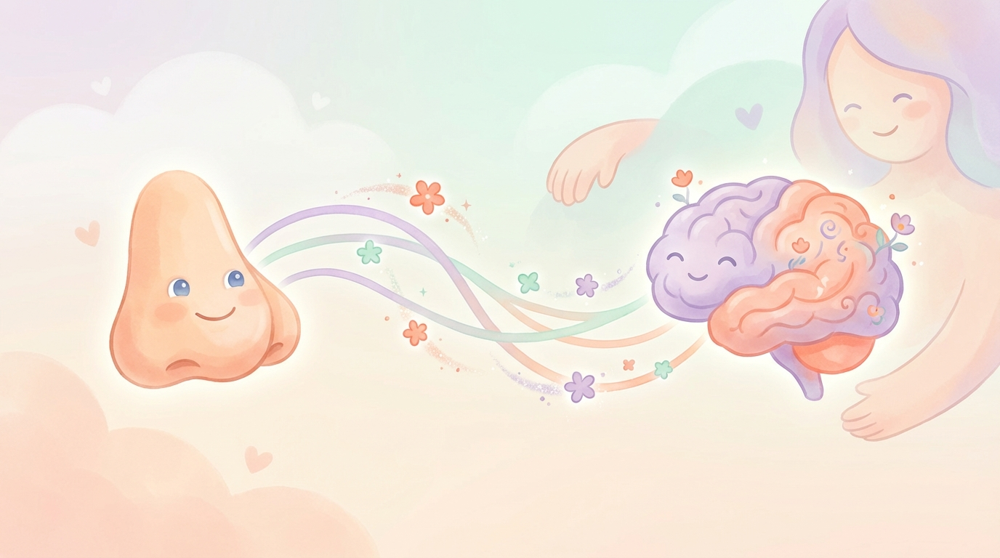
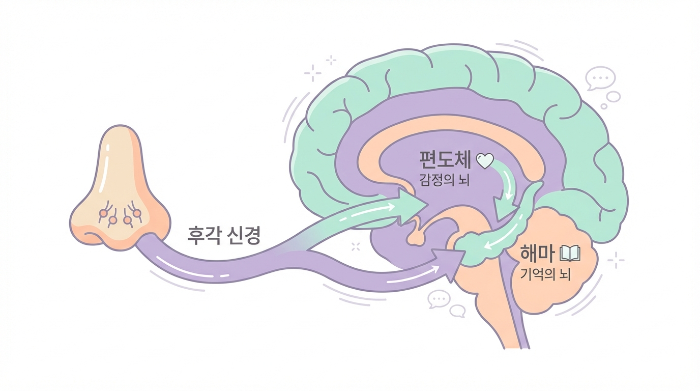

# Chapter 2. 코와 폐, 그리고 뇌의 숨겨진 연결고리

*향기와 호흡이 뇌에 전달되는 과정을 따뜻하게 표현한 일러스트*

## 할머니의 지혜에는 과학이 있었습니다

"코로 깊이 숨 쉬고 자렴."

어릴 적 할머니가 해주시던 말씀을 기억하시나요? 그저 어른들의 잔소리라고 생각했던 이 한마디에, 사실은 놀라운 과학이 담겨 있었습니다.

우리가 코로 숨을 들이마실 때, 공기와 함께 들어오는 향기 분자는 뇌의 가장 깊은 곳까지 단숨에 도달합니다. 동시에 천천히 쉬는 호흡은 온몸에 "이제 쉬어도 돼"라는 신호를 보냅니다. 이 두 가지가 만나면 잠으로 가는 문이 자연스럽게 열립니다.

이 챕터에서는 후각과 호흡이 어떻게 뇌와 연결되어 수면을 돕는지, 그 숨겨진 연결고리를 쉽게 풀어보겠습니다.

---

## 냄새를 맡으면 뇌에서 무슨 일이 일어날까요?

라벤더 향을 맡았을 때 마음이 편안해진 경험이 있으신가요? 또는 어릴 적 먹던 음식 냄새에 그 시절 기억이 갑자기 떠오른 적은요? 이것은 우연이 아닙니다. **후각은 우리의 다섯 가지 감각 중에서 뇌의 감정 중추에 가장 빠르고 직접적으로 연결된 감각**이기 때문입니다.

다른 감각(시각, 청각, 촉각, 미각)은 뇌에 도달하기까지 여러 중간 단계를 거칩니다. 일종의 환승역을 여러 개 지나는 셈이지요. 하지만 후각은 다릅니다. 코 안쪽의 후각 신경이 감지한 냄새 정보는 **단 한 번의 연결만으로 뇌의 변연계(limbic system)에 도착**합니다.

*향기가 뇌에 도달하는 경로 — 코 안쪽의 후각 신경 → 편도체(감정의 뇌) → 해마(기억의 뇌). 다른 감각보다 훨씬 빠르고 직접적입니다*

여기서 중요한 두 가지 뇌 영역이 등장합니다.

**편도체(扁桃體)**는 '감정의 뇌'라고 불립니다. 우리가 무서움을 느끼거나, 안전하다고 느끼거나, 편안함을 느끼는 것 모두 이곳에서 처리됩니다. 편안한 향기가 편도체에 도달하면, 편도체는 몸 전체에 "안전하다, 긴장을 풀어도 된다"는 신호를 보냅니다.

**해마(海馬)**는 '기억의 뇌'입니다. 냄새와 함께 경험한 일을 기억으로 저장하는 역할을 합니다. 라벤더 향과 함께 편안하게 잠든 경험이 반복되면, 해마는 "라벤더 향 = 잠잘 시간"이라는 기억을 만들어냅니다. 나중에는 그 향기만 맡아도 자연스럽게 몸이 수면 모드로 전환되는 것이지요.

### 발달장애 아동의 후각, 무엇이 다를까요?

발달장애 아동은 감각을 처리하는 방식에 특성이 있습니다. 어떤 아이는 소리나 촉감에 매우 예민하고(감각 과민), 어떤 아이는 반대로 감각 자극에 반응이 적습니다(감각 둔감). 후각도 마찬가지입니다.

그런데 흥미로운 점은, **후각 자극이 다른 감각 자극보다 거부 반응이 적은 경우가 많다**는 것입니다. 촉각에 과민한 아이에게 마사지를 하면 강하게 거부할 수 있지만, 은은한 향기는 물리적 접촉 없이 부드럽게 전달됩니다. 이것이 후각 기반 접근이 발달장애 아동에게 특히 유용한 이유입니다.

> **💡 우리 가족 이야기**
>
> "여섯 살 수아는 촉감에 매우 예민해서 마사지는 절대 못 했어요. 그런데 디퓨저에서 나오는 은은한 라벤더 향에는 관심을 보이더라고요. '이게 뭐야?' 하면서 코를 킁킁거리기 시작한 게 첫 번째 변화였어요."
> — 수아 아빠, 경기도

---

## 호흡은 몸의 자동 조종 장치를 바꾸는 스위치입니다

우리 몸에는 **자율신경계(自律神經系)**라는 '자동 조종 장치'가 있습니다. 심장이 뛰는 것, 음식을 소화하는 것, 체온을 유지하는 것 — 이 모든 것을 우리가 의식하지 않아도 알아서 조절해주는 시스템입니다.

이 자동 조종 장치에는 두 가지 모드가 있습니다.

**교감신경 = 액셀(가속 페달)**
놀이터에서 신나게 뛰어놀 때, 무서운 것을 봤을 때, 흥분했을 때 작동합니다. 심장이 빨리 뛰고, 근육에 힘이 들어가고, 눈이 번쩍 뜨이는 상태입니다. 위험에 대비하는 '전투 모드'라고 할 수 있습니다.

**부교감신경 = 브레이크(감속 페달)**
엄마 품에 편안히 안겨 있을 때, 따뜻한 물에 몸을 담그고 있을 때, 배부르게 먹고 나른해질 때 작동합니다. 심장이 천천히 뛰고, 근육이 이완되고, 몸 전체가 쉬는 상태로 들어갑니다. 잠이 들려면 반드시 이 모드가 켜져야 합니다.

많은 발달장애 아동은 **저녁이 되어도 액셀 모드에서 브레이크 모드로 잘 전환되지 않습니다.** 몸은 피곤한데 뇌는 여전히 "활동 중!" 상태에 머물러 있는 것이지요. 이것이 잠들기 어려운 핵심 원인 중 하나입니다.

그런데 여기서 놀라운 사실이 있습니다. 자율신경계는 대부분 자동으로 작동하지만, **호흡만큼은 우리가 의식적으로 조절할 수 있습니다.** 그리고 호흡을 바꾸면 자율신경계의 모드도 바뀝니다.

- **빠르고 얕은 호흡** → 교감신경 활성화 → 몸이 긴장
- **느리고 깊은 호흡** → 부교감신경 활성화 → 몸이 이완

쉽게 말해, **호흡은 액셀과 브레이크를 전환하는 유일한 수동 스위치**인 셈입니다.

---

## 향기 + 호흡 = 수면 개선의 시너지

향기와 호흡, 각각도 효과가 있지만 이 둘을 함께 사용하면 효과가 배가됩니다. 그 과정을 단계별로 살펴보겠습니다.

**1단계: 편안한 향기가 뇌에 "안전하다"는 신호를 보냅니다**
라벤더나 오렌지 같은 편안한 향기가 코를 통해 편도체에 도달하면, 편도체는 경계 수준을 낮춥니다. "위험하지 않아, 긴장을 풀어도 괜찮아"라는 메시지가 온몸에 전달됩니다.

**2단계: 천천히 깊은 호흡이 몸을 이완 모드로 전환합니다**
느리고 깊은 호흡이 부교감신경을 활성화합니다. 심장 박동이 느려지고, 근육의 긴장이 풀리고, 혈압이 내려갑니다. 몸 전체가 "이제 쉴 시간이야"라는 모드로 전환됩니다.

**3단계: 반복적 루틴이 뇌에 "잠잘 시간"을 학습시킵니다**
매일 같은 향기를 맡으며 같은 호흡을 반복하면, 뇌의 해마가 이 패턴을 기억합니다. "이 향기 + 이 호흡 = 잠잘 시간"이라는 연결이 점점 강해집니다. 나중에는 향기를 맡는 것만으로도 몸이 자동으로 수면 준비를 시작합니다.

**4단계: 자연스럽게 잠드는 몸이 만들어집니다**
약물의 도움 없이, 강제하지 않아도, 아이의 몸이 스스로 잠으로 향하게 됩니다. 이것이 후각·호흡 수면 훈련이 추구하는 최종 목표입니다.

---

> **💡 지금 바로 해보세요: 3-3-3 호흡법**
>
> 부모님이 먼저 체험해보세요. 아이에게 가르치기 전에 직접 느껴보는 것이 중요합니다.
>
> 1. **코로 3초** 동안 천천히 들이마시세요 (배가 볼록 나올 만큼)
> 2. **3초** 동안 편안하게 숨을 멈추세요 (억지로 참지 마세요)
> 3. **입으로 3초** 동안 천천히 내쉬세요 (촛불을 부드럽게 끄듯이)
>
> 이것을 3번만 반복해보세요.
> 호흡 전과 후, 어깨의 긴장이 달라졌나요? 마음이 조금 더 차분해졌나요?
> 이 작은 변화가 바로 부교감신경이 활성화된 증거입니다.

---

**✅ 핵심 포인트**
- 후각은 뇌의 감정 중추(편도체)와 기억 중추(해마)에 직접 연결되어 있습니다
- 호흡은 우리 몸의 긴장-이완 모드를 전환하는 유일한 수동 스위치입니다
- 향기와 호흡을 함께 사용하면 "안전 신호 + 이완 모드"의 시너지 효과가 나타납니다
- 매일 반복되는 루틴을 통해 뇌가 수면 패턴을 자연스럽게 학습합니다

---
