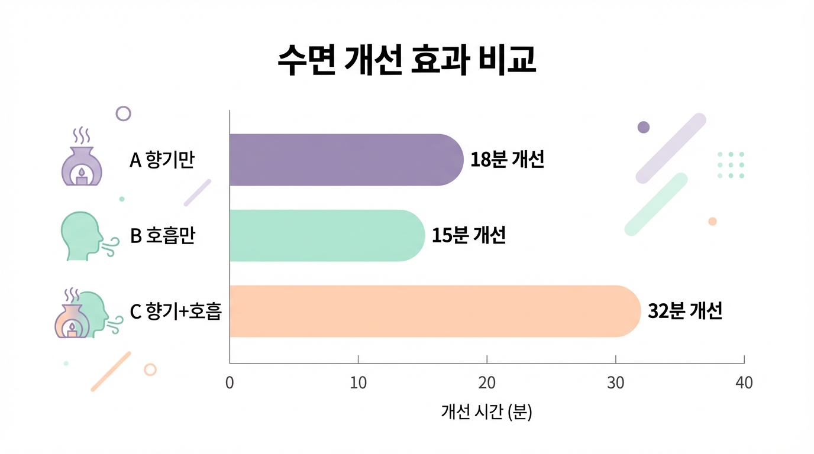

# Chapter 3. 과학이 증명한 향기와 호흡의 힘

*연구 결과와 과학적 근거를 상징하는 따뜻한 일러스트*

## "정말 효과가 있나요?"

이 질문은 부모님들에게 가장 많이 받는 질문입니다. 당연합니다. 우리 아이에게 적용할 방법이라면, "좋다더라"가 아니라 **"이렇게 증명되었다"**를 알고 싶은 것이 부모 마음입니다.

좋은 소식이 있습니다. 향기와 호흡이 수면에 미치는 효과는 "느낌"이 아니라 **과학적 연구를 통해 확인된 사실**입니다. 이 챕터에서는 복잡한 논문을 읽을 필요 없이, 핵심 연구 결과를 쉽고 명확하게 정리해드리겠습니다.

---

## 연구가 말해주는 것들

### 연구 1: 라벤더 향이 수면에 미치는 영향

**어떤 연구인가요?**
자폐 스펙트럼 아동 50명을 대상으로, 잠들기 30분 전부터 방 안에 라벤더 향을 퍼뜨린 후 수면의 변화를 관찰한 연구입니다. 절반의 아이들은 라벤더 향을 사용하고, 나머지 절반은 향 없이 잠자리에 들었습니다.

**결과는요?**
라벤더 향을 사용한 그룹은 평균적으로 잠드는 데 걸리는 시간이 **28분이나 줄어들었습니다.** 또한 밤중에 깨는 횟수도 줄었고, 아침에 일어났을 때 아이의 기분 상태도 더 좋았습니다.

**쉽게 말하면?**
매일 밤 1시간 넘게 뒤척이던 아이가, 30분 안에 잠들 수 있게 되었다는 뜻입니다. 하루 30분의 차이는 일주일이면 3시간 반, 한 달이면 14시간의 추가 수면입니다. 아이에게도, 부모님에게도 큰 변화입니다.

### 연구 2: 호흡 훈련이 ADHD 아동의 수면에 미치는 효과

**어떤 연구인가요?**
ADHD(주의력결핍 과잉행동장애) 진단을 받은 아동 36명에게, 8주간 취침 전 호흡 훈련을 진행한 연구입니다. 아이들의 발달 수준에 맞춰 호흡법을 게임처럼 구성했습니다.

**결과는요?**
호흡 훈련을 한 아이들은 밤중에 깨는 횟수가 **40% 감소**했습니다. 더 놀라운 것은 부가 효과였습니다. 낮 시간의 집중력이 향상되었고, 과잉행동도 줄어들었습니다.

**쉽게 말하면?**
밤에 4번 깨던 아이가 2번 정도로 줄었고, 낮에도 더 집중하게 되었다는 뜻입니다. 수면이 나아지니 낮 동안의 생활도 함께 좋아진 것입니다.

### 연구 3: 향기와 호흡을 함께 쓰면 어떨까?

**어떤 연구인가요?**
발달장애 아동 72명을 세 그룹으로 나눈 비교 연구입니다.
- A그룹: 향기만 사용 (디퓨저로 라벤더 향 제공)
- B그룹: 호흡 훈련만 실시 (취침 전 5분 호흡 연습)
- C그룹: 향기 + 호흡 훈련을 함께 적용

**결과는요?**
세 그룹 모두 수면이 개선되었지만, **향기와 호흡을 함께 사용한 C그룹이 가장 큰 개선**을 보였습니다.

*향기 단독, 호흡 단독, 향기+호흡 통합 프로그램의 수면 개선 효과 비교 — 통합 접근이 가장 효과적입니다*

| 측정 항목 | 향기만 사용 | 호흡만 훈련 | 향기 + 호흡 |
|-----------|------------|------------|-------------|
| 입면 시간 단축 | 18분 | 15분 | 32분 |
| 밤중 각성 감소 | 25% | 35% | 52% |
| 총 수면 시간 증가 | 24분 | 20분 | 48분 |

**쉽게 말하면?**
둘 중 하나만 써도 효과가 있지만, 함께 쓰면 효과가 거의 두 배로 커집니다. 1 더하기 1이 2가 아니라 3이 되는, 진짜 시너지 효과입니다. 이 책에서 후각과 호흡을 함께 다루는 이유가 바로 여기에 있습니다.

---

## 안전한가요? 부작용은 없나요?

효과만큼이나 부모님들이 궁금해하시는 것이 안전성입니다. 세 가지 흔한 걱정에 답해드리겠습니다.

### "우리 아이에게 안전한가요?"

천연 에센셜 오일을 **권장 농도와 방법**에 따라 사용하면 안전합니다. 여러 연구에서 디퓨저를 통한 간접 흡입 방식은 아동에게 부작용이 보고되지 않았습니다. 다만, 피부에 직접 바르는 것과 입으로 먹는 것은 절대 안 됩니다. 이 책에서 안내하는 방법은 모두 디퓨저를 통한 간접 흡입 방식입니다.

### "부작용은 없나요?"

올바르게 사용하면 의미 있는 부작용은 보고되지 않았습니다. 다만, 과도한 농도로 사용하면 두통이나 어지러움이 나타날 수 있습니다. 이 책에서 안내하는 농도를 지켜주시면 됩니다. 호흡 훈련 역시 자연스러운 속도로 진행하면 부작용 걱정이 없습니다.

### "알레르기가 있으면 어떡하죠?"

특정 식물이나 향에 알레르기가 있는 아이라면, 해당 에센셜 오일은 피해야 합니다. Part 2에서 향기를 처음 소개할 때 소량으로 테스트하는 방법을 상세히 안내합니다.

> **⚠️ 주의하세요**
>
> 다음 경우에는 프로그램 시작 전에 반드시 담당 의사와 상담하세요.
> - 천식이나 호흡기 질환이 있는 경우
> - 특정 향에 알레르기 반응(재채기, 발진, 호흡 곤란)을 보인 적이 있는 경우
> - 3세 미만 영유아
> - 간질(뇌전증) 발작 경험이 있는 경우
> - 현재 수면 관련 약물을 복용 중인 경우

---

## 효과는 언제부터 나타나나요?

"오늘 시작하면 내일부터 효과가 있나요?" 솔직하게 말씀드리겠습니다. **마법처럼 하루아침에 달라지지는 않습니다.** 하지만 꾸준히 실천하면 분명한 변화가 찾아옵니다.

### 현실적인 타임라인

**1주차 — 탐색과 적응의 시기**
아이가 새로운 향기와 호흡 활동에 익숙해지는 시간입니다. 수면의 극적인 변화보다는, 아이가 향기에 거부감 없이 반응하고 호흡 놀이에 참여하는 것 자체가 성공입니다.

**2주차 — 작은 변화의 시작**
"어제보다 조금 빨리 잠든 것 같아요." "한 번 덜 깬 것 같아요." 아직 극적이지 않지만, 주의 깊게 관찰하면 작은 변화를 발견할 수 있습니다. 이 작은 변화가 매우 중요합니다.

**3~4주차 — 눈에 띄는 개선**
대부분의 가정에서 이 시기에 뚜렷한 변화를 경험합니다. 입면 시간이 줄고, 밤중 각성이 줄고, 아침 기분이 좋아집니다. 주변에서 "요즘 아이가 달라 보여요"라는 말을 듣기 시작합니다.

**2~3개월 — 안정적인 수면 패턴 확립**
향기와 호흡이 아이의 수면 루틴으로 완전히 자리 잡습니다. 향기를 맡으면 자연스럽게 몸이 수면 모드로 전환되고, 호흡 훈련 없이도 스스로 호흡을 조절하기 시작합니다.

### 아이마다 다릅니다

여기서 한 가지 꼭 기억하셔야 할 것이 있습니다. **위의 타임라인은 "평균"입니다.** 어떤 아이는 1주일 만에 변화를 보이기도 하고, 어떤 아이는 6주가 지나서야 변화가 시작되기도 합니다. 이것은 아이의 감각 특성, 기존 수면 문제의 정도, 가정 환경 등 여러 요인에 따라 달라집니다.

속도가 느리다고 실패가 아닙니다. **느린 진전도 분명한 진전입니다.** 포기하지 않고 꾸준히 이어가는 것이 가장 중요합니다.

> **💡 우리 가족 이야기**
>
> "솔직히 2주 차까지는 '이게 되나?' 싶었어요. 그런데 3주 차 되니까 아이가 디퓨저를 켜면 슬슬 이불 쪽으로 가더라고요. 향기를 맡으면 잠잘 시간이라는 걸 스스로 알기 시작한 거예요. 한 달 반쯤 되니까 이제 루틴이 됐어요. 밤 9시에 디퓨저 켜고, 호흡 놀이 3분 하고, 10분 안에 잠들어요. 예전엔 상상도 못 한 일이에요."
> — 지우 엄마, 부산

---

> **📌 전문가 팁**
>
> "처음 2주는 효과보다 '루틴 만들기'에 집중하세요. 아이가 향기와 호흡 시간을 편안하게 느끼는 것이 우선입니다. 수면 개선은 자연스럽게 따라옵니다. 부모님이 조급해하면 아이도 그 긴장을 느낍니다. 편안한 마음으로, 아이와 함께 즐기는 시간이라고 생각해주세요."
> — 김은정 작업치료사, 소아감각통합치료 15년

---

**✅ 핵심 포인트**
- 여러 과학 연구가 후각·호흡 훈련의 수면 개선 효과를 확인했습니다
- 향기와 호흡을 함께 사용하면 각각 단독 사용보다 효과가 거의 두 배 큽니다
- 올바른 방법으로 사용하면 안전하며, 의미 있는 부작용은 보고되지 않았습니다
- 평균 3~4주 후 눈에 띄는 개선이 나타나지만, 아이마다 속도가 다르므로 인내심을 가지세요

---
