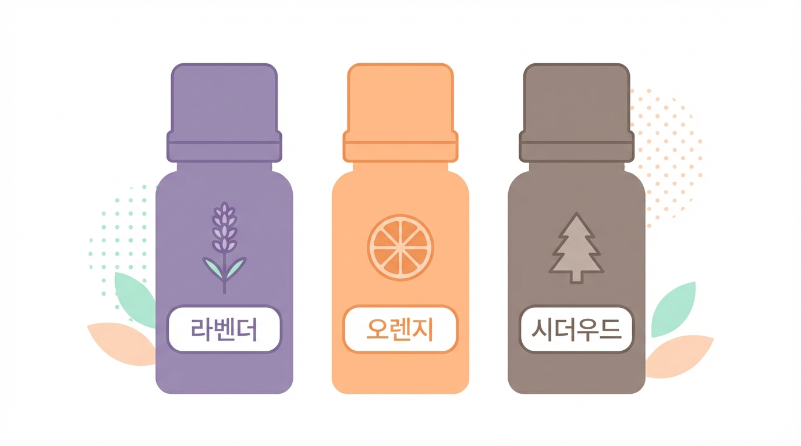
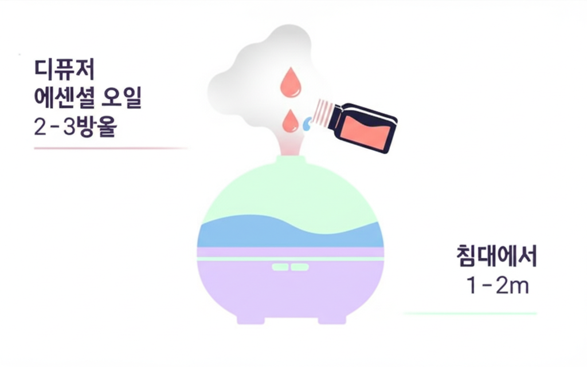
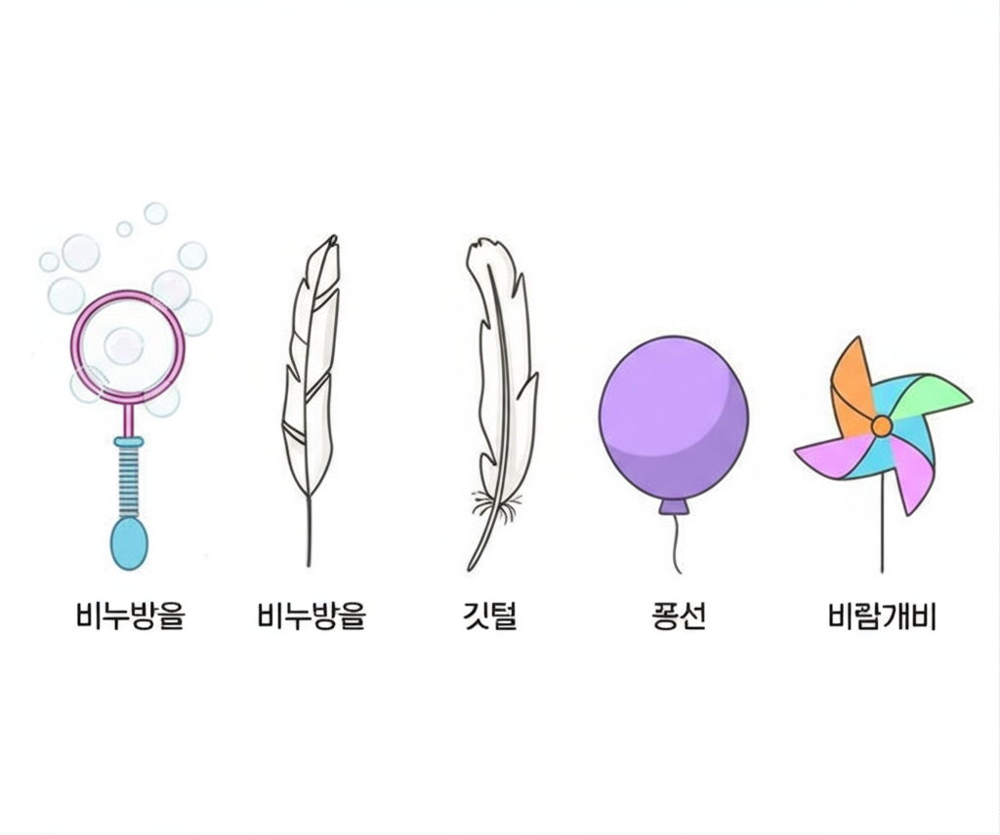

# Chapter 4. 시작 전 준비하기

*프로그램 준비물과 환경을 세팅하는 가족의 모습*

## 여정의 시작

오늘부터 우리 아이의 수면 여정이 시작됩니다.

Part 1에서 후각과 호흡이 왜 수면에 효과적인지 이해하셨을 것입니다. 이제 실천할 차례입니다. 하지만 바로 훈련에 뛰어들기 전에, **준비를 먼저 탄탄히 해야 합니다.** 건물을 짓기 전에 기초 공사를 하는 것과 같습니다. 이 챕터에서 안내하는 준비를 마치면, 내일부터 자신 있게 1주차를 시작할 수 있습니다.

준비에 필요한 시간은 하루면 충분합니다. 오늘 하루만 투자해주세요.

---

## 우리 아이 현재 상태 체크하기

훈련을 시작하기 전에, 아이의 현재 수면 상태와 감각 특성을 파악해야 합니다. 이 기록은 나중에 "얼마나 좋아졌는지"를 확인하는 기준점이 됩니다.

### 수면 패턴 체크리스트

아이의 최근 일주일 수면을 떠올리며 체크해보세요.

| 항목 | 예 | 아니오 | 메모 |
|------|:---:|:------:|------|
| 잠들기까지 30분 이상 걸리나요? | □ | □ | |
| 밤에 3회 이상 깨나요? | □ | □ | |
| 새벽 5시 전에 깨나요? | □ | □ | |
| 낮잠을 2시간 이상 자나요? | □ | □ | |
| 수면 시간이 날마다 불규칙한가요? | □ | □ | |
| 잠들기 전에 심하게 보채나요? | □ | □ | |
| 잠들려면 특정 조건이 꼭 필요한가요? | □ | □ | |

"예"가 3개 이상이라면, 이 프로그램이 특히 도움이 될 것입니다.

### 감각 민감도 체크

향기에 대한 아이의 반응을 파악하면, 훈련을 아이에게 맞출 수 있습니다.

**향기에 대한 반응** (가장 가까운 것에 체크)
- □ 새로운 냄새를 잘 받아들이는 편이다
- □ 특정 냄새를 싫어한다 (어떤 냄새? _______)
- □ 냄새에 크게 반응하지 않는다
- □ 냄새를 좋아하고 적극적으로 맡으려 한다

**현재 호흡 패턴** (가장 가까운 것에 체크)
- □ 주로 코로 숨을 쉰다
- □ 주로 입으로 숨을 쉰다
- □ 얕고 빠른 호흡이 많다
- □ 비교적 깊고 느린 호흡을 한다

> **📌 전문가 팁**
>
> 향기에 과민한 아이라면 훈련 시작 시 향의 농도를 매우 낮게 설정하세요. 반대로 냄새에 둔감한 아이라면 조금 더 가까운 거리에서 향기를 제공해도 됩니다. 아이의 감각 특성에 맞추는 것이 성공의 열쇠입니다.

---

## 필요한 준비물

### 필수 준비물

**1. 에센셜 오일 (3종류 추천)**

*추천 에센셜 오일 3종 — 라벤더, 오렌지, 시더우드*

| 오일 | 특징 | 추천 상황 |
|------|------|-----------|
| **라벤더** | 가장 대표적인 수면 도우미. 부드럽고 꽃 향. | 모든 아이에게 기본 추천 |
| **오렌지** | 밝고 달콤한 감귤 향. 아이들이 가장 잘 받아들임. | 향기에 거부감 있는 아이 |
| **시더우드** | 따뜻하고 나무 향. 안정감과 그라운딩 효과. | 감각 둔감형 아이 |

**구매 시 꼭 확인하세요:**
- "100% Pure Essential Oil" 표기가 있는 제품
- 유기농 인증 마크가 있으면 더 좋습니다
- 합성 향료(fragrance oil)와 혼동하지 마세요
- 예상 가격: 종류당 약 1~2만 원
- 한 병으로 2~3개월 이상 사용 가능합니다

**2. 디퓨저**

*초음파 디퓨저 사용 예시 — 침대에서 1~2m 거리에 배치*

- **초음파 디퓨저** (가장 권장): 물에 오일을 떨어뜨려 미세한 안개로 퍼뜨립니다. 열을 사용하지 않아 안전합니다.
- **아로마 스톤**: 전기 없이 오일을 떨어뜨려 자연 증발. 향이 약하지만 가장 안전합니다.
- 예상 가격: 2~5만 원
- 타이머 기능이 있는 제품을 추천합니다 (30분 자동 꺼짐)

**3. 호흡 훈련 도구**

*호흡 훈련에 활용할 수 있는 놀이 도구들*

아이가 호흡을 "훈련"이 아닌 "놀이"로 느끼게 하는 도구들입니다.

- **비누방울 도구**: 천천히 불어야 큰 방울이 만들어지므로 느린 날숨 연습에 최적
- **깃털 또는 솜털공**: 테이블 위에 올려놓고 부드럽게 불어 움직이기
- **풍선**: 크게 불었다 놓기를 반복하며 깊은 호흡 연습
- **바람개비(핀휠)**: 일정하게 불어야 잘 돌아가므로 고른 호흡 연습

**4. 기록 도구**
- 훈련 일지 (부록 A의 기록지를 인쇄하거나 노트 활용)
- 칭찬 스티커 (아이가 좋아하는 캐릭터)
- 색연필 (기록지에 아이가 직접 스티커를 붙이거나 그림을 그릴 수 있도록)

### 선택 준비물 (있으면 더 좋아요)
- 차분한 음악 (자연의 소리, 클래식 자장가 등)
- 따뜻한 색 LED 조명 (오렌지색 또는 노란색)
- 아이가 가장 좋아하는 인형이나 담요

---

## 안전 수칙

> **⚠️ 반드시 지켜주세요**
>
> **에센셜 오일 사용 수칙**
> - 절대 피부에 원액을 직접 바르지 마세요
> - 절대 마시거나 입에 넣지 마세요
> - 아이 손이 닿지 않는 곳에 보관하세요
> - 디퓨저 사용 시 반드시 환기하세요 (문을 살짝 열어두기)
> - 하루 30분 이상 연속 사용하지 마세요
> - 사용 중 아이가 기침, 재채기, 눈 비비기를 하면 즉시 중단하세요
>
> **응급 상황 대처**
> - 눈에 들어간 경우: 즉시 깨끗한 물로 15분간 씻고 병원 방문
> - 삼킨 경우: 토하게 하지 말고 즉시 119에 신고
> - 피부에 원액이 닿은 경우: 캐리어 오일(올리브유 등)로 닦아낸 후 물로 씻기

### 패치 테스트 — 첫 사용 전 필수!

아이가 특정 오일에 알레르기가 있는지 미리 확인하는 과정입니다.

1. 에센셜 오일 **1방울**을 캐리어 오일(올리브유, 호호바유 등) **1티스푼**에 희석합니다
2. 아이 **팔 안쪽**(손목 위 부분)에 소량 발라줍니다
3. **24시간** 동안 관찰합니다
4. 붉어짐, 부어오름, 가려움이 없으면 사용해도 좋습니다
5. 반응이 나타나면 해당 오일은 사용하지 마세요

각 오일마다 별도로 테스트하세요. 라벤더에 괜찮아도 오렌지에 반응이 있을 수 있습니다.

---

## 가족 회의하기

이 프로그램은 아이 혼자 하는 것이 아닙니다. **가족의 협력**이 필요합니다.

### 함께 참여할 가족 정하기
- **주 담당자**: 매일 훈련을 함께 할 사람. 가능하면 아이가 가장 편안해하는 사람이 좋습니다
- **보조 담당자**: 주 담당자가 힘들 때 교대할 사람. 방법을 함께 익혀두세요
- **형제자매**: 참여를 원하면 함께해도 좋지만, 강제는 금물입니다. 함께 하면 오히려 즐거운 가족 시간이 될 수 있습니다

### 일관성 약속
프로그램의 효과를 높이는 가장 중요한 요소는 **일관성**입니다.
- **같은 시간**: 매일 취침 30분 전으로 정하세요
- **같은 순서**: 향기 → 호흡 → 잠자리 순서를 지키세요
- **같은 사람**: 가능한 한 같은 사람이 함께 해주세요 (아이에게 예측 가능한 안정감을 줍니다)

> **📌 전문가 팁**
>
> "처음 1주일은 부모님이 훈련에 집중해야 하므로 다른 가족의 협조가 필요합니다. 저녁 식사 정리, 다른 아이 돌보기 등 역할을 미리 나누면, 훈련 시간이 되었을 때 온전히 아이에게 집중할 수 있습니다."

---

## 첫날 준비 체크리스트

모든 준비가 끝났는지 최종 확인합니다.

**오늘 할 일**
- □ 에센셜 오일 3종 구매 완료
- □ 디퓨저 구매 및 작동 테스트 완료
- □ 호흡 훈련 도구(비누방울, 깃털 등) 준비 완료
- □ 에센셜 오일 패치 테스트 시작 (24시간 관찰)
- □ 침실 환경 점검 완료 (온도, 조명, 소음)
- □ 디퓨저 위치 결정 (침대에서 1~2m)
- □ 훈련 일지 인쇄 (부록 A)
- □ 칭찬 스티커 준비
- □ 가족 회의 완료 (역할 분담)
- □ 아이에게 "내일부터 재미있는 잠자기 놀이를 할 거야" 예고

> **💡 지금 바로 해보세요**
>
> 아이에게 이렇게 말해보세요. "내일부터 잠자기 전에 좋은 냄새도 맡고, 재미있는 바람 놀이도 할 거야. 기대되지?" 기대감을 심어주는 것만으로도 첫날이 훨씬 수월해집니다.

**내일부터: 1주차 프로그램 시작!**

---

**✅ 핵심 포인트**
- 준비가 성공의 80%입니다 — 오늘 하루를 투자하세요
- 안전이 최우선입니다 — 패치 테스트를 반드시 하세요
- 침실 환경(온도, 조명, 소음)을 먼저 점검하세요
- 가족 모두의 협조와 역할 분담이 필요합니다
- 체크리스트를 활용해 빠짐없이 준비하세요

---
