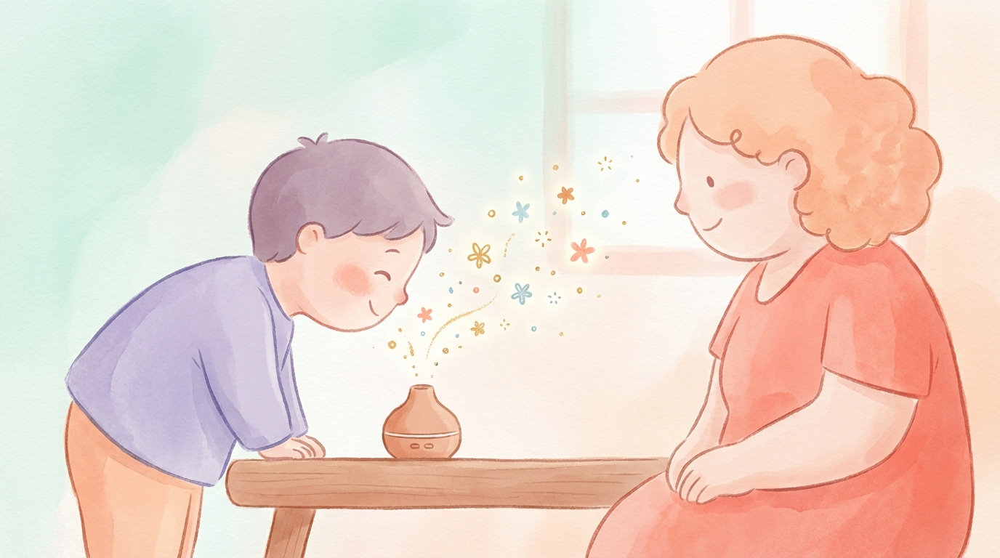
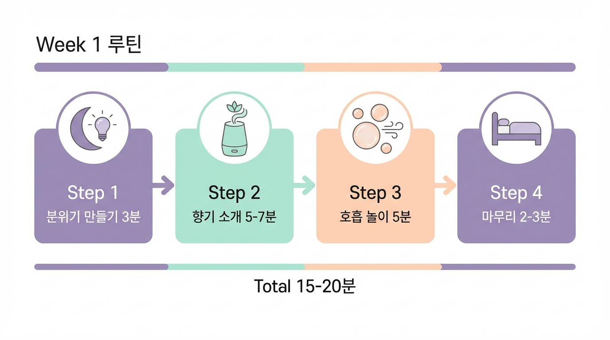

# Chapter 5. 1주차 — 향기와 친해지기

*다양한 향기를 호기심 가득한 표정으로 탐색하는 아이*

## 이번 주는 '친해지기'가 목표입니다

첫 번째 주, 가장 중요한 것을 말씀드리겠습니다. **이번 주에는 수면 개선을 기대하지 마세요.** 놀라셨나요? 1주차의 진짜 목표는 아이가 향기와 호흡 활동을 **"즐겁고 편안한 시간"으로 받아들이는 것**입니다.

새 친구를 사귈 때를 떠올려보세요. 처음부터 "우리 단짝 하자!"고 하면 오히려 부담스럽습니다. 조금씩, 자연스럽게 친해지는 것이 좋습니다. 향기도 마찬가지입니다.

서두르지 마세요. 이번 주에 쌓은 친밀함이 앞으로 3주의 성공을 결정합니다.

---

## 1주차 목표와 기대 효과

### 이번 주에 달성할 목표
1. 아이가 에센셜 오일 향기에 **거부감 없이 반응**하기
2. 간단한 **호흡 놀이 1~2가지를 경험**하기
3. 저녁 시간에 **"향기 시간"이라는 루틴의 틀 만들기**

### 이 정도면 성공입니다
- 아이가 디퓨저가 켜지면 싫어하지 않는다 → 대성공!
- 비누방울을 한 번이라도 불었다 → 훌륭합니다!
- "또 하고 싶어"라고 말하거나 행동으로 보여준다 → 최고의 신호!

### 아직 기대하지 않아도 되는 것
- 잠드는 시간이 빨라지는 것 (아직 이릅니다)
- 완벽한 호흡 기술 (놀이일 뿐입니다)
- 매일 빠짐없이 완료하는 것 (하루 쉬어도 괜찮습니다)

---

## 일일 루틴: 저녁 향기 시간

*1주차 저녁 루틴 — 취침 30분 전부터 시작, 총 15~20분*

매일 저녁, 취침 30분 전에 시작합니다. 전체 소요 시간은 약 **15~20분**입니다.

### Step 1. 분위기 만들기 (3분)

- 방 조명을 낮춥니다 (따뜻한 색 조명으로 전환)
- TV, 태블릿 등 화면을 끕니다
- 차분한 음악을 틀어도 좋습니다 (선택)
- 아이에게 "자, 이제 향기 시간이야!"라고 알려줍니다

**포인트:** 매일 같은 말, 같은 순서로 시작하세요. 이것이 아이에게 "지금부터 잠잘 준비 시간"이라는 예측 가능한 신호가 됩니다.

### Step 2. 향기 소개하기 (5~7분)

**Day 1~2: 첫 만남**

첫 이틀은 **라벤더 한 가지만** 사용합니다.

1. 디퓨저에 물을 채우고, 라벤더 오일 **2방울**만 넣습니다 (처음에는 최소 농도로!)
2. 디퓨저를 켜고, 부모님이 먼저 "음~ 좋은 냄새다!" 하고 자연스럽게 반응합니다
3. 아이에게 강요하지 마세요. 아이가 관심을 보이면 "이리 와서 같이 맡아볼래?" 정도만
4. 아이의 반응을 관찰하고 기록합니다

> **⚠️ 주의하세요**
>
> 아이가 고개를 돌리거나, 얼굴을 찡그리거나, 자리를 피하면 **향이 너무 강한 것**입니다. 디퓨저를 더 멀리 놓거나, 1방울로 줄이세요. 절대 강요하지 마세요. 거부는 실패가 아니라 "조절이 필요하다"는 아이의 표현입니다.

**Day 3~4: 탐색 시간**

아이가 라벤더에 익숙해졌다면, 다른 향기도 소개합니다.

1. 에센셜 오일 병 뚜껑을 열어 아이에게서 **30cm 정도 거리**에 둡니다
2. 라벤더, 오렌지, 시더우드를 차례로 맡게 합니다
3. "어떤 냄새가 좋아?" "이건 어때?" 라고 물어봅니다
4. 아이가 선호하는 향기를 파악합니다 — 이 향이 앞으로의 **"우리 아이 향기"**가 됩니다

**Day 5~7: 향기와 친한 친구 되기**

아이가 선호하는 향기를 중심으로, 저녁 시간의 긍정적 경험과 연결합니다.

1. 디퓨저에 아이가 좋아하는 오일을 넣습니다
2. 향기가 퍼지는 동안 아이가 좋아하는 조용한 활동을 합니다 (그림책 읽기, 퍼즐, 인형 놀이 등)
3. "좋은 냄새 나는 시간이 즐겁지?" 하고 자연스럽게 이야기합니다

### Step 3. 호흡 놀이 (5분)

1주차 호흡 놀이는 **"기술"이 아니라 순수한 "놀이"**입니다. 아이가 재미있어하는 것만 하세요.

**놀이 1: 비누방울 불기**
- 부모님이 먼저 천천히 불어서 큰 비누방울을 만듭니다
- "천~천~히 불면 큰 방울이 생겨! 해볼래?" 하고 권합니다
- 비누방울이 만들어지면 함께 기뻐해주세요
- 3~5번이면 충분합니다

**놀이 2: 깃털 날리기**
- 테이블 위에 깃털이나 솜털공을 올려놓습니다
- "후~ 하고 불어서 저기까지 보내볼까?" 하고 게임처럼 합니다
- 세게 불거나 약하게 불어보며 호흡 세기를 탐색합니다

**놀이 3: 바람개비 돌리기**
- 바람개비를 코 앞에 들고 "후~" 불어서 돌립니다
- "오래오래 돌아가게 할 수 있을까?" 하고 도전 과제를 줍니다
- 일정하게 긴 숨을 내쉬는 연습이 자연스럽게 됩니다

> **💡 지금 바로 해보세요**
>
> 오늘의 호흡 놀이가 끝나면, 아이에게 칭찬 스티커를 붙여주세요.
> "오늘 향기 시간 잘 했어! 스티커 골라봐."
> 기록지에 스티커를 모으는 재미가 아이의 동기를 높여줍니다.

### Step 4. 마무리 (2~3분)

- "오늘 향기 시간 즐거웠어?"
- 훈련 일지에 간단히 기록합니다 (사용한 향, 아이 반응, 특이사항)
- 디퓨저를 끕니다 (또는 타이머로 자동 꺼지도록)
- 잠자리로 이동합니다

---

## 일일 기록 가이드

매일 2분이면 충분한 간단 기록입니다. 부록 A의 기록지를 활용하세요.

| 기록 항목 | Day 1 예시 |
|-----------|-----------|
| 사용한 향기 | 라벤더 2방울 |
| 아이의 향기 반응 | 처음엔 무관심, 2분 후 "이게 뭐야?" 하고 다가옴 |
| 호흡 놀이 | 비누방울 3번 불기 |
| 아이의 놀이 반응 | 재미있어 함. 큰 방울 만들려고 집중 |
| 전체 소요 시간 | 12분 |
| 잠든 시간 | 밤 9시 40분 |
| 특이사항 | 형이 같이 하겠다고 해서 함께 함 |

---

## 이런 상황이라면?

### "아이가 향기를 거부해요"

당황하지 마세요. 이것은 흔한 반응입니다.
- 향의 농도를 낮추세요 (오일 1방울, 거리 늘리기)
- 부모님이 먼저 맡으며 즐거운 모습을 보여주세요
- 며칠간 디퓨저만 틀어놓고 (아주 약하게) 자연스럽게 노출하세요
- 오렌지 향으로 바꿔보세요 (아이들이 가장 잘 받아들이는 향)

### "아이가 호흡 놀이에 관심이 없어요"

괜찮습니다. 1주차에는 향기 친해지기만 해도 충분합니다.
- 부모님이 혼자 비누방울을 불면서 즐기세요. 아이가 보고 관심을 가질 수 있습니다
- 다른 도구(깃털, 바람개비)로 시도해보세요
- 이번 주에 안 되면 2주차에 다시 시도하면 됩니다

### "하루를 빠뜨렸어요"

**전혀 문제없습니다!** 일주일에 5일만 해도 훌륭합니다. 빠뜨렸다고 자책하지 마세요. 내일 다시 하면 됩니다. 완벽보다 꾸준함이 중요합니다.

> **💡 우리 가족 이야기**
>
> "첫날 디퓨저를 켰더니 하윤이가 울면서 방에서 나갔어요. '아, 실패다' 싶었죠. 그런데 다음 날 거실에서 아주 약하게 틀어놨더니 신경 쓰지 않더라고요. 사흘째 되니까 '엄마, 그 냄새 뭐야?' 하고 물어봤어요. 일주일이 끝날 때쯤엔 '오늘도 냄새 나는 거 해?' 하고 물어봤습니다."
> — 하윤 엄마, 대전

---

## 1주차 체크리스트

주말에 돌아보며 체크해보세요.

- □ 에센셜 오일 향기를 아이에게 소개했다
- □ 아이가 선호하는 향기를 파악했다 (→ _________ 향)
- □ 호흡 놀이를 1가지 이상 시도했다
- □ 저녁 "향기 시간"을 5회 이상 실시했다
- □ 매일 간단히 기록했다
- □ 아이가 향기 시간에 거부감을 보이지 않는다

**5개 이상 체크했다면**, 2주차로 넘어갈 준비가 되었습니다!
**3~4개라면**, 서두르지 말고 1주차를 며칠 더 연장해도 좋습니다.
**2개 이하라면**, 향기의 종류나 농도를 바꿔보고, 전문가 상담을 고려해보세요.

---

**✅ 핵심 포인트**
- 1주차 목표는 수면 개선이 아니라 "향기와 친해지기"입니다
- 향기를 놀이처럼, 자연스럽게, 아이의 속도에 맞춰 소개하세요
- 호흡 놀이는 기술이 아닌 즐거운 놀이여야 합니다
- 아이가 거부하면 강요 대신 농도를 낮추고, 기다려주세요
- 매일 간단히 기록하면 변화를 발견할 수 있습니다

---
