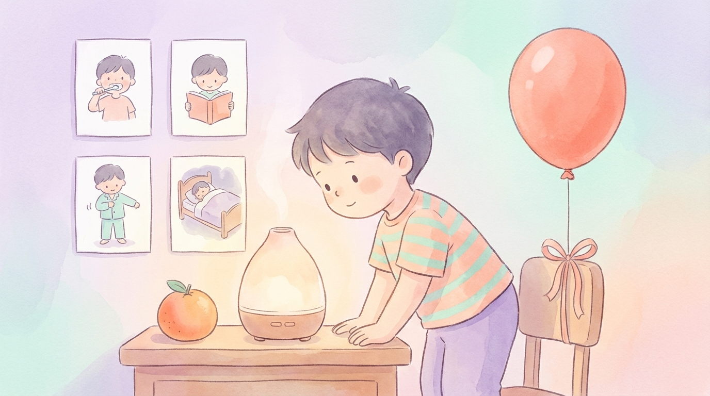
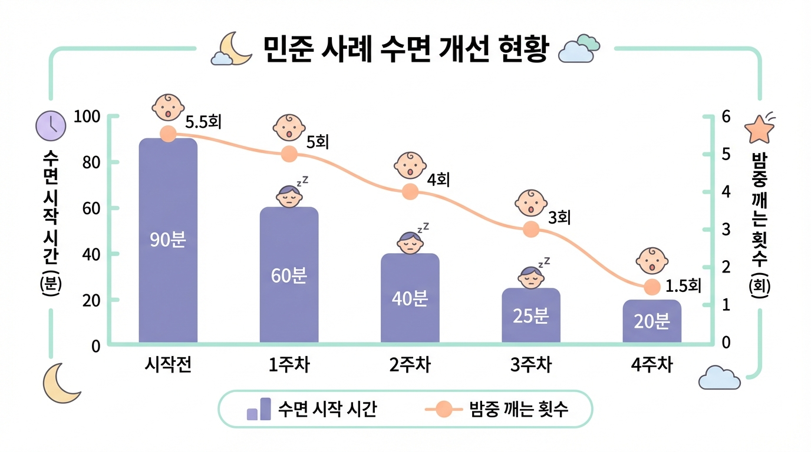

# Chapter 9. 민준이의 이야기 (5세, 자폐스펙트럼)

*향기 시간을 기다리는 민준이의 밝은 표정*

## 민준이를 소개합니다

민준이는 서울에 사는 다섯 살 남자아이입니다. 세 살 때 **자폐스펙트럼장애 레벨 2**로 진단받았습니다. 밝은 눈으로 블록 쌓기를 좋아하고, 기차 장난감이라면 시간 가는 줄 모르는 아이입니다.

하지만 밤이 되면 이야기가 달라졌습니다. 민준이는 잠드는 데 **1~2시간**이 걸렸고, 겨우 잠들어도 밤새 **5~6번** 깨곤 했습니다. 아침이면 아이도, 부모님도 지쳐 있었습니다.

---

## 시작 전: 온 가족이 지쳐 있었습니다

민준이 엄마와 아빠는 매일 밤 교대로 민준이 곁에 누워야 했습니다. 한 사람이 민준이를 재우는 동안, 다른 한 사람은 겨우 잠을 청했습니다. 하지만 민준이가 깨면 다시 달려가야 했기에, 부모님 모두 만성적인 수면 부족에 시달렸습니다.

낮에는 상황이 더 어려웠습니다. 잠을 못 잔 민준이는 **작은 일에도 심하게 짜증**을 냈고, 어린이집에서 친구를 밀치는 일이 잦아졌습니다. 감각통합 치료와 언어치료를 받고 있었지만, 선생님은 "민준이가 치료 시간에 너무 졸려서 효과가 떨어진다"고 했습니다.

민준이 엄마는 말합니다. "밤이 무서웠어요. 오늘도 잠을 못 재우면 어쩌나, 그 불안감이 저녁만 되면 올라왔어요."

---

## 프로그램 적용: 민준이에게 맞춘 커스터마이징

민준이에게 프로그램을 적용할 때, 아이의 특성을 고려해 몇 가지를 조정했습니다.

**시각적 강점 활용**
민준이는 말보다 그림이나 사진을 더 잘 이해하는 아이였습니다. 그래서 저녁 루틴을 **그림 카드**로 만들었습니다. "디퓨저 켜기 → 바람개비 불기 → 이불 덮기 → 불 끄기" 네 장의 카드를 순서대로 벽에 붙여놓고, 민준이가 한 단계씩 마칠 때마다 카드를 뒤집게 했습니다.

**촉각 민감 고려**
민준이는 특정 질감을 싫어했습니다. 일반 이불 대신 민준이가 좋아하는 **부드러운 극세사 매트** 위에서 호흡 훈련을 했습니다.

**향기 선택**
라벤더를 처음 맡았을 때 민준이는 고개를 돌렸습니다. 하지만 오렌지를 맡자 "응?" 하면서 코를 킁킁거렸습니다. **오렌지가 민준이의 향기**가 되었습니다.

**호흡 도구**
비누방울에는 관심이 없었지만, **풍선 불기**를 매우 좋아했습니다. 풍선이 커지는 것을 보면서 즐거워했고, 자연스럽게 깊고 긴 날숨을 연습하게 되었습니다.

---

## 4주간의 변화

*민준이의 주차별 변화 — 입면 시간(분)과 밤중 각성 횟수*

| 항목 | 시작 전 | 1주차 | 2주차 | 3주차 | 4주차 |
|------|---------|-------|-------|-------|-------|
| 입면 시간 | 60~120분 | 60분 | 40분 | 25분 | 20분 |
| 밤중 각성 | 5~6회 | 5회 | 4회 | 3회 | 1~2회 |

**1주차 — 향기에 마음을 열다**
처음 이틀은 디퓨저를 방에 켜두기만 했습니다. 셋째 날, 민준이가 디퓨저 쪽으로 다가가 "이게 뭐야?" 하고 물었습니다. 오렌지 향을 맡으면서 풍선 불기를 시작했고, 풍선 3개를 불겠다며 스스로 호흡 놀이에 참여했습니다.

**2주차 — 첫 번째 변화**
입면 시간이 40분으로 줄었습니다. 민준이가 디퓨저를 보면 "풍선!" 하면서 달려왔고, 호흡 놀이 후에는 이전보다 차분해진 모습을 보였습니다. 그림 카드를 한 장씩 뒤집는 것도 좋아했습니다.

**3주차 — 루틴이 자리잡다**
저녁 8시가 되면 민준이가 먼저 "향기!" 하고 말하기 시작했습니다. 루틴의 순서를 기억하고, 디퓨저 버튼을 직접 누르겠다고 했습니다. 밤중 각성이 3회로 줄었고, 깨더라도 다시 잠드는 시간이 확연히 짧아졌습니다.

**4주차 — 놀라운 안정**
입면 시간 20분, 밤중 각성 1~2회. 민준이 엄마는 "꿈인가 싶었다"고 말합니다. 무엇보다 아침에 일어난 민준이의 표정이 달라졌습니다. 짜증 대신 미소로 하루를 시작하는 날이 많아졌습니다.

---

## 3개월 후 현재

프로그램 시작 3개월이 지난 지금, 민준이의 수면은 안정적으로 유지되고 있습니다.

- **평균 입면 시간**: 15분
- **밤중 각성**: 거의 없음 (주 1~2회 정도, 금방 다시 잠듦)
- **낮 시간 변화**: 짜증과 행동 문제가 현저히 줄었고, 어린이집에서 친구와 잘 어울린다는 피드백
- **치료 효과 향상**: 감각통합 치료 선생님이 "민준이 집중력이 좋아져서 치료 효과가 올라갔다"고 말함

---

> **💡 민준이 엄마의 한마디**
>
> "처음엔 반신반의했어요. '향기 맡고 숨 쉬는 게 뭐가 달라지겠어?' 했죠. 그런데 2주차부터 진짜 변화가 보이기 시작했어요. 이제는 민준이가 '향기 시간'을 기다려요. 우리 가족 모두 푹 자게 되면서 삶이 완전히 달라졌습니다. 밤이 더 이상 두렵지 않아요."
> — 민준 엄마, 서울

> **📌 담당 전문가 코멘트**
>
> "민준이는 감각통합 치료도 함께 받고 있었는데, 후각·호흡 훈련이 시너지 효과를 냈습니다. 특히 자기조절 능력이 크게 향상되었어요. 수면이 안정되니 낮 시간 전반의 기능이 좋아졌습니다. 시각 카드를 활용한 것이 자폐스펙트럼 아이에게 잘 맞았던 케이스예요."
> — 김은정 작업치료사

---

**✅ 민준이 사례에서 배우는 것**
- 자폐스펙트럼 아동에게는 **시각 자료**(그림 카드)를 활용하면 루틴 이해가 쉬워집니다
- 아이가 거부하는 향 대신 **아이가 선택한 향**을 존중하세요
- 호흡 도구는 아이의 관심사에 맞춰 **커스터마이징**하는 것이 효과적입니다
- 수면 개선은 **낮 시간 전반의 기능 향상**으로 이어집니다

---
