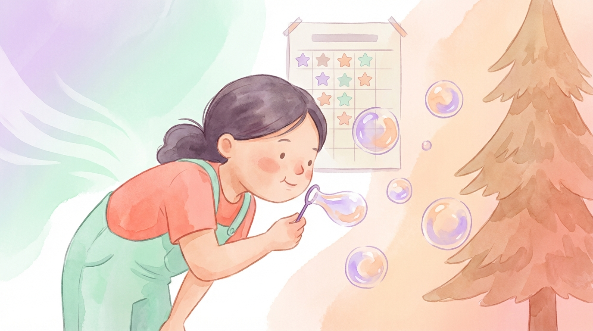
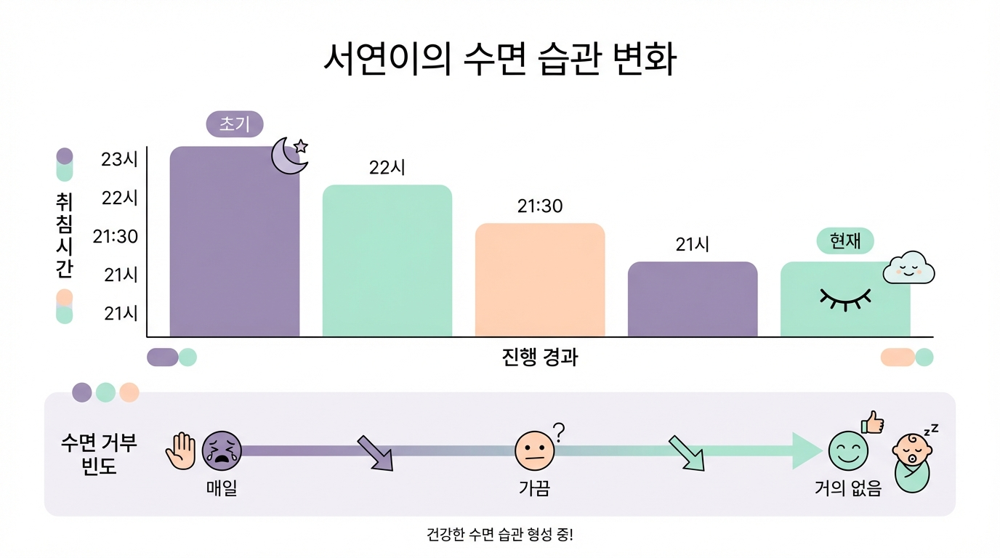

# Chapter 10. 서연이의 이야기 (8세, ADHD)

*에너지 넘치지만 잠자리에서 차분해진 서연이*

## 서연이를 소개합니다

서연이는 경기도에 사는 여덟 살 여자아이입니다. 여섯 살 때 **ADHD(주의력결핍 과잉행동장애)**로 진단받았습니다. 좋아하는 것은 춤추기와 그림 그리기. 에너지가 넘치고 호기심이 많은 아이입니다.

서연이의 가장 큰 문제는 **수면 거부**였습니다. "안 자!" "아직 안 졸려!" 하면서 잠자리에 눕는 것 자체를 강하게 거부했습니다. 억지로 이불에 눕혀도 10분 안에 일어나 돌아다녔고, 결국 밤 11시~12시가 되어서야 기진맥진해서 쓰러지듯 잠들었습니다. 아침에 일어나는 것은 매일 전쟁이었습니다.

---

## 시작 전: 매일 밤 반복되는 실랑이

서연이 아빠는 이렇게 말합니다. "매일 저녁 8시부터 잠자리 전쟁이 시작돼요. '잠자러 가자' 하면 울고 소리 지르고, 방에서 나오려 하고. 결국 저도 화가 나서 소리를 지르게 되고, 그러면 서연이는 더 흥분하고. 악순환이었어요."

학교에서도 문제가 있었습니다. 수면 부족으로 1교시부터 졸았고, 수업 중 집중하지 못해 선생님에게 자주 지적을 받았습니다. ADHD 약물을 복용 중이었지만, 수면 부족이 약물 효과를 떨어뜨리고 있었습니다.

가장 힘든 것은 부모의 **죄책감**이었습니다. "화를 내서는 안 된다는 걸 알면서도, 매일 밤 같은 상황이 반복되니 감정 조절이 안 됐어요."

---

## 프로그램 적용: 서연이에게 맞춘 커스터마이징

서연이의 ADHD 특성을 고려해 프로그램을 조정했습니다.

**에너지 발산 먼저**
잠자리 루틴 시작 1시간 전에 활발한 신체 활동(댄스 타임, 짧은 산책)을 하고, 이후 점차 활동 수준을 낮추는 **"점점 조용하게(wind-down)" 전략**을 적용했습니다.

**수면 거부 대신 "향기 파티"**
"잠자러 가자"는 서연이에게 금지어였습니다. 대신 **"향기 파티 시간이야!"**라고 바꿨습니다. 잠자는 것이 아니라 재미있는 활동을 하러 가는 것으로 프레이밍을 바꾸자, 서연이의 저항이 크게 줄었습니다.

**짧고 다양하게**
ADHD 아동은 한 가지에 오래 집중하기 어렵습니다. 호흡 훈련을 **3분 이내의 짧은 게임 3가지**로 나눠 진행했습니다.
- 1분: 비누방울 불기 대회 (누가 더 큰 방울?)
- 1분: 깃털 축구 (테이블 위 깃털을 상대편으로 불기)
- 1분: 슈퍼 호흡 (코로 크~게 들이마시고 오래 내쉬기 — 몇 초 버틸 수 있을까?)

**향기 선택**
서연이는 시더우드를 맡고 "따뜻해!" 하면서 좋아했습니다. **시더우드가 서연이의 향기**가 되었습니다.

**보상 시스템**
서연이는 목표가 명확하면 동기가 높아지는 아이였습니다. 향기 시간에 참여하면 **별 스티커**, 5개 모으면 좋아하는 간식이라는 보상 시스템을 도입했습니다.

---

## 4주간의 변화

*서연이의 주차별 변화 — 수면 거부 강도와 입면 시간*

| 항목 | 시작 전 | 1주차 | 2주차 | 3주차 | 4주차 |
|------|---------|-------|-------|-------|-------|
| 수면 거부 | 매일 심함 | 4일/7일 | 2일/7일 | 가끔 | 거의 없음 |
| 입면 시간 | 90~180분 | 60분 | 45분 | 30분 | 20분 |
| 실제 취침 | 밤 11~12시 | 밤 10시 | 밤 9시 30분 | 밤 9시 | 밤 9시 |

**1주차 — "향기 파티"에 속아주다**
"향기 파티"라는 이름에 서연이는 호기심을 보였습니다. 첫날은 5분 만에 "심심해!" 하고 나갔지만, 둘째 날 비누방울 대회를 하자 눈이 반짝였습니다. 주 후반에는 "엄마, 오늘 향기 파티 하는 거야?" 하고 먼저 물어봤습니다.

**2주차 — 예상 밖의 차분함**
호흡 게임 후 서연이의 에너지 레벨이 눈에 띄게 낮아졌습니다. "신기하게 게임 끝나면 좀 늘어지더라고요. 예전에는 잠자리에서도 뛰어다녔는데." 수면 거부가 주 2회로 줄었습니다.

**3주차 — 스스로 이불로**
시더우드 향이 퍼지면 서연이가 "음~ 좋다" 하면서 이불 쪽으로 갔습니다. 호흡 게임이 끝나면 자연스럽게 눕는 모습을 보여, 엄마 아빠가 서로 눈을 마주치며 놀랐습니다.

**4주차 — 전쟁이 끝나다**
밤 9시 루틴이 자리잡았습니다. "향기 파티" 시간을 알리면 서연이가 스스로 잠옷을 입고 왔습니다. 20분 안에 잠들었고, 아침에 깨우는 전쟁도 사라졌습니다. "매일 밤 소리 지르던 게 꿈같아요."

---

## 3개월 후 현재

- **수면 거부**: 완전히 사라짐
- **평균 입면 시간**: 15~20분
- **취침 시간**: 밤 9시 (안정적으로 유지)
- **학교 생활**: 1교시 졸림 사라짐, 수업 집중도 향상
- **약물 효과**: 담당 의사가 "수면이 안정되니 약물 효과가 더 잘 나타난다"고 피드백
- **부모-아이 관계**: 저녁 시간의 갈등이 사라지면서 관계가 크게 개선됨

---

> **💡 서연이 아빠의 한마디**
>
> "가장 큰 변화는 서연이가 아니라 저였을 수도 있어요. 매일 밤 화를 내던 제가, 이제는 서연이와 함께 비누방울을 불며 웃고 있거든요. '향기 파티'는 단순히 수면 훈련이 아니라, 우리 가족의 저녁 시간을 바꿔놓았어요."
> — 서연 아빠, 경기도

> **📌 담당 전문가 코멘트**
>
> "ADHD 아동에게 '잠자라'고 강요하는 것은 역효과를 냅니다. 서연이의 경우 수면 시간을 '재미있는 활동'으로 리프레이밍한 것이 핵심이었어요. 짧고 다양한 호흡 게임이 서연이의 집중 특성에 딱 맞았고, 보상 시스템이 동기를 유지시켰습니다. 에너지 발산 후 점진적 이완의 순서도 중요한 전략이었습니다."
> — 박수현 임상심리사

---

**✅ 서연이 사례에서 배우는 것**
- ADHD 아동에게는 "잠자기"가 아닌 **"재미있는 활동"으로 프레이밍**을 바꾸세요
- 호흡 훈련은 **짧고(1~3분) 다양하게** 구성하면 집중을 유지합니다
- 잠자리 전 **에너지 발산 시간**을 먼저 제공하세요
- **보상 시스템**이 ADHD 아동의 참여 동기를 높입니다

---
