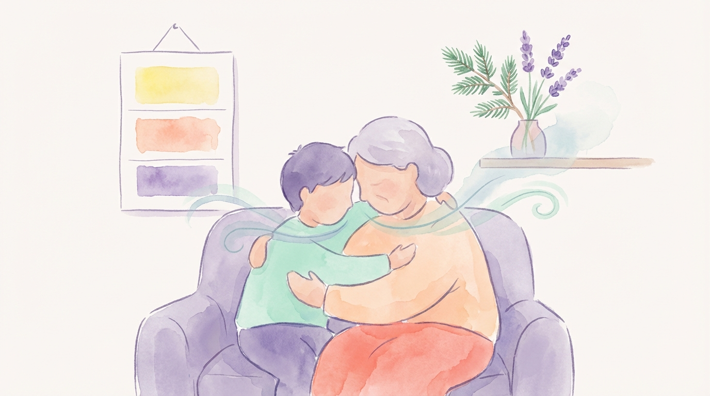
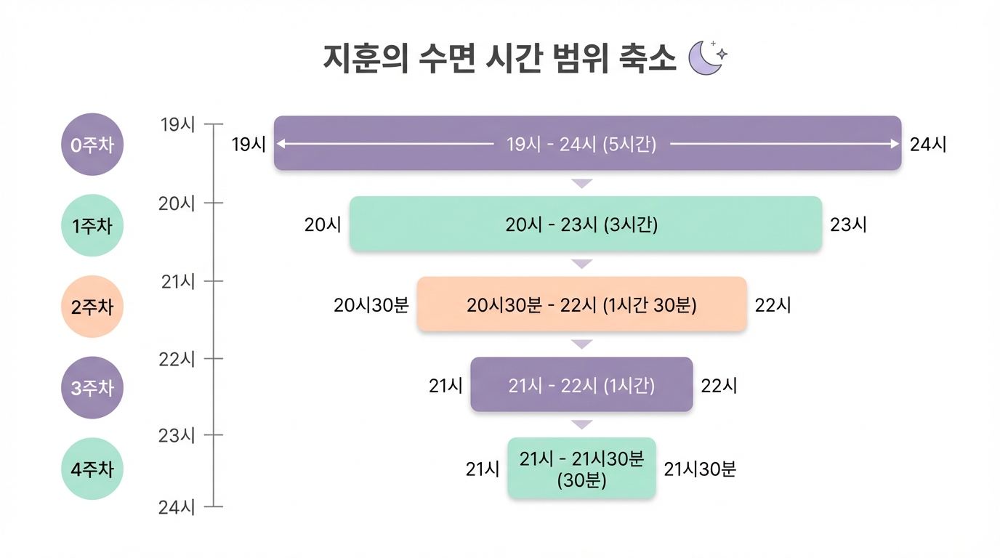

# Chapter 11. 지훈이의 이야기 (10세, 지적장애)

*안정된 수면 루틴 속에서 편안하게 잠든 지훈이*

## 지훈이를 소개합니다

지훈이는 부산에 사는 열 살 남자아이입니다. **지적장애 2급**으로, 발달 연령은 약 5~6세 수준입니다. 좋아하는 것은 음악 듣기와 물놀이. 순한 성격에 웃음이 많은 아이입니다.

지훈이의 수면 문제는 **불규칙한 수면-각성 주기**였습니다. 잠드는 시간이 매일 달랐습니다. 어떤 날은 저녁 7시에 잠들어 새벽 3시에 깨고, 어떤 날은 밤 12시가 넘어야 잠들었습니다. 낮잠도 불규칙해서, 오후 4시에 2시간씩 자는 날이 있었는데, 그런 날 밤에는 잠드는 것이 더 어려웠습니다. 생체 시계가 제대로 작동하지 않는 상태였습니다.

---

## 시작 전: 예측할 수 없는 밤

지훈이 할머니는 손자의 주 양육자입니다. 지훈이 부모님은 맞벌이로, 저녁 시간에는 할머니가 주로 돌봅니다.

"잠드는 시간을 알 수가 없으니, 저녁 계획을 세울 수가 없어요. 7시에 잘 수도 있고, 12시까지 안 잘 수도 있고. 제가 나이가 있으니 체력적으로 너무 힘들었어요."

불규칙한 수면은 지훈이의 특수학교 생활에도 영향을 미쳤습니다. 전날 새벽에 깨서 활동한 날에는 학교에서 오전 내내 졸았고, 반대로 너무 일찍 잠든 날에는 새벽에 깨어 소리를 질러 온 가족이 깼습니다.

---

## 프로그램 적용: 지훈이에게 맞춘 커스터마이징

지훈이의 핵심 목표는 단순했습니다. **매일 같은 시간에 잠들고, 같은 시간에 깨기.** 후각·호흡 훈련을 통해 생체 시계를 재설정하는 것이었습니다.

**시간 고정 전략**
먼저, 목표 취침 시간을 **밤 9시**로 정했습니다. 그리고 목표 기상 시간을 **아침 7시**로 정했습니다. 낮잠은 오후 1시~2시, 30분 이내로 제한했습니다.

**시각적 시간표**
지훈이가 시계를 읽기 어려웠기 때문에, **색깔로 구분한 시간표**를 만들었습니다.
- 노란색 시간 = 낮 활동 시간
- 주황색 시간 = 저녁 (활동 줄이기)
- 보라색 시간 = 향기 시간 & 잠자기

벽에 붙여놓고, 할머니가 "지금은 보라색 시간이야" 하면 지훈이가 향기 시간을 인식하도록 했습니다.

**향기 선택**
지훈이는 냄새에 비교적 둔감한 편이었습니다. 일반 농도(2방울)로는 반응이 없어 **3~4방울**로 약간 높였습니다. **라벤더와 시더우드(삼나무 향) 블렌드**를 사용했는데, 따뜻하고 나무 향이 나는 이 조합에 지훈이가 코를 킁킁거리며 반응했습니다.

**호흡 훈련 단순화**
지훈이의 발달 수준에 맞춰 호흡 훈련을 최대한 단순하게 했습니다.
- **"킁(코로 들이마시기) — 후(입으로 내쉬기)"** 두 동작만 반복
- 할머니가 먼저 "킁~" 하면 지훈이가 따라 "킁~", 할머니가 "후~" 하면 지훈이가 "후~"
- 음악을 좋아하는 특성을 활용해, **느린 자장가에 맞춰 호흡**하기

**신체 접촉 활용**
지훈이는 촉각에 과민하지 않고, 오히려 꼭 안기는 것을 좋아했습니다. 호흡 훈련 시 할머니가 **지훈이를 안고 함께 호흡**했습니다. 할머니의 배가 오르내리는 것을 느끼며 자연스럽게 호흡 리듬을 맞추었습니다.

---

## 4주간의 변화

*지훈이의 주차별 변화 — 취침 시간의 안정화 과정*

| 항목 | 시작 전 | 1주차 | 2주차 | 3주차 | 4주차 |
|------|---------|-------|-------|-------|-------|
| 취침 시간 범위 | 19시~24시 | 20시~23시 | 20시30분~22시 | 21시~22시 | 21시~21시30분 |
| 기상 시간 | 불규칙 | 불규칙 | 6시30분~7시30분 | 7시 전후 | 7시 전후 |
| 낮잠 | 불규칙·길게 | 제한 시작 | 30분 이내 | 안정적 | 안정적 |

**1주차 — 색깔 시간표에 반응하다**
"보라색 시간이야" 하면 지훈이가 방으로 가기 시작했습니다. 향기에 대한 반응은 느렸지만, 셋째 날부터 디퓨저 근처에서 코를 킁킁거렸습니다. 취침 시간 범위가 약간 좁아졌습니다.

**2주차 — 할머니와 함께 호흡하다**
할머니 품에 안겨 "킁~ 후~"를 반복하는 것이 지훈이의 가장 좋아하는 시간이 되었습니다. 자장가에 맞춰 호흡하면 3~4분 만에 눈이 감기기 시작했습니다. 기상 시간이 안정되기 시작했습니다.

**3주차 — 생체 시계가 작동하기 시작하다**
밤 9시가 되면 지훈이가 하품을 하기 시작했습니다. 이전에는 없던 현상입니다. "보라색 시간"이 다가오면 스스로 활동량을 줄이는 모습도 보였습니다. 뇌가 "이 시간 = 잠잘 시간"이라는 패턴을 학습하기 시작한 것입니다.

**4주차 — 예측 가능한 밤**
취침 시간이 밤 9시~9시 30분으로 안정되었습니다. 기상 시간도 아침 7시 전후로 일정해졌습니다. 할머니의 말: "이제 저녁 시간에 뭘 할 수 있어요. 지훈이 잠자는 시간을 알 수 있으니까."

---

## 3개월 후 현재

- **취침 시간**: 밤 9시~9시 30분 (일관되게 유지)
- **기상 시간**: 아침 6시 45분~7시 15분
- **낮잠**: 오후 1시, 20~30분
- **학교 생활**: 오전 졸림 사라짐, 수업 참여도 향상
- **할머니 건강**: 예측 가능한 루틴 덕분에 할머니도 충분히 휴식 가능

---

> **💡 지훈이 할머니의 한마디**
>
> "제일 좋은 건 이제 밤이 예측 가능하다는 거예요. 9시면 잠들고, 7시면 일어나고. 이게 당연한 건데, 우리한테는 기적 같은 거예요. 저도 이제 저녁에 드라마도 보고, 푹 잘 수 있어요. 지훈이 안고 같이 숨 쉬는 시간이 하루 중 가장 평화로운 시간이 됐어요."
> — 지훈 할머니, 부산

> **📌 담당 전문가 코멘트**
>
> "지적장애 아동의 불규칙한 수면-각성 주기를 잡는 것은 쉽지 않은 과제입니다. 지훈이의 경우, 후각·호흡 훈련이 '시간 신호(time cue)' 역할을 해주었어요. 매일 같은 시간에 같은 향기를 맡으며 같은 호흡을 하는 것이, 뇌에 '지금이 잠잘 시간'이라는 강력한 신호를 보낸 것입니다. 색깔 시간표와 결합한 것도 좋은 전략이었어요."
> — 이준호 소아재활의학과 전문의

---

**✅ 지훈이 사례에서 배우는 것**
- 불규칙한 수면-각성 주기에는 **시간 고정 전략**이 핵심입니다
- 시계를 읽기 어려운 아이에게는 **색깔 시간표** 같은 시각 도구를 활용하세요
- 냄새에 둔감한 아이에게는 **농도를 약간 높이거나** 향이 강한 블렌드를 사용합니다
- 호흡 훈련은 아이의 발달 수준에 맞게 **최대한 단순화**하세요
- **신체 접촉과 결합**하면 (안고 함께 호흡) 더 깊은 이완 효과가 있습니다

---
