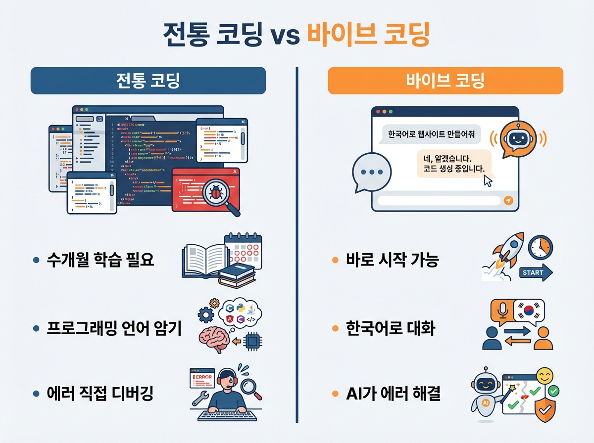
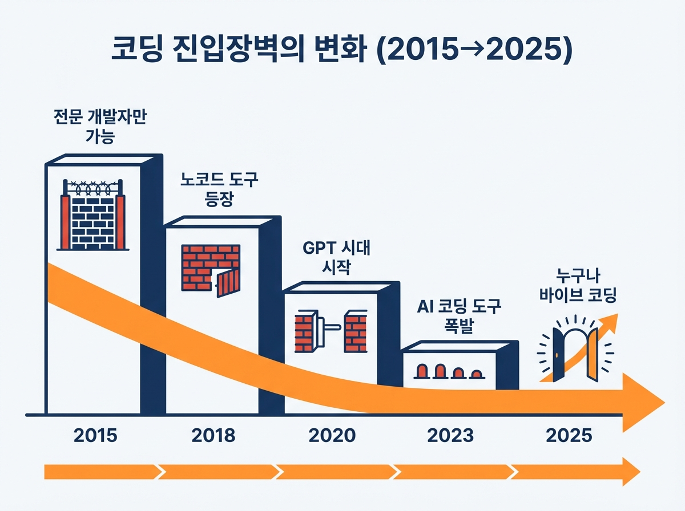

# Chapter 1. AI 시대, 코딩의 새로운 패러다임

---

## 학습 목표

이 챕터를 읽고 나면 이런 것들을 알게 됩니다.

1. **전통적인 코딩**과 **바이브 코딩**이 어떻게 다른지 이해합니다.
2. AI가 코딩을 어떻게 바꾸고 있는지 큰 그림을 그릴 수 있습니다.
3. 지금이 시작하기에 가장 좋은 시기인 이유를 설명할 수 있습니다.

---

## 1. 전통적인 코딩 vs 바이브 코딩

### 코딩, 꼭 어렵게 배워야 할까?

"코딩을 배우려면 영어부터 해야 하나요?"

많은 분들이 이렇게 물어봅니다.
솔직히 말하면, 예전에는 맞는 말이었습니다.

전통적인 코딩은 이런 과정이었습니다.

> 프로그래밍 언어를 배운다 →
> 문법을 외운다 →
> 에러를 찾는다 →
> 또 에러를 찾는다 →
> 몇 달이 지나서야 뭔가 만들어진다

대학교에서 4년을 배워도 막상 실무에서는 또 새로 배워야 했습니다.

### 바이브 코딩은 다릅니다

바이브 코딩은 완전히 다른 방식입니다.

**내가 원하는 것을 말로 설명하면, AI가 코드를 만들어 줍니다.**

예를 들어 볼까요?

| 전통적인 코딩 | 바이브 코딩 |
|---|---|
| HTML, CSS, JavaScript를 배운다 | "예약 페이지 만들어줘"라고 말한다 |
| 코드를 한 줄 한 줄 직접 작성한다 | AI가 코드를 만들어 준다 |
| 에러가 나면 직접 찾아 고친다 | AI에게 "에러 고쳐줘"라고 말한다 |
| 완성까지 몇 주~몇 달 | 완성까지 몇 시간~며칠 |

바이브 코딩에서 가장 중요한 능력은 이것입니다.

**"내가 뭘 만들고 싶은지 정확히 설명하는 능력"**

코드를 몰라도 됩니다.
영어를 잘 몰라도 됩니다.
한국어로 설명하면 됩니다.

---

## 2. AI가 코딩을 어떻게 바꾸고 있는가

### 10년 전과 지금의 차이

2015년에 간단한 웹사이트를 만들려면 이런 것들이 필요했습니다.

- HTML/CSS 기초 학습 (2~4주)
- JavaScript 기본 문법 (4~8주)
- 서버 구축 방법 (4~8주)
- 데이터베이스 설계 (2~4주)

**최소 3개월은 공부해야** 겨우 시작할 수 있었습니다.

### 2025년, 지금은 어떨까요?

지금은 AI 도구 하나만 있으면 됩니다.

- **Claude** — 코드를 대신 작성해 줍니다
- **Cursor** — AI가 내장된 코드 편집기입니다
- **Bolt/Lovable** — 말로 설명하면 웹사이트가 만들어집니다
- **Vercel/Netlify** — 클릭 몇 번으로 전 세계에 공개됩니다

이 도구들은 대부분 **무료**이거나 월 2~3만원이면 충분합니다.

### 진입 장벽이 사라졌습니다

예전에는 이런 사람만 개발자가 될 수 있었습니다.

> "컴퓨터공학과 졸업"
> "코딩 학원 6개월 수료"
> "개발 경력 3년 이상"

지금은 다릅니다.

> **"내가 이런 서비스를 만들고 싶어"**

이 한 마디면 시작할 수 있습니다.

---

## 3. 왜 지금이 시작하기 좋은 시기인가

### 세 가지 이유

**첫째, AI 도구가 충분히 성숙했습니다.**

2022년 ChatGPT가 처음 나왔을 때는 아직 부족했습니다.
코드를 만들어 달라고 하면 절반은 틀렸습니다.

2025년 지금은 다릅니다.
AI가 만드는 코드의 품질이 크게 좋아졌습니다.
간단한 서비스라면 거의 완벽하게 만들어 냅니다.

**둘째, 성공 사례가 쌓이고 있습니다.**

바이브 코딩으로 실제 돈을 버는 사람들이 나타났습니다.
이 책에서도 여러 사례를 소개하겠습니다.
"정말 되는 거구나"를 직접 확인할 수 있습니다.

**셋째, 경쟁자가 아직 적습니다.**

대부분의 사람들은 아직 이렇게 생각합니다.

> "코딩? 나는 그런 거 못 해."
> "AI? 젊은 사람들이나 쓰는 거 아냐?"

그래서 지금이 기회입니다.
남들이 망설이는 사이에 시작하면 됩니다.

---

## 실생활 비유: 요리로 이해하는 바이브 코딩

코딩이 아직 어렵게 느껴지시나요?
요리에 비유해 보겠습니다.

### 전통적인 코딩 = 재료부터 직접 만들어 요리하기

밀가루를 직접 빻고, 면을 직접 뽑고, 소스를 직접 만듭니다.
맛있는 파스타 한 접시를 만들려면 몇 시간이 걸립니다.
전문 요리사만 할 수 있는 일이었습니다.

### 바이브 코딩 = 밀키트로 요리하기

밀키트를 주문하면 재료가 손질되어 옵니다.
레시피대로 따라하면 30분이면 완성됩니다.
요리 초보도 맛있는 한 끼를 만들 수 있습니다.

### AI 도구 = 똑똑한 요리 보조 셰프

옆에서 전문 셰프가 도와준다고 상상해 보세요.

> "지금 불 세기를 좀 줄이세요."
> "소금은 이 정도만 넣으면 됩니다."
> "이 순서로 하면 더 맛있어요."

AI 도구가 바로 이 역할을 합니다.
내가 방향을 정하면 AI가 실행을 도와줍니다.

**중요한 건 요리사(나)의 아이디어입니다.**
무엇을 만들지 결정하는 건 바로 나입니다.

---

## 실제 사례: Pieter Levels 이야기

### 부모님 집에서 시작한 1인 사업가

Pieter Levels(피터 레벨스)라는 사람이 있습니다.
네덜란드 출신의 1인 개발자입니다.

2014년, 그는 이런 상황이었습니다.

- 부모님 집에 얹혀살고 있었습니다
- 우울증을 겪고 있었습니다
- 특별한 기술이나 학위가 없었습니다
- 돈도 거의 없었습니다

그가 한 일은 단순했습니다.

**"사람들에게 필요한 간단한 웹사이트를 만들자."**

### 12개 프로젝트 도전

그는 "12개월 안에 12개 프로젝트 만들기"에 도전했습니다.

대단한 기술이 필요한 게 아니었습니다.
간단한 도구를 사용해서 빠르게 만들었습니다.
실패한 것도 많았지만, 몇 개가 성공했습니다.

그중 하나가 **NomadList**(노매드리스트)입니다.
디지털 노마드를 위한 도시 정보 사이트입니다.

### 그리고 지금

2025년 현재, Pieter Levels의 연 수입은 약 **38억 원**입니다.
직원 없이 혼자서 운영합니다.

여기서 중요한 포인트가 있습니다.

**2014년에는 간단한 사이트를 만드는 것도 꽤 어려웠습니다.**
그때도 기본적인 코딩 지식은 필요했습니다.

**2025년 지금은 AI가 있습니다.**
그때보다 훨씬 더 쉽게 시작할 수 있습니다.

Pieter Levels도 최근 인터뷰에서 이렇게 말했습니다.

> "지금 시작하는 사람들이 부럽다.
> AI 덕분에 예전보다 10배는 빠르게 만들 수 있다."

---

## 핵심 포인트

이 챕터에서 꼭 기억할 것들입니다.

1. **바이브 코딩**은 코드를 직접 작성하는 것이 아니라, AI에게 원하는 것을 설명하는 방식입니다.
2. AI 도구가 충분히 발전해서, 코딩을 몰라도 서비스를 만들 수 있는 시대가 되었습니다.
3. 가장 중요한 능력은 프로그래밍이 아니라 **"무엇을 만들고 싶은지 아는 것"**입니다.
4. 지금이 시작하기 가장 좋은 시기입니다. AI는 충분히 좋아졌고, 경쟁자는 아직 적습니다.
5. Pieter Levels처럼 특별한 배경 없이도 시작할 수 있습니다. 지금은 그때보다 훨씬 쉽습니다.

---

## 다음 챕터 미리보기

**Chapter 2**에서는 바이브 코딩에 사용하는 **AI 도구들**을 하나씩 살펴봅니다.

- Claude, Cursor, Bolt 같은 도구가 뭔지
- 어떤 도구를 먼저 써보면 좋은지
- 무료로 시작하는 방법

도구를 알아야 요리를 시작할 수 있겠죠?
다음 챕터에서 여러분의 주방을 세팅해 보겠습니다.
