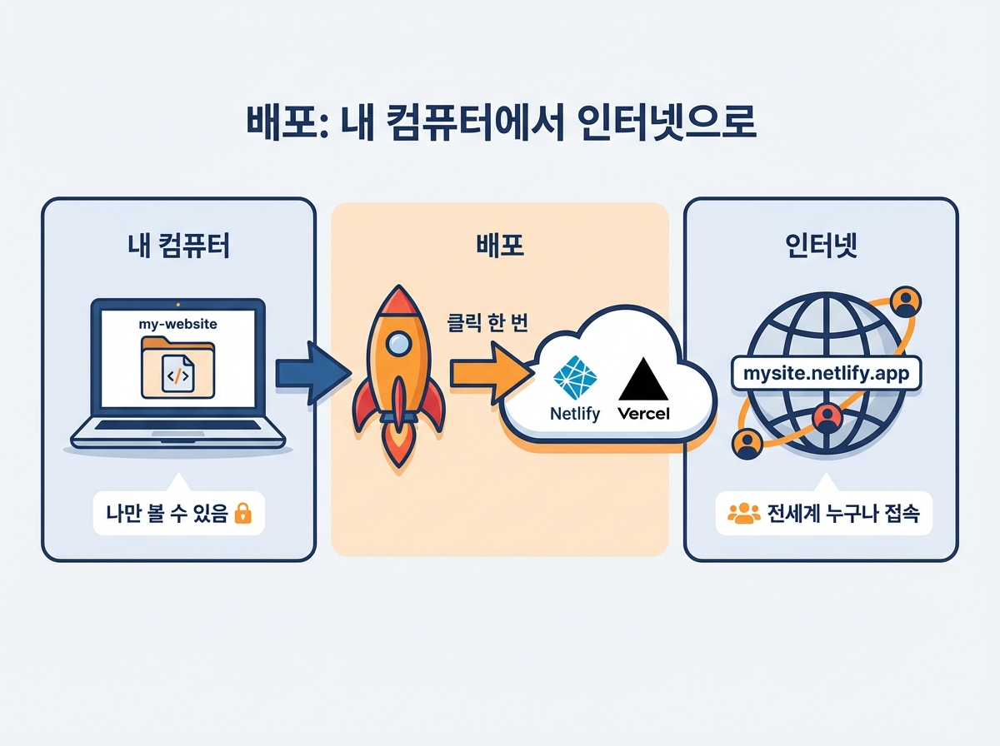

# Chapter 06. 내 웹페이지를 세상에 공개하기

---

## 학습 목표

이 챕터를 읽고 나면 이런 것들을 알게 됩니다.

1. Netlify를 사용해 웹페이지를 인터넷에 올릴 수 있습니다.
2. 도메인(인터넷 주소)의 개념을 이해합니다.
3. 배포한 웹페이지 링크를 다른 사람과 공유할 수 있습니다.

---

## 1. 배포란 무엇인가요?

### 내 컴퓨터 안에 갇힌 웹페이지

지금까지 열심히 웹페이지를 만드셨죠?
그런데 이 페이지는 내 컴퓨터에만 있어요.
옆 사람도 볼 수 없는 상태입니다.

**배포**란 내 웹페이지를 인터넷에 올리는 거예요.
영어로는 Deploy(디플로이)라고 해요.
올리고 나면 전 세계 누구나 볼 수 있어요.

### 왜 배포를 해야 할까요?

만든 것을 보여줘야 의미가 생겨요.
혼자만 보면 발전이 느립니다.
다른 사람의 반응이 성장의 시작이에요.

"이 부분이 좋아요!"라는 말을 들으면요.
자신감이 생기고 의욕이 올라갑니다.
빨리 공개하는 것이 중요한 이유예요.

---

## 2. Netlify로 배포하기

### Netlify가 뭔가요?

Netlify(넷틀리파이)는 무료 배포 서비스예요.
웹페이지를 인터넷에 올려주는 곳이에요.
복잡한 설정 없이 바로 사용할 수 있어요.

**드래그 앤 드롭**으로 배포가 됩니다.
마우스로 파일을 끌어다 놓는 거예요.
정말 클릭 몇 번이면 끝나요.

### 1단계: Netlify 가입하기

인터넷 브라우저를 열어주세요.
주소창에 **netlify.com**을 입력합니다.
화면에 "Sign up" 버튼이 보일 거예요.

이메일 주소로 가입할 수 있어요.
구글 계정으로도 가입이 가능합니다.
가입은 1분이면 충분해요.

### 2단계: 대시보드 확인하기

가입하면 대시보드 화면이 나타나요.
**대시보드**란 관리 화면을 말해요.
내 사이트를 관리하는 곳이에요.

화면에 "Sites" 메뉴가 보일 겁니다.
여기서 새 사이트를 올릴 수 있어요.
아래쪽에 점선 박스가 보여요.

### 3단계: 폴더 드래그하기

내 컴퓨터에서 웹페이지 폴더를 찾으세요.
보통 **dist** 폴더에 파일이 있어요.
dist는 배포용 파일이 담긴 폴더예요.

dist 폴더가 없다면 걱정 마세요.
HTML 파일이 있는 폴더면 됩니다.
그 폴더를 점선 박스에 끌어다 놓으세요.

### 4단계: 배포 완료!

폴더를 놓으면 업로드가 시작돼요.
보통 30초에서 1분이면 끝나요.
초록색 "Published" 표시가 나타납니다.

**축하드려요! 배포가 완료되었어요.**
이제 전 세계 누구나 볼 수 있습니다.
정말 간단하지 않나요?

---

## 3. 도메인 이야기

### 도메인이란?

도메인은 인터넷 주소를 말해요.
**naver.com**이 네이버의 도메인이에요.
**google.com**이 구글의 도메인이고요.

집에도 주소가 있잖아요.
웹페이지에도 주소가 있어야 해요.
그 주소가 바로 도메인입니다.

### 무료 주소로 시작하세요

Netlify에서 배포하면 주소가 자동으로 생겨요.
예를 들어 **my-site.netlify.app** 같은 거예요.
이것이 내 웹페이지의 무료 주소입니다.

나중에 원하면 직접 도메인을 살 수 있어요.
**my-shop.com** 같은 주소를 가질 수 있죠.
하지만 처음엔 무료 주소로 충분해요.

### 링크 공유하기

배포가 끝나면 주소를 복사하세요.
카카오톡에 붙여넣어 보내보세요.
"내가 만든 웹페이지야!"라고요.

상대방이 링크를 누르면 바로 보여요.
스마트폰에서도 잘 열립니다.
그 순간이 정말 뿌듯할 거예요.

---

## 실생활 비유: 가게 문 열기

식당을 준비하는 상황을 떠올려 보세요.
인테리어를 완벽하게 하고 싶으시겠죠.
메뉴판도 예쁘게 만들고 싶을 거예요.

그런데 문을 안 열면 어떻게 될까요?
손님이 올 수가 없어요.
어떤 음식이 인기인지 알 수도 없어요.

**문을 여는 것이 가장 중요합니다.**
인테리어가 완벽하지 않아도 괜찮아요.
손님이 와야 뭘 고칠지 알 수 있거든요.

웹페이지도 똑같아요.
완벽하지 않아도 일단 공개하세요.
사람들이 봐야 뭘 개선할지 알게 됩니다.

---

## 실제 사례: Pieter Levels의 첫 배포 이야기

Pieter Levels(피터 레벨스)를 기억하시죠?
**NomadList**라는 서비스를 만든 사람이에요.
디지털 노마드를 위한 도시 정보 사이트예요.

디지털 노마드란 어떤 사람일까요?
노트북 하나로 여행하며 일하는 사람이에요.
NomadList는 살기 좋은 도시를 알려줘요.

그런데 처음 배포했을 때 어땠을까요?
**완벽하지 않았어요.**
디자인도 투박하고 기능도 부족했어요.

단순한 스프레드시트 수준이었어요.
도시 이름과 몇 가지 정보만 있었죠.
지금 보면 초라할 정도였어요.

하지만 그는 일단 인터넷에 올렸어요.
사람들에게 링크를 공유했어요.
"이런 걸 만들었는데 봐줘"라고요.

그랬더니 사람들이 반응하기 시작했어요.
"이 기능이 있으면 좋겠어요."
"이 도시 정보도 추가해주세요."

피드백을 받으며 서비스가 점점 좋아졌어요.
지금은 수십억 원 매출을 올리고 있어요.
그 시작은 불완전한 첫 배포였습니다.

피터 레벨스의 유명한 말이 있어요.

> **"만든 것을 세상에 보여줘야 피드백을 받을 수 있다."**

완벽할 때까지 기다리면요.
영원히 시작 못 해요.
일단 올리는 것이 답이에요.

---

## 핵심 포인트

이 챕터에서 꼭 기억할 것들입니다.

1. **배포는 클릭 몇 번이면 끝납니다.** Netlify에 폴더를 끌어다 놓으면 자동으로 올라가요.
2. **무료 도메인으로 시작할 수 있어요.** Netlify가 무료 주소를 제공하니 비용 걱정 없습니다.
3. **전 세계 누구나 볼 수 있어요.** 링크만 공유하면 어디서든 접속할 수 있습니다.
4. **완성 후 공유가 자신감을 줍니다.** 내가 만든 것을 보여주는 경험은 큰 동기부여가 돼요.

---

## 다음 챕터 미리보기

축하드려요! Part 2가 거의 끝났어요.
다음은 **Part 2 종합 실습**입니다.
지금까지 배운 것을 모두 활용해 봅니다.

직접 웹페이지를 처음부터 만들고요.
Netlify에 배포까지 해보는 시간이에요.
한 단계씩 차근차근 함께 해봐요!
