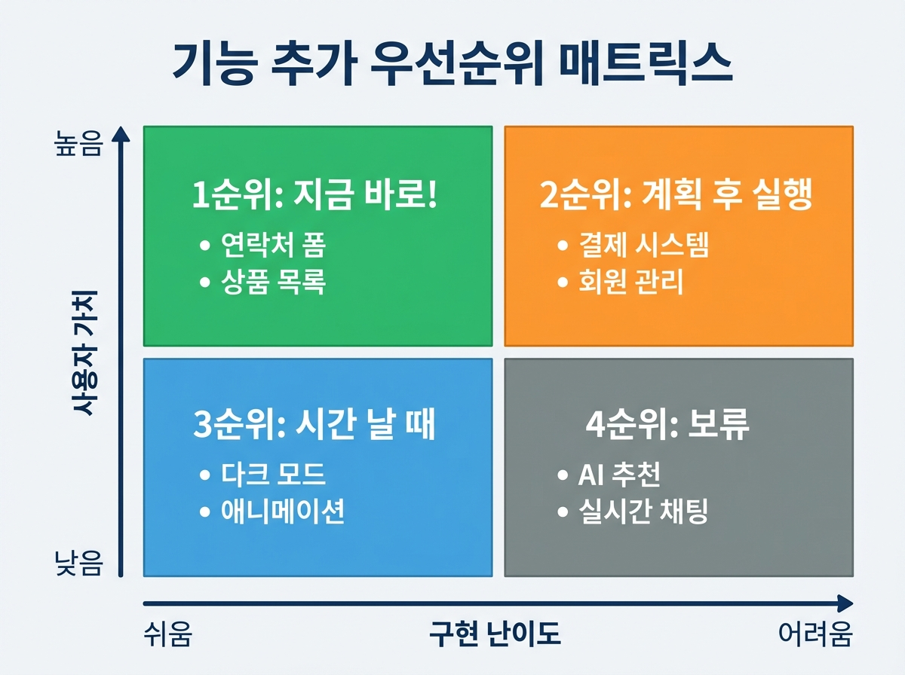

# Chapter 08. 기능 하나씩 추가하기

---

## 학습 목표

이 챕터를 읽고 나면 이런 것들을 알게 됩니다.

1. AI에게 구체적으로 기능을 요청하는 프롬프트를 작성할 수 있습니다.
2. 기능을 추가하는 올바른 순서를 이해합니다.
3. 에러가 발생했을 때 AI를 활용해 해결할 수 있습니다.

---

## 1. 좋은 프롬프트 작성법

### 프롬프트란?

**프롬프트**란 AI에게 하는 요청을 말해요.
쉽게 말해서 AI에게 하는 부탁이에요.
이 부탁을 잘 하는 게 핵심이에요.

같은 부탁이라도 방법에 따라 달라요.
"밥 해줘"보다 "김치볶음밥 해줘"가 낫죠.
AI에게도 구체적으로 말해야 해요.

### 나쁜 프롬프트 vs 좋은 프롬프트

나쁜 프롬프트의 예를 볼까요?

> "로그인 기능 만들어줘."

이러면 AI가 어떻게 할지 헷갈려요.
이메일 로그인? 소셜 로그인?
비밀번호 찾기도 필요한지 모르죠.

좋은 프롬프트는 이렇게 써요.

> "회원가입 기능을 추가해줘.
> 이메일과 비밀번호로 가입할 수 있게 해줘.
> 가입 버튼을 누르면 환영 메시지가 나오게 해줘."

차이가 느껴지시나요?
**구체적일수록 좋은 결과가 나와요.**
AI도 정확히 뭘 해야 할지 알게 돼요.

### 좋은 프롬프트의 3가지 규칙

**규칙 1: 무엇을 원하는지 명확하게**
"예쁘게 만들어줘" (X)
"파란색 버튼을 오른쪽 위에 놓아줘" (O)

**규칙 2: 한 번에 하나씩 요청하기**
"로그인, 게시판, 채팅 다 만들어줘" (X)
"먼저 로그인 기능을 만들어줘" (O)

**규칙 3: 예시를 들어주기**
"좋은 디자인으로 해줘" (X)
"네이버처럼 검색창이 가운데에 있게 해줘" (O)

---

## 2. 기능 추가 순서

### 중요한 것부터 만드세요

기능을 추가할 때 순서가 중요해요.
**가장 핵심적인 기능부터** 만드세요.
부가 기능은 나중에 해도 돼요.

맛집 사이트를 예로 들면요.
이런 순서가 좋아요.

1. 맛집 목록 보여주기 (핵심!)
2. 검색 기능 추가하기
3. 별점 남기기 기능
4. 사진 업로드 (나중에)
5. 댓글 기능 (나중에)

### 한 번에 하나씩

한 기능이 완성되면 다음으로 넘어가세요.
**작동하는 것을 확인한 후** 다음 기능이에요.
이것이 가장 안전한 방법이에요.

두 가지를 동시에 만들면요.
문제가 생겼을 때 원인을 모르게 돼요.
하나씩 하면 문제 찾기가 쉬워요.

### 실전 프롬프트 예시

맛집 사이트를 만든다고 가정해 볼게요.
AI에게 이렇게 순서대로 요청하세요.

**첫 번째 요청:**
> "맛집 목록 페이지를 만들어줘.
> 가게 이름, 주소, 전화번호를 보여줘.
> 목록은 카드 형태로 보여줘."

**두 번째 요청 (첫 번째 완성 후):**
> "검색 기능을 추가해줘.
> 가게 이름으로 검색할 수 있게 해줘.
> 검색창은 페이지 위쪽에 놓아줘."

**세 번째 요청 (두 번째 완성 후):**
> "별점 기능을 추가해줘.
> 1점에서 5점까지 별로 표시해줘.
> 별을 클릭하면 점수가 저장되게 해줘."

이렇게 하나씩 요청하는 게 핵심이에요.

---

## 3. 에러 해결하기

### 에러는 당연한 거예요

코딩을 하다 보면 에러가 나요.
이건 초보만 그런 게 아니에요.
**전문 개발자도 매일 에러를 만나요.**

에러가 나면 당황하지 마세요.
빨간 글씨가 떠도 괜찮아요.
AI가 고쳐줄 수 있거든요.

### 에러 메시지를 그대로 보여주세요

에러가 나면 이렇게 하세요.
화면에 뜨는 에러 메시지를 복사하세요.
그리고 AI에게 그대로 보여주세요.

> "이런 에러가 났어. 고쳐줘."
> [에러 메시지 붙여넣기]

이러면 AI가 원인을 찾아줘요.
수정된 코드도 만들어 줘요.
내가 에러 내용을 몰라도 괜찮아요.

### 에러 해결 프롬프트 예시

실제로 이렇게 요청하면 돼요.

> "아래 에러가 나왔어. 원인을 알려주고 고쳐줘.
>
> Error: Cannot read property 'map' of undefined
>
> 맛집 목록을 보여주려고 했는데 안 돼."

AI가 친절하게 설명해 줄 거예요.
"이 에러는 데이터가 없어서 생긴 거예요."
이렇게 원인과 해결책을 알려줘요.

### 잘 안 될 때는 다시 설명하세요

한 번에 안 고쳐질 수도 있어요.
그럴 때는 더 자세히 설명하세요.
**"이전에 알려준 방법이 안 됐어"**라고요.

AI도 대화를 통해 이해가 깊어져요.
몇 번 주고받으면 해결될 거예요.
포기하지 마시고 다시 물어보세요.

---

## 실생활 비유: 집 인테리어

새 집에 이사한 상황을 떠올려 보세요.
이사 첫날 모든 방을 꾸밀 수 있나요?
**불가능하죠.**

현명한 방법은 이렇게 하는 거예요.
먼저 거실부터 꾸며요.
소파를 놓고, TV를 설치해요.
거실이 완성되면 편하게 쉴 수 있죠.

그 다음에 침실을 꾸며요.
침대를 놓고, 커튼을 달아요.
침실이 되면 편히 잘 수 있어요.

그 다음에 주방을 정리해요.
이렇게 **한 공간씩 완성하는 거예요.**
조급해하지 않아도 돼요.

웹 서비스도 똑같습니다.
한 기능씩 완성하세요.
하나가 되면 다음으로 넘어가세요.

---

## 실제 사례: NomadList 기능 추가 히스토리

Pieter Levels의 NomadList를 다시 볼게요.
이 서비스가 어떻게 성장했는지 살펴봐요.
**한 번에 완성된 게 아니에요.**

**처음에는 도시 목록만 있었어요.**
어떤 도시가 있는지 보여주는 것이 전부였어요.
정말 단순한 표 하나였습니다.

**그 다음에 날씨 정보를 추가했어요.**
"이 도시 날씨는 어때?"라는 질문에 답하려고요.
사용자가 원하는 정보였거든요.

**그 다음에 인터넷 속도를 추가했어요.**
디지털 노마드에게 인터넷은 필수잖아요.
이것도 사용자 요청이었어요.

**그 다음에 커뮤니티 기능을 넣었어요.**
사용자들끼리 소통하고 싶어 했거든요.
이렇게 하나씩 기능이 늘어났어요.

핵심이 보이시나요?
**한 번에 하나씩** 추가했어요.
사용자가 원하는 것을 듣고 추가했어요.

지금 NomadList에는 수십 가지 기능이 있어요.
하지만 처음은 도시 목록 하나였습니다.
여러분도 이렇게 시작하시면 돼요.

---

## 핵심 포인트

이 챕터에서 꼭 기억할 것들입니다.

1. **한 번에 하나씩 요청하세요.** 여러 기능을 동시에 요청하면 결과가 엉망이 돼요.
2. **구체적으로 설명할수록 좋은 결과가 나와요.** "예쁘게"보다 "파란색 버튼을 위쪽에"가 좋아요.
3. **에러는 AI에게 그대로 보여주세요.** 에러 메시지를 복사해서 붙여넣기만 하면 돼요.
4. **작동하면 다음 기능으로 넘어가세요.** 하나가 완성된 후에 다음을 만드는 게 안전해요.

---

## 다음 챕터 미리보기

기능을 추가하는 방법을 배웠으니요.
**Chapter 9**에서는 디자인을 다듬는 방법을 배워요.

- 색상과 폰트를 AI에게 요청하는 법
- 깔끔한 레이아웃 만드는 법
- 모바일에서도 잘 보이게 하는 법

기능이 있으면 이제 옷을 입혀야겠죠?
예쁘게 다듬는 방법을 알려드릴게요!
