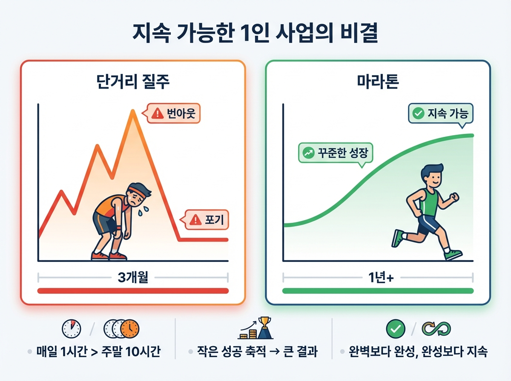

# Chapter 17. 1인 사업가의 장기 비전

---

## 학습 목표

이 챕터를 읽고 나면 이런 것들을 알게 됩니다.

1. **번아웃 없이** 사업을 지속하는 방법을 알게 됩니다.
2. **건강과 균형**이 사업의 기반임을 이해합니다.
3. **AI 기술의 미래**와 앞으로의 기회를 그려볼 수 있습니다.

---

## 1. 지속 가능한 사업

### 번아웃은 누구에게나 옵니다

처음 시작할 때는 열정이 넘칩니다.
밤늦게까지 작업합니다.
주말에도 일합니다.

한 달쯤 지나면 슬슬 지칩니다.
두 달이면 "이걸 왜 시작했지?" 생각이 듭니다.

이것이 **번아웃**입니다.
몸과 마음이 지쳐서 더 이상 못 하겠는 상태입니다.

번아웃은 나약해서 오는 게 아닙니다.
**너무 열심히 해서 오는 겁니다.**

### 페이스 조절이 답입니다

1인 사업은 단거리 달리기가 아닙니다.
**마라톤입니다.**

마라톤 선수가 처음부터 전력 질주하면 어떻게 될까요?
5km도 못 가서 쓰러집니다.

사업도 마찬가지입니다.

하루 2~3시간이면 충분합니다.
매일 꾸준히 하는 게 중요합니다.

> **하루 12시간 x 1개월**보다
> **하루 2시간 x 12개월**이 훨씬 좋습니다.

### 쉬는 것도 일입니다

죄책감 없이 쉬세요.
쉬는 동안 뇌가 정리를 합니다.

산책을 하다가 아이디어가 떠오릅니다.
잠을 자다가 해결책이 생각납니다.

**쉬는 시간은 낭비가 아닙니다.**
오히려 생산성을 높이는 시간입니다.

일주일에 최소 하루는 완전히 쉬세요.
그날은 컴퓨터를 열지 마세요.
서비스 알림도 꺼 두세요.

---

## 2. 건강과 균형

### 몸이 자본입니다

1인 사업의 가장 큰 리스크가 뭔지 아시나요?
경쟁자가 아닙니다.
기술 변화도 아닙니다.

**내 건강입니다.**

직원이 없는 1인 사업은 내가 쓰러지면 끝입니다.
아무도 대신해 줄 사람이 없습니다.

그래서 건강이 최우선입니다.

### 간단한 건강 루틴

거창할 필요 없습니다.

**아침**: 30분 산책하기
컴퓨터 앞에 앉기 전에 밖에 나가세요.
햇빛을 쐬면 하루가 달라집니다.

**작업 중**: 50분 일하고 10분 쉬기
타이머를 맞춰 놓으세요.
10분 동안 스트레칭을 하세요.

**저녁**: 정해진 시간에 컴퓨터 끄기
"오늘은 여기까지"라고 선을 그으세요.
저녁 시간은 가족과 나를 위한 시간입니다.

### 가족과의 균형

50대, 60대에 사업을 시작하면 좋은 점이 있습니다.
인생 경험이 풍부합니다.
무엇이 진짜 중요한지 알고 있습니다.

돈을 많이 벌어도 가족이 불행하면 의미가 없습니다.
사업은 인생을 풍요롭게 하는 도구일 뿐입니다.

가족에게 내 사업 이야기를 들려주세요.
응원을 받으면 힘이 납니다.
때로는 가족이 최고의 조언자가 됩니다.

---

## 3. AI 기술의 미래와 기회

### AI는 계속 발전합니다

지금도 놀라운데, 앞으로는 더 대단해집니다.

2025년의 AI와 2030년의 AI는 크게 다를 겁니다.
마치 2015년 스마트폰과 2025년 스마트폰이 다르듯이요.

**이것은 위기가 아닙니다. 기회입니다.**

AI가 발전할수록 1인 사업가가 할 수 있는 일이 늘어납니다.
지금은 간단한 웹사이트를 만들 수 있습니다.
앞으로는 더 복잡한 서비스도 혼자 만들 수 있습니다.

### 앞으로 더 쉬워지는 것들

**AI 도구가 더 똑똑해집니다.**
지금은 구체적으로 설명해야 합니다.
앞으로는 대충 말해도 알아듣습니다.

**비용이 더 낮아집니다.**
기술이 발전하면 가격이 내려갑니다.
더 적은 비용으로 더 많은 일을 할 수 있습니다.

**새로운 분야가 열립니다.**
AI 영상 제작, AI 음악, AI 교육.
지금은 상상도 못 하는 사업이 가능해집니다.

### 지금 시작하는 사람이 유리합니다

AI 시대는 이제 시작입니다.
지금 바이브 코딩을 배우고 있는 여러분은 **선구자**입니다.

남들이 "AI가 뭐야?"라고 할 때
여러분은 이미 AI로 제품을 만들고 있습니다.

남들이 "나도 해볼까?"라고 할 때
여러분은 이미 수익을 내고 있습니다.

**이 경험의 차이는 시간이 지날수록 벌어집니다.**

---

## 실생활 비유: 마라톤

장기 비전을 마라톤에 비유해 보겠습니다.

### 전력 질주하면 쓰러집니다

마라톤 초보가 흔히 하는 실수가 있습니다.
출발선에서 전력 질주하는 것입니다.

주변 사람들이 빠르게 달리니까 따라갑니다.
1km까지는 신이 납니다.
3km에서 숨이 차옵니다.
5km에서 포기하고 싶어집니다.

**사업도 똑같습니다.**

남들이 빨리 성공하는 것 같아 보입니다.
조급해집니다.
무리하게 됩니다.

### 자기 페이스로 달리세요

경험 많은 마라톤 선수는 다릅니다.
자기 페이스를 지킵니다.

처음 10km는 천천히 갑니다.
중반에 속도를 조금 올립니다.
마지막에 남은 힘으로 마무리합니다.

**완주가 목표입니다.**
1등이 아니어도 됩니다.

사업도 마찬가지입니다.
남과 비교하지 마세요.
내 속도로 꾸준히 가면 됩니다.

### 중간에 걸어도 괜찮습니다

마라톤에서 걷는 구간이 있어도 됩니다.
잠깐 쉬어도 됩니다.
물 한 잔 마시고 다시 가면 됩니다.

사업도 마찬가지입니다.
잘 안 되는 시기가 옵니다.
쉬고 싶을 때가 있습니다.

**그때 멈추는 게 아니라 걷는 겁니다.**

속도를 줄여도 됩니다.
쉬었다 다시 해도 됩니다.
포기하지 않는 것이 중요합니다.

결승선은 반드시 있습니다.

---

## 실제 사례: Pieter Levels 10년의 여정

### 2014년, 바닥이었습니다

Pieter Levels의 시작은 화려하지 않았습니다.

2014년, 그는 이런 상태였습니다.

- 부모님 집에 얹혀살고 있었습니다
- 우울증을 겪고 있었습니다
- 미래가 보이지 않았습니다
- 할 수 있는 건 컴퓨터 앞에 앉는 것뿐이었습니다

그가 선택한 건 **작게 시작하기**였습니다.
대단한 계획이 아니었습니다.
"일단 뭐라도 만들어 보자."

### 10년간 꾸준히

2014년부터 2024년까지.
10년이라는 시간입니다.

그 사이에 많은 일이 있었습니다.

- 실패한 프로젝트가 수십 개 있었습니다
- 번아웃도 여러 번 겪었습니다
- 사람들의 비판도 받았습니다
- 포기하고 싶은 순간도 많았습니다

하지만 그는 한 가지를 지켰습니다.

**"작지만 매일 조금씩"**

어떤 날은 1시간만 일했습니다.
어떤 날은 산책만 하고 돌아왔습니다.
하지만 완전히 멈추지는 않았습니다.

### 번아웃을 이긴 방법

Pieter Levels도 번아웃을 겪었습니다.
그가 극복한 방법은 이것이었습니다.

**페이스 조절.**

바쁠 때는 하루 8시간도 일했습니다.
지칠 때는 하루 1시간만 일했습니다.
때로는 일주일간 여행을 떠났습니다.

"멈추지 않되 무리하지 않는다."

이것이 10년을 버틸 수 있었던 비결입니다.

### 2024년, 연 38억

10년이 지난 지금 결과를 보겠습니다.

- 연 수입 약 **38억 원**
- 직원 **0명**, 혼자 운영
- 세계 어디서든 일할 수 있는 자유
- 하루 **2~3시간**만 일하는 생활

하루아침에 이루어진 게 아닙니다.
10년간 조금씩 쌓아 올린 결과입니다.

**여러분에게도 이 시간이 있습니다.**

---

## 핵심 포인트

이 챕터에서 꼭 기억할 것들입니다.

1. **작지만 꾸준한 성장**이 최고의 전략입니다. 매일 조금씩, 멈추지 마세요.
2. **건강과 균형**이 사업의 기반입니다. 몸이 무너지면 사업도 무너집니다.
3. **AI 기술은 계속 발전**합니다. 지금 시작하면 앞으로 더 많은 기회가 열립니다.
4. **지금 시작한 당신이 선구자**입니다. 남들보다 먼저 시작한 경험은 큰 자산이 됩니다.
5. 마라톤처럼 **자기 페이스로** 달리세요. 중간에 걸어도 괜찮습니다. 포기만 안 하면 됩니다.

---

## 마무리

### 여기까지 오신 여러분께

Chapter 1에서 "바이브 코딩이 뭐지?"라고 시작하셨습니다.
코딩이라는 단어가 낯설고 두려웠을 수도 있습니다.

그런데 지금은 어떠신가요?

AI 도구가 무엇인지 알게 되었습니다.
아이디어를 제품으로 만드는 법을 배웠습니다.
수익을 내는 방법도 알게 되었습니다.
자동화로 시간을 절약하는 법도 배웠습니다.
커뮤니티를 만드는 법도 알게 되었습니다.

**이 모든 도구가 이제 여러분의 것입니다.**

### 50대, 60대라서 늦은 게 아닙니다

오히려 유리한 점이 많습니다.

수십 년간 쌓아온 인생 경험이 있습니다.
사람들이 진짜 필요한 것이 무엇인지 알고 있습니다.
인내심과 끈기가 있습니다.
급하게 서두르지 않는 지혜가 있습니다.

젊은 사람들은 기술은 빠르지만
여러분만의 깊은 통찰은 없습니다.

**기술은 AI가 채워줍니다.**
**통찰은 여러분만 가지고 있습니다.**

### 작게, 하지만 꾸준히

이 책에서 가장 드리고 싶은 말씀은 이것입니다.

**완벽하지 않아도 시작하세요.**
**작아도 괜찮으니 매일 조금씩 하세요.**

Pieter Levels도 부모님 집에서 시작했습니다.
여러분도 지금 있는 자리에서 시작하면 됩니다.

컴퓨터 하나와 AI 도구만 있으면 됩니다.
나머지는 여러분의 경험과 아이디어가 채워줄 겁니다.

### 여러분의 사업을 응원합니다

이 책이 작은 디딤돌이 되었으면 합니다.
첫 발을 내딛는 데 용기를 드렸다면 더 바랄 게 없습니다.

**Part 5 실습**이 마지막으로 남아 있습니다.
지금까지 배운 모든 것을 종합해서
여러분만의 장기 사업 계획을 세워 보겠습니다.

새로운 시작을 축하드립니다.
여러분의 바이브 코딩 여정을 진심으로 응원합니다.

**화이팅!**
