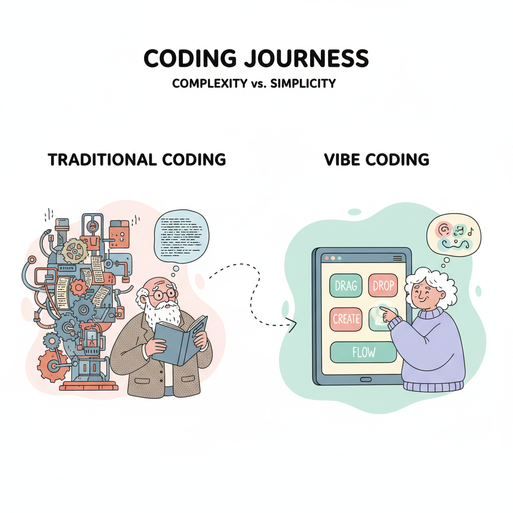
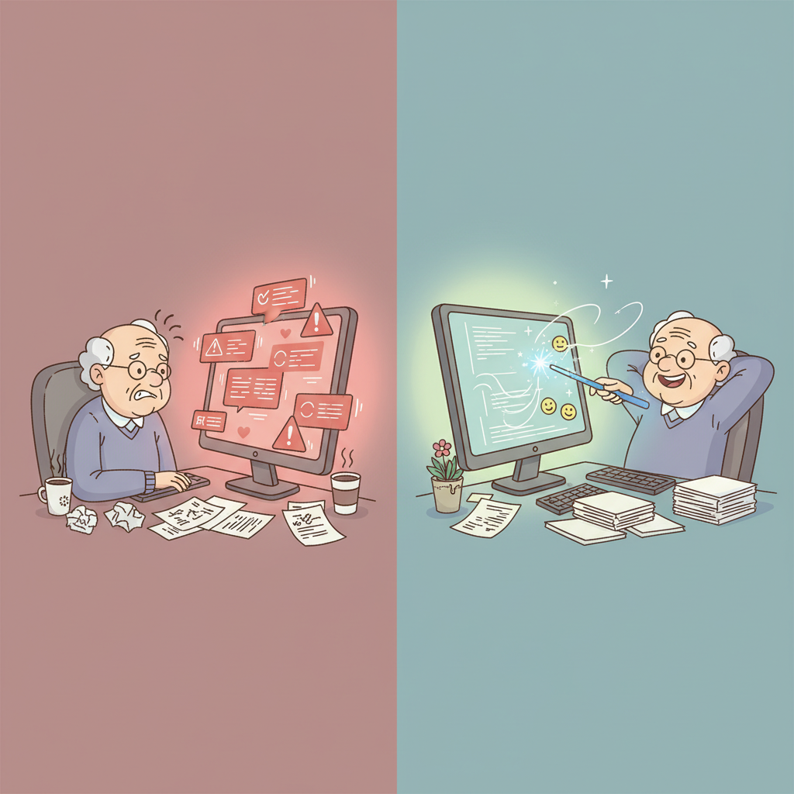
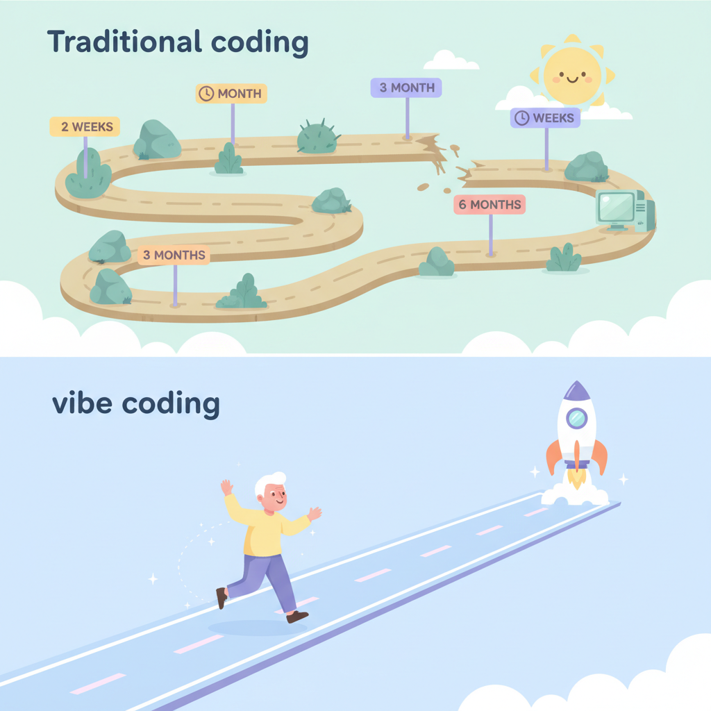
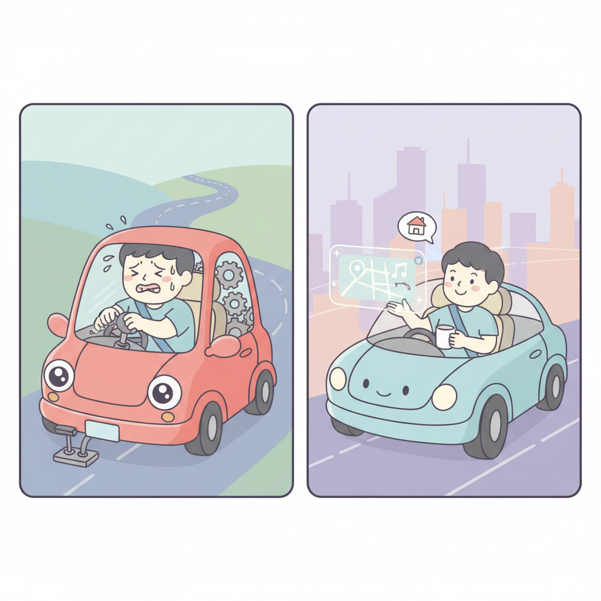

# Chapter 2. 바이브 코딩 vs 전통적 코딩



---

## 학습 목표

이 챕터를 읽고 나면 이런 것들을 알게 됩니다.

1. 전통적 코딩이 왜 어려웠는지 구체적으로 이해합니다.
2. 바이브 코딩이 가진 **핵심 장점 3가지**를 설명할 수 있습니다.
3. 실패 비용이 거의 없다는 사실에 자신감을 얻습니다.

---

## 1. 전통적 코딩의 어려움

### 외국어를 배우는 것과 같았습니다

전통적 코딩은 새로운 언어를 배우는 것이었습니다.
영어도 아닌, 컴퓨터만 알아듣는 언어였습니다.

```
function calculateTotal(items) {
  return items.reduce((sum, item) => sum + item.price, 0);
}
```

이 코드가 무슨 뜻인지 아시나요?
"물건들의 가격을 다 합쳐라"라는 뜻입니다.
이걸 쓰려면 몇 달을 배워야 했습니다.

### 에러와의 끝없는 싸움

코드를 작성하면 에러가 납니다.
점 하나, 쉼표 하나 빠져도 안 돌아갑니다.

에러 메시지는 영어로 나옵니다.
무슨 뜻인지 모르겠습니다.
검색해서 찾아봐야 합니다.
찾아봐도 이해가 안 됩니다.

**이 과정에서 대부분 포기합니다.**



### 배워야 할 것이 너무 많았습니다

웹사이트 하나를 만들려면 이것들을 알아야 했습니다.

- **HTML**: 웹페이지의 뼈대
- **CSS**: 웹페이지의 디자인
- **JavaScript**: 웹페이지의 동작
- **서버**: 데이터를 저장하는 곳
- **데이터베이스**: 정보를 정리하는 곳

이 다섯 가지를 다 배우려면 최소 6개월이 걸립니다.
6개월 뒤에도 초보입니다.

---

## 2. 바이브 코딩의 장점

### 말로 하면 됩니다

바이브 코딩에서는 코드를 쓸 필요가 없습니다.

전통적 코딩:
```
코드를 직접 작성한다
```

바이브 코딩:
```
"로그인 페이지를 만들어줘"라고 말한다
```

이것이 전부입니다.
AI가 코드를 대신 작성해 줍니다.

### 속도가 다릅니다

전통적 코딩으로 로그인 페이지를 만들면?
초보자 기준 **2~3일**이 걸립니다.

바이브 코딩으로 같은 페이지를 만들면?
**10분**이면 됩니다.

| 작업 | 전통적 코딩 | 바이브 코딩 |
|---|---|---|
| 로그인 페이지 | 2~3일 | 10분 |
| 게시판 | 1~2주 | 30분~1시간 |
| 결제 기능 | 3~5일 | 1시간 |
| 전체 웹사이트 | 1~3개월 | 1~3일 |

**10배 이상 빠릅니다.**



### 실패 비용이 거의 제로입니다

전통적으로 서비스를 만들려면 이런 비용이 들었습니다.

- 개발자 고용: 월 수백만 원
- 외주 개발: 수천만 원
- 시간 투자: 최소 3~6개월

돈을 들이고 시간을 들여서 만들었는데 실패하면?
**큰 손해입니다.**

바이브 코딩은 다릅니다.

- AI 도구 비용: 무료 또는 월 2~3만 원
- 시간 투자: 며칠
- 실패하면? **다시 만들면 됩니다**

실패해도 잃는 것이 거의 없습니다.
그래서 마음 편하게 도전할 수 있습니다.

---

## 실생활 비유: 자동차 운전 vs 자율주행



### 전통적 코딩 = 수동 변속기 운전 배우기

예전에는 운전을 배우려면 많은 것을 알아야 했습니다.

클러치를 밟고, 기어를 넣고, 악셀을 조절합니다.
타이밍이 안 맞으면 차가 덜컹거립니다.
시동이 꺼지기도 합니다.

운전면허를 따는 데만 몇 달이 걸렸습니다.
면허를 따도 도로에 나가면 무서웠습니다.

전통적 코딩이 이렇습니다.
배울 것이 많고, 실수가 잦고, 시간이 오래 걸립니다.

### 바이브 코딩 = 자율주행차 타기

자율주행차를 상상해 보세요.

"강남역으로 가줘."

이 한마디면 됩니다.
클러치도 모르고, 기어도 모르고, 도로 법규도 몰라도 됩니다.
차가 알아서 갑니다.

바이브 코딩이 이렇습니다.

**"로그인 페이지 만들어줘."**

이 한마디면 AI가 알아서 만들어 줍니다.
내가 해야 할 일은 **목적지를 정하는 것**뿐입니다.

### 중요한 건 어디로 갈지 아는 것

수동 운전이든 자율주행이든 공통점이 있습니다.
**어디로 갈지는 내가 정해야 한다**는 것입니다.

바이브 코딩도 마찬가지입니다.
무엇을 만들지 결정하는 건 나입니다.
AI는 그 결정을 실행해 주는 도구입니다.

---

## 실제 사례: Marc Lou의 27번의 시도

### 실패가 무서운 이유

"만들어 봤자 실패하면 어쩌지?"

이런 걱정이 가장 큰 장벽입니다.
특히 시간과 돈이 많이 들었을 때 실패가 무섭습니다.

### Marc Lou는 27번 실패했습니다

Marc Lou(마크 루)라는 사람이 있습니다.
프랑스 출신의 1인 개발자입니다.

그는 무려 **27개의 제품**을 만들었습니다.
그리고 **27개 모두 실패**했습니다.

보통 사람이라면 5번쯤에서 포기했을 겁니다.
10번이면 "나는 안 되는 사람인가 보다" 생각했을 겁니다.

하지만 Marc Lou는 계속했습니다.
왜 가능했을까요?

### 실패 비용이 작았기 때문입니다

Marc Lou는 각 제품을 **며칠** 만에 만들었습니다.
비용도 거의 들지 않았습니다.

실패해도 잃는 것이 거의 없었습니다.
"안 되면 다음 거 만들자."
이런 마음으로 가볍게 시도할 수 있었습니다.

전통적 코딩이었다면 27번 시도가 가능했을까요?
각각 3개월씩 걸렸다면 **7년**이 필요합니다.
현실적으로 불가능합니다.

### 28번째가 성공했습니다

27번 실패 후, 28번째 제품이 드디어 성공했습니다.
그리고 그 뒤로도 연달아 성공했습니다.

지금 Marc Lou는 월 수천만 원을 벌고 있습니다.
혼자서 운영합니다.

**핵심 교훈은 이것입니다.**

> "빠르게 만들고, 빠르게 실패하고, 빠르게 다시 시작하라."

바이브 코딩이기에 가능한 전략입니다.

---

## 핵심 포인트

이 챕터에서 꼭 기억할 것들입니다.

1. **완벽함보다 실행이 중요합니다.** 27번 실패한 Marc Lou가 증명했습니다.
2. **AI가 반복 작업을 대신합니다.** 코드 작성, 에러 수정, 디자인까지 AI가 도와줍니다.
3. **창의성에 집중할 수 있습니다.** 기술적 부분은 AI에게 맡기고, 나는 아이디어에 집중합니다.
4. **실패 비용이 거의 제로입니다.** 시간도 돈도 적게 들어서 마음 편하게 도전할 수 있습니다.

---

## 다음 챕터 미리보기

**Chapter 3**에서는 **"당신도 할 수 있는 이유"**를 이야기합니다.

- 나이가 오히려 장점인 이유
- 살아온 경험이 최고의 사업 아이디어인 이유
- 작게 시작하는 용기

"나는 너무 늦었다"고 생각하시나요?
다음 챕터를 읽고 나면 생각이 바뀔 겁니다.
