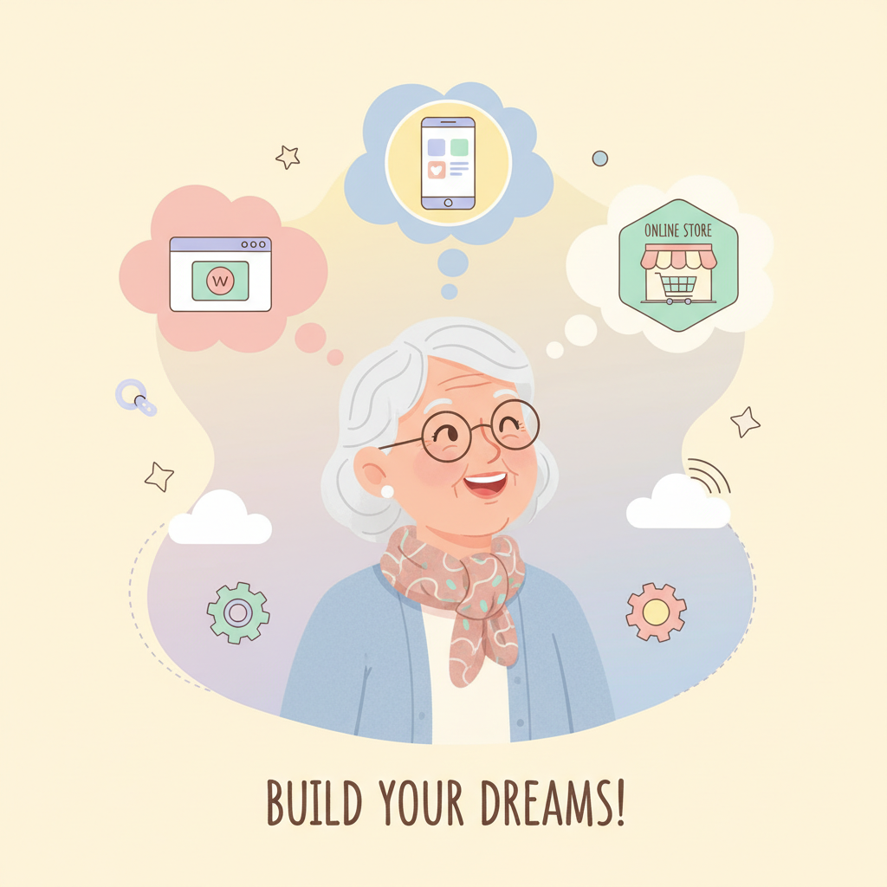
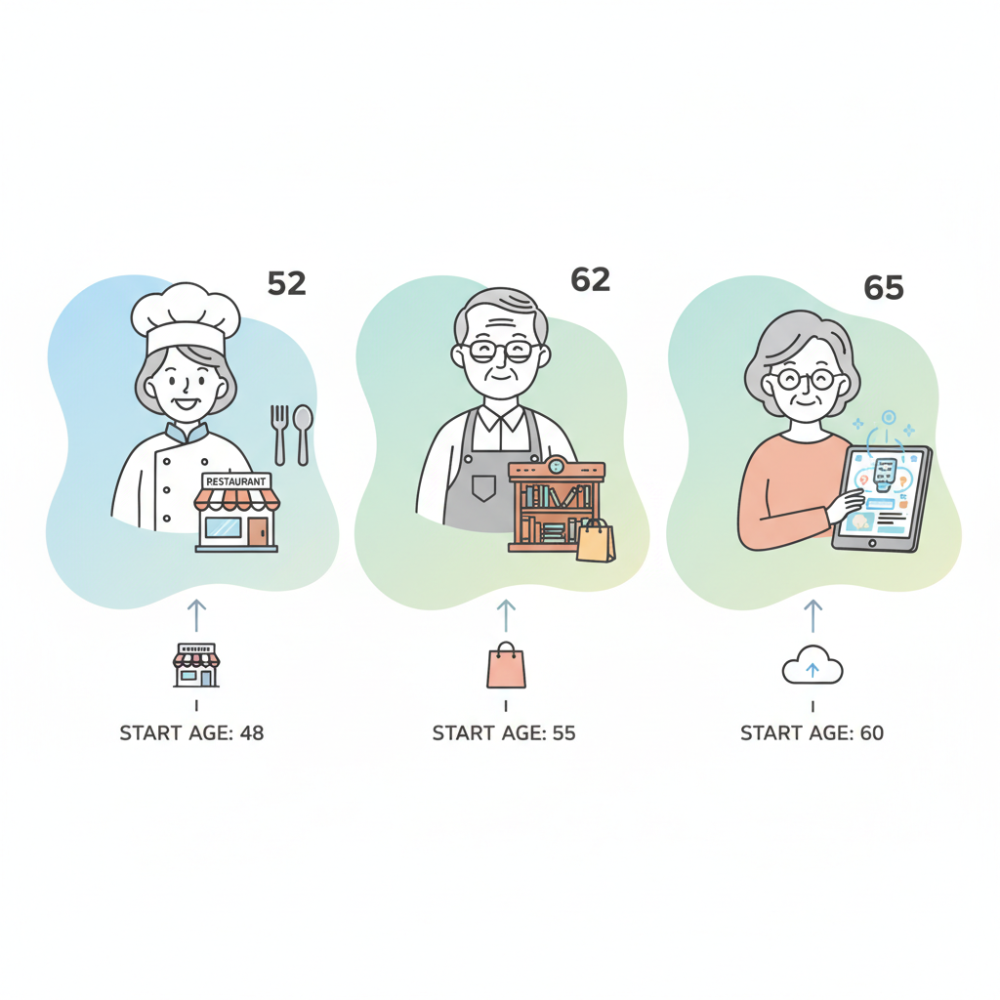
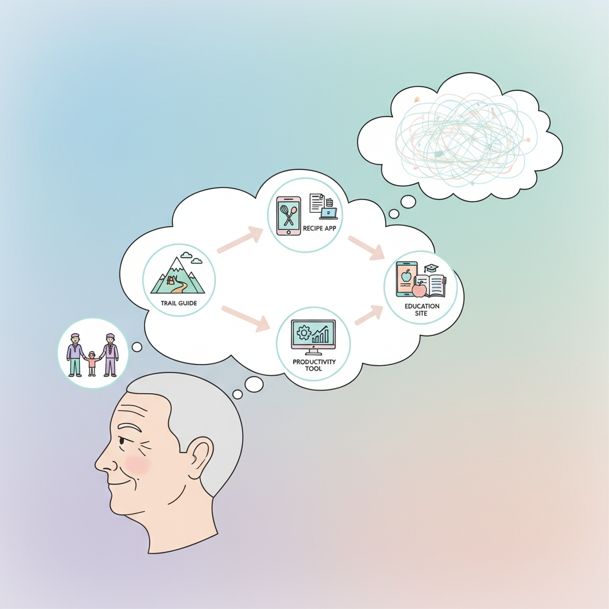
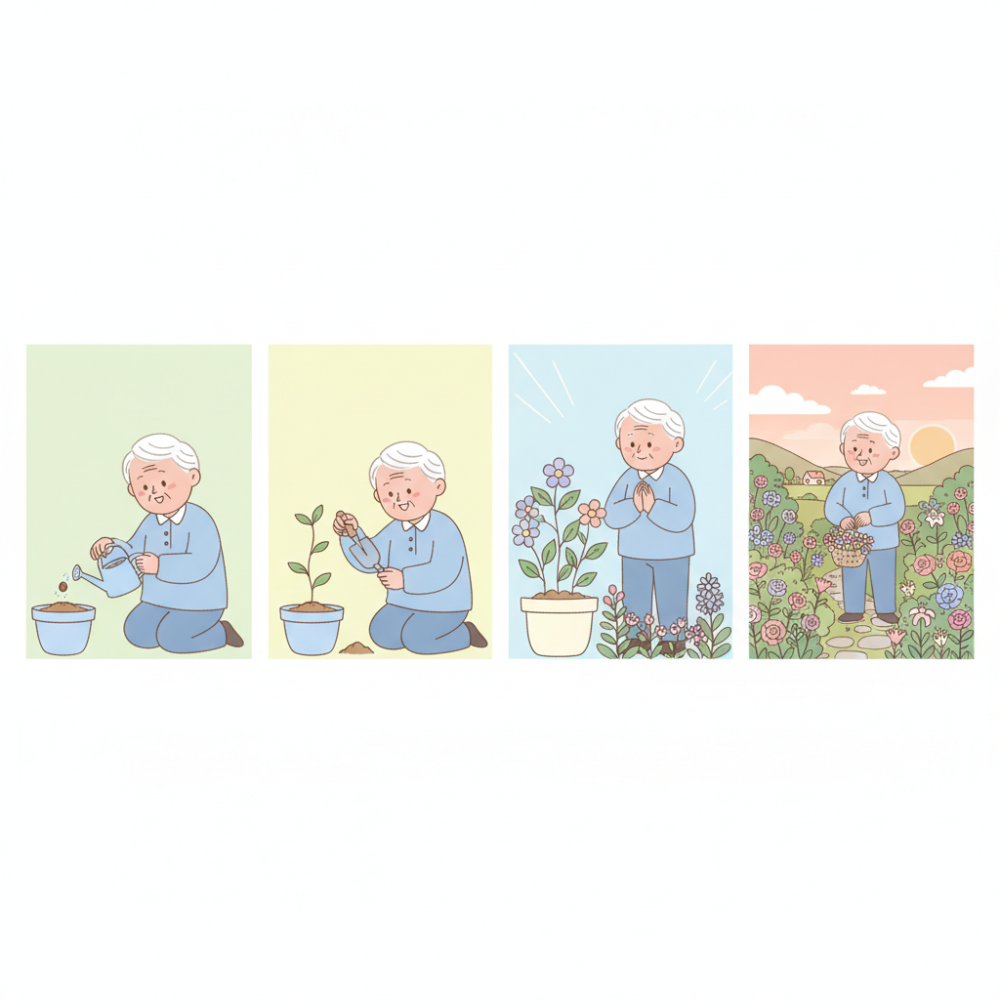

# Chapter 3. 당신도 할 수 있는 이유

---

## 학습 목표

이 챕터를 읽고 나면 이런 것들을 알게 됩니다.

1. **나이는 장벽이 아니라 장점**이라는 것을 이해합니다.
2. 살아온 경험이 곧 **사업 아이디어**가 된다는 것을 알게 됩니다.
3. **작게 시작하는 용기**가 가장 중요하다는 확신을 갖습니다.

---

## 1. 나이는 숫자에 불과합니다

### 너무 늦은 거 아닌가요?

"나이 50이 넘었는데 이제 와서 뭘 시작해?"

이런 생각이 드셨을 수 있습니다.
주변에서도 그렇게 말할 수 있습니다.

하지만 역사를 보면 다릅니다.

### 50대 이후에 시작한 사람들

**레이 크록 — 맥도날드 (52세)**

맥도날드를 만든 사람을 아시나요?
레이 크록이라는 사람입니다.
그는 52세에 맥도날드 사업을 시작했습니다.

그전까지 밀크셰이크 기계를 팔던 세일즈맨이었습니다.
특별한 배경이 없었습니다.

**할랜드 샌더스 — KFC (65세)**

KFC의 할아버지 로고를 아시죠?
실제 인물입니다.
할랜드 샌더스는 65세에 KFC를 시작했습니다.

그전에는 수십 가지 직업을 전전했습니다.
65세에 "이제 정말 해보자" 결심했습니다.

### 디지털 시대에는 더 쉽습니다

레이 크록과 할랜드 샌더스는 직접 가게를 열었습니다.
돈도 많이 들고, 위험도 컸습니다.

**디지털 사업은 다릅니다.**

- 가게를 열 필요가 없습니다
- 직원을 고용할 필요가 없습니다
- 재고를 쌓을 필요가 없습니다
- 컴퓨터 한 대면 시작할 수 있습니다

나이가 많다고 못 할 이유가 없습니다.
오히려 유리한 점이 더 많습니다.

---

## 2. 경험이 곧 아이디어

### 젊은 사람에게 없는 것

20대 개발자는 기술이 뛰어납니다.
코드를 빠르게 작성합니다.
새로운 도구를 금방 배웁니다.

하지만 한 가지가 부족합니다.

**인생 경험입니다.**

30년 넘게 직장 생활을 하셨나요?
자녀를 키워 보셨나요?
건강 문제를 겪어 보셨나요?
취미 활동을 오래 하셨나요?

이 모든 경험이 사업 아이디어입니다.

### 경험에서 아이디어 찾기

몇 가지 예를 들어 보겠습니다.

**30년 회사원 경력이 있다면:**
→ 직장인을 위한 업무 효율 도구

**자녀 교육에 관심이 많다면:**
→ 학부모를 위한 교육 정보 사이트

**등산이 취미라면:**
→ 등산 코스 추천 서비스

**요리를 좋아한다면:**
→ 레시피 공유 커뮤니티

**건강 관리에 신경 쓴다면:**
→ 건강 기록 앱

### 여러분만의 전문 분야가 있습니다

20대는 모든 분야의 초보입니다.
하지만 50대, 60대는 **최소 한 분야의 전문가**입니다.

그 전문 지식을 서비스로 만들면 됩니다.
기술은 AI가 담당합니다.
아이디어와 경험은 여러분이 담당합니다.

**이것이 최강의 조합입니다.**

---

## 3. 작게 시작하는 용기

### 처음부터 큰 걸 만들 필요 없습니다

"사업"이라고 하면 거창하게 느껴집니다.
사무실도 있어야 할 것 같고요.
직원도 뽑아야 할 것 같습니다.

하지만 그럴 필요 없습니다.

방 한쪽 구석, 노트북 한 대.
이것으로 충분합니다.

### 첫 번째 목표는 작게

첫 번째 목표를 이렇게 잡아보세요.

> "간단한 웹페이지 하나 만들어보기"

이게 전부입니다.
수백만 원을 벌겠다는 목표가 아닙니다.
**"뭔가 하나 만들어보기"**가 첫 목표입니다.

하나를 만들면 두 번째가 쉬워집니다.
두 번째를 만들면 세 번째는 더 쉬워집니다.

### 완벽하지 않아도 됩니다

"좀 더 준비되면 시작할게."
"조금만 더 공부하고."
"좀 더 좋은 아이디어가 떠오르면."

이런 말을 하며 시작을 미루지 마세요.
완벽한 준비란 없습니다.

**80%만 준비되었으면 시작하세요.**
나머지 20%는 하면서 채우면 됩니다.

---

## 실생활 비유: 씨앗 심기

### 큰 농장이 아니라 작은 화분에서

사업을 시작하는 것을 씨앗 심기에 비유해 보겠습니다.

처음부터 큰 농장을 살 필요 없습니다.
작은 화분 하나면 됩니다.

베란다에 화분을 놓습니다.
씨앗 하나를 심습니다.
물을 줍니다.
기다립니다.

### 싹이 트면 자신감이 생깁니다

며칠 후 작은 싹이 나옵니다.
"내가 키운 거다!"라는 기쁨이 있습니다.

그러면 화분을 하나 더 놓습니다.
다른 씨앗도 심어봅니다.

어떤 것은 잘 자라고 어떤 것은 시듭니다.
**시든 것은 뽑고 새 씨앗을 심으면 됩니다.**

### 화분이 늘어나면 작은 정원이 됩니다

하나에서 시작한 화분이 다섯 개가 됩니다.
다섯 개가 열 개가 됩니다.
어느새 베란다가 작은 정원이 됩니다.

사업도 마찬가지입니다.
작은 웹페이지 하나에서 시작합니다.
사용자가 모이면 기능을 추가합니다.
작은 프로젝트가 하나의 사업이 됩니다.

**모든 큰 나무는 작은 씨앗에서 시작했습니다.**

---

## 실제 사례: 늦게 시작해도 성공할 수 있습니다

### 기술이 아니라 경험이 무기입니다

Pieter Levels와 Marc Lou의 이야기를 기억하시나요?
그들은 젊은 나이에 시작했습니다.
하지만 그들에게는 AI가 없었습니다.

**여러분에게는 두 가지 무기가 있습니다.**

1. **수십 년의 인생 경험** — 아이디어의 원천
2. **AI 도구** — 기술의 보조

Pieter Levels가 했던 것을 떠올려 보세요.
"사람들에게 필요한 것을 만들자."

여러분은 **사람들에게 뭐가 필요한지 이미 알고 있습니다.**
수십 년간 살면서 느낀 불편함, 필요한 것들.
그것이 바로 사업 아이디어입니다.

### AI가 기술 격차를 메워줍니다

"기술을 모르는데 어떡해?"

괜찮습니다.
AI가 메워줍니다.

코딩을 모르면 AI가 만들어 줍니다.
디자인을 모르면 AI가 도와줍니다.
마케팅 문구를 못 쓰면 AI가 써줍니다.

**여러분은 방향만 정하면 됩니다.**
실행은 AI와 함께 하면 됩니다.

---

## 핵심 포인트

이 챕터에서 꼭 기억할 것들입니다.

1. **살아온 경험이 최고의 사업 아이디어**입니다. 젊은 사람에게는 없는 통찰이 여러분에게 있습니다.
2. **완벽하지 않아도 시작할 수 있습니다.** 80%만 준비되면 나머지는 하면서 배웁니다.
3. **작은 것부터 만들어보세요.** 화분 하나에서 시작해 정원을 만들 수 있습니다.
4. **AI가 기술 격차를 메워줍니다.** 코딩, 디자인, 마케팅 모두 AI가 도와줍니다.

---

## 다음 챕터 미리보기

Part 1이 끝나면 **Part 1 종합 실습**이 있습니다.
지금까지 배운 내용을 정리하고, 실제로 해볼 시간입니다.

그리고 **Part 2**에서는 드디어 실전입니다!

- **Chapter 4**: AI 도구를 설치하고 첫 대화를 나눕니다
- **Chapter 5**: 10분 만에 첫 웹페이지를 만듭니다
- **Chapter 6**: 만든 것을 인터넷에 공개합니다

이론은 끝났습니다.
이제 직접 해볼 차례입니다!
