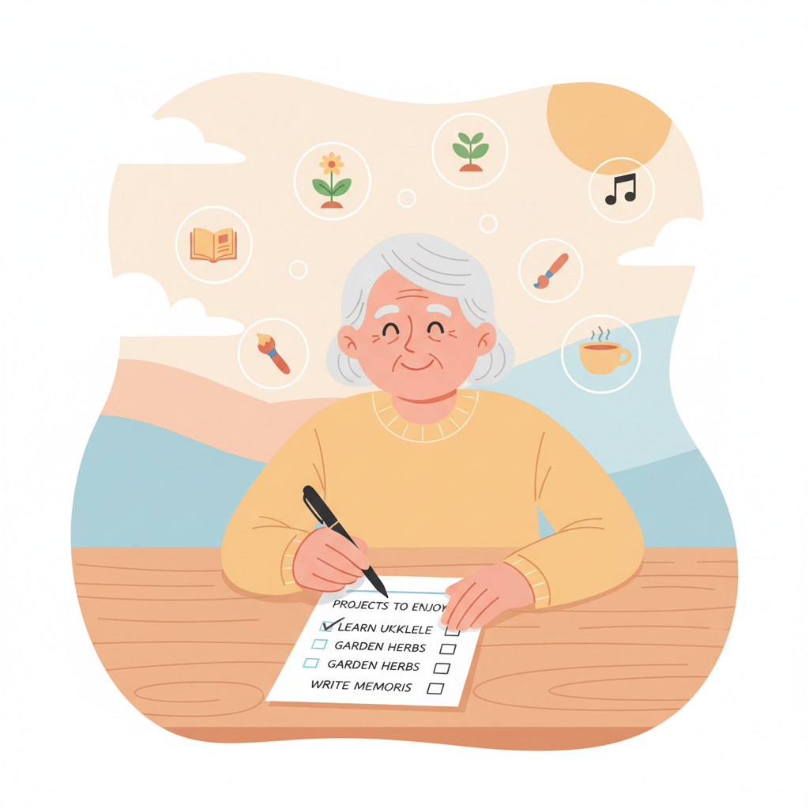

# Part 1 마무리: 바이브 코딩 마인드셋 점검

---

## Part 1 핵심 요약

세 개의 챕터를 통해 이런 것들을 배웠습니다.

### Chapter 1 — AI 시대, 코딩의 새로운 패러다임

- 바이브 코딩은 코드를 직접 쓰는 것이 아닙니다.
- AI에게 내가 원하는 것을 **말로 설명**하는 것입니다.
- 코딩 지식보다 **아이디어**가 더 중요합니다.

### Chapter 2 — 바이브 코딩 도구 살펴보기

- Claude, Cursor, Bolt 같은 AI 도구를 알게 되었습니다.
- 대부분 **무료**로 시작할 수 있습니다.
- 도구는 많지만, 하나만 잘 써도 충분합니다.

### Chapter 3 — 바이브 코딩 마인드셋

- 완벽하지 않아도 **일단 시작**하는 것이 중요합니다.
- 작은 것부터 만들어 보는 것이 최고의 공부법입니다.
- 실패해도 괜찮습니다. AI가 다시 도와줍니다.

---

## 실습 과제: 내가 만들고 싶은 것 3가지 적어보기

지금 바로 해볼 수 있는 실습입니다.
어렵게 생각하지 마세요.

### 이렇게 해보세요

아래 빈칸에 **내가 만들고 싶은 것**을 적어 보세요.
웹사이트, 앱, 도구, 서비스 아무거나 괜찮습니다.

> **1.** _______________________________________________
>
> 이유: _______________________________________________

> **2.** _______________________________________________
>
> 이유: _______________________________________________

> **3.** _______________________________________________
>
> 이유: _______________________________________________

### 잘 안 떠오르시나요? 힌트를 드릴게요

이런 것들을 생각해 보세요.

- **불편한 것**: "이런 게 있으면 편할 텐데..."
- **취미**: "내 취미를 다른 사람과 나누고 싶다"
- **경험**: "내가 아는 것을 정리해서 알려주고 싶다"
- **주변 사람**: "우리 동네에 이런 서비스가 있으면 좋겠다"

### 예시

| 만들고 싶은 것 | 이유 |
|---|---|
| 우리 동네 맛집 지도 | 블로그 리뷰는 광고가 많아서 진짜 맛집만 모으고 싶다 |
| 하루 운동 기록 사이트 | 종이 다이어리보다 편하게 기록하고 싶다 |
| 중고 물품 나눔 게시판 | 우리 아파트 단지에서 쓸 수 있는 나눔 공간이 필요하다 |

**정답은 없습니다.**
떠오르는 대로 적어 보세요.
이 목록이 앞으로 여러분의 첫 프로젝트가 됩니다.

---

## 자가 진단 체크리스트

Part 1을 잘 이해했는지 스스로 점검해 보세요.
아래 항목을 읽고 체크해 보세요.

- [ ] **바이브 코딩이 뭔지 한 문장으로 설명할 수 있다.**
  → "AI에게 내가 원하는 것을 말로 설명해서 만드는 것"

- [ ] **AI 코딩 도구를 최소 2개 이상 말할 수 있다.**
  → 예: Claude, Cursor, Bolt, Lovable 등

- [ ] **코딩을 몰라도 시작할 수 있다는 것을 이해했다.**
  → 중요한 건 코드가 아니라 아이디어입니다

- [ ] **만들고 싶은 것이 최소 1개는 떠올랐다.**
  → 위 실습 과제에 적어 보셨나요?

- [ ] **"나도 할 수 있겠다"는 마음이 조금이라도 생겼다.**
  → 이 마음이 가장 중요합니다!

### 결과 확인

- **5개 모두 체크**: 완벽합니다! Part 2로 바로 넘어가세요.
- **3~4개 체크**: 잘하고 있습니다. 부족한 부분만 다시 읽어 보세요.
- **1~2개 체크**: 괜찮습니다. Chapter 1부터 천천히 다시 읽어 보세요.
- **0개 체크**: 걱정 마세요. 이 책은 도망가지 않습니다. 편하게 다시 시작하세요.

---

## 당신도 할 수 있습니다

혹시 이런 생각이 드시나요?

> "나이가 많은데 할 수 있을까?"
> "컴퓨터를 잘 못 하는데..."
> "젊은 사람들이나 하는 거 아닌가?"

한 가지 이야기를 더 해드리겠습니다.

### Pieter Levels는 특별한 사람이 아니었습니다

Chapter 1에서 소개한 Pieter Levels를 기억하시나요?

- 부모님 집에서 시작했습니다
- 우울증을 겪고 있었습니다
- 특별한 학위도 없었습니다

**그런데 지금은 연 38억 원을 벌고 있습니다.**

### Marc Lou도 마찬가지입니다

Marc Lou(마크 루)라는 사람도 있습니다.
그는 여러 번 실패한 후에 성공했습니다.

그의 전략은 단순했습니다.

> "작은 제품을 빠르게 만들고,
> 반응이 있는 것만 키운다."

그는 이 방법으로 월 수천만 원을 벌고 있습니다.
역시 혼자서 운영합니다.

### 그들과 여러분의 차이

Pieter Levels와 Marc Lou가 시작할 때는 AI가 없었습니다.
직접 코딩을 배워야 했습니다.

**여러분에게는 AI가 있습니다.**

그들보다 유리한 조건에서 시작하는 것입니다.

나이는 상관없습니다.
경험은 오히려 장점입니다.
살아온 세월만큼 아이디어가 많다는 뜻이니까요.

---

## Part 2 미리보기: 본격적으로 시작하기

Part 1에서는 마음가짐을 다졌습니다.
Part 2에서는 **직접 손을 움직여 봅니다.**

- **Chapter 4**: AI 도구 설치하고 첫 대화 나누기
- **Chapter 5**: 나의 첫 웹페이지 만들기 (10분 안에!)
- **Chapter 6**: 만든 것을 인터넷에 공개하기

Part 2를 마치면 **실제로 동작하는 웹페이지**를 갖게 됩니다.
인터넷에 공개해서 누구나 볼 수 있게 만듭니다.

준비되셨나요?
다음 장을 넘겨 주세요.
