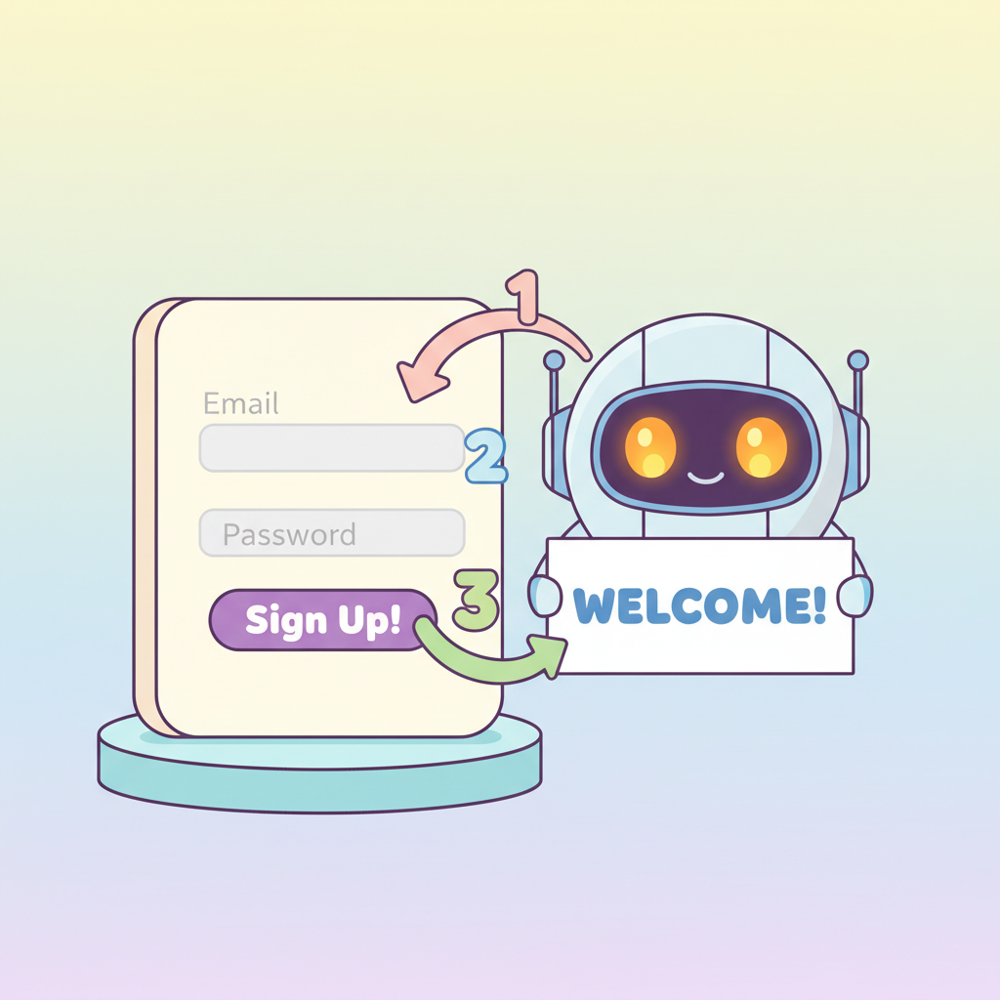
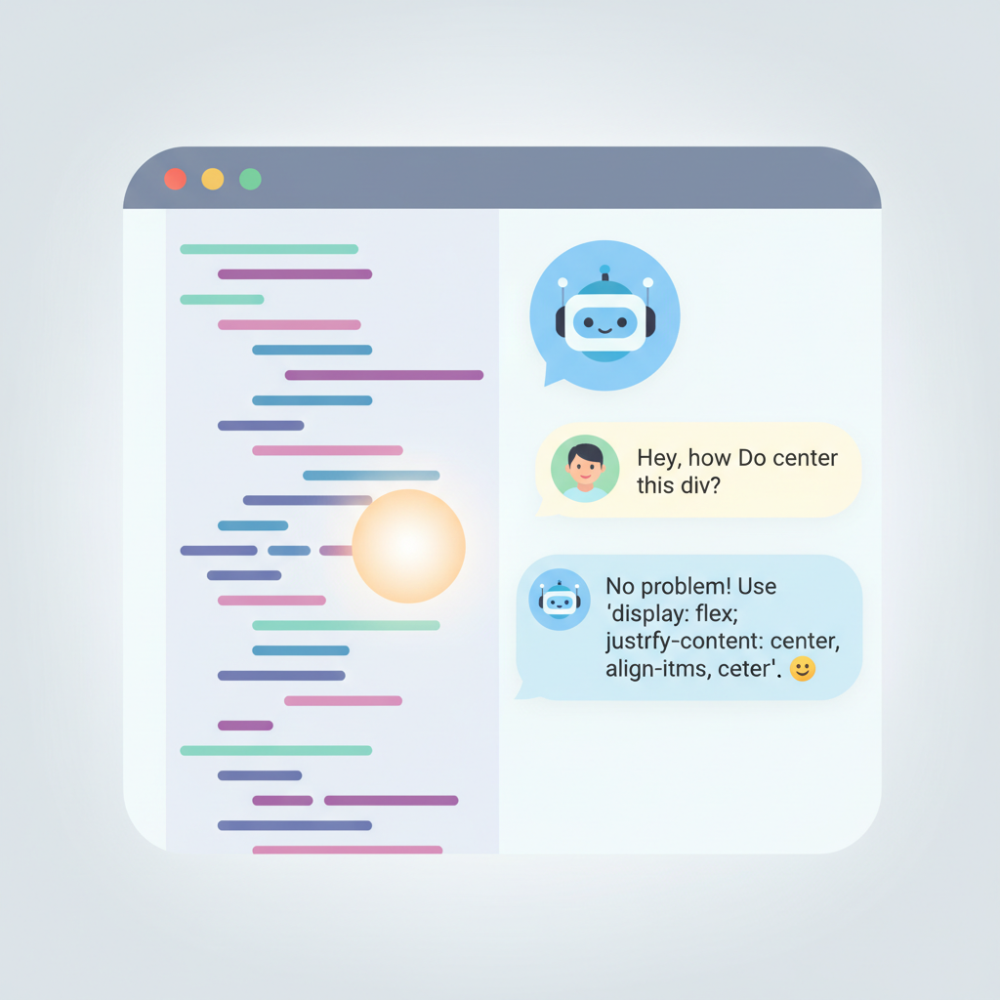

# Chapter 4. AI 도구 설치하고 첫 대화 나누기

---

## 학습 목표

이 챕터를 읽고 나면 이런 것들을 알게 됩니다.

1. **Claude**에 가입하고 사용하는 방법을 알게 됩니다.
2. **Cursor**를 설치하는 방법을 알게 됩니다.
3. AI와 **첫 대화**를 나눌 수 있습니다.

---

## 1. Claude 가입하기

### Claude가 뭔가요?

Claude(클로드)는 AI 대화 도구입니다.
사람처럼 대화할 수 있습니다.
질문하면 답해줍니다.
코드도 작성해 줍니다.

**카카오톡으로 친구에게 부탁하는 것**과 비슷합니다.
"이거 만들어줘"라고 하면 만들어 줍니다.

### 가입 방법 (5분이면 됩니다)

**1단계: 사이트 접속**

인터넷 브라우저를 엽니다.
주소창에 **claude.ai**를 입력합니다.
엔터를 누릅니다.

**2단계: 회원가입**

화면에 "Sign up" 버튼이 보입니다.
이메일 주소를 입력합니다.
비밀번호를 정합니다.
이메일로 온 인증 번호를 입력합니다.

구글 계정이 있다면 더 쉽습니다.
"Continue with Google"을 누르면 됩니다.

**3단계: 완료!**

가입이 끝나면 대화 화면이 나타납니다.
아래쪽에 입력창이 보입니다.
여기에 글을 쓰면 AI가 답합니다.

**무료로 사용할 수 있습니다.**
처음에는 무료 버전으로 충분합니다.

---

## 2. Cursor 설치하기

### Cursor가 뭔가요?

Cursor(커서)는 코드 편집기입니다.
**코드 편집기**란 코드를 쓰는 프로그램입니다.
메모장의 전문가 버전이라고 생각하시면 됩니다.

Cursor의 특별한 점은 **AI가 내장**되어 있다는 것입니다.
편집기 안에서 바로 AI에게 말할 수 있습니다.

### 설치 방법

**1단계: 다운로드**

인터넷 브라우저에서 **cursor.com**에 접속합니다.
"Download" 버튼을 누릅니다.
내 컴퓨터(Windows/Mac)에 맞는 버전이 자동으로 다운됩니다.

**2단계: 설치**

다운받은 파일을 더블클릭합니다.
"다음", "동의", "설치" 버튼을 누릅니다.
보통 1~2분이면 설치가 끝납니다.

**3단계: 실행**

설치가 끝나면 Cursor를 실행합니다.
처음 화면이 조금 복잡해 보일 수 있습니다.
걱정하지 마세요.
우리가 쓸 기능은 몇 가지 안 됩니다.

### 지금 당장 안 해도 괜찮습니다

Cursor는 Part 3에서 본격적으로 사용합니다.
지금은 Claude만 있어도 충분합니다.
**Claude에 먼저 익숙해지는 것**을 추천합니다.

---

## 3. AI와 첫 대화 나누기

### 긴장하지 마세요

AI와 대화하는 것은 어렵지 않습니다.
카카오톡으로 메시지 보내는 것과 같습니다.

틀려도 괜찮습니다.
이상한 질문을 해도 괜찮습니다.
AI는 절대 화내지 않습니다.

### 첫 대화 해보기

Claude 화면 아래 입력창에 이렇게 써보세요.

> "안녕, 나는 코딩을 처음 배우려는 사람이야.
> 쉽게 설명해줘."

엔터를 누르면 Claude가 답합니다.
친절하게 설명해 줄 겁니다.

### 이런 것들도 물어보세요

Claude에게 다양한 것을 물어볼 수 있습니다.

**일상적인 질문:**
> "오늘 저녁 메뉴 추천해줘."

**정보 찾기:**
> "고혈압에 좋은 음식이 뭐야?"

**코딩 관련:**
> "웹사이트가 뭔지 쉽게 설명해줘."

**아이디어 상담:**
> "50대가 시작할 수 있는 온라인 사업 아이디어 알려줘."

무엇이든 물어보세요.
**연습이 가장 좋은 공부입니다.**

### 대화할 때 팁

**팁 1: 한국어로 말하세요**
Claude는 한국어를 잘 이해합니다.
영어로 말할 필요 없습니다.

**팁 2: 구체적으로 말하세요**
"알려줘" (X)
"50대 초보자에게 쉽게 알려줘" (O)

**팁 3: 모르면 다시 물어보세요**
답이 어려우면 이렇게 말하세요.
"더 쉽게 설명해줘."
"예를 들어서 설명해줘."

---

## 실생활 비유: 새 스마트폰 처음 켜기

### 처음엔 다 낯설었습니다

스마트폰을 처음 쓰셨을 때를 떠올려 보세요.
화면을 어떻게 터치하는지도 몰랐습니다.
앱이 뭔지도 몰랐습니다.

하지만 전화 거는 법부터 배웠습니다.
문자 보내는 법을 배웠습니다.
카카오톡을 깔았습니다.

**한 달 뒤에는 능숙하게 쓰고 있었습니다.**

### AI 도구도 마찬가지입니다

처음엔 낯설어 보입니다.
뭘 어떻게 해야 할지 모릅니다.

하지만 대화 한 번, 두 번 하다 보면 익숙해집니다.
일주일이면 편하게 쓸 수 있습니다.

스마트폰을 배웠던 것처럼 AI 도구도 배울 수 있습니다.
**처음이 가장 어렵습니다. 시작만 하세요.**

---

## 실제 사례: 처음 AI를 써본 사람들의 반응

### "이게 정말 되는 거야?"

AI를 처음 써본 분들의 반응은 대부분 비슷합니다.

> "세상에, 이게 진짜 돼?"
> "사람이 대답하는 줄 알았어!"
> "이걸 왜 이제서야 알았지?"

60대 어머니에게 Claude를 보여드린 아들의 이야기입니다.

> "어머니가 '김치찌개 맛있게 끓이는 법' 물어보셨어요.
> Claude가 상세하게 알려주니까
> '이 친구 요리 잘 아네?' 하셨어요."

그 뒤로 어머니는 매일 Claude에게 물어보신다고 합니다.
건강 정보도 물어보고, 여행지도 추천받으신다고 합니다.

### AI는 친구같은 도우미입니다

AI를 어렵게 생각하지 마세요.
**모든 것을 알고 있는 친절한 친구**라고 생각하세요.

이 친구는 24시간 언제든 대답합니다.
화를 내지 않습니다.
같은 질문을 해도 싫어하지 않습니다.
한국어로 말하면 한국어로 답합니다.

이보다 좋은 도우미가 있을까요?

---

## 핵심 포인트

이 챕터에서 꼭 기억할 것들입니다.

1. **Claude는 무료**로 시작할 수 있습니다. claude.ai에서 5분이면 가입됩니다.
2. **Cursor는 AI가 내장된 코드 편집기**입니다. 나중에 설치해도 괜찮습니다.
3. **AI에게 한국어로 말하면 됩니다.** 어렵게 생각하지 마세요.
4. **처음엔 간단한 질문부터 시작하세요.** "안녕"이라고 말하는 것도 훌륭한 첫걸음입니다.

---

## 다음 챕터 미리보기

**Chapter 5**에서는 드디어 **첫 웹페이지를 만들어 봅니다!**

- AI에게 웹페이지를 요청하는 방법
- 10분 만에 완성하는 비결
- 마음에 안 드는 부분을 수정하는 방법

정말 10분이면 될까요?
다음 챕터에서 직접 경험해 보세요!
