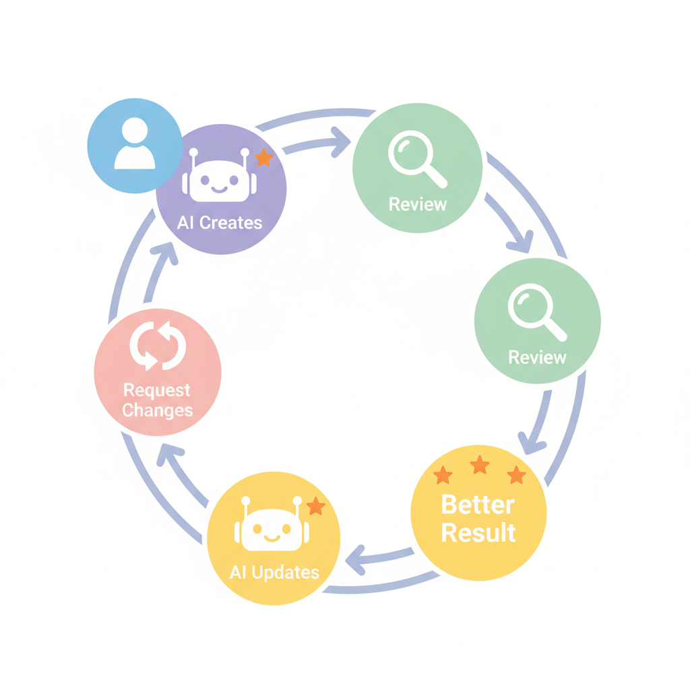

# Chapter 5. 10분 만에 첫 웹페이지 만들기

---

## 학습 목표

이 챕터를 읽고 나면 이런 것들을 알게 됩니다.

1. AI에게 웹페이지를 **요청하는 방법**을 알게 됩니다.
2. 결과물을 확인하고 **수정 요청**하는 방법을 배웁니다.
3. 실제로 **10분 안에** 나만의 웹페이지를 만들 수 있습니다.

---

## 1. AI에게 웹페이지 요청하기

### 프롬프트가 곧 설계도입니다

AI에게 하는 요청을 **프롬프트**라고 합니다.
건축에 비유하면 설계도와 같습니다.

설계도가 구체적일수록 좋은 집이 나옵니다.
프롬프트가 구체적일수록 좋은 웹페이지가 나옵니다.

### 첫 번째 프롬프트 따라하기

Claude에게 이렇게 말해 보세요.

> "나의 자기소개 웹페이지를 만들어줘.
> 이름은 홍길동이고, 취미는 등산이야.
> 좋아하는 말은 '천리길도 한 걸음부터'야.
> 예쁜 디자인으로 만들어줘."

이름과 취미는 여러분의 것으로 바꾸세요.

엔터를 누르면 Claude가 HTML 코드를 만들어 줍니다.
**HTML**이란 웹페이지를 만드는 언어입니다.
이 코드를 이해할 필요는 없습니다.

### 결과물 확인하기

Claude가 만든 코드를 복사합니다.
메모장을 열고 붙여넣습니다.
파일 이름을 **index.html**로 저장합니다.

저장한 파일을 더블클릭하면?
**웹페이지가 열립니다!**

내 이름이 보입니다.
취미가 보입니다.
좋아하는 말이 보입니다.

**이것이 여러분의 첫 웹페이지입니다.**

---

## 2. 수정 요청하기

### 마음에 안 드는 부분이 있다면

첫 결과가 완벽하지 않을 수 있습니다.
색상이 마음에 안 들 수 있습니다.
글씨가 너무 작을 수 있습니다.

**AI에게 다시 말하면 됩니다.**

### 수정 프롬프트 예시

이렇게 요청해 보세요.

> "배경색을 하늘색으로 바꿔줘."

> "글씨 크기를 더 크게 해줘."

> "내 사진을 넣을 자리를 추가해줘."

> "아래쪽에 연락처 정보도 넣어줘."

한 번에 하나씩 요청하는 게 좋습니다.
AI가 수정된 코드를 다시 만들어 줍니다.

### 몇 번이든 수정할 수 있습니다

수정에 제한이 없습니다.
10번을 수정해도 괜찮습니다.
20번을 수정해도 괜찮습니다.

AI는 지치지 않습니다.
**마음에 들 때까지 요청하세요.**

---

## 3. 더 멋진 웹페이지 만들기

### 좀 더 구체적인 프롬프트

기본 자기소개 페이지에 만족하셨나요?
조금 더 욕심을 내볼까요?

이렇게 요청해 보세요.

> "나의 자기소개 웹페이지를 만들어줘.
>
> 포함할 내용:
> - 이름: [이름]
> - 한 줄 소개: [소개]
> - 취미 3가지: [취미1], [취미2], [취미3]
> - 좋아하는 명언: [명언]
> - 연락처: [이메일]
>
> 디자인:
> - 색상은 따뜻한 느낌으로
> - 글씨는 크고 읽기 쉽게
> - 사진 넣을 공간 포함
> - 모바일에서도 잘 보이게"

구체적으로 요청할수록 결과가 좋아집니다.

### 다른 종류의 페이지도 만들 수 있습니다

자기소개 말고도 다양한 페이지를 만들 수 있습니다.

> "우리 동네 맛집 3곳을 소개하는 페이지 만들어줘."

> "내 강아지 사진첩 웹페이지 만들어줘."

> "우리 동호회 소개 페이지 만들어줘."

아이디어가 떠오르면 AI에게 말해보세요.
**10분이면 무엇이든 만들어 줍니다.**

---

## 실생활 비유: 레고 블록으로 집 만들기

### 설명서만 있으면 누구나 조립합니다

레고를 아시나요?
작은 블록을 조립해서 집을 만드는 장난감입니다.

레고에는 **설명서**가 들어있습니다.
설명서대로 따라하면 누구나 멋진 집을 만들 수 있습니다.

건축 지식이 필요 없습니다.
설명서만 따라하면 됩니다.

### 프롬프트가 설명서입니다

바이브 코딩에서 프롬프트는 레고 설명서와 같습니다.

"파란색 지붕 집을 만들어줘."
이렇게 말하면 AI가 블록을 조립해 줍니다.

"지붕 색을 빨간색으로 바꿔줘."
이렇게 말하면 AI가 블록을 교체해 줍니다.

**마음에 안 들면 부분만 바꾸면 됩니다.**
처음부터 다시 만들 필요 없습니다.

---

## 실제 사례: 바이브 코딩 10분 챌린지

### 실제로 10분이면 됩니다

"10분이라니, 과장 아니야?"

실제로 바이브 코딩으로 웹페이지를 만드는 과정입니다.

- **0~2분**: Claude에게 프롬프트 작성
- **2~4분**: AI가 코드 생성 + 확인
- **4~7분**: 수정 요청 1~2번
- **7~10분**: 최종 확인 + 저장

**정말 10분이면 완성됩니다.**

전통적 코딩이었다면?
HTML, CSS를 배우는 데만 2주가 걸립니다.
같은 페이지를 직접 만드는 데 하루는 걸립니다.

10분 vs 2주.
이것이 바이브 코딩의 힘입니다.

### 처음이라 15분 걸려도 괜찮습니다

물론 처음이라 익숙하지 않을 수 있습니다.
15분이 걸릴 수도 있고 20분이 걸릴 수도 있습니다.

**전혀 괜찮습니다.**

두 번째는 10분이 됩니다.
세 번째는 5분이면 됩니다.
점점 빨라집니다.

---

## 핵심 포인트

이 챕터에서 꼭 기억할 것들입니다.

1. **프롬프트가 곧 설계도**입니다. 구체적으로 쓸수록 좋은 결과가 나옵니다.
2. **처음부터 완벽할 필요 없습니다.** 기본을 만들고 수정하면 됩니다.
3. **수정은 AI에게 다시 요청**하면 됩니다. 몇 번이든 괜찮습니다.
4. **10분이면 기본 웹페이지가 완성**됩니다. 직접 해보면 믿게 됩니다.

---

## 다음 챕터 미리보기

**Chapter 6**에서는 만든 웹페이지를 **인터넷에 공개**합니다!

- Netlify로 무료 배포하기
- 나만의 인터넷 주소 갖기
- 가족과 친구에게 링크 공유하기

만든 것을 세상에 보여줄 시간입니다.
정말 뿌듯한 경험이 될 거예요!
