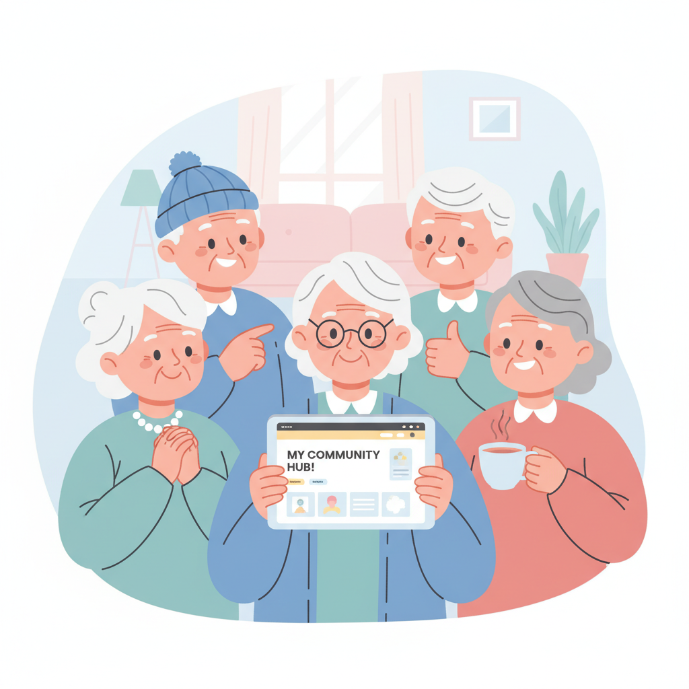

# Part 2 마무리: 첫 웹사이트 만들기 프로젝트

---

## Part 2 핵심 요약

세 개의 챕터를 통해 이런 것들을 배웠습니다.

### Chapter 4 — AI 도구 설치하고 첫 대화 나누기

- Claude, Cursor 등 AI 도구에 **가입하는 방법**을 배웠습니다.
- 처음 가입할 때는 **무료 플랜**으로 충분합니다.
- AI에게 말을 거는 것은 친구에게 부탁하는 것과 비슷합니다.

### Chapter 5 — 나의 첫 웹페이지 만들기

- AI에게 부탁하면 **10분 안에** 웹페이지를 만들 수 있습니다.
- HTML, CSS 같은 용어를 몰라도 괜찮습니다.
- 내가 원하는 대로 **수정도 AI에게 부탁**하면 됩니다.

### Chapter 6 — 만든 것을 인터넷에 공개하기

- Netlify를 사용하면 **무료로 배포**할 수 있습니다.
- 배포하면 **나만의 인터넷 주소**가 생깁니다.
- 그 주소를 누구에게든 공유할 수 있습니다.

---

## 실습 과제: 나만의 자기소개 웹페이지를 만들고 배포하기

지금 바로 해볼 수 있는 실습입니다.
천천히 따라 하시면 됩니다.

### Step 1: Claude에게 자기소개 페이지 요청하기

Claude에게 이렇게 말해 보세요.

> "나를 소개하는 예쁜 웹페이지를 만들어 줘.
> 이름은 ______이고, 취미는 ______이야.
> 따뜻한 느낌으로 만들어 줘."

아래에 여러분의 정보를 먼저 적어 보세요.

| 항목 | 내 정보 |
|---|---|
| 이름 | _______________ |
| 한 줄 소개 | _______________ |
| 취미 | _______________ |
| 좋아하는 것 | _______________ |
| 하고 싶은 말 | _______________ |

### Step 2: 내용 수정하기

AI가 만들어 준 페이지를 보고 수정할 부분을 찾아보세요.

이렇게 부탁하면 됩니다.

> "배경색을 하늘색으로 바꿔 줘."
> "글씨를 좀 더 크게 해줘."
> "사진 넣는 자리를 추가해 줘."

**수정은 몇 번이든 괜찮습니다.**
AI는 지치지 않습니다.

### Step 3: Netlify에 배포하기

1. [netlify.com](https://netlify.com)에 접속합니다.
2. 회원가입을 합니다. (무료입니다.)
3. AI가 만들어 준 파일을 끌어다 놓습니다.
4. 몇 초 기다리면 **나만의 주소**가 생깁니다.

> 내 웹페이지 주소: https://_______________.netlify.app

### Step 4: 가족이나 친구에게 공유하기

이것이 가장 중요한 단계입니다.

카카오톡이나 문자로 링크를 보내 보세요.
"내가 만든 거야!" 한마디면 됩니다.

> 공유한 사람: _______________
>
> 그 사람의 반응: _______________

**반응이 어떻든 괜찮습니다.**
중요한 것은 **내가 만들고, 공유했다**는 사실입니다.

---

## 자가 진단 체크리스트

Part 2를 잘 마쳤는지 스스로 점검해 보세요.
아래 항목을 읽고 체크해 보세요.

- [ ] **AI 도구(Claude 등)에 가입했다.**
  → 가입만 해도 큰 첫 걸음입니다

- [ ] **AI와 첫 대화를 나눠 봤다.**
  → 무엇이든 좋습니다. "안녕"이라도 괜찮습니다

- [ ] **웹페이지를 하나 만들어 봤다.**
  → 완벽하지 않아도 됩니다. 만들어 본 것 자체가 대단합니다

- [ ] **만든 웹페이지를 인터넷에 배포해 봤다.**
  → 나만의 주소가 생겼다면 성공입니다

- [ ] **누군가에게 내 웹페이지를 공유했다.**
  → 가족, 친구, 누구든 한 명이면 충분합니다

### 결과 확인

- **5개 모두 체크**: 멋집니다! 이미 많은 사람보다 앞서 있습니다.
- **3~4개 체크**: 아주 잘하고 있습니다. 나머지는 천천히 해보세요.
- **1~2개 체크**: 괜찮습니다. AI 도구 가입부터 다시 시작해 보세요.
- **0개 체크**: 걱정 마세요. Chapter 4를 다시 읽으면서 따라 해보세요.

---

## 당신도 할 수 있습니다

혹시 이런 생각이 드시나요?

> "겨우 웹페이지 하나 만든 건데..."
> "이걸로 뭘 할 수 있을까?"

한 가지 이야기를 해드리겠습니다.

### Marc Lou의 첫 제품은 아주 간단했습니다

Marc Lou(마크 루)를 기억하시나요?
월 수천만 원을 버는 1인 개발자입니다.

그의 첫 제품이 뭐였는지 아시나요?
**아주 단순한 웹페이지 하나**였습니다.

거창한 앱이 아니었습니다.
화려한 기능도 없었습니다.

> "작게 시작하라.
> 완벽할 필요 없다.
> 일단 세상에 내놓아라."

이것이 Marc Lou의 철학입니다.

### 여러분도 이미 시작했습니다

웹페이지를 만들고 배포했다면,
여러분은 이미 **Marc Lou의 첫 걸음**과 같은 일을 한 것입니다.

시작이 반입니다.
아니, 시작이 전부일 수도 있습니다.

작은 웹페이지 하나가 큰 변화의 씨앗이 됩니다.

---

## Part 3 미리보기: 본격 프로젝트 시작하기

Part 2에서는 첫 웹페이지를 만들어 봤습니다.
Part 3에서는 **진짜 나만의 프로젝트**를 만들어 봅니다.

- **Chapter 7**: 아이디어를 구체적인 기획으로 바꾸기
- **Chapter 8**: AI에게 기능을 하나씩 추가해 달라고 요청하기
- **Chapter 9**: 보기 좋게 디자인 다듬기
- **Chapter 10**: 다른 사람에게 보여주고 피드백 받기

Part 3를 마치면 **실제 사용자가 쓸 수 있는 서비스**가 만들어집니다.
아이디어가 현실이 되는 과정을 함께 경험해 봅시다.

준비되셨나요?
다음 장을 넘겨 주세요.
