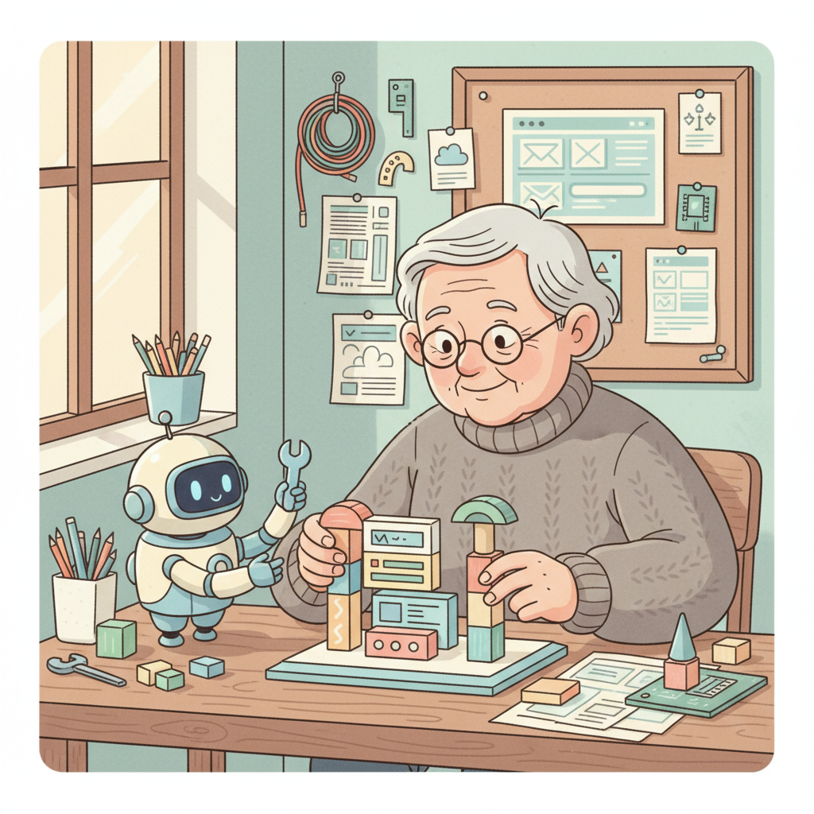
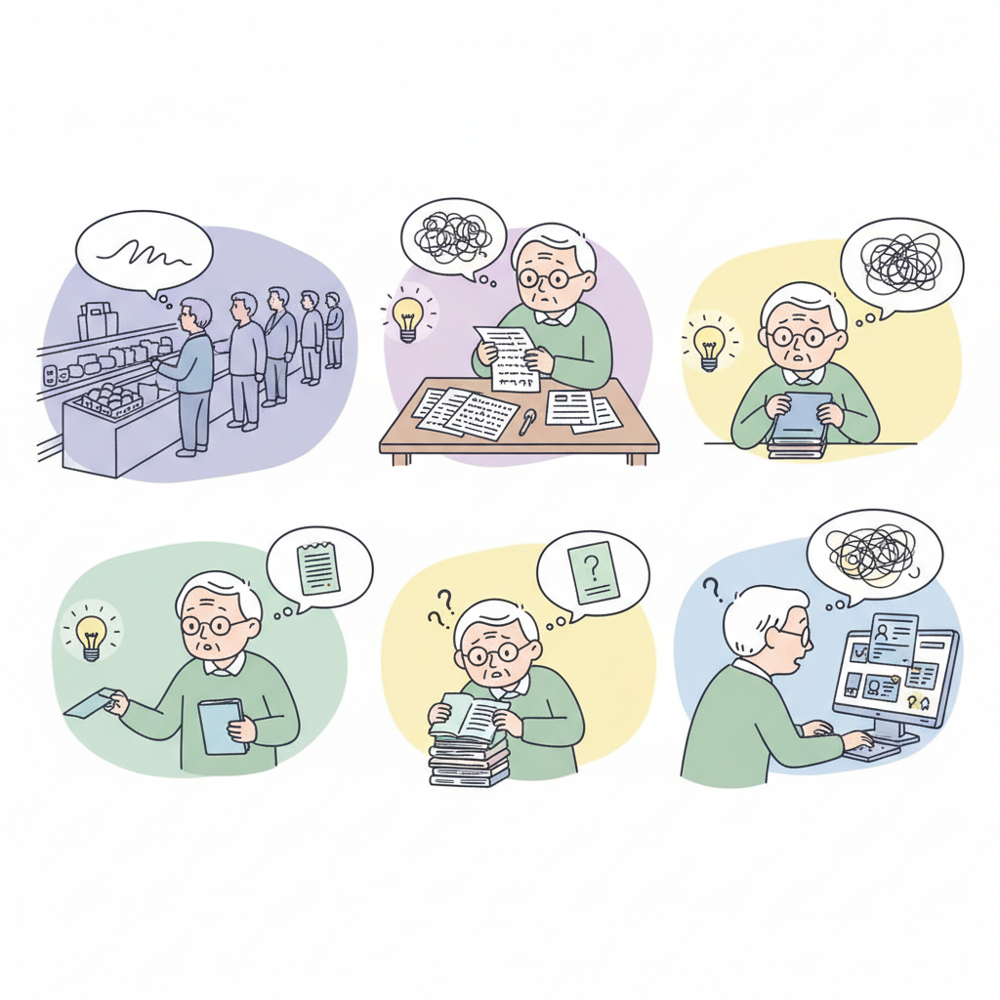
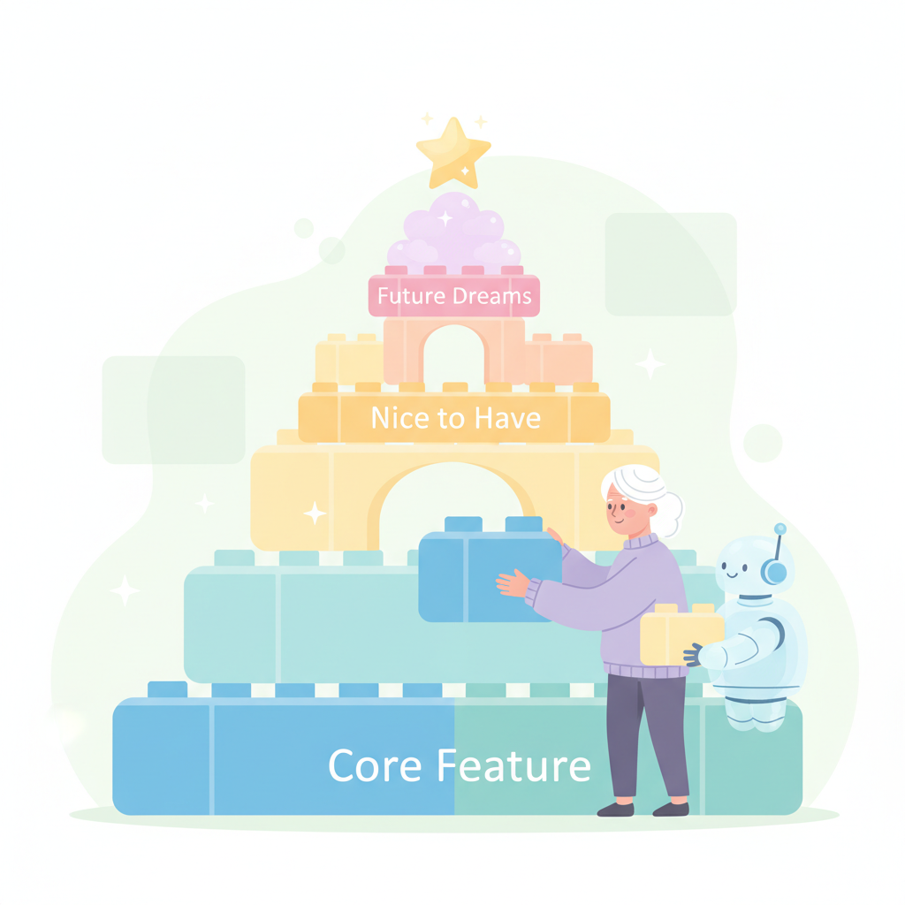
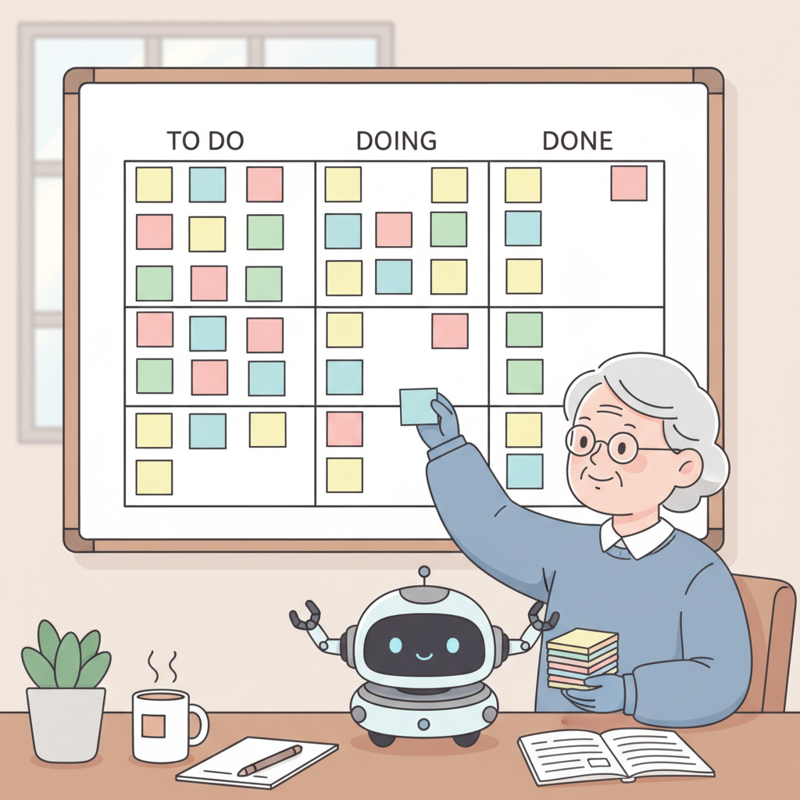

# Chapter 07. 실전 프로젝트 기획하기

---

## 학습 목표

이 챕터를 읽고 나면 이런 것들을 알게 됩니다.

1. 내 일상의 불편함에서 사업 아이디어를 찾을 수 있습니다.
2. MVP(최소 기능 제품)의 개념을 이해하고 적용할 수 있습니다.
3. 핵심 기능 3가지를 정해서 프로젝트를 기획할 수 있습니다.

---

## 1. 아이디어는 불편함에서 시작합니다

### 거창할 필요 없어요

"어떤 서비스를 만들어야 할까요?"
이 질문에 막막하신 분이 많을 거예요.
대단한 아이디어가 필요한 건 아니에요.

가장 좋은 아이디어의 출발점은요.
바로 **내가 느끼는 불편함**이에요.
"이런 게 있으면 편할 텐데"가 시작이에요.

### 불편함을 찾는 방법

하루 동안 이런 순간을 떠올려 보세요.
"아, 이거 불편하다" 싶은 순간이요.
그게 바로 사업 아이디어입니다.

예를 들어 볼까요?

- "동네 맛집을 한눈에 보고 싶다"
- "우리 동호회 일정 관리가 어렵다"
- "매일 먹는 약을 자꾸 잊어버린다"

이런 작은 불편함이 서비스가 돼요.
나만 불편한 게 아닐 수 있거든요.
같은 불편함을 느끼는 사람이 고객이에요.

### 종이에 적어보세요

지금 바로 종이를 꺼내보세요.
불편한 것 5개만 적어보세요.
쓰다 보면 아이디어가 구체화돼요.

완벽한 아이디어는 없어요.
일단 적는 것이 시작입니다.
나중에 골라도 충분해요.

---

## 2. MVP: 핵심 기능만 담은 첫 버전

### MVP가 뭔가요?

MVP는 **Minimum Viable Product**의 줄임말이에요.
한국어로는 "최소 기능 제품"이라고 해요.
**꼭 필요한 기능만 담은 첫 버전**이에요.

쉽게 말해서 이런 거예요.
100점짜리를 만들려 하지 마세요.
**60점짜리를 빨리 만드는 것**이 MVP예요.

### 왜 MVP가 중요한가요?

완벽하게 만들려면 시간이 오래 걸려요.
몇 달씩 만들다가 지쳐서 포기해요.
그런데 완성해도 사람들이 안 쓸 수 있어요.

MVP는 빠르게 만들어서 빨리 보여주는 거예요.
사람들이 원하는지 먼저 확인하는 거죠.
**확인한 다음에 더 만들어도 늦지 않아요.**

### 핵심 기능 3가지만 정하세요

아이디어가 정해졌다면요.
**가장 중요한 기능 3가지**만 고르세요.
3가지면 충분합니다.

예를 들어 "동네 맛집 사이트"라면요.

1. 맛집 목록 보여주기
2. 지도에서 위치 확인하기
3. 별점 남기기

이 3가지면 서비스가 됩니다.
예약 기능, 사진 업로드, 리뷰 기능은요.
**나중에 추가해도 돼요.**

---

## 실생활 비유: 식당 메뉴판

처음 여는 식당을 상상해 보세요.
메뉴를 몇 가지로 시작할까요?
**3가지면 충분합니다.**

김치찌개, 된장찌개, 비빔밥.
이 3가지로 문을 여세요.
손님이 오면 반응을 살피는 거예요.

"김치찌개가 제일 인기구나."
그러면 김치찌개를 더 맛있게 만들어요.
"불고기도 있으면 좋겠어요"라는 요청이 오면요.
그때 메뉴를 추가하면 됩니다.

처음부터 100가지 메뉴를 준비하면 어떨까요?
재료비가 엄청 들어요.
음식 품질도 떨어져요.
**이것이 바로 실패 레시피예요.**

웹 서비스도 똑같습니다.
기능 3가지로 시작하세요.
잘 되는 것을 파악한 후에 확장하세요.

---

## 실제 사례: Marc Lou의 ShipFast

Marc Lou(마크 루)라는 사람이 있어요.
**ShipFast**라는 서비스를 만들었어요.
개발자들이 빠르게 제품을 만드는 템플릿이에요.

**템플릿**이란 미리 만들어진 틀을 말해요.
요리로 치면 반조리 식품 같은 거예요.
기본 틀이 있으니 완성이 빠른 거죠.

Marc Lou도 처음부터 대단하지 않았어요.
ShipFast의 첫 버전은 기능이 3개였어요.

1. 회원가입 기능
2. 결제 기능
3. 이메일 발송 기능

딱 이 3가지로 출시했어요.
"이 정도면 사람들이 쓸까?" 싶었대요.
그런데 반응이 왔어요.

사용자들이 요청하기 시작했어요.
"SEO 기능 추가해주세요."
"블로그 기능도 있으면 좋겠어요."

그 피드백을 받아서 하나씩 추가했어요.
지금은 월 수천만 원의 매출을 올려요.
**시작은 기능 3개짜리 MVP였습니다.**

여기서 배울 점이 뭘까요?
완벽한 기획보다 빠른 실행이 중요해요.
사용자 1명이라도 먼저 만족시키세요.

---

## 3. 내 프로젝트 기획하기

### 기획서 작성법

거창한 문서가 필요한 건 아니에요.
종이 한 장이면 충분합니다.
이 세 가지만 적으세요.

**1. 한 줄 설명**
"이 서비스는 ___을 위한 ___이다."
예: "이 서비스는 동네 주민을 위한 맛집 지도이다."

**2. 핵심 기능 3가지**
가장 중요한 기능만 고르세요.
나머지는 나중에 추가하면 돼요.

**3. 첫 번째 사용자**
누가 이 서비스를 가장 먼저 쓸까요?
가족? 친구? 동호회 회원?
딱 1명을 떠올려 보세요.

### 완벽하지 않아도 괜찮아요

기획이 완벽할 수 없어요.
만들면서 계속 바뀌는 게 정상이에요.
중요한 건 일단 시작하는 거예요.

기획에 일주일을 쓰지 마세요.
30분이면 충분합니다.
**나머지는 만들면서 알게 돼요.**

---

## 핵심 포인트

이 챕터에서 꼭 기억할 것들입니다.

1. **아이디어는 내 불편함에서 시작해요.** 거창한 아이디어보다 작은 불편함이 좋은 출발점입니다.
2. **MVP는 핵심 기능만 담은 첫 버전이에요.** 60점짜리를 빨리 만들어서 빨리 보여주세요.
3. **완벽한 기획보다 빠른 실행이 중요해요.** 기획은 30분이면 충분합니다.
4. **사용자 1명이라도 먼저 만족시키세요.** 1명이 좋아하면 100명도 좋아할 수 있어요.

---

## 다음 챕터 미리보기

기획이 끝났으면 이제 만들 차례예요!
**Chapter 8**에서는 AI에게 기능을 요청하는 방법을 배워요.

- 좋은 프롬프트 작성법
- 기능을 하나씩 추가하는 순서
- 에러가 나도 당황하지 않는 방법

드디어 본격적으로 만드는 시간이에요.
함께 시작해 볼까요?
