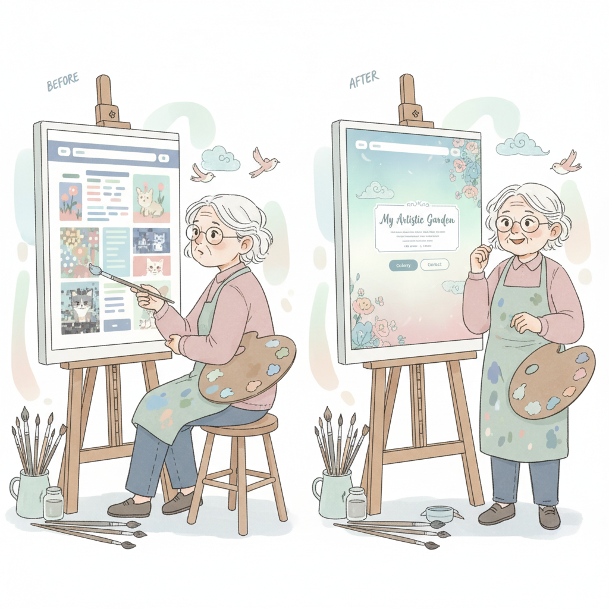
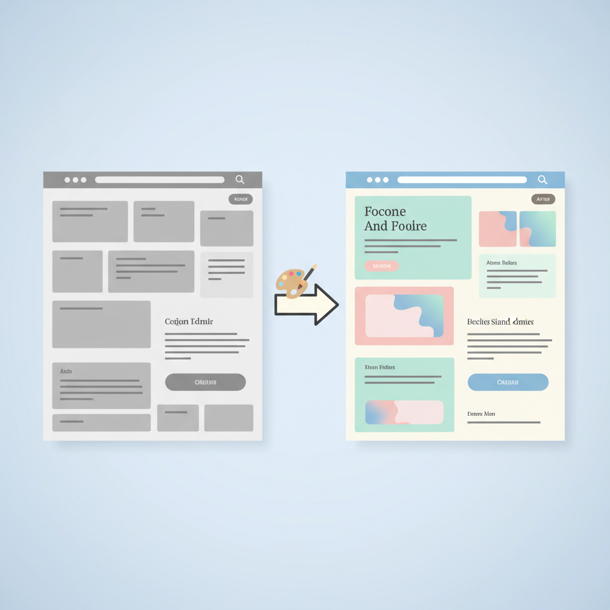
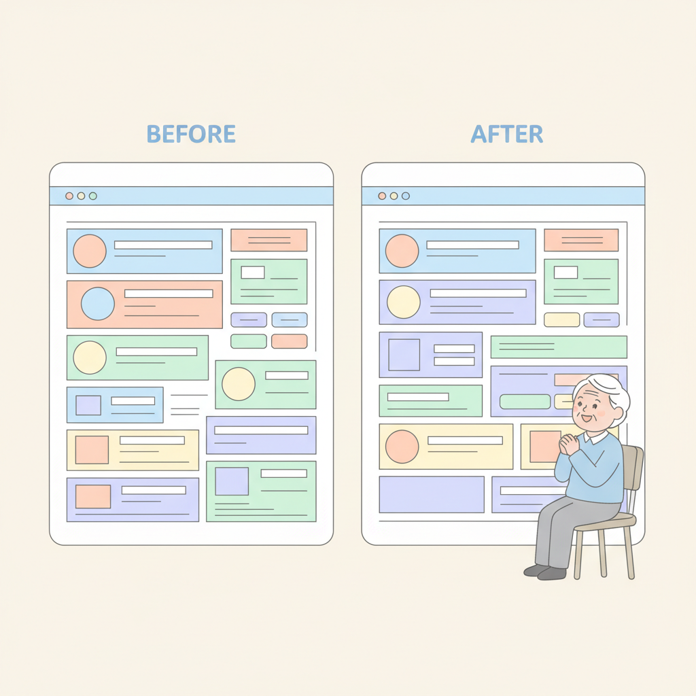
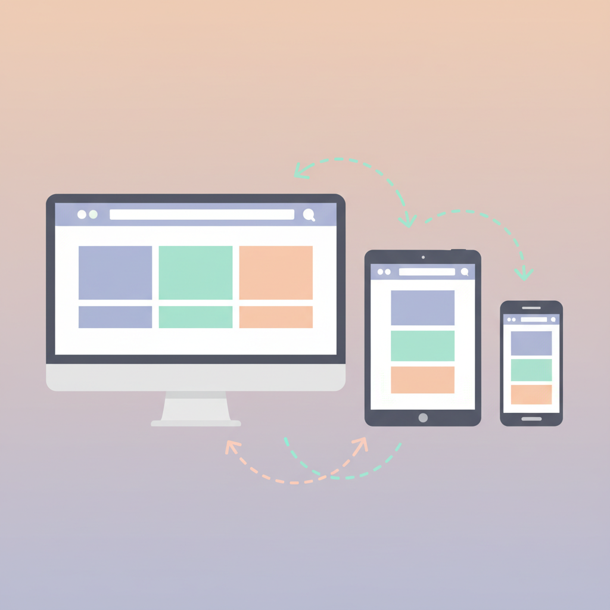

# Chapter 09. 디자인 다듬기

---

## 학습 목표

이 챕터를 읽고 나면 이런 것들을 알게 됩니다.

1. AI에게 색상과 폰트 변경을 요청할 수 있습니다.
2. 참고 사이트를 보여주며 레이아웃을 개선할 수 있습니다.
3. 모바일 대응(반응형 디자인)의 개념을 이해합니다.

---

## 1. 색상과 폰트 바꾸기

### 색상이 주는 느낌

색상은 서비스의 첫인상이에요.
파란색은 신뢰감을 줘요.
초록색은 자연스러운 느낌이고요.
빨간색은 열정적인 느낌이에요.

내 서비스에 맞는 색을 골라보세요.
건강 관련이면 초록색이 좋겠죠.
금융 관련이면 파란색이 어울려요.

### 색상은 3가지 이내로

색상을 너무 많이 쓰면 산만해져요.
**3가지 이내로 정하세요.**
이것만 지켜도 깔끔해 보여요.

- **주요 색상**: 서비스를 대표하는 색 1가지
- **보조 색상**: 버튼이나 강조에 쓰는 색 1가지
- **배경 색상**: 흰색이나 밝은 회색

이렇게 3가지면 충분합니다.
전문 디자이너도 이 규칙을 따라요.

### 폰트도 AI에게 맡기세요

**폰트**란 글씨체를 말해요.
읽기 쉬운 폰트가 가장 좋아요.
예쁜 것보다 잘 읽히는 게 중요해요.

AI에게 이렇게 요청해 보세요.

> "디자인을 더 깔끔하게 바꿔줘.
> 색상은 파란색 계열로 해줘.
> 폰트는 읽기 쉬운 것으로 바꿔줘."

AI가 적절한 색상 코드를 골라줘요.
폰트도 가독성 좋은 것을 추천해 줘요.
직접 코드를 수정할 필요가 없어요.

---

## 2. 레이아웃 개선하기

### 레이아웃이란?

**레이아웃**은 화면의 배치를 말해요.
메뉴가 어디 있고, 내용이 어디 있는지요.
버튼은 어디에 놓을지 정하는 거예요.

신문을 떠올려 보세요.
제목이 위에 있고 기사가 아래에 있죠.
사진은 옆에 배치되어 있고요.
이런 배치가 바로 레이아웃이에요.

### 참고 사이트를 보여주세요

디자인을 설명하기 어려울 때가 있어요.
그럴 때는 참고 사이트를 알려주세요.
AI에게 이렇게 말하면 돼요.

> "이 사이트처럼 만들어줘.
> (참고 사이트 주소 붙여넣기)
> 상단에 메뉴바가 있고
> 가운데에 큰 이미지가 나오는 형태로 해줘."

AI가 비슷한 구조로 만들어 줘요.
100% 같지는 않지만 비슷해져요.
말로 설명하는 것보다 훨씬 효과적이에요.

### 여백을 넉넉히 두세요

초보자가 흔히 하는 실수가 있어요.
화면을 빽빽하게 채우는 거예요.
**여백이 있어야 읽기 편해요.**

AI에게 이렇게 요청하면 돼요.

> "요소들 사이에 여백을 더 넣어줘.
> 글씨와 이미지 사이를 넓혀줘.
> 전체적으로 여유 있게 배치해줘."

여백은 비어 있는 게 아니에요.
**읽는 사람을 배려하는 공간이에요.**

---

## 3. 모바일 대응 (반응형 디자인)

### 반응형이 뭔가요?

요즘 사람들은 스마트폰으로 인터넷을 봐요.
컴퓨터 화면과 스마트폰 화면은 크기가 다르죠.
**반응형**이란 화면 크기에 맞춰 바뀌는 거예요.

컴퓨터에서는 옆으로 넓게 보이고요.
스마트폰에서는 위아래로 길게 보여요.
같은 내용인데 배치만 달라지는 거예요.

### 왜 모바일이 중요한가요?

방문자의 70% 이상이 스마트폰을 써요.
컴퓨터에서만 잘 보이면 부족해요.
**스마트폰에서 잘 보여야 성공해요.**

글씨가 너무 작으면 읽기 힘들죠.
버튼이 너무 작으면 누르기 어렵고요.
모바일에서 불편하면 바로 떠나버려요.

### AI에게 반응형을 요청하세요

어렵게 생각할 필요 없어요.
AI에게 한마디만 하면 돼요.

> "모바일에서도 잘 보이게 만들어줘.
> 스마트폰에서 글씨가 잘 읽히게 해줘.
> 버튼은 손가락으로 누르기 쉽게 해줘."

AI가 반응형 코드를 만들어 줘요.
내가 코드를 이해할 필요 없어요.
**요청만 잘 하면 됩니다.**

### 확인하는 방법

만든 후에 꼭 확인해 보세요.
컴퓨터 브라우저 창의 크기를 줄여보세요.
가로 폭을 좁히면 모바일 화면처럼 돼요.

글씨가 잘 보이나요?
버튼을 쉽게 누를 수 있나요?
이미지가 깨지지 않나요?
이 세 가지만 확인하시면 돼요.

---

## 실생활 비유: 옷 입히기

디자인은 옷 입히기와 같아요.
기능이 완성된 서비스는 알몸이에요.
이제 옷을 입혀야 할 차례예요.

그런데 옷도 잘 입어야 하잖아요.
유행을 따르는 것보다 중요한 게 있어요.
**깔끔한 기본이 최고예요.**

흰 셔츠에 청바지를 입어보세요.
100가지 액세서리보다 나아요.
단정하고 깔끔한 느낌이 들죠.

웹 디자인도 마찬가지예요.
화려한 효과보다 깔끔함이 좋아요.
색상 3가지, 읽기 쉬운 폰트.
**이것만으로도 충분히 멋져요.**

---

## 실제 사례: 심플한 디자인으로 성공한 서비스들

화려한 디자인만 성공할까요?
전혀 아니에요.
오히려 단순한 디자인이 성공하는 경우가 많아요.

### Google 검색

구글 첫 화면을 떠올려 보세요.
**검색창 하나만 있어요.**
나머지는 전부 여백이에요.

그런데 전 세계에서 가장 많이 쓰는 사이트죠.
단순함이 바로 구글의 힘이에요.
사용자가 뭘 해야 할지 바로 알 수 있어요.

### Craigslist

Craigslist(크레이그리스트)를 아시나요?
미국의 중고 거래 사이트예요.
디자인이 솔직히 못생겼어요.

텍스트와 링크만 잔뜩 있어요.
예쁘다고 말할 수 없는 사이트예요.
**그런데 매달 수십억 명이 방문해요.**

이유가 뭘까요?
**유용하기 때문이에요.**
예쁜 것보다 쓸모 있는 게 중요해요.

### NomadList

NomadList는 깔끔한 표 형태예요.
도시 정보가 한눈에 보여요.
화려하지 않지만 정보가 잘 정리되어 있어요.

이 세 사이트의 공통점이 보이시나요?
**깔끔하고 유용한 것이 좋은 디자인이에요.**
화려함이 아니라 사용하기 편한 것이 핵심이에요.

---

## 핵심 포인트

이 챕터에서 꼭 기억할 것들입니다.

1. **깔끔한 디자인이 좋은 디자인이에요.** 화려한 것보다 읽기 쉽고 사용하기 편한 게 중요해요.
2. **AI에게 참고 사이트를 보여주세요.** 말로 설명하기 어려우면 비슷한 사이트를 알려주는 게 효과적이에요.
3. **모바일에서도 잘 보이는지 확인하세요.** 방문자 대부분이 스마트폰을 사용하니 꼭 점검해야 해요.
4. **색상은 3가지 이내로 유지하세요.** 주요 색, 보조 색, 배경 색만 있으면 충분합니다.

---

## 다음 챕터 미리보기

디자인까지 다듬었으니 거의 다 됐어요!
**Chapter 10**에서는 사용자 피드백 받는 방법을 배워요.

- 주변 사람에게 테스트 부탁하는 법
- 피드백을 받아서 개선하는 방법
- 진짜 사용자를 찾는 방법

만든 것을 보여주고 더 좋게 만들어 봐요.
다음 챕터에서 만나요!
