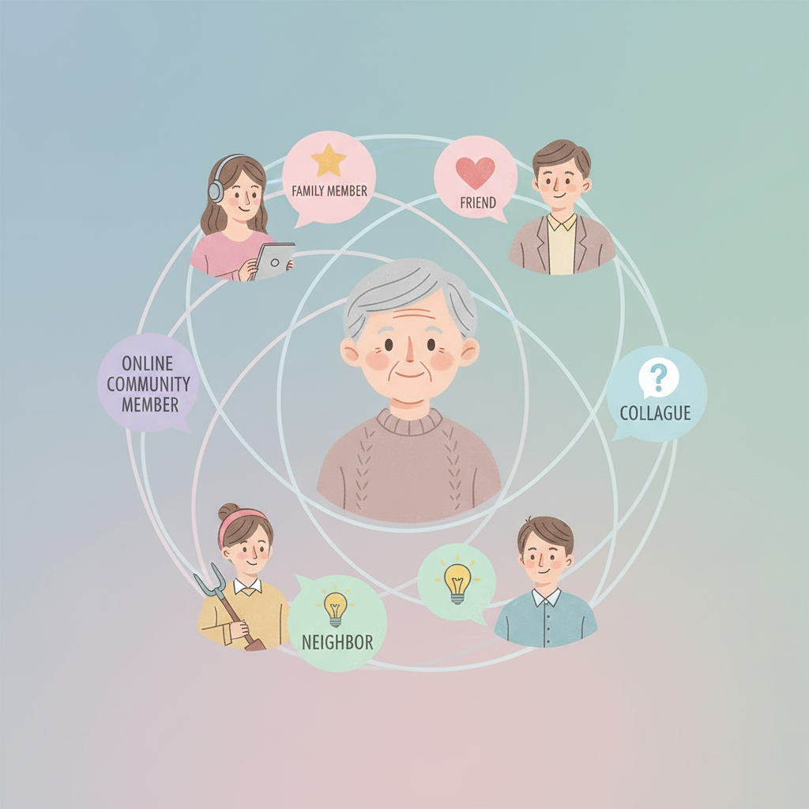
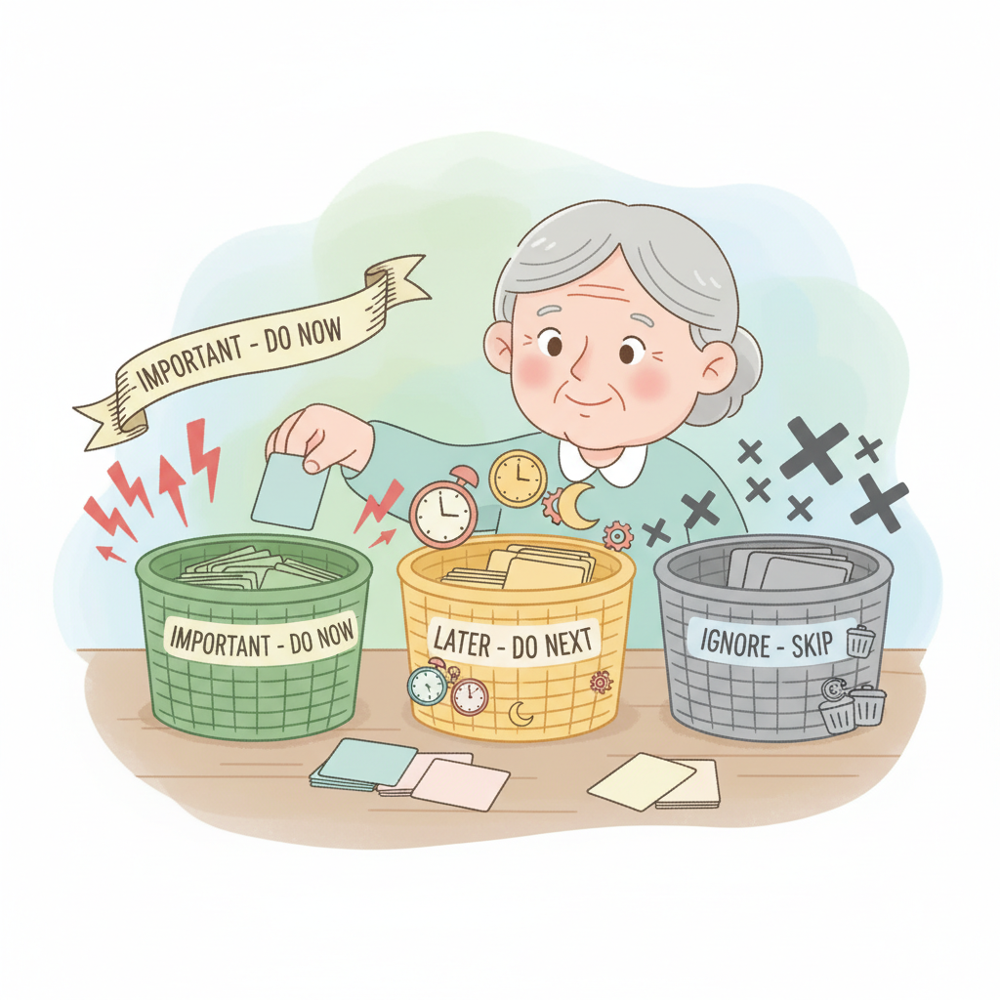
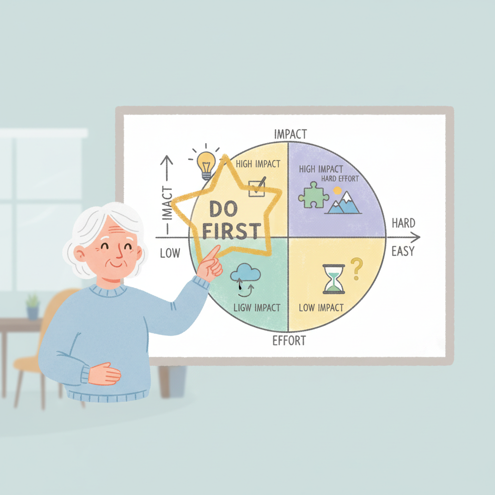

# Chapter 10. 사용자 피드백 받고 개선하기

---

## 학습 목표

이 챕터를 읽고 나면 이런 것들을 알게 됩니다.

1. **주변 사람 5명**에게 효과적으로 피드백을 받는 방법을 알게 됩니다.
2. 받은 피드백을 **중요/나중에/무시**로 분류하는 기준을 세울 수 있습니다.
3. 우선순위를 정해서 **효율적으로 개선**하는 과정을 실행할 수 있습니다.

---

## 1. 주변 5명에게 보여주기

### 완벽하지 않아도 보여주세요

"아직 완성이 안 됐는데..."

많은 분들이 이렇게 생각합니다.
하지만 100% 완성을 기다리면 영원히 못 보여줍니다.

**70%만 되어도 보여주세요.**
그래야 방향을 바로잡을 수 있습니다.

### 누구에게 보여줄까요?

처음 피드백을 받을 5명을 골라보세요.

- **가족 1명** — 솔직한 의견을 줍니다
- **친구 1~2명** — 편하게 말해줍니다
- **동료나 지인 1~2명** — 객관적 시각을 줍니다

이 5명이 여러분의 첫 번째 사용자입니다.
전문가가 아니어도 괜찮습니다.
오히려 일반 사용자의 눈이 더 중요합니다.

### 피드백을 잘 받는 방법

피드백을 부탁할 때 이렇게 말해보세요.

> "내가 만든 서비스인데 한번 써볼래?
> 솔직하게 말해줘. 안 좋은 점도 괜찮아."

그리고 이 세 가지를 꼭 물어보세요.

1. **"처음 봤을 때 뭔지 바로 알겠어?"**
2. **"사용하면서 불편한 점이 있었어?"**
3. **"다시 쓰고 싶은 마음이 들어?"**

이 세 질문이면 충분합니다.
너무 많이 물어보면 상대방이 부담스러워합니다.

### 중요한 태도

피드백을 들을 때 가장 중요한 것이 있습니다.

**변명하지 마세요.**

"그건 원래 이런 거야"라고 하면 안 됩니다.
사용자가 불편하다고 느꼈다면 그게 사실입니다.

듣고, 적고, 감사하다고 말하세요.
그것으로 충분합니다.

---

## 2. 피드백 정리하기: 중요/나중에/무시

### 피드백이 쌓이면 정리가 필요합니다

5명에게 피드백을 받으면 의견이 다양합니다.
어떤 것은 급하고, 어떤 것은 나중에 해도 됩니다.
어떤 것은 무시해도 됩니다.

**세 가지 바구니**에 나눠 담아보세요.

### 바구니 1: 중요 (지금 바로 고치기)

이런 피드백은 바로 반영하세요.

- **2명 이상**이 같은 말을 했을 때
- 서비스를 **아예 사용할 수 없는** 문제일 때
- 처음 화면에서 **뭔지 모르겠다**고 할 때

예를 들어 보겠습니다.

> "버튼을 눌렀는데 아무 반응이 없어요."
> "이게 뭘 하는 서비스인지 모르겠어요."

이런 건 바로 고쳐야 합니다.

### 바구니 2: 나중에 (다음에 개선)

지금 당장은 아니지만 기록해두세요.

- **1명만** 말한 불편 사항
- "이런 기능도 있으면 좋겠다"는 **추가 요청**
- 고치면 좋지만 **급하지 않은** 것들

예를 들면 이런 것입니다.

> "색깔을 바꾸면 더 예쁠 것 같아요."
> "알림 기능이 있으면 좋겠어요."

메모해두고 나중에 하나씩 처리하세요.

### 바구니 3: 무시 (반영하지 않기)

모든 피드백을 다 반영할 필요는 없습니다.

- 내 서비스의 **방향과 맞지 않는** 의견
- 너무 **개인적인 취향**의 문제
- 다른 서비스를 만들어야 하는 수준의 요청

예를 들어 보겠습니다.

> "이거 말고 완전히 다른 걸 만들면 안 돼요?"

이런 건 웃으며 넘기면 됩니다.
내 서비스의 핵심을 잃으면 안 됩니다.

### AI로 피드백 정리하기

피드백 정리도 AI에게 도움받을 수 있습니다.

> "내 서비스에 대한 사용자 피드백을 정리해줘.
> 아래 의견들을 '바로 수정', '나중에', '무시'로 분류해줘.
> 1. 버튼이 너무 작아서 누르기 어렵다
> 2. 색깔이 마음에 안 든다
> 3. 로그인이 안 된다
> 4. 게임 기능을 추가해달라"

AI가 깔끔하게 분류해줍니다.

---

## 3. 우선순위 정해서 개선하기

### 한 번에 하나씩

피드백을 분류했으면 이제 개선할 차례입니다.
하지만 한꺼번에 다 고치려고 하면 안 됩니다.

**가장 중요한 것 하나부터 시작하세요.**

### 개선 순서 정하기

"중요" 바구니 안에서도 순서가 있습니다.

1. **사용 자체가 불가능한 문제** — 가장 먼저
2. **많은 사람이 말한 문제** — 그다음
3. **쉽게 고칠 수 있는 문제** — 그다음

쉽게 고칠 수 있는 것부터 하는 것도 좋습니다.
작은 성과가 쌓이면 자신감이 생깁니다.

### AI에게 개선 요청하기

피드백을 반영할 때도 AI에게 말하면 됩니다.

> "사용자들이 버튼이 너무 작다고 해.
> 모든 버튼 크기를 1.5배로 키워줘.
> 모바일에서도 잘 눌리게 해줘."

AI가 코드를 수정해줍니다.
여러분은 결과를 확인하면 됩니다.

### 개선 후 다시 확인하기

고친 다음에는 다시 보여주세요.
같은 사람에게 보여줘도 좋습니다.

> "저번에 말해준 부분 고쳤는데 확인해줄래?"

이 과정을 반복하는 게 **개선의 핵심**입니다.
만들기 → 보여주기 → 듣기 → 고치기.
이 사이클이 서비스를 성장시킵니다.

---

## 실생활 비유: 시식 코너

마트에 가면 시식 코너가 있습니다.
떡볶이를 새로 만들었다고 해볼까요?

### 시식을 나눠줍니다

지나가는 손님에게 한 입씩 드립니다.
그리고 반응을 살핍니다.

> "어떠세요? 맛이 괜찮으세요?"

### 반응을 모읍니다

손님들의 반응이 다양합니다.

- "좀 짜요" — 3명이 말함
- "매운맛도 있으면 좋겠어요" — 1명
- "나는 떡볶이 안 좋아해요" — 1명

### 핵심만 반영합니다

3명이 짜다고 했으니 소금을 줄입니다.
매운맛은 나중에 고려합니다.
떡볶이를 안 좋아하는 건 어쩔 수 없습니다.

**모든 의견을 다 반영할 수는 없습니다.**
여러 사람이 공통으로 말하는 것이 핵심입니다.

피드백도 마찬가지입니다.
모든 사용자를 만족시킬 수는 없습니다.
가장 많이 나오는 의견에 집중하세요.

---

## 실제 사례: Pieter Levels의 트위터 피드백 전략

### 만드는 과정을 공개했습니다

Pieter Levels(피터 레벨스)는 독특한 방법을 썼습니다.

**만드는 과정을 트위터에 공유한 것입니다.**

이것을 **"Build in Public"**(공개 개발)이라고 합니다.
말 그대로 만드는 과정을 공개하는 방식입니다.

### 사용자가 직접 의견을 줬습니다

그가 트위터에 이렇게 올렸습니다.

> "NomadList에 새 기능을 추가했다.
> 각 도시의 인터넷 속도를 보여주는 기능이다.
> 어떻게 생각하세요?"

그러면 사용자들이 바로 답했습니다.

> "좋아요! 카페 와이파이 속도도 보여주면 좋겠어요."
> "도시별 비교 기능도 있으면 편할 것 같아요."

설문조사를 만들 필요가 없었습니다.
트위터가 피드백 창구가 된 것입니다.

### NomadList가 진화했습니다

이 피드백들을 반영하면서 NomadList는 점점 좋아졌습니다.

처음에는 단순한 도시 목록이었습니다.
사용자 피드백을 받으면서 이렇게 발전했습니다.

- 도시별 **생활비** 정보 추가
- **인터넷 속도** 정보 추가
- **날씨**, **안전도** 정보 추가
- 사용자끼리 **채팅** 기능 추가

모두 사용자가 요청한 것들이었습니다.
Pieter는 듣고, 분류하고, 반영했을 뿐입니다.

### 우리도 할 수 있습니다

꼭 트위터 팔로워가 많을 필요는 없습니다.
처음에는 주변 5명이면 충분합니다.

중요한 건 **듣는 자세**입니다.
사용자의 목소리가 서비스를 키웁니다.

---

## 핵심 포인트

이 챕터에서 꼭 기억할 것들입니다.

1. **가까운 5명**에게 먼저 보여주세요. 완벽하지 않아도 괜찮습니다.
2. 모든 피드백을 반영할 필요는 없습니다. **중요/나중에/무시**로 분류하세요.
3. **여러 사람이 공통으로 말하는 의견**을 우선적으로 반영하세요.
4. 피드백은 비판이 아니라 **성장의 연료**입니다. 감사하게 받아들이세요.
5. 만들기 → 보여주기 → 듣기 → 고치기. 이 **사이클을 반복**하는 것이 핵심입니다.

---

## 다음 챕터 미리보기

다음은 **Part 3 종합 실습**입니다.

- 지금까지 배운 프로젝트 기획, 제작, 배포, 피드백을 **한 번에 실습**합니다
- 실제로 서비스를 만들고 주변 사람에게 보여주는 연습을 합니다
- Part 3의 모든 내용을 **직접 경험**으로 만들어 봅니다

배운 것을 직접 해봐야 내 것이 됩니다.
종합 실습에서 실전 경험을 쌓아보겠습니다.
