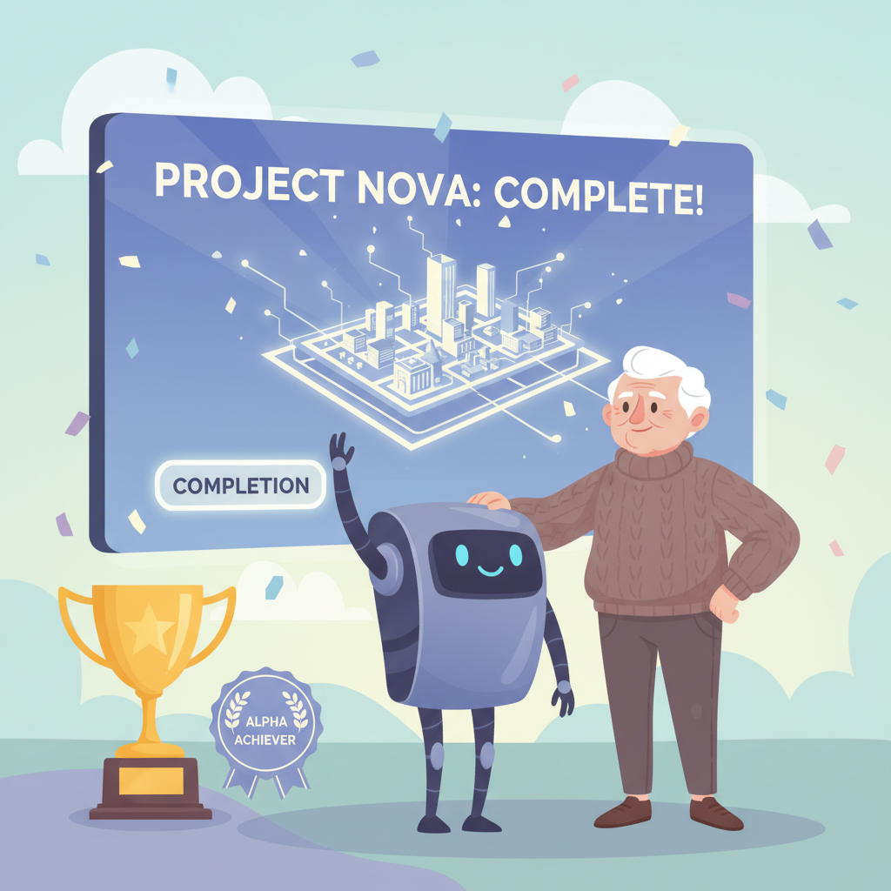

# Part 3 마무리: 나만의 앱 아이디어 구체화

---

## Part 3 핵심 요약

네 개의 챕터를 통해 이런 것들을 배웠습니다.

### Chapter 7 — 아이디어를 구체적인 기획으로 바꾸기

- 막연한 아이디어를 **구체적인 문장**으로 정리하는 법을 배웠습니다.
- AI에게 기획을 도와달라고 부탁할 수 있습니다.
- 처음부터 완벽한 기획은 없습니다. **작게 시작**하면 됩니다.

### Chapter 8 — AI에게 기능 추가 요청하기

- 기능은 한 번에 하나씩 요청하는 것이 좋습니다.
- AI에게 **구체적으로 설명**할수록 결과가 좋아집니다.
- 원하는 대로 안 나오면 다시 부탁하면 됩니다.

### Chapter 9 — 보기 좋게 디자인 다듬기

- 디자인 감각이 없어도 AI가 도와줍니다.
- "깔끔하게", "따뜻하게" 같은 **느낌을 말로** 전달하면 됩니다.
- 색상, 글꼴, 배치를 AI에게 자유롭게 요청할 수 있습니다.

### Chapter 10 — 다른 사람에게 보여주고 피드백 받기

- 완성 전에 보여줘야 **더 좋은 결과**가 나옵니다.
- 피드백은 선물입니다. 부정적인 의견도 소중합니다.
- 1명에게 보여주는 것만으로도 충분합니다.

---

## 실습 과제: 내 프로젝트 기획서 1장 작성하기

아이디어를 머릿속에만 두지 마세요.
종이 한 장에 정리하면 훨씬 명확해집니다.

### 나의 프로젝트 기획서

아래 빈칸을 채워 보세요.
어렵게 생각하지 않으셔도 됩니다.

> **프로젝트 이름**: _______________________________________________
>
> (예: "우리 동네 산책 친구", "오늘의 건강 기록장")

> **해결하고 싶은 문제**: _______________________________________________
>
> (예: "혼자 산책하면 심심한데, 같이 걸을 사람을 찾기 어렵다")

> **핵심 기능 3가지**:
>
> 1. _______________________________________________
>
> 2. _______________________________________________
>
> 3. _______________________________________________
>
> (예: 산책 일정 등록, 근처 산책 친구 찾기, 채팅하기)

> **타겟 사용자**: _______________________________________________
>
> (예: "50대 이상 건강 걷기를 좋아하는 분들")

> **디자인 컨셉**: _______________________________________________
>
> (예: "따뜻한 느낌, 큰 글씨, 심플한 화면")

### 잘 안 떠오르시나요? AI에게 도움을 받아 보세요

Claude에게 이렇게 말해 보세요.

> "나는 50대이고, ______에 관심이 많아.
> 이 분야에서 사람들이 불편해하는 것이 뭐가 있을까?
> 간단한 앱 아이디어를 3개만 제안해 줘."

AI가 제안한 아이디어를 보고 마음에 드는 것을 고르면 됩니다.

### 기획서 예시

| 항목 | 내용 |
|---|---|
| 프로젝트 이름 | 오늘의 텃밭 일기 |
| 해결하는 문제 | 텃밭 작물 관리를 체계적으로 하고 싶다 |
| 핵심 기능 1 | 작물별 물주기, 비료주기 기록 |
| 핵심 기능 2 | 성장 사진 올리기 |
| 핵심 기능 3 | 다른 텃밭 농부와 팁 공유 |
| 타겟 사용자 | 주말농장, 옥상 텃밭을 가꾸는 5060 세대 |
| 디자인 컨셉 | 자연 느낌, 초록색 톤, 큰 글씨 |

**이 기획서가 앞으로 만들 프로젝트의 설계도가 됩니다.**

---

## 자가 진단 체크리스트

Part 3를 잘 마쳤는지 스스로 점검해 보세요.
아래 항목을 읽고 체크해 보세요.

- [ ] **나만의 아이디어를 구체화했다.**
  → 기획서 빈칸을 채웠다면 성공입니다

- [ ] **MVP(최소 기능 제품)에 들어갈 기능을 정했다.**
  → 3개 이하로 줄이는 것이 핵심입니다

- [ ] **AI에게 기능을 요청해 봤다.**
  → "이런 기능을 만들어 줘"라고 말해 보셨나요?

- [ ] **디자인을 수정해 봤다.**
  → 색상이든 글씨 크기든, 한 가지라도 바꿔 봤다면 충분합니다

- [ ] **1명 이상에게 내 아이디어를 보여줬다.**
  → 말로 설명하든, 화면을 보여주든 상관없습니다

### 결과 확인

- **5개 모두 체크**: 대단합니다! 이미 기획자이자 개발자입니다.
- **3~4개 체크**: 훌륭합니다. 부족한 부분은 다음에 채우면 됩니다.
- **1~2개 체크**: 괜찮습니다. 기획서부터 천천히 작성해 보세요.
- **0개 체크**: 걱정 마세요. Chapter 7을 다시 읽으면서 시작해 보세요.

---

## 당신도 할 수 있습니다

혹시 이런 생각이 드시나요?

> "내 아이디어가 별로인 것 같은데..."
> "이런 거 누가 쓸까?"
> "다른 사람들은 더 대단한 걸 만들던데..."

한 가지 이야기를 해드리겠습니다.

### Pieter Levels는 12개 프로젝트 중 대부분 실패했습니다

Pieter Levels를 기억하시나요?
연 38억 원을 버는 1인 개발자입니다.

그가 처음부터 성공한 것은 아닙니다.
12개월 동안 12개의 프로젝트를 만들었습니다.

그중 대부분은 실패했습니다.
아무도 관심을 갖지 않았습니다.

**하지만 몇 개가 성공했고, 그것으로 충분했습니다.**

> "12개를 만들면 1~2개는 된다.
> 나머지 10개는 배움이다."

이것이 Pieter Levels의 철학입니다.

### 여러분의 첫 아이디어도 소중합니다

성공하든 실패하든 상관없습니다.
첫 기획서를 쓴 것 자체가 의미 있는 일입니다.

안 되면 다음 아이디어를 시도하면 됩니다.
AI가 있으니 다시 만드는 것은 어렵지 않습니다.

중요한 것은 **멈추지 않는 것**입니다.

---

## Part 4 미리보기: 수익화 시작하기

Part 3에서는 나만의 프로젝트를 기획하고 만들어 봤습니다.
Part 4에서는 **돈을 벌 수 있는 구조**를 만들어 봅니다.

- **Chapter 11**: 수익 모델 정하기 (구독, 일회성, 광고 등)
- **Chapter 12**: 첫 수익 만들기 (결제 연동)
- **Chapter 13**: 마케팅으로 사람들에게 알리기
- **Chapter 14**: 사업을 확장하는 방법

Part 4를 마치면 **실제로 수익을 만들 수 있는 계획**이 완성됩니다.
취미가 사업이 되는 순간을 함께 경험해 봅시다.

준비되셨나요?
다음 장을 넘겨 주세요.
