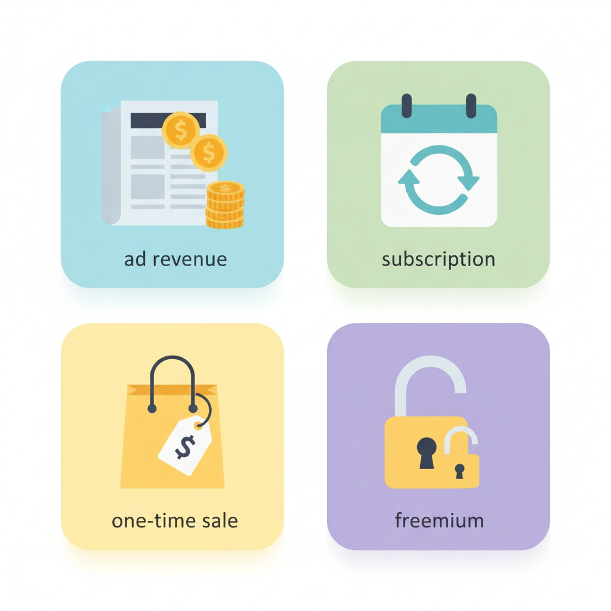
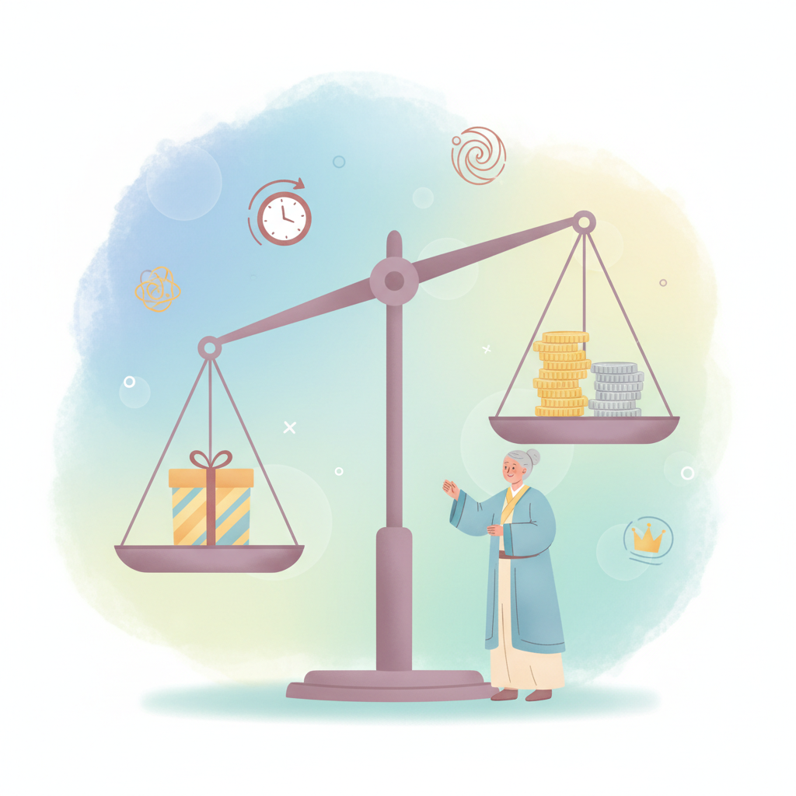

# Chapter 11. 수익화 전략 세우기

---

## 학습 목표

이 챕터를 읽고 나면 이런 것들을 알게 됩니다.

1. **수익 모델의 4가지 종류**(광고/구독/일회성/프리미엄)를 이해합니다.
2. 내 프로젝트에 **어떤 모델이 맞는지** 판단할 수 있습니다.
3. 처음 **가격을 정하는 기준**을 세울 수 있습니다.

---

## 1. 수익 모델의 종류

### 돈을 버는 방법은 여러 가지입니다

서비스를 만들었으면 이제 돈을 벌 차례입니다.
"어떻게 돈을 받을까?"가 수익 모델입니다.

크게 네 가지가 있습니다.

### 모델 1: 광고 수익

서비스에 광고를 붙이는 방식입니다.

- 사용자는 **무료**로 서비스를 씁니다
- 광고주가 돈을 냅니다
- 사용자가 **많아야** 의미 있는 수익이 납니다

예를 들면 유튜브가 이 방식입니다.
영상 중간에 광고가 나오죠.

**장점:** 사용자가 돈을 안 내도 됩니다.
**단점:** 사용자가 매우 많아야 합니다.

1인 사업 초기에는 추천하지 않습니다.
사용자가 적으면 수익도 거의 없습니다.

### 모델 2: 구독 수익

매달 일정 금액을 받는 방식입니다.

- 사용자가 **매월 또는 매년** 결제합니다
- **안정적인 수입**이 들어옵니다
- 넷플릭스, 멜론이 이 방식입니다

**장점:** 수입이 예측 가능합니다.
**단점:** 매달 가치를 제공해야 합니다.

1인 사업에 가장 추천하는 모델입니다.
사용자 10명만 있어도 수익이 시작됩니다.

### 모델 3: 일회성 판매

한 번 결제하면 끝나는 방식입니다.

- 전자책, 템플릿, 도구 등이 해당됩니다
- 한 번 만들어 놓으면 **계속 팔 수** 있습니다
- 쿠팡에서 물건 사는 것과 같습니다

**장점:** 만들어 놓으면 추가 노력이 적습니다.
**단점:** 매달 새로 팔아야 합니다.

### 모델 4: 프리미엄(무료+유료)

기본은 무료, 추가 기능은 유료인 방식입니다.

- **무료** 버전으로 사용자를 모읍니다
- 더 좋은 기능은 **유료**로 제공합니다
- 카카오톡이 이 방식입니다

기본 메시지는 무료입니다.
이모티콘이나 선물하기는 유료입니다.

**장점:** 사용자를 모으기 쉽습니다.
**단점:** 무료에서 유료 전환이 어렵습니다.

### 한눈에 비교하기

| 모델 | 수익 안정성 | 시작 난이도 | 추천도 |
|---|---|---|---|
| 광고 | 낮음 | 쉬움 | ★★ |
| 구독 | 높음 | 보통 | ★★★★★ |
| 일회성 | 보통 | 쉬움 | ★★★★ |
| 프리미엄 | 보통 | 어려움 | ★★★ |

---

## 2. 내 프로젝트에 맞는 모델 찾기

### 서비스 종류별 추천 모델

어떤 모델이 맞는지 헷갈리시죠?
만든 서비스의 종류에 따라 다릅니다.

**도구형 서비스를 만들었다면:**

매일 쓰는 서비스입니다.
할 일 관리, 가계부 같은 것들이죠.
→ **구독 모델**이 잘 맞습니다.

**정보형 서비스를 만들었다면:**

특정 정보를 제공하는 서비스입니다.
맛집 추천, 여행 정보 같은 것들이죠.
→ **프리미엄 모델**이 잘 맞습니다.

**콘텐츠를 만들었다면:**

전자책, 강의, 템플릿 같은 것들입니다.
→ **일회성 판매**가 잘 맞습니다.

### 모델은 섞어도 됩니다

하나만 고를 필요는 없습니다.

예를 들어 볼까요?

- 기본 기능은 **무료** (사용자 모으기)
- 고급 기능은 **월 구독** (안정 수익)
- 특별 템플릿은 **일회성 판매** (추가 수익)

이렇게 조합하면 더 좋습니다.
처음에는 하나로 시작하고 나중에 추가하세요.

---

## 3. 가격 정하기

### 가장 어려운 질문

"얼마를 받아야 하죠?"

많은 분들이 이 질문에서 막힙니다.
너무 비싸면 안 살 것 같고,
너무 싸면 의미가 없을 것 같습니다.

### 가격을 정하는 세 가지 기준

**첫째, 비슷한 서비스를 참고하세요.**

내 서비스와 비슷한 것을 찾아보세요.
그 서비스의 가격이 기준이 됩니다.

비슷한 서비스가 월 5,000원이라면,
처음에는 월 3,000원으로 시작해보세요.

**둘째, 처음에는 낮게 시작하세요.**

첫 사용자를 모으는 것이 중요합니다.
가격이 낮아야 부담 없이 시작합니다.

나중에 가치가 증명되면 올리면 됩니다.
반대로 내리는 건 더 어렵습니다.

**셋째, "커피 한 잔 가격"을 기준으로 하세요.**

월 5,000원은 커피 한 잔 값입니다.
이 정도면 대부분 부담 없이 결제합니다.

### AI에게 가격 전략 물어보기

가격 정하기가 어려우면 AI에게 물어보세요.

> "나는 직장인을 위한 할 일 관리 앱을 만들었어.
> 비슷한 서비스들의 가격대를 알려줘.
> 처음 시작할 때 적절한 가격을 추천해줘."

AI가 시장 조사를 도와줍니다.

---

## 실생활 비유: 과일 가게

과일 가게를 하나 연다고 생각해보세요.
같은 과일로도 여러 방식으로 팔 수 있습니다.

### 낱개 판매 = 일회성 판매

사과를 하나씩 팝니다.
손님이 올 때마다 한 개씩 사갑니다.

서비스로 치면 일회성 결제입니다.
전자책 한 권, 템플릿 한 개 파는 것과 같습니다.

### 과일 박스 = 프리미엄

기본 박스에는 사과 5개가 들어갑니다.
프리미엄 박스에는 사과 5개 + 배 3개입니다.

기본 기능은 무료로, 좋은 기능은 유료로.
프리미엄 모델과 같은 원리입니다.

### 매주 배달 = 구독

매주 화요일마다 과일 박스를 배달합니다.
한 달에 한 번 결제하면 매주 받을 수 있습니다.

넷플릭스처럼 매달 결제하는 구독 모델입니다.
**가장 안정적인 수입**이 됩니다.

같은 과일, 세 가지 팔기 방법.
같은 서비스, 세 가지 수익 모델.

**어떻게 파느냐에 따라 수익 구조가 달라집니다.**

---

## 실제 사례: Pieter Levels의 수익 모델

### 한 가지가 아닌 다양한 조합

Pieter Levels(피터 레벨스)는 여러 서비스를 운영합니다.
흥미로운 점은 각각 다른 수익 모델을 쓴다는 것입니다.

### NomadList — 구독 모델

디지털 노마드를 위한 도시 정보 사이트입니다.

- 기본 정보는 **무료**로 볼 수 있습니다
- 상세 정보와 커뮤니티는 **유료**입니다
- 가격은 **연 50달러**(약 6만 5천원)입니다

연간 구독이라 안정적인 수입이 들어옵니다.

### RemoteOK — 채용 공고 게시비

원격 근무 채용 사이트입니다.

- 구직자는 **무료**로 이용합니다
- 기업이 공고를 올릴 때 **300달러 이상** 냅니다
- 기업에서 돈을 받는 B2B 모델입니다

사용자에게는 무료, 기업에게는 유료.
양쪽 모두 만족하는 구조입니다.

### PhotoAI — 구독 모델

AI로 사진을 생성하는 서비스입니다.

- 월 구독으로 운영됩니다
- 월 수익이 **10만 달러** 이상입니다
- 혼자서 운영하고 있습니다

### 핵심 교훈

Pieter Levels는 처음부터 완벽한 수익 모델을 가진 게 아닙니다.

- 처음에는 **무료**로 시작했습니다
- 사용자가 모이니 **유료**로 전환했습니다
- 서비스마다 **다른 모델**을 적용했습니다

수익 모델은 처음부터 정할 필요 없습니다.
사용자를 모으면서 자연스럽게 찾아가면 됩니다.

---

## 핵심 포인트

이 챕터에서 꼭 기억할 것들입니다.

1. **구독형 모델**이 1인 사업에 가장 안정적입니다. 매달 예측 가능한 수입이 들어옵니다.
2. 처음에는 **가격을 낮게** 시작하세요. 첫 사용자를 모으는 것이 더 중요합니다.
3. **무료 버전**으로 사용자를 모으고, 유료로 전환하는 전략이 효과적입니다.
4. 수익 모델은 **나중에 변경 가능**합니다. 처음부터 완벽할 필요 없습니다.
5. 같은 서비스로도 **여러 수익 모델을 조합**할 수 있습니다.

---

## 다음 챕터 미리보기

**Chapter 12**에서는 실제로 **결제 시스템을 연동**합니다.

- Stripe, 토스페이먼츠 같은 결제 도구를 알아봅니다
- AI에게 결제 연동을 요청하는 방법을 배웁니다
- 첫 고객을 찾고 첫 수익을 만드는 과정을 경험합니다

전략을 세웠으니 이제 실행할 차례입니다.
다음 챕터에서 첫 수익의 기쁨을 느껴보겠습니다.
