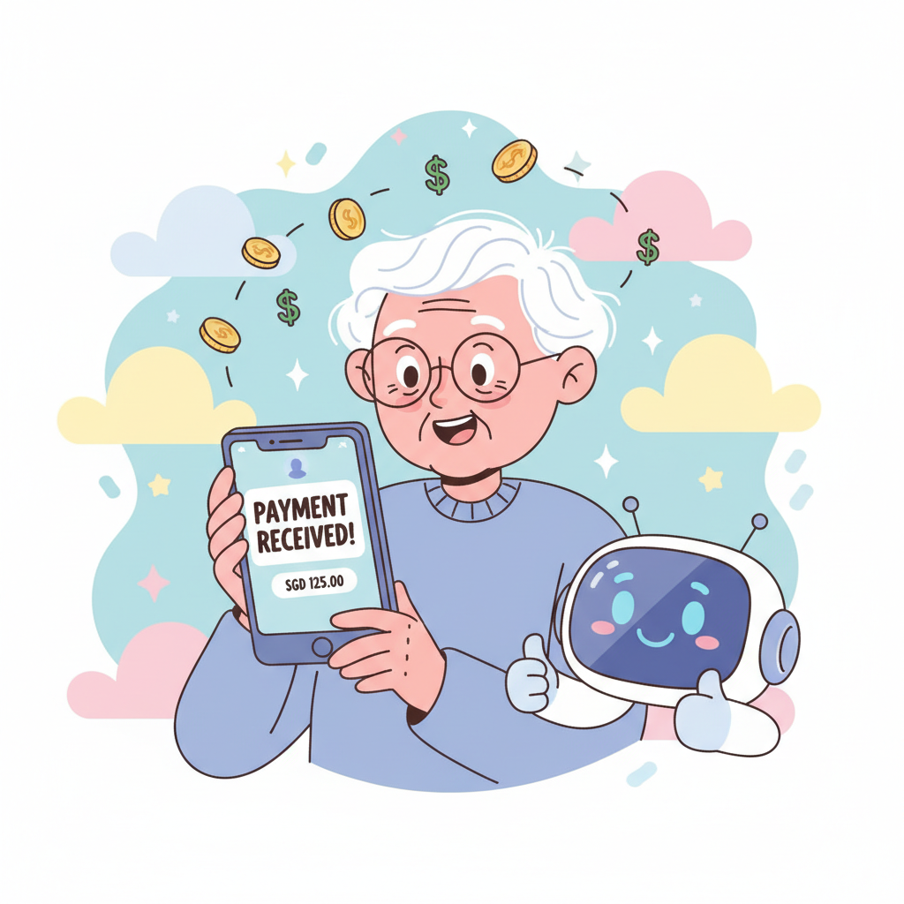
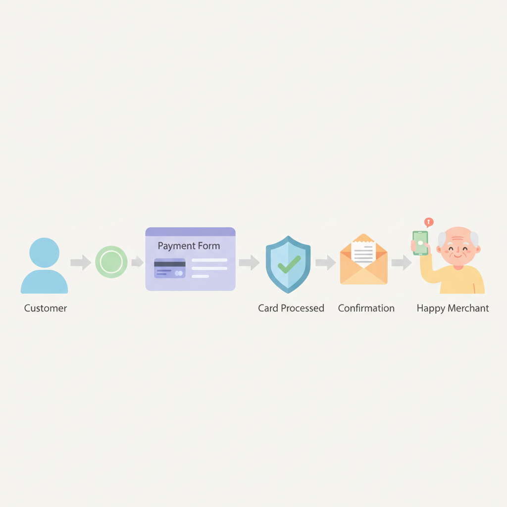
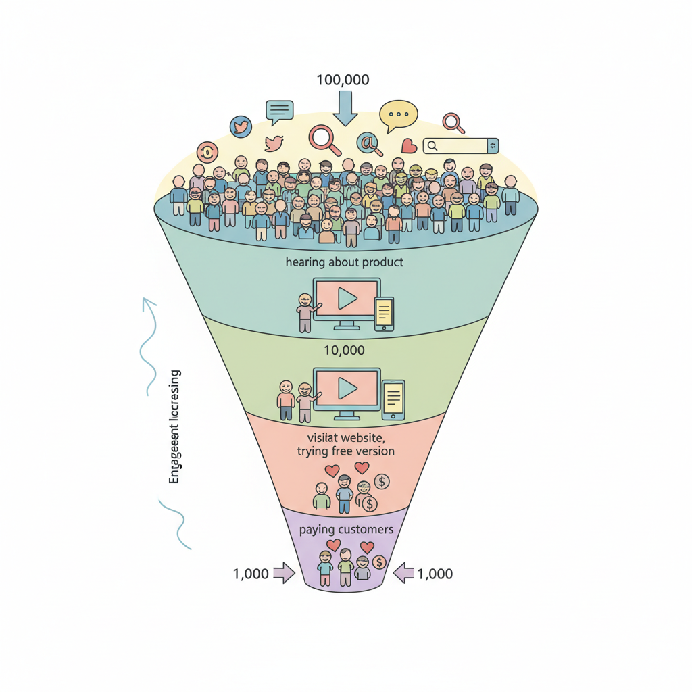
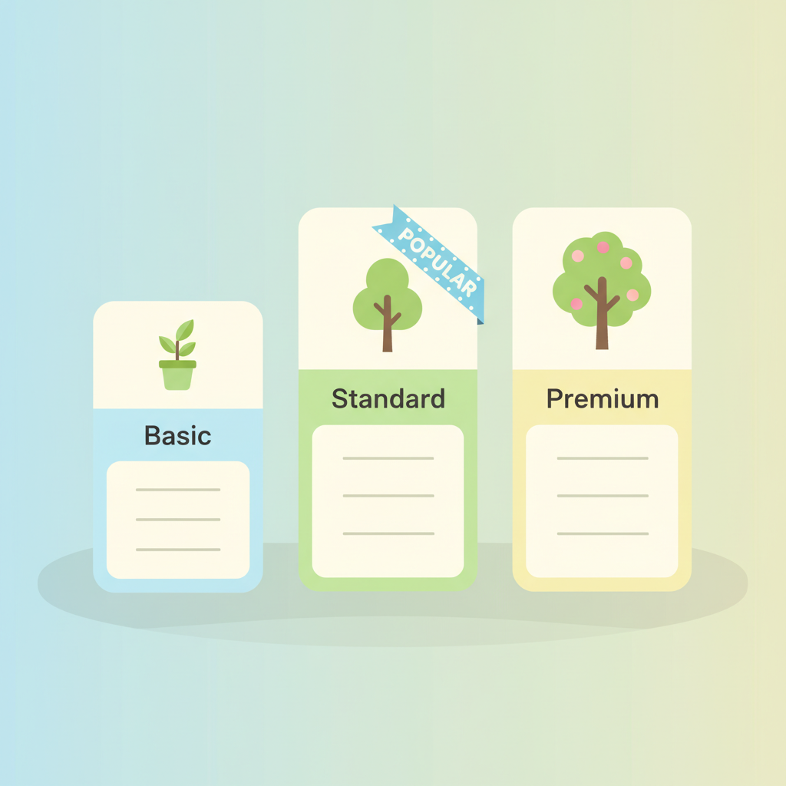

# Chapter 12. 첫 수익 만들기

---

## 학습 목표

이 챕터를 읽고 나면 이런 것들을 알게 됩니다.

1. **결제 시스템**을 내 서비스에 연동하는 방법을 알게 됩니다.
2. **첫 번째 고객**을 찾는 구체적인 방법을 배웁니다.
3. **가격을 정하고 테스트**하는 방법을 이해합니다.

---

## 1. 결제 시스템 연동하기

### 돈을 받을 준비부터

서비스를 만들었습니다.
수익 모델도 정했습니다.
이제 실제로 돈을 받을 수 있어야 합니다.

"결제 시스템 연동이 어렵지 않을까?"

걱정하지 마세요.
AI와 함께하면 생각보다 간단합니다.

### Stripe: 해외 결제의 표준

**Stripe**(스트라이프)는 전 세계에서 가장 많이 쓰는 결제 서비스입니다.

특징을 정리하면 이렇습니다.

- **가입이 무료**입니다
- 결제가 일어날 때만 수수료를 냅니다
- 신용카드, 체크카드를 받을 수 있습니다
- 해외 고객도 결제할 수 있습니다

수수료는 결제 금액의 약 **2.9% + 30센트**입니다.
1만 원을 받으면 약 320원 정도가 수수료입니다.

### 토스페이먼츠: 국내 결제에 강합니다

한국 고객이 주 대상이라면 **토스페이먼츠**가 좋습니다.

- 카카오페이, 네이버페이, 토스를 지원합니다
- 한국 사람들에게 익숙한 결제 방식입니다
- 수수료는 약 **2.5~3.5%** 수준입니다
- 한국어로 된 안내 문서가 있습니다

### AI에게 결제 연동 요청하기

결제 시스템 연동도 AI에게 맡길 수 있습니다.

이렇게 요청해 보세요.

> "내 웹사이트에 Stripe 결제 버튼을 추가해줘.
> 월 9,900원 구독 상품이야.
> 결제 완료 후 감사 페이지로 이동하게 해줘."

AI가 필요한 코드를 만들어 줍니다.
복사해서 붙여넣으면 됩니다.

### 처음에는 간단하게

처음부터 복잡한 결제 시스템을 만들 필요 없습니다.

**1단계**: 결제 버튼 하나 추가하기
**2단계**: 결제 완료 페이지 만들기
**3단계**: 고객에게 서비스 제공하기

이 세 단계면 충분합니다.
자동화나 구독 관리는 나중에 추가하면 됩니다.

---

## 2. 첫 고객 찾기

### 첫 고객 1명이 가장 중요합니다

100명의 고객보다 **첫 1명**이 더 중요합니다.

왜냐하면 첫 고객이 증명해 주기 때문입니다.
"진짜 돈을 내고 쓸 사람이 있구나."

이 확신이 생기면 모든 것이 달라집니다.

### 주변 사람부터 시작하세요

첫 고객은 멀리 있지 않습니다.

**가족과 친구에게 보여주세요.**
"이런 서비스를 만들었는데 한번 봐줄래?"
솔직한 피드백을 받을 수 있습니다.

**직장 동료에게 알려주세요.**
같은 업종의 불편함을 해결하는 서비스라면
동료가 첫 고객이 될 수 있습니다.

**동호회에서 소개하세요.**
취미 관련 서비스라면 동호회 회원들이 관심을 보일 겁니다.

### 온라인에서 찾기

주변에 적합한 사람이 없다면 온라인으로 넓혀보세요.

**네이버 카페:**
관련 주제의 카페에 가입합니다.
활동을 하면서 자연스럽게 서비스를 소개합니다.

**페이스북 그룹:**
관심사가 비슷한 그룹에서 활동합니다.
"이런 걸 만들어 봤는데 어떠세요?"라고 물어봅니다.

**인스타그램:**
서비스와 관련된 해시태그를 검색합니다.
관심 있는 사람들에게 DM을 보냅니다.

### 무료로 먼저 써보게 하세요

첫 고객에게는 **무료 체험**을 제공하세요.

"한 달 동안 무료로 써보시겠어요?"

무료라면 부담 없이 시작할 수 있습니다.
서비스가 좋으면 유료로 전환됩니다.

이것을 **프리 트라이얼**(무료 체험)이라고 합니다.
대부분의 성공한 서비스가 이 방법을 씁니다.

---

## 3. 가격 테스트하기

### 가격 정하기가 가장 어렵습니다

"얼마를 받아야 하지?"

이 질문에 정답은 없습니다.
하지만 **시작점**은 있습니다.

### 경쟁 서비스를 살펴보세요

비슷한 서비스가 얼마를 받는지 찾아보세요.

- 비슷한 서비스가 월 1만 원이라면
- 내 서비스는 **월 5,000~8,000원**으로 시작합니다

처음에는 낮게 시작하는 게 좋습니다.
사용자가 모이면 가격을 올릴 수 있습니다.

### 세 가지 가격 만들기

가격을 하나만 두지 마세요.
**세 가지 옵션**을 만드세요.

| 플랜 | 가격 | 내용 |
|---|---|---|
| 기본 | 무료 | 핵심 기능만 |
| 프로 | 월 9,900원 | 모든 기능 |
| 프리미엄 | 월 19,900원 | 모든 기능 + 우선 지원 |

대부분의 사람은 **가운데 옵션**을 선택합니다.
이것을 **앵커링 효과**라고 합니다.
비교 대상이 있으면 가운데가 적당해 보이는 심리입니다.

### 가격은 바꿀 수 있습니다

처음 정한 가격이 영원한 게 아닙니다.

한 달 운영해 보고 반응을 봅니다.
"너무 비싸다"는 피드백이 오면 낮춥니다.
"이 가격에 이 기능이?"라는 반응이면 올릴 수 있습니다.

**가격은 실험입니다.**
데이터를 보고 조정하면 됩니다.

---

## 실생활 비유: 시장에서 첫 손님 맞이하기

### 노점을 열었습니다

시장에서 떡볶이 노점을 열었다고 상상해 보세요.

장소를 정했습니다.
재료를 준비했습니다.
떡볶이를 만들었습니다.

이제 손님을 기다립니다.

### 첫 손님이 가장 떨립니다

한 시간이 지나도 손님이 없습니다.
"맛이 없나? 가격이 비싼가?"
불안해집니다.

그때 한 분이 다가옵니다.
"떡볶이 하나 주세요."

**이 한마디가 모든 것을 바꿉니다.**

떡볶이를 내놓습니다.
그분이 맛있게 드십니다.
"맛있네요!"

이 한마디에 자신감이 생깁니다.
"내 떡볶이를 좋아하는 사람이 있구나!"

### 첫 손님이 단골이 됩니다

그분이 다음 날 또 옵니다.
친구를 데려옵니다.
"여기 떡볶이 맛있어."

입소문이 시작됩니다.
한 명이 두 명이 되고, 두 명이 다섯 명이 됩니다.

**디지털 사업도 마찬가지입니다.**

첫 고객 1명을 정성껏 대하세요.
그 1명이 다른 사람에게 알려줍니다.
이것이 성장의 시작입니다.

---

## 실제 사례: Marc Lou의 첫 100달러

### 27번 실패 후의 도전

Marc Lou의 이야기를 다시 꺼내보겠습니다.
Chapter 2에서 그가 27번 실패했다는 이야기를 했습니다.

28번째 제품을 만들었을 때도 처음에는 반응이 없었습니다.
하지만 이번에는 뭔가 달랐습니다.

### 첫 100달러의 의미

28번째 제품에서 첫 결제가 들어왔습니다.
**100달러.**
약 13만 원입니다.

금액 자체는 크지 않습니다.
하지만 Marc Lou에게는 **세상이 바뀐 순간**이었습니다.

> "내가 만든 것에 누군가 돈을 냈다.
> 이건 진짜다. 이건 사업이다."

27번의 실패 동안 한 번도 못 느낀 감정이었습니다.

### 100달러가 1000달러가 되기까지

첫 100달러 이후 Marc Lou가 한 일은 간단했습니다.

**첫째, 고객에게 물어봤습니다.**
"왜 구매하셨어요?"
"어떤 기능이 가장 좋았어요?"

**둘째, 피드백을 반영했습니다.**
고객이 원하는 기능을 추가했습니다.
불편한 부분을 개선했습니다.

**셋째, 과정을 공개했습니다.**
트위터에 수익을 공개했습니다.
다른 사람들이 관심을 가졌습니다.

첫 달 100달러.
두 번째 달 500달러.
세 번째 달 1,000달러.

**시작은 작았지만 성장은 빨랐습니다.**

### 여러분의 첫 100달러

Marc Lou도 처음에는 아무도 몰랐습니다.
특별한 인맥도 없었습니다.

하지만 좋은 제품을 만들었습니다.
첫 고객을 정성껏 대했습니다.
피드백을 들었습니다.

**여러분도 똑같이 할 수 있습니다.**
첫 1명의 고객을 찾으세요.
그 1명에게 최선을 다하세요.

그것이 첫 수익의 시작입니다.

---

## 핵심 포인트

이 챕터에서 꼭 기억할 것들입니다.

1. **결제 시스템은 AI가 도와줍니다.** Stripe나 토스페이먼츠를 연동하는 것도 AI에게 요청할 수 있습니다.
2. **첫 고객 1명이 가장 중요합니다.** 100명보다 정성을 다한 1명이 사업의 시작입니다.
3. **가격은 실험입니다.** 처음부터 완벽한 가격은 없습니다. 시작하고 조정하세요.
4. **첫 수익의 기쁨이 동력이 됩니다.** 작은 금액이라도 직접 번 돈은 큰 자신감을 줍니다.

---

## 다음 챕터 미리보기

**Chapter 13**에서는 **마케팅의 기초**를 배웁니다.

- SNS를 활용해 서비스 알리기
- 콘텐츠로 자연스럽게 홍보하기
- 커뮤니티에서 신뢰 쌓기

광고비 없이도 사람들에게 알릴 수 있습니다.
어떻게 하는지 다음 챕터에서 알아보겠습니다!
