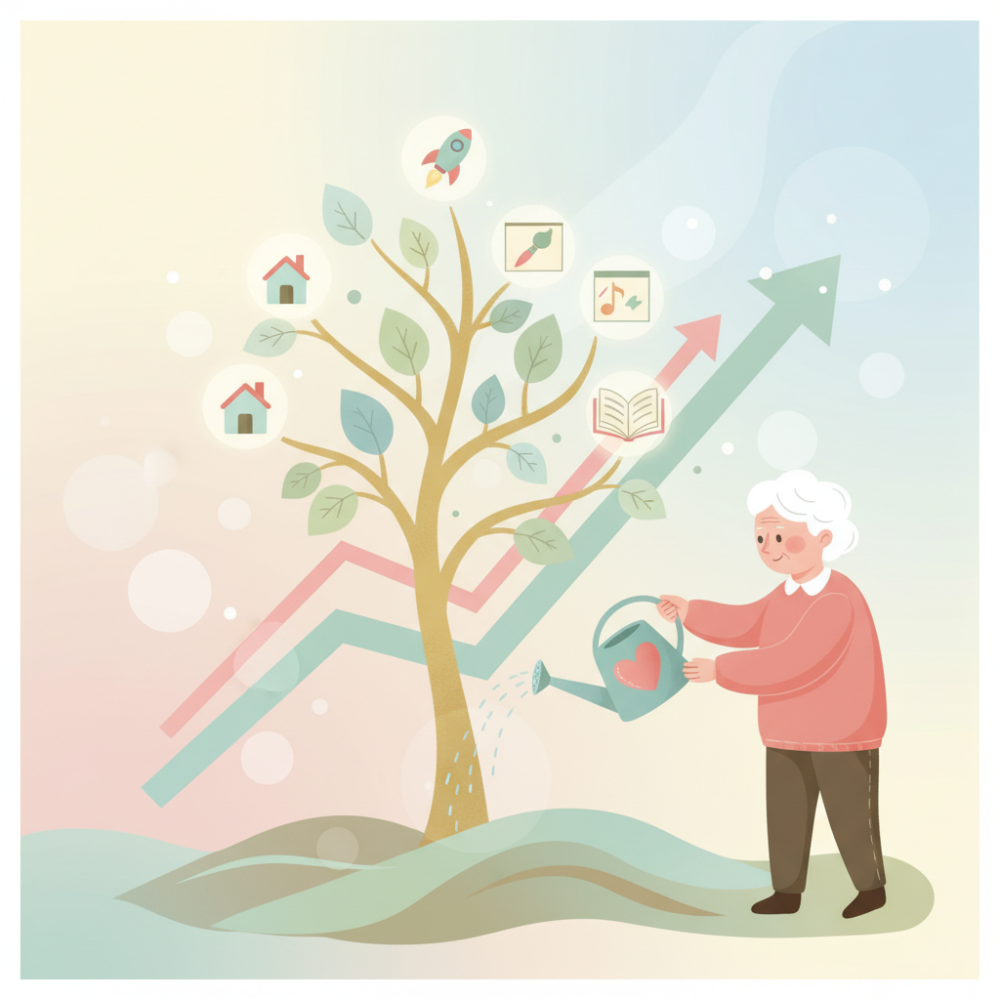

# Chapter 14. 수익 확장하기

---

## 학습 목표

이 챕터를 읽고 나면 이런 것들을 알게 됩니다.

1. 첫 번째 제품의 경험을 활용해 **두 번째 제품**을 만드는 방법을 알게 됩니다.
2. 기존 제품에 **프리미엄 기능**을 추가해 수익을 높이는 방법을 이해합니다.
3. **수익 다각화**가 왜 중요한지, 어떻게 하는지 설명할 수 있습니다.

---

## 1. 두 번째 제품 만들기

### 첫 제품이 선생님입니다

첫 번째 제품을 만들면서 많이 배우셨을 겁니다.
사용자가 뭘 원하는지 알게 되었습니다.
어떤 기능이 인기 있는지도 보였을 겁니다.

이 경험이 바로 두 번째 제품의 씨앗입니다.

첫 제품을 운영하다 보면 이런 생각이 듭니다.

> "이 기능을 따로 떼서 만들면 어떨까?"
> "다른 분야에도 이걸 적용할 수 있겠는데?"

그 생각이 두 번째 제품의 시작입니다.

### 두 번째는 훨씬 쉽습니다

첫 제품을 만들 때를 떠올려 보세요.
모든 게 낯설었습니다.
AI에게 뭘 물어봐야 할지도 몰랐습니다.

두 번째는 다릅니다.

- 어떤 도구를 쓸지 이미 알고 있습니다
- AI에게 지시하는 방법도 익숙합니다
- 사용자가 뭘 원하는지 감이 있습니다
- 결제 시스템도 이미 만들어 봤습니다

**첫 제품에 3개월 걸렸다면, 두 번째는 1개월이면 됩니다.**

### 어떤 제품을 만들까?

두 번째 제품의 아이디어는 멀리 있지 않습니다.

**방법 1: 기존 사용자에게 물어보기**

> "또 어떤 기능이 있으면 좋겠어요?"

사용자들이 직접 답을 줄 때가 많습니다.

**방법 2: 첫 제품의 일부를 독립시키기**

건강 식단 서비스를 만들었다면?
식재료 가격 비교 기능만 떼어낼 수 있습니다.
그것만으로도 하나의 제품이 됩니다.

**방법 3: 비슷한 문제를 다른 분야에서 풀기**

동네 맛집 추천 서비스를 만들었다면?
동네 병원 추천, 학원 추천도 가능합니다.
구조는 같고 내용만 바뀝니다.

---

## 2. 기존 제품 업그레이드

### 프리미엄 기능 추가하기

새 제품을 만들지 않아도 됩니다.
기존 제품을 업그레이드하는 것도 좋은 방법입니다.

무료로 쓰던 기능 위에 프리미엄을 얹는 겁니다.

| 무료 기능 | 프리미엄 기능 |
|---|---|
| 하루 3번 검색 | 무제한 검색 |
| 기본 보고서 | 상세 분석 보고서 |
| 광고 포함 | 광고 제거 |
| 이메일 지원 | 실시간 채팅 지원 |

이런 구조를 **프리미엄 모델**이라고 합니다.
기본은 무료, 더 좋은 건 유료인 구조입니다.

### AI에게 프리미엄 기능 만들기를 부탁하세요

AI에게 이렇게 말하면 됩니다.

> "지금 서비스에 프리미엄 구독 기능을 추가해 줘.
> 월 9,900원 구독자만 쓸 수 있는 기능이야.
> 무제한 검색과 상세 보고서를 제공해 줘."

AI가 결제 연동부터 기능 분리까지 도와줍니다.

### 수익 다각화의 힘

수입원이 하나뿐이면 위험합니다.
그 하나가 막히면 수입이 0이 됩니다.

여러 곳에서 돈이 들어오면 안전합니다.

수익 다각화 방법을 정리해 보겠습니다.

- **구독료**: 매달 정기적으로 들어오는 돈
- **일회성 결제**: 특별 기능이나 콘텐츠 판매
- **광고 수입**: 사용자가 많아지면 가능
- **제휴 수수료**: 다른 서비스를 추천하고 수수료 받기
- **컨설팅**: 경험을 바탕으로 다른 사람 도와주기

하나의 제품에서도 여러 수입원을 만들 수 있습니다.

---

## 실생활 비유: 과수원 키우기

수익 확장을 과수원에 비유해 보겠습니다.

### 사과나무만 심으면 위험합니다

올해 사과 농사가 잘되었습니다.
기뻐서 사과나무만 더 심었습니다.

그런데 다음 해에 태풍이 왔습니다.
사과가 다 떨어졌습니다.
수입이 0이 되었습니다.

### 여러 과일을 심으면 안전합니다

현명한 농부는 다르게 합니다.

사과나무도 심고, 배나무도 심습니다.
감나무, 포도나무도 함께 키웁니다.

사과 농사가 안 좋아도 배가 잘됩니다.
포도 수확이 적어도 감이 풍년입니다.

**전체 수입은 안정적으로 유지됩니다.**

### 시간이 지나면 나무가 자랍니다

처음 심은 묘목은 작습니다.
열매도 얼마 안 열립니다.

하지만 해가 지날수록 나무가 커집니다.
열매도 점점 많이 열립니다.

**디지털 제품도 똑같습니다.**

처음엔 사용자가 10명입니다.
1년 뒤에는 100명이 됩니다.
2년 뒤에는 1,000명이 될 수 있습니다.

나무를 여러 그루 심어 두면 됩니다.
시간이 알아서 키워 줍니다.

---

## 실제 사례: Pieter Levels의 다중 프로젝트 전략

### 하나가 아니라 여러 개를 운영합니다

Pieter Levels는 한 가지만 하지 않습니다.
여러 제품을 동시에 운영합니다.

그의 주요 제품들을 살펴보겠습니다.

- **NomadList**: 디지털 노마드를 위한 도시 정보
- **RemoteOK**: 원격 근무 채용 사이트
- **PhotoAI**: AI로 사진을 만드는 서비스
- **InteriorAI**: AI로 인테리어를 바꿔주는 서비스

이 외에도 여러 작은 프로젝트가 있습니다.

### 한 제품이 안 되면 다른 제품이 받쳐줍니다

RemoteOK의 수입이 줄어든 달이 있었습니다.
하지만 PhotoAI가 그 달에 폭발적으로 성장했습니다.

NomadList의 성장이 멈춘 시기도 있었습니다.
대신 InteriorAI가 새로운 수입원이 되었습니다.

**여러 제품이 서로를 보완합니다.**

### 연 38억의 비밀

Pieter Levels의 연 수입은 약 38억 원입니다.
그 비밀은 의외로 단순합니다.

**"여러 개의 작은 수입원"**

하나의 대박 제품이 아닙니다.
여러 개의 중소형 제품이 합쳐진 것입니다.

각 제품이 월 수백만 원씩 벌어다 줍니다.
그것들이 모이면 큰 금액이 됩니다.

그리고 중요한 점이 하나 더 있습니다.
모든 제품을 **혼자서** 운영합니다.
자동화 덕분에 가능한 일입니다.

---

## 핵심 포인트

이 챕터에서 꼭 기억할 것들입니다.

1. 첫 제품이 안정되면 **두 번째 제품**을 시작하세요. 첫 번째보다 훨씬 쉽고 빠릅니다.
2. **기존 사용자에게 새 제품을 제안**하면 처음부터 시작하는 것보다 훨씬 효과적입니다.
3. **여러 수입원**을 만들면 하나가 안 되어도 전체 수입은 안정적입니다.
4. **자동화**로 여러 제품을 관리하는 시간을 줄일 수 있습니다. 혼자서도 충분합니다.
5. 한 번에 다 하려고 하지 마세요. **하나씩 차근차근** 늘려가면 됩니다.

---

## 다음 챕터 미리보기

이제 Part 4의 마지막 단계입니다.
**Part 4 종합 실습**에서는 배운 것들을 직접 해봅니다.

- 내 첫 제품의 수익 확장 계획 세우기
- 두 번째 제품 아이디어 구체화하기
- 프리미엄 기능 설계해 보기

수익의 씨앗을 여러 곳에 심어 보겠습니다.
