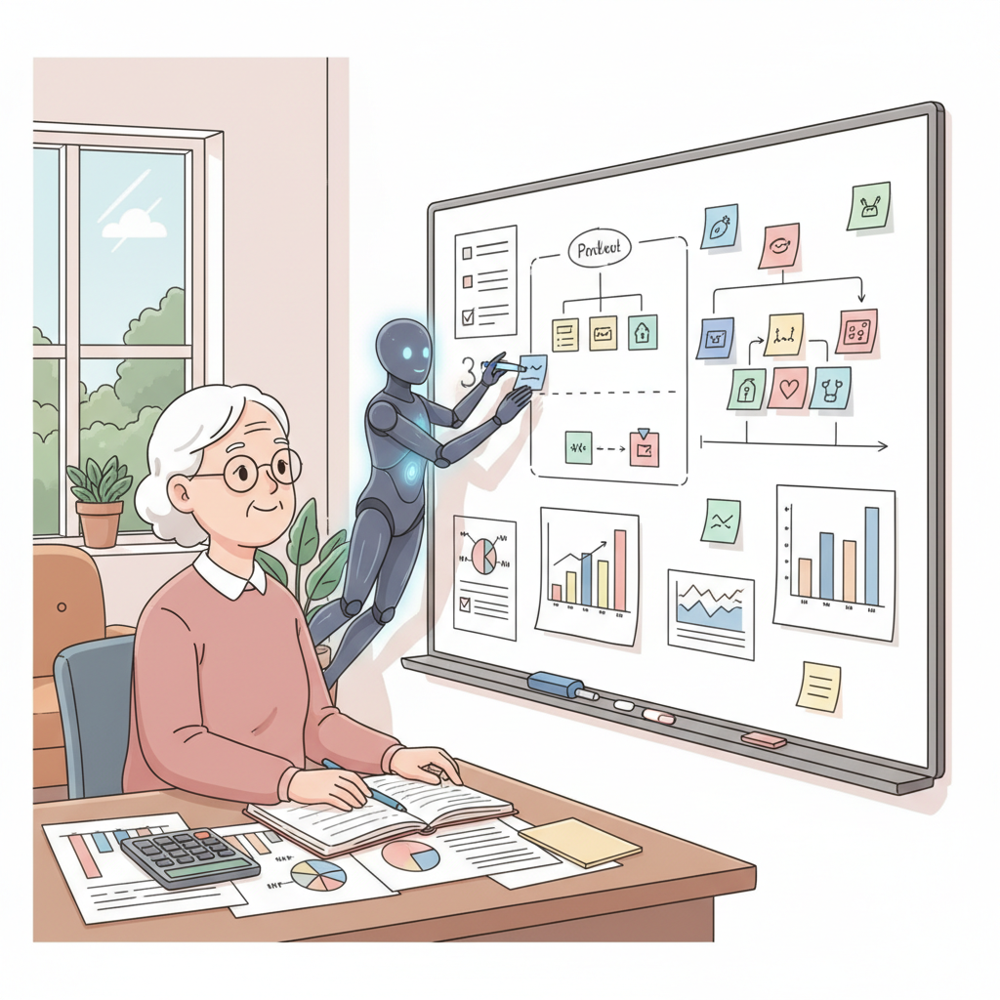

# Part 4 마무리: 수익화 계획 세우기

---

## Part 4 핵심 요약

네 개의 챕터를 통해 이런 것들을 배웠습니다.

### Chapter 11 — 수익 모델 정하기

- 수익 모델에는 **구독, 일회성 결제, 광고** 등 여러 가지가 있습니다.
- 처음에는 가장 **단순한 모델** 하나를 선택하는 것이 좋습니다.
- 무료로 시작하고 나중에 유료로 전환해도 됩니다.

### Chapter 12 — 첫 수익 만들기

- 결제 연동은 AI에게 부탁하면 **생각보다 쉽습니다.**
- Stripe, 토스페이먼츠 같은 도구를 활용할 수 있습니다.
- 첫 1,000원이 가장 어렵고, 가장 의미 있습니다.

### Chapter 13 — 마케팅으로 알리기

- 좋은 제품도 **알려야** 사람들이 찾아옵니다.
- SNS, 블로그, 커뮤니티 등 **무료 채널**부터 시작하면 됩니다.
- 거창한 광고보다 **솔직한 이야기**가 더 효과적입니다.

### Chapter 14 — 사업 확장하기

- 잘 되는 것에 **집중**하는 것이 확장의 핵심입니다.
- 한 번에 크게 키우려 하지 마세요. **조금씩** 늘려 가면 됩니다.
- 자동화할 수 있는 것은 AI에게 맡기세요.

---

## 실습 과제: 내 프로젝트의 수익 모델 캔버스 작성하기

아이디어만으로는 사업이 되지 않습니다.
돈이 어떻게 들어올지 정리해 봐야 합니다.

### 수익 모델 캔버스

아래 표를 채워 보세요.
처음이니까 대략적으로 적어도 괜찮습니다.

| 항목 | 내 계획 |
|---|---|
| 제품/서비스 이름 | _______________ |
| 수익 모델 | _______________ (구독 / 일회성 결제 / 광고 / 기타) |
| 가격 | 월 _______________원 또는 건당 _______________원 |
| 타겟 고객 | _______________ |
| 목표 고객 수 (첫 3개월) | _______________명 |
| 월 예상 수익 | _______________원 |
| 주요 마케팅 채널 | _______________ |

### 잘 모르겠다면 이렇게 생각해 보세요

**수익 모델 고르기**

| 수익 모델 | 장점 | 적합한 경우 |
|---|---|---|
| 월 구독 | 매달 안정적 수익 | 계속 쓰는 서비스 (기록 앱, 학습 도구) |
| 일회성 결제 | 한 번에 목돈 | 한 번 사면 되는 것 (전자책, 템플릿) |
| 광고 | 사용자 부담 없음 | 방문자가 많은 사이트 |
| 프리미엄 | 무료로 모으고 유료로 전환 | 기본 기능은 무료, 고급 기능은 유료 |

**가격 정하기**

처음에는 이렇게 생각하면 쉽습니다.

> "커피 한 잔 값(5,000원)부터 시작하자."

부담 없는 가격으로 시작해서 가치를 증명한 후에 올리면 됩니다.

### 수익 모델 캔버스 예시

| 항목 | 내용 |
|---|---|
| 제품/서비스 이름 | 오늘의 텃밭 일기 |
| 수익 모델 | 프리미엄 (기본 무료, 고급 기능 유료) |
| 가격 | 월 4,900원 |
| 타겟 고객 | 주말농장을 가꾸는 5060 세대 |
| 목표 고객 수 | 첫 3개월에 유료 회원 20명 |
| 월 예상 수익 | 98,000원 |
| 주요 마케팅 채널 | 네이버 카페 (텃밭/주말농장 관련) |

**월 10만 원이 작아 보일 수 있습니다.**
하지만 이것이 시작입니다.
10만 원이 100만 원이 되고, 100만 원이 1,000만 원이 됩니다.

---

## 자가 진단 체크리스트

Part 4를 잘 마쳤는지 스스로 점검해 보세요.
아래 항목을 읽고 체크해 보세요.

- [ ] **수익 모델을 하나 정했다.**
  → 구독, 일회성, 광고, 프리미엄 중 하나를 골랐나요?

- [ ] **가격을 정했다.**
  → 대략적인 금액이라도 괜찮습니다

- [ ] **결제 연동 방법을 알게 되었다.**
  → Stripe, 토스페이먼츠 등의 이름을 들어 봤다면 충분합니다

- [ ] **마케팅 채널을 하나 이상 정했다.**
  → 블로그, SNS, 카페 등 어디서 알릴지 생각해 봤나요?

- [ ] **첫 고객 후보 3명을 떠올릴 수 있다.**
  → 가족, 친구, 지인 중에 내 서비스를 쓸 만한 사람이 있나요?

### 결과 확인

- **5개 모두 체크**: 훌륭합니다! 사업가의 마인드가 완성되었습니다.
- **3~4개 체크**: 잘하고 있습니다. 고객 후보를 더 생각해 보세요.
- **1~2개 체크**: 괜찮습니다. 수익 모델 캔버스부터 다시 채워 보세요.
- **0개 체크**: 걱정 마세요. Chapter 11을 다시 읽으면서 시작해 보세요.

---

## 당신도 할 수 있습니다

혹시 이런 생각이 드시나요?

> "내 서비스에 돈을 낼 사람이 있을까?"
> "수익화는 너무 어려운 것 아닌가?"
> "사업이라니, 나한테는 너무 큰 이야기 같은데..."

한 가지 이야기를 해드리겠습니다.

### Marc Lou의 첫 100달러

Marc Lou(마크 루)는 여러 제품을 만들었지만,
처음에는 아무도 돈을 내지 않았습니다.

몇 달을 무료로 운영했습니다.
포기하고 싶은 순간도 많았습니다.

그러다 어느 날, 첫 유료 고객이 생겼습니다.
**100달러.**

그는 그 순간을 이렇게 말했습니다.

> "첫 100달러는 100만 달러보다 소중하다.
> 누군가 내가 만든 것에 돈을 냈다는 것은
> 이것이 진짜 가치가 있다는 증거다."

### 여러분의 첫 수익도 그렇게 시작됩니다

첫 고객 한 명만 찾으면 됩니다.
그 한 명이 여러분에게 확신을 줄 것입니다.

**"내가 만든 것에 가치가 있구나."**

이 확신이 있으면 나머지는 따라옵니다.
천천히, 하지만 확실하게 성장할 수 있습니다.

---

## Part 5 미리보기: 지속 가능한 성장

Part 4에서는 수익화 계획을 세웠습니다.
Part 5에서는 **오래 지속할 수 있는 사업**을 만들어 봅니다.

- **Chapter 15**: 반복 작업을 자동화하기
- **Chapter 16**: 나만의 커뮤니티 만들기
- **Chapter 17**: 장기 비전 세우기

Part 5를 마치면 **1인 사업가로서의 로드맵**이 완성됩니다.
단순한 부업이 아닌, 지속 가능한 사업의 기초를 다져 봅시다.

준비되셨나요?
다음 장을 넘겨 주세요.
